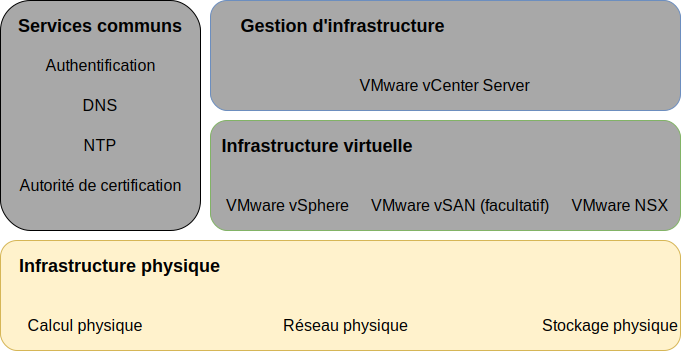
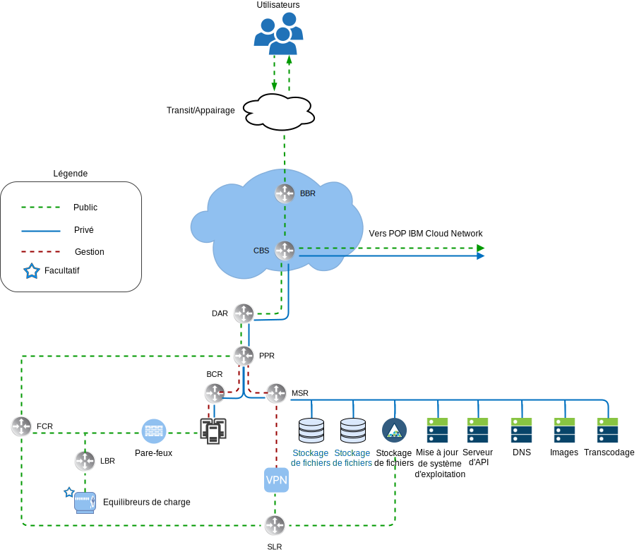
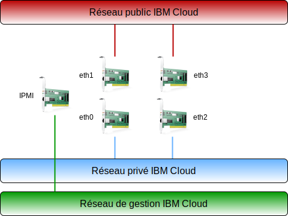
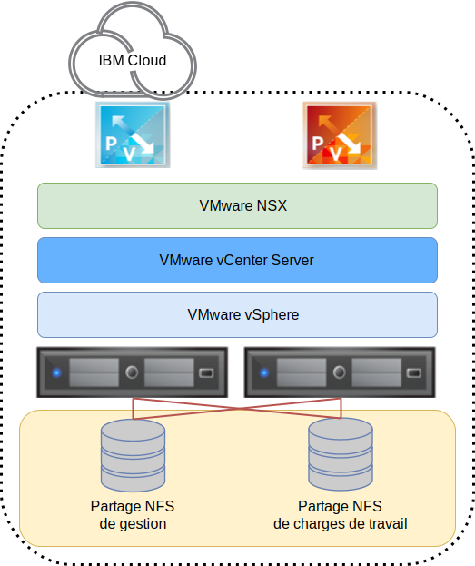
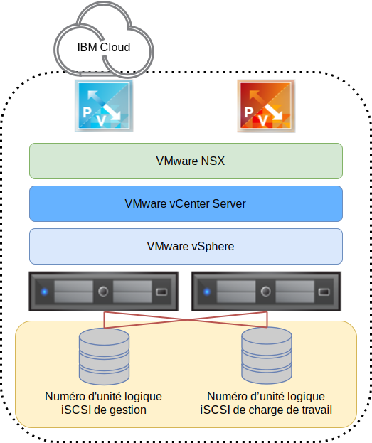

---

copyright:

  years:  2016, 2019

lastupdated: "2019-05-07"

subcollection: vmware-solutions

---

{:tip: .tip}
{:note: .note}
{:important: .important}

# Conception de l'infrastructure physique
{: #design_physicalinfrastructure}

L'infrastructure physique est constituée des composants suivants :

<dl class="dl">
  <dt class="dt dlterm">Calcul physique</dt>
  <dd class="dd">Le calcul physique fournit le traitement et la mémoire physiques utilisés par l'infrastructure de virtualisation. Pour cette conception, les composants de calcul sont fournis par les serveurs {{site.data.keyword.baremetal_long}} et sont répertoriés dans le document [VMware Hardware Compatibility Guide (HCG)](https://www.vmware.com/resources/compatibility/search.php).</dd>
  <dt class="dt dlterm">Stockage physique</dt>
  <dd class="dd">Le stockage physique fournit la capacité de stockage brut qui est utilisée par l'infrastructure de virtualisation. Les composants de stockage sont fournis par les serveurs {{site.data.keyword.baremetal_short}} ou par la matrice NAS (Network Attached Storage) partagée qui utilise NFSv3 ou iSCSI.</dd>
  <dt class="dt dlterm">Réseau physique</dt>
  <dd class="dd">Le réseau physique fournit la connectivité réseau dans l'environnement qui est ensuite utilisé par la virtualisation de réseau. Le réseau est fourni par le réseau des services {{site.data.keyword.cloud_notm}} et comprend d'autres services, tels que DNS et NTP.</dd>
</dl>

Pour plus d'informations sur les composants physiques, voir la [Nomenclature de vCenter Server](/docs/services/vmwaresolutions/vcenter?topic=vmware-solutions-vc_bom).

Pour plus d'informations sur le stockage, voir la documentation sur l'[architecture de stockage partagé](/docs/services/vmwaresolutions/archiref/attached-storage?topic=vmware-solutions-storage-benefits#storage-benefits).

## Conception du calcul physique
{: #design_physicalinfrastructure-host-design}

Les configurations de serveur disponibles dans la solution sont conformes ou supérieures aux exigences minimales relatives à l'installation, la configuration et la gestion de vSphere ESXi. Différentes configurations sont disponibles pour satisfaire différentes exigences. Pour obtenir la liste détaillée des spécifications exactes utilisées pour la solution VMware on {{site.data.keyword.cloud_notm}}, voir la nomenclature pour l'[instance vCenter Server](/docs/services/vmwaresolutions/vcenter?topic=vmware-solutions-vc_bom).

Les serveurs {{site.data.keyword.baremetal_short}} résident dans {{site.data.keyword.cloud_notm}}.
{:note}

Chaque instance vCenter Server commence avec un déploiement de 3 ou 4 hôtes, selon la solution de stockage choisie.

L'hôte physique emploie deux disques connectés localement destinés à être alloués à l'hyperviseur vSphere ESXi. Vous pouvez allouer davantage de disques en utilisant vSAN comme indiqué dans la section _Conception du stockage physique_ ou en utilisant NetApp ONTAP comme indiqué dans la documentation sur l'[architecture NetApp ONTAP Select](https://www.ibm.com/cloud/garage/files/IBM_Cloud_for_VMware_Solutions_NetApp_Architecture.pdf). Chaque hôte physique comporte des connexions réseau 10 Gbps redondantes pour l'accès au réseau public et l'accès au réseau privé.

Les spécifications du serveur bare metal sont les suivantes :
* Unité centrale : Dual ou Quad Intel Xeon, configuration variable du coeur et de la vitesse
* Mémoire : Configuration variable, 64 Go ou plus
* Réseau : 4 x 10 Gbps
* Nombre d'unités : Au moins 2

## Conception du réseau physique
{: #design_physicalinfrastructure-net-design}

La mise en réseau physique est gérée par {{site.data.keyword.cloud_notm}}. Revoyez les sections suivantes qui décrivent le réseau physique fourni par IBM Cloud et les connexions hôte physiques (VLAN, MTU) associées aux hôtes physiques.

### Présentation du réseau IBM Cloud
{: #design_physicalinfrastructure-ibm-cloud-network}

Le réseau physique d'{{site.data.keyword.cloud_notm}} est divisé en deux réseaux distincts : public et privé. Le réseau privé contient également le trafic de gestion de l'interface IPMI (Intelligent Platform Management Interface) vers les serveurs physiques.

#### Réseau public
{: #design_physicalinfrastructure-public-net}

{{site.data.keyword.CloudDataCents_notm}} et les points de présence (PoP) sont dotés de plusieurs connexions 1 Gbps ou 10 Gbps aux opérateurs réseau d'appairage et de transit de premier plan. Le trafic réseau depuis n'importe quel endroit du monde se connecte au PoP de réseau le plus proche et transite directement par le réseau vers son centre de données, réduisant ainsi le nombre de segments réseau et de relais entre les fournisseurs.

Au sein du centre de données, {{site.data.keyword.cloud_notm}} fournit 1 Gbps ou 10 Gbps de bande passante réseau à des serveurs individuels via une paire de commutateurs client frontaux distincts homologues. Ces commutateurs agrégés sont connectés à une paire de routeurs FCR distincts pour la mise en réseau L3.

Cette conception multiniveau permet la mise à l'échelle du réseau dans des armoires, des lignes et des pods au sein d'un {{site.data.keyword.CloudDataCent_notm}}.

#### Réseau privé
{: #design_physicalinfrastructure-private-net}

Tous les {{site.data.keyword.CloudDataCents_notm}} et PoP sont connectés par le réseau principal privé. Le réseau privé est distinct du réseau public et il permet la connectivité aux services dans des {{site.data.keyword.CloudDataCents_notm}} situés dans le monde entier. Le transfert de données entre plusieurs {{site.data.keyword.CloudDataCents_notm}} est effectué via plusieurs connexions 10 Gbps ou 40 Gbps au réseau privé.

Similaire au réseau public, le réseau privé est multiniveau, ce qui signifie que les serveurs et les autres composants d'infrastructure sont connectés aux commutateurs client frontaux (BCS)agrégés. Ces commutateurs agrégés sont connectés à une paire de routeurs client frontaux (BCR) distincts pour la mise en réseau L3. Le réseau privé prend également en charge l'utilisation de trames jumbo (MTU 9000) pour des connexions hôte physiques.

#### Réseau de gestion
{: #design_physicalinfrastructure-mgmt-net}

Outre les réseaux public et privé, chaque serveur {{site.data.keyword.cloud_notm}} est connecté pour la gestion au sous-réseau du réseau privé principal. Cette connexion permet un accès IPMI (Intelligent Platform Management Interface) au serveur, quels que soient son unité centrale, son microprogramme et son système d'exploitation, à des fins de maintenance et d'administration.

#### Blocs d'adresses IP principales et portables
{: #design_physicalinfrastructure-ip-blocks}

{{site.data.keyword.cloud_notm}} alloue deux types d'adresses IP à utiliser dans l'infrastructure {{site.data.keyword.cloud_notm}} :
* Les adresses IP principales sont affectées aux unités, aux serveurs bare metal et aux serveurs virtuels qui sont mis à disposition par {{site.data.keyword.cloud_notm}}. Vous ne devez pas affecter d'adresses IP dans ces blocs.
* Des adresses IP portables vous sont fournies et vous pouvez les affecter et les gérer en fonction de vos besoins. vCenter Server met à disposition plusieurs plages d'adresses IP portables à cet effet. Utilisez uniquement les plages d'adresses portables affectées à des composants NSX-T ou NSX-V spécifiques désignés pour être utilisés par les clients. Par exemple, **Customer EDGE**.

Les adresses IP principales ou portables peuvent devenir routables vers n'importe quel réseau local virtuel (VLAN) au sein de votre compte lorsque celui-ci est configuré en tant que compte **VRF (Virtual Routing and Forwarding)**.

#### Virtual Routing and Forwarding (VRF)
{: #design_physicalinfrastructure-vrf}

Le compte {{site.data.keyword.slportal}} doit être configuré en tant que compte VRF (Virtual Routing and Forwarding) pour activer le routage global automatique entre les blocs d'adresses IP de sous-réseau. Tous les comptes dotés de connexions Direct Link doivent être convertis en ou créés en tant que compte VRF.

Etant donné que diverses options de connectivité de même que des options de routage de réseau nécessitent que le compte {{site.data.keyword.cloud_notm}} soit en mode VRF, il est préférable de placer le compte en mode VRF avant de mettre vCenter Server à disposition.

#### Connexions d'hôte physique
{: #design_physicalinfrastructure-host-connect}

Chaque hôte physique de cette conception possède deux paires redondantes de connexions Ethernet 10 Gbps dans chaque commutateur {{site.data.keyword.cloud_notm}} de niveau supérieur (ToR) (public et privé). Les adaptateurs sont configurés comme des connexions individuelles (non liées) pour un total de 4 connexions 10 Gbps. Cela permet aux connexions de carte d'interface réseau (NIC) de fonctionner indépendamment les unes des autres.

Il est impossible de retirer la connectivité de réseau physique au réseau public ou privé pour les serveurs bare metal utilisés dans l'offre vCenter Server. Les ports physiques de la carte NIC interne du serveur bare metal peut être désactivée, mais aucun support n'est fourni concernant le débranchement des câbles.

#### Réseaux locaux virtuels (VLAN) et routage du réseau sous-jacent au réseau dissocié
{: #design_physicalinfrastructure-vlans}

Les offres {{site.data.keyword.vmwaresolutions_short}} sont conçues avec 3 réseaux locaux virtuels, un public et deux privés, affectés lors du déploiement. Comme le montre la figure précédente, le réseau local virtuel public est affecté à `eth1` et à `eth3`, et les réseaux locaux virtuels privés sont affectés à `eth0` et `eth2`.

Le réseau local virtuel public et le premier réseau local virtuel privé créés et affectés dans cette conception ne sont pas balisés dans {{site.data.keyword.cloud_notm}}. Ensuite, le réseau local virtuel privé supplémentaire est partagé sur les ports de commutation physique et balisé dans les groupes de ports VMware qui utilisent ces sous-réseaux.

Le réseau privé est composé de deux réseaux locaux virtuels dans cette conception. Trois sous-réseaux sont alloués au premier de ces réseaux locaux virtuels (appelé ici VLAN privé A) :
* Le premier sous-réseau est une plage de sous-réseaux d'adresses IP privées principales affectées par {{site.data.keyword.cloud_notm}} aux hôtes physiques.
* Le deuxième sous-réseau est utilisé pour les machines virtuelles de gestion, telles que vCenter Server Appliance et Platform Services Controller.
* Le troisième sous-réseau est utilisé pour les point d'extrémité de tunnel (VTEP, Tunnel Endpoints) de réseau dissocié encapsulé affectés à chaque hôte à l'aide de NSX Manager.

Outre le VLAN privé A, il existe un deuxième réseau local virtuel (appelé ici VLAN privé B) permettant la prise en charge de fonctions VMware, telles que vSAN, vMotion, NFS et iSCSI. Ainsi, le réseau local virtuel est divisé en deux, trois ou quatre sous-réseaux portables :
* Le premier sous-réseau est affecté à un groupe de ports de noyau pour le trafic vMotion.
* Les autres sous-réseaux sont utilisés pour le trafic de stockage :
   * Lorsque vSAN est utilisé, un sous-réseau est affecté aux groupes de ports de noyau qui sont utilisés pour le trafic vSAN.
   * Lorsque NAS connecté NFS est utilisé, un sous-réseau est affecté au groupe de ports qui est dédié au trafic NFS.
   * Pour une connexion iSCSI, deux groupes de ports sont créés pour permettre une solution multi-accès active-active entre les deux ports NIC privés étant donné qu'un seul port NIC peut être actif à la fois conformément à la documentation iSCSI.

Tous les sous-réseaux qui sont configurés dans le cadre d'un déploiement vCenter Server automatisé utilisent des plages gérées par {{site.data.keyword.cloud_notm}}. Cela garantit que toutes les adresses IP peuvent être routées vers n'importe quel centre de données dans le compte {{site.data.keyword.cloud_notm}} lorsque vous avez besoin de la connexion que ce soit immédiatement ou ultérieurement.

Voir le tableau suivant pour un récapitulatif.

Tableau 1. Récapitulatif VLAN et sous-réseau

| VLAN | Type | Description |
|:---- |:---- |:----------- |
| Public| Principal  | Affecté à des hôtes physiques pour l'accès au réseau public. Non utilisé lors du déploiement initial. |
| Privé A | Principal  | Sous-réseau unique affecté aux hôtes physiques affectés par {{site.data.keyword.cloud_notm}}. Utilisé par l'interface de gestion pour le trafic de gestion vSphere. |
| Privé A | Portable | Sous-réseau unique affecté aux machines virtuelles qui fonctionnent comme des composants de gestion |
| Privé A | Portable | Sous-réseau unique affecté à NSX-V ou NSX-T VTEP |
| Privé B | Portable | Sous-réseau unique affecté pour vSAN, si utilisé. |
| Privé B | Portable | Sous-réseau unique affecté pour NAS, si utilisé. |
| Privé B | Portable | Deux sous-réseaux affectés pour iSCSI NAS, si utilisé (un par port NIC physique) |
| Privé B | Portable | Sous-réseau unique affecté pour vMotion. |

Dans cette conception, tous les hôtes et machines virtuelles VLAN sont configurés pour pointer vers le routeur client (BCR) "réseau privé" dorsal {{site.data.keyword.cloud_notm}} comme route par défaut. Bien que les instances vCenter Server activent l'utilisation de la mise en réseau définie par logiciel, les réseaux dissociés créés dans une instance VMware qui incluent le routage vers des sous-réseaux internes ne sont pas connus des routeurs gérés par {{site.data.keyword.cloud_notm}}.

Si vous voulez avoir un routage entre les réseaux dissocié et sous-jacent, vous devez déployer une unité pare-feu IBM pour le VLAN privé par défaut spécifique lors du déploiement de l'instance vCenter Server. Cette unité autorise l'insertion de routes statiques et l'appairage de protocole de routage dynamique avec les unités de mise en réseau dissocié pour permettre le routage entre les réseaux sous-jacent et dissocié.

Les connexions de réseau privé sont configurées pour utiliser 9000 comme taille MTU de trame jumbo afin d'améliorer les performances des transferts d'importantes quantités de données, comme le stockage et vMotion. Il s'agit de la MTU maximale autorisée dans VMware et par {{site.data.keyword.cloud_notm}}. Les connexions de réseau public utilisent 1500 comme taille MTU Ethernet standard. Cette valeur doit être conservée ; tout changement peut provoquer une fragmentation des paquets sur Internet.

## Conception du stockage physique
{: #design_physicalinfrastructure-storage-design}

La conception du stockage physique fait référence à la configuration des disques physiques qui sont installés dans les hôtes physiques et à la configuration du stockage en réseau partagé. Cela inclut le système d'exploitation (vSphere ESXi) et les disques utilisés pour le stockage des machines virtuelles. Le stockage des machines virtuelles peut être constitué de disques locaux virtualisés par VMware vSAN, d'un stockage de niveau fichier partagé ou d'un stockage de niveau bloc partagé.

### Disques de système d'exploitation
{: #design_physicalinfrastructure-os-disks}

L'hyperviseur vSphere ESXi est installé dans un emplacement persistant. Par conséquent, les hôtes physiques sont constitués de deux disques dans une configuration RAID–1 afin d'assurer la prise en charge de la redondance pour l'hyperviseur vSphere ESXi.

### Disques vSAN
{: #design_physicalinfrastructure-vsan-disks}

Cette conception permet d'utiliser le stockage VMware vSAN ou le stockage en réseau partagé comme magasin de données principal pour les machines virtuelles. VMware vSAN est configuré en utilisant une configuration all–flash. Cette conception offre plusieurs options de configuration, y compris les châssis 2U et 4U, différents nombres de disques et différentes tailles de disque. Toutes les configurations utilisent deux groupes de disques vSAN, avec un disque SSD pour le cache et un ou plusieurs disques SSD pour la capacité. Toutes les unités qui sont allouées pour la consommation vSAN sont configurées en RAID-0 à un disque.

Pour plus d'informations sur les configurations prises en charge, voir la [Nomenclature vCenter Server](/docs/services/vmwaresolutions/vcenter?topic=vmware-solutions-vc_bom).

### Stockage de niveau fichier partagé entre plusieurs hôtes
{: #design_physicalinfrastructure-shared-storage}

Lors de l'utilisation d'un stockage de niveau fichier partagé, un partage NFS de 2 To est associé aux hôtes qui constituent le cluster VMware initial. Ce partage, appelé partage de gestion, est utilisé pour les composants de gestion, tels que VMware vCenter Server, Platform Services Controller et VMware NSX.

Le stockage est connecté à l'aide du protocole NFSv3 à un niveau de 2 IOPS par Go depuis IBM Cloud. IBM normalise le niveau IOP mis à disposition à une taille de bloc de 16 K de sorte que les tailles de bloc supérieures obtiennent une limite plus basse et les tailles de bloc inférieures une limite plus élevée.

Vous pouvez allouer et monter sur tous les hôtes des partages de fichiers supplémentaires pour vos charges de travail, au moment de l'achat ou ultérieurement dans la console. Vous pouvez effectuer une sélection parmi les niveaux de performance et les options de capacité de stockage de fichiers {{site.data.keyword.cloud_notm}} Endurance disponibles dans l'{{site.data.keyword.CloudDataCent_notm}} correspondant. Tous les partages sont associés à l'aide du protocole NFSv3. En outre, il est possible d'associer des partages de fichiers NFSv3 en appliquant l'offre NetApp ONTAP Select.

La disponibilité des 10 IOPS/Go dépend du centre de données IBM Cloud. Les {{site.data.keyword.CloudDataCents_notm}} qui offrent le niveau de performance 10 IOPS/Go incluent également le chiffrement géré par le fournisseur des données au repos (chiffrement AES-256) et sont sauvegardés par le stockage All-flash. Ce niveau de performance est limité à une capacité maximale de 4 To. Pour plus d'informations sur le stockage NAS partagé utilisé dans cette solution, voir la documentation sur l'[architecture de stockage partagé](/docs/services/vmwaresolutions/archiref/attached-storage?topic=vmware-solutions-storage-benefits#storage-benefits).

### Stockage iSCSI partagé
{: #design_physicalinfrastructure-shared-iscsi}

A l'instar de NFS, pour le stockage iSCSI partagé, un numéro d'unité logique iSCSI 2 To est associé aux hôtes que contient le cluster VMware initial. Ce numéro d'unité logique iSCSI est utilisé pour les composants de gestion tels que VMware vCenter Server, le contrôleur PSC (Platform Services Controller) et VMware NSX. Le stockage est connecté via le protocole iSCSI à un niveau de 2 IOPS par Go depuis IBM Cloud.

IBM normalise le niveau IOP mis à disposition à une taille de bloc de 16 K de sorte que les tailles de bloc supérieures obtiennent une limite plus basse et les tailles de bloc inférieures une limite plus élevée.

Vous pouvez allouer et monter des numéros d'unité logique iSCSI supplémentaires pour les charges de travail sur tous les hôtes, au moment de l'achat ou ultérieurement dans la console. Effectuez une sélection parmi les niveaux de performance et les options de capacité de stockage par blocs IBM Cloud Endurance disponibles dans le centre de données IBM Cloud correspondant. Tous les numéros d'unité logique sont associés à l'aide du protocole iSCSI. En outre, il est possible d'associer des numéros d'unité logique iSCSI à partir de l'offre NetApp ONTAP Select.

La disponibilité des 10 IOPS/Go dépend du centre de données IBM Cloud. Les centres de données qui offrent le niveau de performance 10 IOPS/Go incluent également le chiffrement géré par le fournisseur des données au repos (chiffrement AES–256) et sont sauvegardés par le stockage all-flash. Ce niveau de performance est limité à une capacité maximale de 4 To.

Pour plus d'informations sur le stockage NAS partagé utilisé dans cette solution, voir la documentation sur l'[architecture de stockage partagé](/docs/services/vmwaresolutions/archiref/attached-storage?topic=vmware-solutions-storage-benefits#storage-benefits).

## Liens connexes
{: #design_physicalinfrastructure-related}

* [Nomenclature de vCenter Server](/docs/services/vmwaresolutions/vcenter?topic=vmware-solutions-vc_bom)
* [Architecture de stockage partagé](/docs/services/vmwaresolutions/archiref/attached-storage?topic=vmware-solutions-storage-benefits#storage-benefits)
* [Architecture de NetApp ONTAP Select](https://www.ibm.com/cloud/garage/files/IBM_Cloud_for_VMware_Solutions_NetApp_Architecture.pdf)
