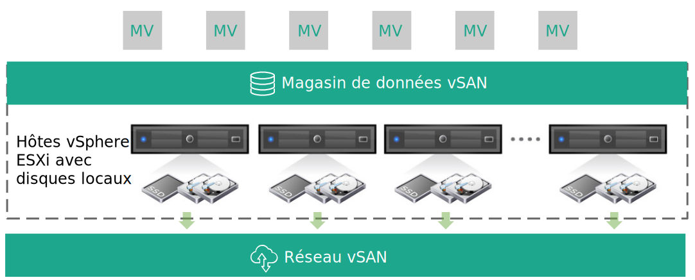

---

copyright:

  years:  2016, 2018

lastupdated: "2018-09-28"

---

# Conception d'infrastructure virtuelle

La couche d'infrastructure virtuelle inclut les composants logiciels VMware qui virtualisent les ressources de calcul, de stockage et de réseau fournies dans la couche d'infrastructure physique : VMware vSphere ESXi, VMware NSX et éventuellement VMware vSAN.

## Conception de VMware vSphere

La configuration de vSphere ESXi comprend les aspects suivants :
* Configuration d'amorçage
* Synchronisation d'horloge
* Accès à l'hôte
* Accès utilisateur
* Configuration DNS

Le tableau 1 présente les spécifications de chaque aspect. Après la configuration et l'installation d'ESXi, l'hôte est ajouté à une instance VMware vCenter Server et est géré à partir de là.

La conception vous permet d'accéder aux hôtes virtuels via l'interface DCUI (Direct Console User Interface), ESXi Shell et SSH (Secure Shell).

Par défaut, les seuls utilisateurs qui peuvent se connecter directement sont les utilisateurs _root_ et _ibmvmadmin_ pour la machine physique de l'hôte. L'administrateur peut ajouter des utilisateurs finaux au domaine MSAD (Microsoft Active Directory) pour activer l'accès utilisateur à l'hôte. Tous les hôtes de la conception de solution vCenter Server sont configurés pour être synchronisés avec un serveur NTP central.

Tableau 1. Configuration de vSphere ESXi

| Attribut              | Paramètre de configuration |
|:---------------------- |:----------------------- |
| Emplacement de l'amorçage ESXi     | Utilisation des disques locaux configurés dans RAID-1 |
| Synchronisation d'horloge   | Utilise le serveur NTP {{site.data.keyword.cloud}} |
| Accès à l'hôte            | Prise en charge de DCUI, ESXi Shell ou SSH |
| Accès utilisateur            | Authentification locale et MSAD |
| Résolution de nom de domaine | Utilisation de DNS comme indiqué dans [Conception des services communs](design_commonservice.html). |

Le cluster vSphere héberge les machines virtuelles qui gèrent le cloud central, ainsi que les ressources de calcul des charges de travail utilisateur.

Pour les instances Cloud Foundation :
* Une instance contient 4 hôtes ESXi lors du déploiement initial.
* Après le déploiement, vous pouvez l'étoffer jusqu'à comprendre 32 hôtes ESXi au maximum.

Pour les instances vCenter Server :
* Lorsqu'une instance utilise NFS uniquement, le nombre minimal d'hôtes ESXi lors du déploiement initial est 2, mais il est recommandé d'en utiliser 3 pour assurer la haute disponibilité. Vous pouvez effectuer une mise à l'échelle jusqu'à 59 hôtes ESXi au maximum durant ou après le déploiement initial.
* Lorsqu'une instance utilise vSAN, le nombre minimal d'hôtes ESXi lors du déploiement initial est 4, mais vous pouvez effectuer une mise à l'échelle jusqu'à 59 hôtes ESXi au maximum durant ou après le déploiement initial.

Pour prendre en charge davantage de charges de travail utilisateur, vous pouvez effectuer une mise à l'échelle de l'environnement en :  
* déployant d'autres hôtes de calcul de clusters existants ;
* Déploiement de clusters supplémentaires gérés par le même dispositif vCenter Server Appliance
* Déploiement de nouvelles instance vCenter Server ou Cloud Foundation avec leur propre dispositif vCenter Server Appliance

Pour plus d'informations sur les clusters, reportez-vous au [document sur {{site.data.keyword.cloud_notm}} exécutant l'architecture de solution de clusters VMware](https://www.ibm.com/cloud/garage/files/IBM-Cloud-for-VMware-Solutions-Multicluster-Architecture.pdf).

## Conception de VMware vSAN

Dans cette conception, le stockage VMware vSAN est employé dans des instances Cloud Foundation et éventuellement dans des instances vCenter Server afin de fournir du stockage partagé pour les hôtes vSphere.

Comme illustré dans la figure 1, vSAN agrège le stockage local sur plusieurs hôtes ESXi dans un cluster vSphere et gère le stockage agrégé comme un seul magasin de données de machine virtuelle. Avec cette conception, les noeuds de traitement contiennent les unités de disque local pour le système d'exploitation ESXi et le magasin de données vSAN. Quel que soit le cluster auquel est rattaché un noeud, deux unités 1-TB SATA sont incluses dans chaque noeud pour héberger l'installation ESXi.

Figure 1. Concept vSAN

vSAN emploie les composants suivants :
* Conception vSAN avec deux groupes de disques, chaque groupe de disques étant composé d'au moins deux disques. L'unité SSD la plus petite dans le groupe sert de niveau de cache et les autres unités SSD servent de niveau de capacité.
* Le contrôleur RAID intégré est configuré pour chaque unité sauf pour les deux unités de système d'exploitation, au niveau RAID-0.
* Un seul magasin de données vSAN est créé à partir de toutes les unités de stockage.

Les fonctions vSAN disponibles varient en fonction de l'édition de licence que vous sélectionnez lors de la commande de l'instance. Pour plus d'informations, voir [Comparaison des éditions VMware vSAN](appendix.html#vmware-vsan-edition-comparison).

### Configuration de réseau virtuel pour vSAN

Pour cette conception, le trafic vSAN parcourt les hôtes ESXi sur un réseau local privé dédié. Les deux adaptateurs de réseau connectés au commutateur de réseau privé sont configurés dans vSphere sous la forme d'un commutateur vDS avec les deux adaptateurs de réseau sous la forme de liaisons montantes. Un groupe de ports de noyau vSAN dédié configuré pour le réseau local virtuel vSAN réside dans le commutateur vDS. Les trames Jumbo (MTU 9000) sont activées pour le commutateur vDS privé.

vSAN ne procède pas à l'équilibrage de charge du trafic entre les liaisons montantes. Par conséquent, un adaptateur est actif pendant que l'autre est en veille pour prendre en charge la haute disponibilité (HA). La règle de reprise par transfert configurée pour vSAN entre les ports de réseau physique est **Basculement explicite**.

Pour plus d'informations sur les connexions NIC physiques, voir la Figure 2. Connexions NIC hôte physiques dans la rubrique [Conception d'infrastructure physique](design_physicalinfrastructure.html).

### Conception de règles de stockage

Lorsque vSAN est activé et configuré, des règles de stockage sont configurées pour définir les caractéristiques de stockage de machine virtuelle. Les caractéristiques de stockage spécifient différents niveaux de service pour différentes machines virtuelles.

La règle de stockage définie par défaut dans cette conception ne tolère qu'une seule panne. La règle par défaut est configurée avec le codage d'effacement RAID 5, avec la valeur **Niveau-5/6 (Codage d'effacement) - Capacité** affectée à **Méthode de tolérance aux défaillances** et la valeur 1 affectée à **Niveau principal des pannes**.

La configuration RAID 5 requiert au moins quatre hôtes. Sinon, vous pouvez choisir la configuration RAID 6, avec la valeur **Niveau-5/6 (Codage d'effacement) - Capacité** affectée à **Méthode de tolérance aux défaillances** et la valeur 2 affectée à **Niveau principal des pannes**.

La configuration RAID 6 requiert au moins 6 hôtes. La **duplication** et la **compression** sont également activées dans la règle de stockage par défaut.

Une instance utilise la règle par défaut sauf indication contraire à partir de la console vSphere. Lorsqu'une règle personnalisée est configurée, elle est garantie par vSAN chaque fois que cela est possible. Toutefois, si la règle ne peut pas être garantie, il n'est pas possible de mettre à disposition une machine virtuelle qui utilise la règle sauf si elle est activée pour forcer la mise à disposition.

Les règles de stockage doivent être réappliquées après l'ajout de nouveaux hôtes ESXi ou l'application de modules de correction aux hôtes ESXi.

### Paramètres vSAN

Les paramètres vSAN sont définis selon les meilleures pratiques relatives au déploiement de solutions VMware dans {{site.data.keyword.cloud_notm}}. Ils incluent les paramètres SIOC, le groupe de ports des paramètres de basculement explicite et les paramètres de cache-disque.
* Paramètres de règles de cache SSD : NRWTD (No **Read Ahead**, **Write Through**, **Direct**)
* Paramètres de contrôle d'E-S de réseau
   * Gestion : 20 partages
   * Machine virtuelle : 30 partages
   * vMotion : 50 partages
   * vSAN : 100 partages
* Ports de noyau vSAN : **Basculement explicite**

## Conception de VMware NSX

La virtualisation de réseau fournit un réseau dissocié qui existe dans la couche virtuelle. Cette virtualisation offre à l'architecture des fonctions telles que la mise à disposition, le déploiement, la reconfiguration et la destruction rapides de réseaux virtuels à la demande. Cette conception utilise le commutateur vDS et VMware NSX for vSphere pour implémenter la mise en réseau virtuelle.

Dans cette conception, NSX Manager est déployé dans le cluster initial. NSX Manager se voit affecter une adresse IP VLAN provenant du bloc d'adresses portables privées conçu pour les composants de gestion et configuré avec les serveurs DNS et NTP décrits dans [Conception des services communs](design_commonservice.html). NSX Manager est installé avec les spécifications recensées dans le tableau 2.

Tableau 2. Attributs de NSX Manager

| Attribut       | Spécification |
|:--------------- |:------------- |
| NSX Manager     | Dispositif virtuel |
| Nombre d'unités centrales virtuelles | 4 |
| Mémoire          | 16 Go |
| Disque            | 60 Go sur le partage NFS de gestion |
| Type de disque       | Alloué de manière dynamique |
| Réseau         | Privé, portable, conçu pour les composants de gestion |

La figure suivante illustre l'emplacement de NSX Manager par rapport aux autres composants de l'architecture.

Figure 2. Présentation du réseau NSX Manager

Après le déploiement initial, l'automatisation d'{{site.data.keyword.cloud_notm}} déploie trois contrôleurs NSX dans le cluster initial. Chacun des contrôleurs se voit affecter une adresse IP VLAN provenant du sous-réseau portable destiné aux composants de gestion. En outre, la conception crée des règles anti-affinité MV-MV pour séparer les contrôleurs parmi les hôtes du cluster. Le cluster initial doit contenir un minimum de trois noeuds pour garantir la haute disponibilité des contrôleurs.

Outre les contrôleurs, l'automatisation d'{{site.data.keyword.cloud_notm}} prépare les hôtes vSphere déployés avec NSX VIBS pour permettre l'utilisation d'un réseau virtualisé via des points d'extrémité de tunnel VXLAN (VTEP). Les VTEP se voient affecter des adresses IP VLAN provenant de la plage d'adresses IP du sous-réseau portable privé spécifié pour les VTEP comme indiqué dans le *Tableau 1. Récapitulatif VLAN et sous-réseau* de la rubrique [Conception d'infrastructure physique](design_physicalinfrastructure.html). Le trafic VXLAN réside sur le réseau local virtuel non balisé et est affecté au commutateur vDS privé.

Par la suite, un pool d'ID de segment est affecté et les hôtes du cluster sont ajoutés à la zone de transfert. Seul unicast est utilisé dans la zone de transfert car la surveillance IGMP (Internet Group Management Protocol) n'est pas configurée dans {{site.data.keyword.cloud_notm}}.

Après cela, des paires de passerelles NSX ESG (Edge Services Gateway) sont déployées. Dans tous les cas, une paire de passerelles est utilisée pour le trafic sortant des composants d'automatisation qui résident dans le réseau privé. Pour vCenter Server, une seconde passerelle, appelée serveur de périphérie géré par le client, est déployée et configurée avec une liaison montante au réseau public et une interface affectée au réseau privé. Pour plus d'informations sur les passerelles NSX ESG (Edge Services Gateway) déployées dans le cadre de la solution, voir [NSX Edge on 	{{site.data.keyword.cloud_notm}} Solution architecture](https://www.ibm.com/cloud/garage/files/IBM_Cloud_for_VMware_Solutions_NSX_Edge_Services_Gateway.pdf).

Les administrateurs de cloud peuvent configurer les composants NSX requis, tels que le routeur DLR (Distributed Logical Router), les commutateurs logiques et les pare-feu. Les fonctions NSX disponibles varient en fonction de l'édition de licence NSX que vous sélectionnez lors de la commande de l'instance. Pour plus d'informations, voir [Comparaison des éditions VMware NSX](appendix.html#vmware-nsx-edition-comparison). Pour les instances vCenter Server, l'automatisation {{site.data.keyword.cloud_notm}} ajoute le dispositif vCenter Server Appliance et le contrôleur PSC (Platform Services Controller) Controller (PSC) à la liste d'exclusion de pare-feu distribué de NSX Manager.

### Conception de commutateur distribué

La conception utilise un nombre minimal de commutateurs vDS. Les hôtes du cluster sont connectés aux réseaux public et privé. Les hôtes sont configurés avec deux commutateurs virtuels distribués. L'utilisation de deux commutateurs est conforme à la pratique du réseau {{site.data.keyword.cloud_notm}} qui sépare le réseau public et le réseau privé. Le diagramme suivant illustre la conception vDS.

Figure 3. Conception de commutateur distribué

Comme illustré dans la figure, un commutateur vDS est configuré pour la connectivité de réseau public (SDDC-Dswitch-Public) et l'autre commutateur vDS est configuré pour la connectivité de réseau privé (SDDC-Dswitch-Private).

La séparation des différents types de trafic est nécessaire pour réduire les conflits et les temps d'attente et renforcer la sécurité. Les VLAN sont utilisés pour segmenter les fonctions de réseau physique.

Cette conception utilise VLAN, deux pour le trafic de réseau privé et l'autre pour le trafic de réseau public. Le tableau suivant illustre la séparation du trafic.

Tableau 3. Mappage VLAN aux types de trafic

| VLAN  | Désignation | Type de trafic |
|:----- |:----------- |:------------ |
| VLAN1 | Public      | Disponible pour l'accès Internet |
| VLAN2 | Privé A   | Gestion ESXi, gestion, VXLAN (VTEP) |
| VLAN3 | Privé B   | vSAN, NFS, vMotion |

Le trafic issu des charges de travail transite sur des commutateurs logiques VXLAN.

Le cluster vSphere utilise deux commutateurs distribués vSphere configurés comme indiqué dans les tableaux suivants.

Tableau 4. Commutateurs distribués de cluster convergé

| Nom de commutateur Nom du commutateur | Fonction | Réseau Contrôle E-S | Equilibrage de charge mode | Ports ports | MTU |
|:------------- |:------------- |:------------- |:------------- |:------------- |:------------- |
| SDDC-Dswitch-Private | gestion ESXi, vSAN, vSphere vMotion, point d'extrémité du tunnel VXLAN, NFS (VTEP) | Activé | Route basée sur le basculement explicite (vSAN, vMotion) port virtuel d'origine (tout le reste) | 2 | 9 000 (Trames Jumbo) |
| SDDC-Dswitch-Public | Trafic de gestion externe (Nord-Sud) | Activé | Route basée sur le port virtuel d'origine | 2 | 1 500 (par défaut) |

**Remarque :** les noms, le nombre et l'ordre des NIC de l'hôte peuvent varier en fonction de l'{{site.data.keyword.CloudDataCent_notm}} et du matériel de l'hôte choisi.

Tableau 5. Paramètres de configuration de groupe de ports de commutation distribuée pour le cluster convergé

| Paramètre          | Valeur       |
|:------------------ |:------------- |
| Equilibrage de charge     | Route basée sur le port virtuel d'origine \* |
| Détection de basculement | Statut de liaison uniquement |
| Commutateurs de notification    | Activé |
| Reprise par restauration           | Non |
| Commande de basculement     | Liaisons montantes actives : Uplink1, Uplink2 \* |

\* **Remarque :** le groupe de ports vSAN utilise le basculement explicite actif/en veille car il ne prend pas en charge l'équilibrage de charge du trafic de stockage vSAN.

Tableau 6. Groupes de ports de commutation virtuelle et VLAN pour un cluster convergé

| Commutateur distribué vSphere (VDS) | Nom du groupe de ports | Groupage | Liaisons montantes | ID VLAN |
|:------------- |:------------- |:------------- |:------------- |:---------- |
| SDDC-Dswitch-Private | SDDC-DPortGroup-Mgmt | Port virtuel d'origine | Actives : 0, 1 | VLAN1 |
| SDDC-Dswitch-Private | SDDC-DPortGroup-vMotion | Port virtuel d'origine | Actives : 0, 1 | VLAN2 |
| SDDC-Dswitch-Private | SDDC-DPortGroup-VSAN | Basculement explicite | Actives : 0 En veille : 1 | VLAN2 |
| SDDC-Dswitch-Private | SDDC-DPortGroup-NFS | Port virtuel d'origine | Actives : 0, 1 | VLAN2 |
| SDDC-Dswitch-Private | Généré automatiquement par NSX | Port virtuel d'origine | Actives : 0, 1 | VLAN1 |
| SDDC-Dswitch-Public | SDDC-DPortGroup-External | Port virtuel d'origine | Actives : 0, 1 | VLAN3 |

Tableau 7. Adaptateurs de noyau de machine virtuelle de cluster convergé

| Commutateur distribué vSphere (VDS) | Objectif | Groupe de ports connecté | Services activés | MTU |
|:-------------------------- |:------- |:-------------------- |:---------------- |:--- |
| SDDC-Dswitch-Private | Gestion | SDDC-DPortGroup-Mgmt | Trafic de gestion | 1 500 (par défaut) |
| SDDC-Dswitch-Private | vMotion | SDDC-DPortGroup-vMotion | Trafic vMotion | 9 000 |
| SDDC-Dswitch-Private | VTEP | *Généré automatiquement par NSX* | \- | 9 000 |
| SDDC-Dswitch-Private | VSAN | SDDC-DPortGroup-VSAN | vSAN | 9 000 |
| SDDC-Dswitch-Private | NAS | SDDC-DPortGroup-NFS | \-  | 9 000 |

### Configuration de NSX

Cette conception spécifie la configuration des composants NSX mais n'applique aucune configuration de réseau dissocié. Vous pouvez concevoir le réseau dissocié en fonction de vos besoins. Les aspects suivants sont préconfigurés :

* Les serveurs et contrôleurs de gestion sont installés et intégrés dns l'interface utilisateur Web vCenter
* Les agents ESXi sont installés et des adresses IP VTEP sont configurées par hôte ESXi
* Configuration VTEP, configuration de contrôleur et configuration VXLAN (zone de transfert)
* Dispositifs NSX Edge Services Gateway destinés à être utilisés par les composants de gestion
* Pour les instances vCenter Server uniquement : dispositifs NSX Edge Services Gateway destinés à être utilisés par les clients

Les aspects suivants ne sont pas configurés :
* Routeurs distribués virtuels
* Micro segmentation
* VXLAN
* Gestion NSX liée à d'autres instances VMware

### Liens connexes

* [{{site.data.keyword.cloud_notm}} running VMware clusters Solution Architecture](https://www.ibm.com/cloud/garage/files/IBM-Cloud-for-VMware-Solutions-Multicluster-Architecture.pdf)
* [NSX Edge on {{site.data.keyword.cloud_notm}} Solution Architecture](https://www.ibm.com/cloud/garage/files/IBM_Cloud_for_VMware_Solutions_NSX_Edge_Services_Gateway.pdf)
