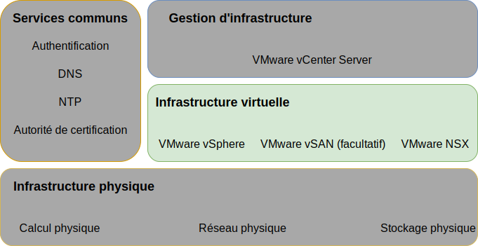
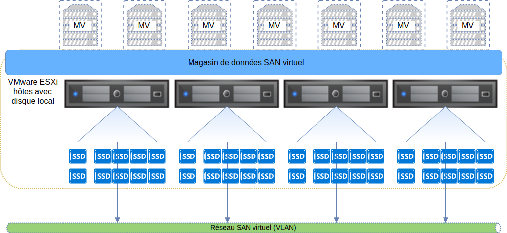

---

copyright:

  years:  2016, 2019

lastupdated: "2019-05-07"

subcollection: vmware-solutions

---

{:tip: .tip}
{:note: .note}
{:important: .important}

# Conception de l'infrastructure virtuelle
{: #design_virtualinfrastructure}

La couche d'infrastructure virtuelle inclut les composants logiciels VMware qui virtualisent les ressources de calcul, de stockage et de réseau fournies dans la couche d'infrastructure physique : VMware vSphere ESXi, VMware NSX-V ou NSX-T et éventuellement VMware vSAN.

## Conception de VMware vSphere
{: #design_virtualinfrastructure-vsphere-design}

La configuration de vSphere ESXi comprend les aspects suivants :
* Configuration d'amorçage
* Synchronisation d'horloge
* Accès à l'hôte
* Accès utilisateur
* Configuration DNS

Le tableau suivant présente les spécifications de chaque aspect. Après la configuration et l'installation d'ESXi, l'hôte est ajouté à une instance VMware vCenter Server et est géré à partir de là.

Cette conception vous permet d'accéder aux hôtes virtuels via l'interface DCUI (Direct Console User Interface) et vSphere Web Client. Après la mise à disposition, Secure Shell (SSH) et ESXi Shell sont désactivées conformément aux pratiques recommandées.

Par défaut, les seuls utilisateurs qui peuvent se connecter directement sont les utilisateurs _root_ et _ibmvmadmin_ pour la machine physique de l'hôte. L'administrateur peut ajouter des utilisateurs à partir du domaine MSAD (Microsoft Active Directory) pour activer l'accès utilisateur à l'hôte. Tous les hôtes de la conception de solution vCenter Server sont configurés pour être synchronisés avec un serveur NTP central.

Tableau 1. Configuration de vSphere ESXi

| Attribut              | Paramètre de configuration |
|:---------------------- |:----------------------- |
| Emplacement de l'amorçage ESXi     | Utilisation des disques locaux qui sont configurés dans RAID-1 |
| Synchronisation d'horloge   | Utilisation du serveur NTP {{site.data.keyword.cloud}} |
| Accès à l'hôte            | Prend en charge l'interface DCUI. SSH et ESXi Shell sont prises en charge mais ne sont pas activées par défaut |
| Accès utilisateur            | Authentification locale et MSAD |
| Résolution de nom de domaine | Utilisation de DNS comme indiqué dans [Conception des services communs](/docs/services/vmwaresolutions/archiref/solution?topic=vmware-solutions-design_commonservice). |
| Mode EVC | Skylake (uniquement pour les nouveaux déploiements vSphere 6.7) |

Le cluster vSphere héberge les machines virtuelles qui gèrent l'instance vCenter Server, ainsi que les ressources de calcul des charges de travail utilisateur.

* Lorsqu'une instance vCenter Server utilise vSAN, le nombre minimum d'hôtes ESXi lors du déploiement initial est 4.
* Lorsqu'une instance vCenter Server utilise un stockage de niveau fichier ou de niveau bloc partagé, le nombre minimum d'hôtes ESXi lors du déploiement initial est 3.

Vous pouvez effectuer une mise à l'échelle jusqu'à 59 hôtes ESXi au maximum durant ou après le déploiement initial.

Pour prendre en charge davantage de charges de travail utilisateur, vous pouvez effectuer une mise à l'échelle de l'environnement en :  
* Déployant plusieurs hôtes de calcul dans les clusters existants
* Déployant d'autres clusters gérés par le même dispositif vCenter Server Appliance
* Déployant de nouvelles instances vCenter Server avec leur propre dispositif vCenter Server Appliance

Pour plus d'informations sur les clusters, voir [{{site.data.keyword.cloud_notm}} running VMware clusters solution architecture](https://www.ibm.com/cloud/garage/files/IBM-Cloud-for-VMware-Solutions-Multicluster-Architecture.pdf).

## Conception de VMware vSAN
{: #design_virtualinfrastructure-vsan-design}

Dans cette conception, le stockage VMware vSAN est employé dans des instances vCenter Server afin de fournir du stockage partagé pour les hôtes vSphere.

Comme illustré dans la figure suivante, vSAN agrège le stockage local sur plusieurs hôtes ESXi dans un cluster vSphere et gère le stockage agrégé comme un seul magasin de données de machine virtuelle. Avec cette conception, les noeuds de traitement contiennent les unités de disque local pour le système d'exploitation ESXi et le magasin de données vSAN. Quel que soit le cluster auquel appartient un noeud, deux unités de système d'exploitation sont incluses dans chaque noeud pour héberger l'installation ESXi.

vSAN emploie les composants suivants :
* Conception vSAN avec deux groupes de disques ; chaque groupe de disques est composé d'au moins deux disques. L'unité SSD ou NVMe la plus petite dans le groupe sert de niveau de cache et les autres unités SSD servent de niveau de capacité.
* Le contrôleur RAID intégré est configuré dans une grappe RAID-0 pour chaque unité sauf pour les deux unités du système d'exploitation.
* Un seul magasin de données vSAN est créé à partir de toutes les unités de stockage.

Les fonctions vSAN disponibles varient en fonction de l'édition de licence que vous sélectionnez lors de la commande de l'instance. Pour plus d'informations, voir [Comparaison des éditions VMware vSAN](/docs/services/vmwaresolutions/archiref/solution?topic=vmware-solutions-solution-appendix#vmware-vsan-edition-comparison).

### Configuration de réseau virtuel pour vSAN
{: #design_virtualinfrastructure-net-setup}

Pour cette conception, le trafic vSAN parcourt les hôtes ESXi sur un réseau local privé dédié. Les deux adaptateurs de réseau connectés au commutateur de réseau privé sont configurés dans vSphere sous la forme d'un commutateur vDS avec les deux adaptateurs de réseau sous la forme de liaisons montantes. Un groupe de ports de noyau vSAN dédié qui est configuré pour le réseau local virtuel vSAN réside dans le commutateur vDS. Les trames Jumbo (MTU 9000) sont activées pour le commutateur vDS privé.

vSAN ne procède pas à l'équilibrage de charge du trafic entre les liaisons montantes. Par conséquent, un adaptateur est actif pendant que l'autre est en veille pour prendre en charge la haute disponibilité (HA). La règle de reprise par transfert configurée pour vSAN entre les ports de réseau physique est **Basculement explicite**.

Pour plus d'informations sur les connexions NIC physiques, voir [Connexions NIC hôte physiques](/docs/services/vmwaresolutions/services?topic=vmware-solutions-design_physicalinfrastructure#design_physicalinfrastructure-host-connect).

### Conception de règles vSAN
{: #design_virtualinfrastructure-storage-policy}

Lorsque vSAN est activé et configuré, des règles de stockage sont configurées pour définir les caractéristiques de stockage de machine virtuelle. Les caractéristiques de stockage spécifient différents niveaux de service pour différentes machines virtuelles.

La règle de stockage définie par défaut dans cette conception ne tolère qu'une seule panne. La règle par défaut est configurée avec le codage d'effacement, avec la **méthode de tolérance aux défaillances** définie sur **RAID-5/6 (Codage d'effacement) - Capacité** et le **niveau principal des pannes** défini sur 1. La configuration RAID 5 requiert au moins quatre hôtes.

Sinon, vous pouvez choisir la configuration RAID 6, avec la **méthode de tolérance aux défaillances** définie sur **RAID-5/6 (Codage d'effacement) - Capacité** et le **niveau principal des pannes** défini sur 2. La configuration RAID 6 requiert au moins six hôtes. La **duplication** et la **compression** sont également activées dans la règle de stockage par défaut.

Une instance utilise la règle par défaut sauf indication contraire à partir de la console vSphere. Lorsqu'une règle personnalisée est configurée, elle est garantie par vSAN chaque fois que cela est possible. Toutefois, si la règle ne peut pas être garantie, il n'est pas possible de mettre à disposition une machine virtuelle qui utilise la règle sauf si elle est activée pour forcer la mise à disposition.

Les règles de stockage doivent être réappliquées après l'ajout de nouveaux hôtes ESXi ou l'application de modules de correction aux hôtes ESXi.

### Paramètres vSAN
{: #design_virtualinfrastructure-vsan-sett}

Les paramètres vSAN sont définis selon les meilleures pratiques relatives au déploiement de solutions VMware dans {{site.data.keyword.cloud_notm}}. Ils incluent les paramètres SIOC, le groupe de ports des paramètres de basculement explicite et les paramètres de cache-disque.
* Paramètres de règles de cache SSD : NRWTD (No **Read Ahead**, **Write Through**, **Direct**)
* Paramètres de contrôle d'E-S de réseau
   * Gestion - 20 partages
   * Machine virtuelle - 30 partages
   * vMotion - 50 partages
   * vSAN - 100 partages
* Ports de noyau vSAN : **Basculement explicite**

## Stockage NFS connecté
{: #design_virtualinfrastructure-nfs-storage}

Lors de l'utilisation du stockage connecté au réseau NFS, cette architecture prescrit l'utilisation de NFS v3 au lieu de NFS v4.1, car les migrations LIF de serveur NFS peuvent provoquer un temps d'attente excessif lorsque NFS v4.1 est utilisé. Chaque hôte vSphere est connecté au stockage NFS à l'aide de son nom d'hôte. 

Un magasin de données NFS 2 To est connecté à un cluster pour être utilisé par des composants de gestion avec un niveau de performance de IOPS/Go. D'autres magasins de données peuvent être connectés à un cluster pour l'utilisation de charge de travail, à différentes tailles et différents niveaux de performance. 

De plus, cette architecture requiert que tous les hôtes disposent d'une route de sous-réseau créée pour le sous-réseau sur lequel réside le stockage NFS. Cette route de sous-réseau a pour objet de diriger tout le trafic NFS afin d'utiliser le groupe de ports, le sous-réseau et le VLAN conçus pour le trafic NFS. Si plusieurs magasins de données NFS sont connectés, il peut être nécessaire de configurer plusieurs routes car ces magasins de données peuvent se trouver dans différents sous-réseaux distants. 

Les machines virtuelles de gestion peuvent se trouver sur un magasin de données NFS. Cela crée un problème d'amorçage car certaines des machines de gestion peuvent être responsables des services DNS qui sont utilisés pour résoudre le nom d'hôte NFS. Par conséquent, cette architecture spécifie qu'au moins l'une des adresses IP pour le magasin de données de gestion doit être codée en dur dans `/etc/hosts` sur chacun des hôtes.

## Stockage iSCSI connecté
{: #design_virtualinfrastructure-iscsi-storage}

Contrairement à un stockage connecté NFS v3, un stockage connecté iSCSI prend en charge les configurations d'accès active–active sur tous les ports de carte NIC et les ports cible configurés. De ce fait, il est possible d'obtenir un débit plus élevé, ce qui constitue une alternative souhaitable au stockage connecté NFS. Cela se fait au prix d'une plus grande complexité.

Le stockage par blocs d'{{site.data.keyword.cloud_notm}} Endurance prend en charge un maximum de 64 adresses IP par numéro d'unité logique lors de l'utilisation de VMware, ce qui autorise jusqu'à 32 hôtes dans ce modèle.

Un numéro d'unité logique iSCSI de 2 To est connecté au cluster vSphere pour l'utilisation des composants de gestion, et un minimum d'un numéro d'unité logique iSCSI supplémentaire est configuré pour l'utilisation des charges de travail du client. Ce stockage est formaté comme un système de fichiers VMFS 6.x pour chaque numéro d'unité logique.

Cette architecture spécifie l'utilisation de la liaison de ports iSCSI, d'une politique circulaire pour le multi-accès, d'un nombre maximal de lignes de la file d'attente fixé à 64 et d'une limite IOPS circulaire égale à 1. 

### Configuration de réseau virtuel pour iSCSI
{: #design_virtualinfrastructure-setup-iscsi}

Pour cette conception, le trafic iSCSI peut utiliser les deux ports de carte NIC privés connectés dans une configuration active-active. Etant donné que vSphere n'autorise qu'un seul port de carte NIC actif à la fois sur un groupe de ports particulier dans vDS, vous devez créer deux groupes de ports (A et B) sur le réseau local virtuel de stockage.

Un port de noyau ESXi est créé avec une unique adresse IP sur des sous-réseaux individuels afin d'autoriser l'évolutivité. Chaque port de noyau est affecté à son propre groupe de ports iSCSI. Les deux ports de noyau sont affectés à un adaptateur de bus hôte de bus hôte (HBA) ISCSI virtuel ESXi. Pour chaque port de noyau, le commutateur de substitution de la passerelle par défaut est employé de manière à utiliser la passerelle par défaut pour le sous-réseau local pour ce port de noyau. Voir le tableau suivant.

Table 2. Groupes de ports iSCSi

Groupes de ports vDS | Sous-réseau du port de noyau | VMHBA
--|:---|:--
**SDDC-Dprotgroup-iSCSI-A** |Sous-réseau A |  vmhba64
**SDDC-Dprotgroup-iSCSI-B** | Sous-réseau B | vmhba64

#### Contrôle des E-S de stockage - SIOC
{: #design_virtualinfrastructure-sioc}

Des numéros d'unité logique iSCSI sont mis à disposition et formatés en un unique système de fichiers VMFS par numéro d'unité logique. Le paramètre par défaut recommandé de contrôle des E-S de stockage est de 90% du débit en période de pic.

## Conception de VMware NSX-V
{: #design_virtualinfrastructure-nsx-design}

La virtualisation de réseau fournit un réseau dissocié qui existe dans la couche virtuelle. Cette virtualisation offre à l'architecture des fonctions telles que la mise à disposition, le déploiement, la reconfiguration et la destruction rapides de réseaux virtuels à la demande. Cette conception utilise le commutateur vDS et VMware NSX for vSphere pour implémenter la mise en réseau virtuelle.

Dans cette conception, NSX Manager est déployé dans le cluster initial. NSX Manager se voit affecter une adresse IP VLAN provenant du bloc d'adresses portables privées conçu pour les composants de gestion et configuré avec les serveurs DNS et NTP présentés dans la rubrique [Conception des services communs](/docs/services/vmwaresolutions/archiref/solution?topic=vmware-solutions-design_commonservice).

La figure suivante illustre l'emplacement de NSX Manager par rapport aux autres composants de l'architecture.

Après le déploiement initial, l'automatisation {{site.data.keyword.cloud_notm}} déploie trois contrôleurs NSX dans le cluster initial. Chacun des contrôleurs se voit affecter une adresse IP VLAN provenant du sous-réseau portable **Privé A** destiné aux composants de gestion. En outre, la conception crée des règles anti-affinité MV-MV pour séparer les contrôleurs parmi les hôtes du cluster. Le cluster initial doit contenir un minimum de trois noeuds pour garantir la haute disponibilité des contrôleurs.

Outre les contrôleurs, l'automatisation {{site.data.keyword.cloud_notm}} prépare les hôtes vSphere déployés avec NSX VIBS pour permettre l'utilisation d'un réseau virtualisé via des points d'extrémité de tunnel VXLAN (VTEP). Les VTEP se voient affecter des adresses IP VLAN provenant de la plage d'adresses IP du sous-réseau portable **Privé A** spécifié pour les VTEP comme indiqué dans [Réseaux locaux virtuels](/docs/services/vmwaresolutions/services?topic=vmware-solutions-design_physicalinfrastructure#design_physicalinfrastructure-vlans). Le trafic VXLAN réside sur le réseau local virtuel non balisé et est affecté au commutateur vDS privé.

Par la suite, un pool d'ID de segment est affecté et les hôtes du cluster sont ajoutés à la zone de transfert. Seul unicast est utilisé dans la zone de transfert car la surveillance IGMP (Internet Group Management Protocol) n'est pas configurée dans {{site.data.keyword.cloud_notm}}. Deux ports de noyau VTEP sont configurés par hôte sur le même sous-réseau dédié VTEP conformément aux pratiques recommandées pour VMW.

Après cela, si l'instance a des interfaces de réseau public, deux paires de passerelles NSX Edge Services Gateway sont déployées. Une paire de passerelles est utilisée pour le trafic sortant des composants d'automatisation qui résident dans le réseau privé. Une seconde passerelle, appelée serveur de périphérie géré par le client, est déployée et configurée avec une liaison montante au réseau public et une interface qui est affectée au réseau privé. Pour plus d'informations sur les passerelles NSX ESG (Edge Services Gateway) déployées dans le cadre de la solution, voir [Architecture de la solution NSX Edge Services Gateway](/docs/services/vmwaresolutions/services?topic=vmware-solutions-nsx_overview#nsx_overview).

Les administrateurs de cloud peuvent configurer les composants NSX requis, tels que le routeur DLR (Distributed Logical Router), les commutateurs logiques et les pare-feu. Les fonctions NSX disponibles varient en fonction de l'édition de licence NSX que vous sélectionnez lors de la commande de l'instance. Pour plus d'informations, voir [Comparaison des éditions VMware NSX](/docs/services/vmwaresolutions/archiref/solution?topic=vmware-solutions-solution-appendix#vmware-nsx-edition-comparison).

NSX Manager est installé avec les spécifications recensées dans le tableau suivant.

Table 3. Exigences pour NSX Manager

| Attribut       | Spécification |
|:--------------- |:------------- |
| NSX Manager     | Dispositif virtuel |
| Nombre d'unités centrales virtuelles | 4 |
| Mémoire          | 16 Go |
| Disque            | 60 Go sur le partage NFS de gestion |
| Type de disque       | Alloué de manière dynamique |
| Réseau         | Sous-réseau portable **Privé A** conçu pour les composants de gestion |

### Conception du commutateur distribué
{: #design_virtualinfrastructure-distr-switch}

La conception utilise un nombre minimal de commutateurs vDS. Les hôtes du cluster sont connectés aux réseaux public et privé. Les hôtes sont configurés avec deux commutateurs virtuels distribués. L'utilisation de deux commutateurs est conforme à la pratique du réseau {{site.data.keyword.cloud_notm}} qui sépare le réseau public et le réseau privé. Le diagramme suivant illustre la conception vDS.

Comme illustré dans la figure précédente, un commutateur vDS est configuré pour la connectivité de réseau public (SDDC-Dswitch-Public) et l'autre commutateur vDS est configuré pour la connectivité de réseau privé (SDDC-Dswitch-Private). La séparation des différents types de trafic est nécessaire pour réduire les conflits et les temps d'attente et renforcer la sécurité.

Les VLAN sont utilisés pour segmenter les fonctions de réseau physique. Cette conception utilise VLAN, deux pour le trafic de réseau privé et l'autre pour le trafic de réseau public. Le tableau suivant illustre la séparation du trafic.

Table 4. Mappage VLAN aux types de trafic

| VLAN  | Désignation | Type de trafic |
|:----- |:----------- |:------------ |
| Réseau local virtuel 1 | Privé A   | Gestion ESXi, gestion, VXLAN (VTEP) |
| Réseau local virtuel 2 | Privé B   | vSAN, NFS, vMotion, iSCSI |
| Réseau local virtuel 3 | Public      | Disponible pour l'accès Internet |

Le trafic issu des charges de travail transite sur des commutateurs logiques VXLAN.

Le cluster vSphere utilise deux commutateurs distribués vSphere qui sont configurés comme indiqué dans les tableaux suivants.

Table 5. Commutateurs distribués de cluster convergé

| Nom de commutateur Nom de commutateur | Fonction | Réseau Contrôle E-S | Equilibrage de charge Mode | Ports Ports | MTU |
|:------------- |:------------- |:------------- |:------------- |:------------- |:------------- |
| SDDC-Dswitch-Private | gestion ESXi, vSAN, vSphere vMotion, point d'extrémité du tunnel VXLAN, NFS (VTEP) | Activé | Route basée sur le basculement explicite (vSAN, vMotion) port virtuel d'origine (tout le reste) | 2 | 9 000 (Trames Jumbo) |
| SDDC-Dswitch-Public | Trafic de gestion externe (Nord-Sud) | Activé | Route basée sur le port virtuel d'origine | 2 | 1 500 (par défaut) |

Les noms, le nombre et l'ordre des cartes d'interface réseau de l'hôte peuvent varier en fonction de l'{{site.data.keyword.CloudDataCent_notm}} et du matériel de l'hôte choisi.
{:note}

Table 6. Paramètres de configuration de groupe de ports de commutation distribuée pour le cluster convergé

| Paramètre          | Valeur       |
|:------------------ |:------------- |
| Equilibrage de charge     | Route basée sur le port virtuel d'origine \* |
| Détection de basculement | Statut de liaison uniquement |
| Commutateurs de notification    | Activé |
| Reprise par restauration           | Non |
| Commande de basculement     | Liaisons montantes actives : Uplink1, Uplink2 \* |

\* Le groupe de ports vSAN utilise le basculement explicite actif ou en veille car il ne prend pas en charge l'équilibrage de charge du trafic de stockage vSAN. Les groupes de ports iSCSI ne disposent que d'une seule liaison montante active à la fois (iSCSI A - Liaison montante 1, iSCSI B - Liaison montante 2).
{:note}

Table 7. Groupes de ports de commutation virtuelle et réseaux locaux virtuels, commutateur distribué **SDDC-Dswitch-Private**

Groupe de ports|Groupage|Liaisons montantes|ID réseau local virtuel
---|---|---|--
SDDC-DPortGroup-Mgmt|Port virtuel d'origine|Actives : 0, 1|Réseau local virtuel 1
SDDC-DPortGroup-vMotion|Port virtuel d'origine|Actives : 0, 1|Réseau local virtuel 2
SDDC-DPortGroup-VSAN|Basculement explicite|Active : 0, En veille : 1|Réseau local virtuel 2
SDDC-DPortGroup-NFS|Port virtuel d'origine|Actives : 0, 1|Réseau local virtuel 2
Généré par NSX|Port virtuel d'origine|Active : 0,1|Réseau local virtuel 1
SDDC-DPortGroup-External|Port virtuel d'origine|Actives : 0, 1|Réseau local virtuel 3
SDDC-DPortGroup-iSCSI-A|Port virtuel d'origine|Actives : 0|Réseau local virtuel 2
SDDC-DPortGroup-iSCSI-B|Port virtuel d'origine|Actives : 0|Réseau local virtuel 2

Table 8. Adaptateurs VMkernel de cluster convergé, commutateur distribué **SDDC-Dswitch-Private**

Objectif|Groupe de ports connecté|Services activés|MTU
--|---|---|---|--
Gestion|SDDC-DPortGroup-Mgmt|Trafic de gestion|1500 (valeur par défaut)
vMotion|SDDC-DPortGroup-vMotion|Trafic vMotion|9000
VTEP|Généré par NSX|-|9000
vSAN|SDDC-DPortGroup-VSAN|vSAN|9000
NAS|SDDC-DPortGroup-NFS|NAS|9000
iSCSI|SDDC-DPortGroup-iSCSI-A|iSCSI|9000
iSCSI|SDDC-DPortGroup-iSCSI-B|iSCSI|9000

### Configuration de NSX
{: #design_virtualinfrastructure-nsx-config}

Cette conception spécifie la configuration des composants NSX mais n'applique aucune configuration de réseau dissocié. Vous pouvez concevoir le réseau dissocié en fonction de vos besoins.

Les aspects suivants sont préconfigurés :
* Les serveurs et contrôleurs de gestion sont installés et intégrés dans l'interface utilisateur Web vCenter
* Les agents ESXi sont installés et des adresses IP VTEP sont configurées par hôte ESXi
* Configuration VTEP, configuration de contrôleur et configuration VXLAN (zone de transfert)
* Dispositifs NSX Edge Services Gateway destinés à être utilisés par les composants de gestion
* Dispositifs NSX Edge Services Gateway à l'usage des clients
* Charges de travail client NSX VXLAN associées à un routeur local distribué (DLR, Distributed Local Router) avec réseau VXLAN de transit entre le DLR et la passerelle ESG du client.
* Espace adresse RFC 1918 pour les réseaux VXLAN et l'espace d'adresses IP portables public et privé d'IBM Cloud à utiliser comme réseau Egress sur la passerelle ESG du client.

Les aspects suivants ne sont pas configurés :
* Micro segmentation
* Gestion NSX liée à d'autres instances VMware

## Connectivité au réseau public

Il y a plusieurs raisons pour lesquelles vous pouvez avoir besoin d'une connectivité au réseau public pour votre instance. Cela peut inclure l'accès à des services publics de mise à jour ou à d'autres services publics pour votre charge de travail tels que les bases de données de géolocalisation ou les données météorologiques. Vos services de gestion de la virtualisation et vos services complémentaires peuvent également nécessiter ou bénéficier d'une connectivité publique. Par exemple, vCenter peut mettre à jour sa base de données HCL et obtenir des mises à jour de [VMware Update Manager (VUM)](/docs/services/vmwaresolutions/archiref/vum?topic=vmware-solutions-vum-intro) sur le réseau public. Zerto, Veeam, VMware HCX, F5 BIG-IP et FortiGate-VM utilisent tous la connectivité au réseau public pour une partie de leurs licences de produits, de leur activation ou de leurs rapports d'utilisation. De plus, vous pouvez utiliser des tunnels sur le réseau public pour vous connecter à votre centre de données sur site à des fins de réplication.

Généralement, ces communications sont acheminées de façon sélective et transférées vers le réseau public par l'intermédiaire de la passerelle ESG client ou de gestion. Toutefois, il se peut que vous ayez des exigences de sécurité supplémentaires ou que vous préfériez utiliser un proxy pour simplifier le processus de communication. De plus, si vous avez déployé votre instance avec des interfaces publiques désactivées, vous ne pourrez pas utiliser les ESG pour le routage vers le réseau public.

Cette architecture permet les options suivantes pour router ou mettre en proxy votre trafic vers le réseau public :

Méthode|Description|Limitations
--|--|--
Passerelle virtualisée|Déployez une passerelle virtualisée (par exemple, NSX ESG, F5 BIG-IP, FortiGate-VM, ou un dispositif virtuel de votre choix) sur le réseau privé et public. Configurez le routage sur le système source (par exemple, vCenter, Zerto, votre charge de travail) pour diriger uniquement le trafic du réseau public vers la passerelle, et configurez la passerelle selon vos besoins.|Applicable uniquement aux instances dont les interfaces publiques sont activées. Cette configuration tient compte à la fois des modèles de trafic sortant et entrant.
Passerelle virtualisée avec proxy|Déployez une passerelle virtualisée comme ci-dessus. Derrière cette passerelle, [déployez un serveur proxy](/docs/services/vmwaresolutions/archiref/vum?topic=vmware-solutions-vum-init-config#vum-init-config) et configurez vos services et applications pour les relier au réseau public par ce serveur.|Applicable uniquement aux instances dont les interfaces publiques sont activées. Les modèles de trafic sortant peuvent utiliser le proxy mais les modèles de trafic entrant doivent être gérés au niveau de la passerelle.
Passerelle matérielle|Déployez un [dispositif de passerelle matérielle](https://cloud.ibm.com/catalog/infrastructure/gateway-appliance) sur votre réseau local virtuel de gestion. Configurez la passerelle pour transférer le trafic sortant vers le réseau public selon vos besoins.|Applicable à toutes les instances, avec ou sans interface publique activée. Cette configuration tient compte à la fois des modèles de trafic sortant et entrant.
Passerelle matérielle avec proxy|Déployez un dispositif de passerelle comme ci-dessus. Derrière cette passerelle, [déployez un serveur proxy](/docs/services/vmwaresolutions/archiref/vum?topic=vmware-solutions-vum-init-config#vum-init-config) et configurez vos services et applications pour les relier au réseau public par ce serveur.|Applicable à toutes les instances, avec ou sans interface publique activée. Les modèles de trafic sortant peuvent utiliser le proxy mais les modèles de trafic entrant doivent être gérés par la passerelle.
Equilibreur de charge|IBM Cloud offre plusieurs [services d'équilibrage de charge](https://cloud.ibm.com/catalog/infrastructure/load-balancer-group) que vous pouvez utiliser pour fournir un accès réseau entrant à vos applications.|Applicable à toutes les instances, mais limité aux modèles de trafic entrant.

## Liens connexes
{: #design_virtualinfrastructure-related}

* [{{site.data.keyword.cloud_notm}} running VMware clusters Solution Architecture](https://www.ibm.com/cloud/garage/files/IBM-Cloud-for-VMware-Solutions-Multicluster-Architecture.pdf)
* [Architecture de la solution NSX Edge Services Gateway](/docs/services/vmwaresolutions/services?topic=vmware-solutions-nsx_overview#nsx_overview)
