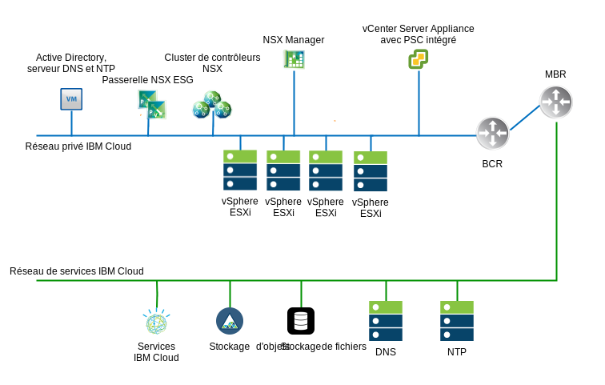
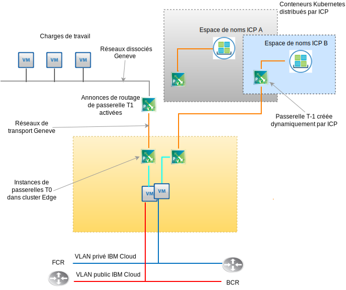

---

copyright:

  years:  2016, 2019

lastupdated: "2019-08-05"

subcollection: vmware-solutions

---

# Conception VMware NSX-T
{: #nsx-t-design}

A la différence de NSX-V (NSX on vSphere), VMware NSX-T a été conçu pour prendre en charge les structures et les architectures d'application comportant des points finaux et des piles technologiques hétérogènes. En plus de vSphere, ces environnements peuvent inclure d'autres hyperviseurs, KVM, des conteneurs et des serveurs bare metal. VMware NSX est conçu pour étendre une infrastructure de sécurité et de réseau définie par logiciels sur d'autres plateformes que vSphere. Bien qu'il soit possible de déployer des composants NSX-T sans avoir besoin de vSphere, cette conception est axée sur NSX-T et son intégration, principalement au sein d'un déploiement automatisé vCenter Server vSphere.

Il existe de nombreuses fonctionnalités avancées dans NSX-T, telles que des règles d'administration des pare-feux, l'inclusion de l'introspection des invités dans les règles d'administration des pare-feux et le suivi avancé du trafic réseau. La description de ces fonctionnalités dépasse le cadre du présent document. Consultez la documentation VMware pour NSX-T. Dans cette conception, l'infrastructure de gestion NSX-T est déployée lors du déploiement initial du cluster vCenter Server à la place de NSX-V.

## NSX-T ou NSX-V
{: #nsx-t-design-nsx-t-nsx-v}

Pour NSX (NSX-V) natif vSphere, revoyez les objets NSX-T les plus connus ayant des fonctions similaires à leurs homologues NSX-V. Les limitations et différences au sein d'un environnement vSphere sont également abordées. Le tableau ci-dessous répertorie les fonctions généralement utilisées de T et V qui correspondent.

Tableau 1. Terminologie NSX-V à NSX-T

NSX-V ou vSphere natif | NSX-T
--|:---|:--
**Commutateur distribué virtuel (VDS, Virtual Distributed Switch)** | Commutateur distribué virtuel de réseau (N-VDS, Network Virtual Distributed Switch)
**Zone de transport NSX** | Zone de transport (dissociée ou réseau local virtuel)
**Groupe de ports (vDS)** | Commutateur logique
**VXLAN (encapsulation L2)** | GENEVE (encapsulation L2)
**Passerelle Edge** | Passerelle T0 (changée depuis la version 2.4)
**Routeur logique distribué (DLR, Distributed Logical Router)** | Passerelle T1 (changée depuis la version 2.4)
**Serveur ESXi (vTEP)** | Noeud de transport (ESXi, KVM, passerelle T0 bare metal)

Certains concepts NSX-T fondamentaux qui ne correspondent pas à la fonction de NSX-V pour cette implémentation de la conception de NSX-T doivent être parfaitement compris.

A savoir :
- Un cluster Edge est constitué d'une ou plusieurs machines virtuelles ou machines physiques qui participent à une matrice virtuelle NSX-T. Elles sont les noeuds finaux des zones de transport réseau dissocié et des zones de transport de réseau local virtuel. Un cluster Edge peut prendre en charge plusieurs instances de passerelle de niveau 0.
- Une passerelle de niveau 0 est une instance de routeur virtuel, mais pas une machine virtuelle. Plusieurs instances de passerelles de niveau 0 peuvent s'exécuter au sein d'un cluster Edge chacune avec ses propres fonctions et tables de routage. Cela signifie qu'un cluster Edge doit exister avant de créer une instance de routeur de niveau 0.
- Une zone de transport peut couvrir des noeuds finaux dans différentes plateformes et plusieurs instances vSphere vCenter. Aucune liaison NSX n'est nécessaire dans vCenter. Des zones de transport peuvent être exclues de noeuds finaux spécifiques. Un commutateur N-VDS est directement corrélé à une zone de transport et créé lors de la création de la zone de transport.
- Une commande de basculement de liaison montante est créée. Elle est indépendante des commutateurs logiques, qui sont créés dans des profils tels que “Profils de liaison montante” et appliqués à un commutateur logique particulier basé sur un réseau local virtuel. Etant donné qu'il est possible d'avoir besoin de commandes de basculement différentes ou d'un équilibrage de charge des liaisons montantes physiques pour le même réseau local virtuel, le profil de liaison montante d'un réseau local virtuel particulier peut contenir plusieurs entrées pour “Groupage” avec différentes commandes de basculement et d'équilibrage de charge. Lorsque vous affectez le profil de liaison montante à un commutateur logique, le profil de groupage approprié est alors sélectionné.

- A compter de NSX-T version 2.4, le fonctionnement de la machine virtuelle du gestionnaire et celui du contrôleur sont combinés. En conséquence, trois machines virtuelles gestionnaire de contrôleurs sont déployées. Si elles se trouvent sur le même sous-réseau, elles utilisent un équilibreur de charge réseau interne. Si elles sont dans des sous-réseaux différents, un équilibreur de charge externe est nécessaire.

## Besoins en ressources
{: #nsx-t-design-resource-req}

Dans cette conception, les machines virtuelles gestionnaire-contrôleur NSX-T sont déployées sur le cluster initial. De plus, chaque gestionnaire-contrôleur se voit affecter une adresse IP de réseau local virtuel provenant du bloc d'adresses du sous-réseau portable privée conçu pour les composants de gestion et configuré avec les serveurs DNS et NTP traités dans la section 0. Un récapitulatif de l'installation du gestionnaire NSX-T Manager est présenté dans le tableau suivant.

Tableau 2. NSX-T Manager - spécifications pour le contrôleur

Attribut | Spécification
--|--
**NSX Manager / Controller** | Trois dispositifs virtuels
**Nombre d'UC virtuelles** | 4
**Mémoire** |  16 Go
**Disque** | 60 Go
**Type de disque** | A allocation dynamique
**Réseau privé A** | Privé A

La figure suivante illustre l'emplacement des contrôleurs NSX Manager par rapport aux autres composants de cette architecture.

## Remarques liées au déploiement
{: #nsx-t-design-deployment}

Avec NSX-T on vSphere, les adaptateurs physiques doivent être affectés au N-VDS (virtual distributed switch, commutateur distribué virtuel) au sein des hôtes. Etant donné qu'un N-VDS ne peut être configuré que dans NSX-T Manager, si la redondance doit être maintenue, aucun adaptateur physique n'est disponible pour le commutateur local natif ou l'affectation des commutateurs distribués vSphere (vDS) dans un cluster qui héberge à la fois des composants NSX-T et les composants de réseaux dissociés associés.

C'est pourquoi, lors de l'installation de NSX-T et de sa configuration, un port NIC physique sur un adaptateur doit rester affecté à un commutateur virtuel (vSwitch) vSphere local ou un commutateur distribué virtuel
(vDS). Après le déploiement de NSX-T, tous les ports de noyau ESX doivent être migrés vers un commutateur N-VDS et supprimés de tout commutateur vSwitch local ou VDS. Une fois les ports de noyau supprimés, les ports NIC physiques restants peuvent être affectés en tant que liaison montante N-VDS assurant la redondance du commutateur N-VDS.

Après le déploiement initial, l'automatisation {{site.data.keyword.cloud_notm}} déploie trois dispositifs virtuels NSX-T Manager/Controller dans le cluster initial. Les contrôleurs se voient affecter une adresse IP VLAN provenant du sous-réseau portable A destiné aux composants de gestion. De ^plus, les règles d'anti-affinité MV–MV sont créées de telle sorte que les contrôleurs soient répartis parmi les hôtes du cluster.

Vous devez déployer le cluster initial avec un minimum de trois noeuds afin de garantir la haute disponibilité des paires Manager/Controller. En plus des Manager/Controller, l'automatisation {{site.data.keyword.cloud_notm}} prépare les hôtes vSphere déployés en tant que noeuds de transport NSX-T. Les noeuds de transport ESXi se voient affecté une adresse IP VLAN provenant de la plage d'adresses IP du sous-réseau portable privé A spécifié par une plage de pool d'adresses IP NSX dérivée du récapitulatif VLAN et sous-réseau. Le trafic des noeuds de transport réside sur le réseau local virtuel non balisé et est affecté au commutateur distribué virtuel (N-VDS) NSX-T privé.

Selon la topologie NSX-T que le client a choisi de déployer, un cluster Edge NSX-T est déployé en tant que paire de machines virtuelles ou de logiciel déployé sur des noeuds de cluster bare metal. Que la paire de clusters soit virtuelle ou physique, des liaisons montantes sont configurées sur des commutateurs N-VDS pour les réseaux public et privé d'{{site.data.keyword.cloud_notm}}.

Le tableau suivant récapitule les exigences relatives à un environnement de taille moyenne.

Tableau 3. Spécification de composant NSX-T

 Ressources | 3 contrôleurs Manager | 2 clusters Edge | Edge Bare Metal
-----------|:---------|:-------|:---------
**Taille moyenne** | Dispositif virtuel | Dispositif virtuel | Serveur physique
**Nombre d'UC virtuelles** | 4 | 4 | 8
**Mémoire** | 16 Go | 8 Go | 32 Go
**Disque** | 120 Go sur réseau de stockage virtuel/NFS de gestion | 120 Go sur réseau de stockage virtuel/NFS de gestion | 200 Go
**Type de disque** | A allocation dynamique | A allocation dynamique | Physique
**Réseau** | Privé A | Privé A | Privé A

## Zones de transport et N-VDS
{: #nsx-t-design-transport-zones}

Les zones de transport déterminent quels hôtes et quelles machines virtuelles peuvent participer à l'utilisation d'un réseau particulier. Une zone de transport effectue cette opération en limitant les hôtes qui peuvent "voir" un commutateur logique et, par conséquent, les machines virtuelles qui peuvent être associées au commutateur logique. Une zone de transport peut couvrir un ou plusieurs clusters d'hôtes. Cette conception lance un appel pour que des zones de transport soient créées comme suit :

Tableau 4. Zones de transport NSX-T et N-VDS

Nom de la zone de transport | VLAN/VXLAN | Nom du N-VDS | Règle de groupage de liaison montante
--|:-------|:------|:-----
**Private-Overlay** | VXLAN | SDDC-Dissocié | Par défaut
**Public-VLAN** | VLAN | SDDC-Public | Par défaut
**Private-VLAN** | VLAN | SDDC-Privé | NFS,vSAN,iSCSI-A&B Par défaut

## Noeuds de transport
{: #nsx-t-design-transport-nodes}

Les noeuds de transport définissent les objets serveur physique ou les machines virtuelles qui participent à la matrice de réseau virtuel. Pour comprendre la conception, revoyez le tableau suivant.

Tableau 5. Noeuds de transport NSX-T

Type de noeud de transport | N-VDS | Profil de liaison montante | Affectation d'IP | Cartes d'interface réseau physiques
--|:--------|:--------|:---
**ESXi** | SDDC-Privé | SDDC-Privé-liaison montante | Pool d'IP | vmnic0, vmnic2
**Cluster Edge** | SDDC-Dissocié | SDDC-Dissocié-liaison montante | Pool d'IP | Non applicable
**Edge physique** | SDDC-Privé | SDDC-Privé-liaison montante | Pool d'IP | eth0, eth2

## Profils de liaison montante
{: #nsx-t-design-uplink-profiles}

Un profil de liaison montante définit des règles pour les liaisons entre les hôtes hyperviseurs et les commutateurs logiques NSX-T ou entre les noeuds Edge NSX et les commutateurs de niveau supérieur (ToR, Top-of-Rack).

Tableau 6. Profils de liaison montante NSX-T

Nom du profil de liaison montante | VLAN | Groupages inclus | MTU
--|:-----|:---|:---
**SDDC-Private-Uplink** | Par défaut | Par défaut, gestion | 9000
**SDDC-Public-Uplink** | Par défaut| Par défaut | 1500
**SDDC-Storage-Uplink** | Réseau local virtuel de stockage | vSAN, iSCSI-A&B,NFS | 9000

## Groupage
{: #nsx-t-design-teaming}

Tableau 7. Spécification de groupage du port NIC NSX-T

Nom du groupage | Basculement ou équilibrage de charge | NIC actif | NIC en veille
--|:----|:---|:---
**Default** | Source d'équilibrage de charge | Liaison montante 1, 2 | Non applicable
**Management** | Basculement| Liaison montante 1 | Liaison montante 2
**TEP** | Basculement| Liaison montante 1 | Liaison montante 1
**vSAN** | Basculement| Liaison montante 2 | Liaison montante 1
**iSCSI-A** | Basculement| Liaison montante 1 | Non applicable
**iSCSI-B** | Basculement| Liaison montante 2 | Non applicable
**NFS** | Source d'équilibrage de charge | Liaison montante 1, 2 | Liaison montante 1
**vMotion** | Basculement| Liaison montante 2 | Liaison montante 1

## Pools de VNI
{: #nsx-t-design-vni-pools}

Les identificateurs de réseau virtuel (VNI, Virtual Network Identifier) sont similaires aux réseaux locaux virtuels (VLAN, Virtual Local Area Network) dans un réseau physique. Ils sont automatiquement créés lors de la création d'un commutateur logique à partir d'un pool ou d'une plage d'ID. Cette conception utilise le pool de VNI par défaut déployé avec NSX-T.

## Commutateurs logiques
{: #nsx-t-design-logical-switches}

Un commutateur logique NSX-T reproduits des fonctionnalités de commutation, de diffusion, d'unicast inconnu, de trafic de multidiffusion (BUM), dans un environnement virtuel totalement découplé du matériel sous-jacent.

Tableau 8. Commutateurs logiques NSX-T

Nom du commutateur logique | VLAN |Zone de transport | Règle de groupage de liaison montante
--|:---|:----|:---
**SDDC-LS-Mgmt** | Par défaut | Privé-VLAN | Gestion
**SDDC-LS-NFS** | Par défaut | Privé-VLAN | NFS
**SDDC-LS-vMotion** | Par défaut | Privé-VLAN | vMotion
**SDDC-LS-VSAN** | Réseau local virtuel de stockage balisé | Privé-VLAN | vSAN
**SDDC-LS-iSCSI-A** | Réseau local virtuel de stockage balisé | Privé-VLAN| iSCSI-A
**SDDC-LS-iSCSi-B** | Réseau local virtuel de stockage balisé | Privé-VLAN| iSCSi-B
**SDDC-LS-TEP** | Par défaut | Privé-VLAN| Liaison montante
**SDDC-LS-External** | Par défaut | Public-VLAN | Par défaut

### Cluster Edge
{: #nsx-t-design-edge-cluster}

Dans cette conception, un unique cluster Edge virtuel est mis à disposition à l'usage des charges de travail client et de gestion. Le cluster Edge virtuel peut héberger plusieurs instances de passerelles T0. Comme indiqué précédemment, plusieurs instances de passerelles Edge T0 peuvent être instanciées sur un même cluster Edge, chacune disposant de ses propres tables de routage. Voir la figure suivante qui illustre les composants fonctionnels d'un cluster Edge NSX-T.

#### Passerelle de routeur logique de niveau 0
{: #nsx-t-design-tier-0}

Un routeur logique de niveau 0 NSX-T fournit un service passerelle en et hors fonction entre le réseau logique et le réseau physique. Pour cette conception, plusieurs passerelles de niveau 0 sont déployées pour les besoins de gestion, l'ajout de produits et éventuellement de topologies choisies par le client.

#### Passerelle de routeur logique de niveau 1
{: #nsx-t-design-tier-1}

Une passerelle logique de niveau 1 NSX-T dispose de ports de liaison descendante pour se connecter aux commutateurs logiques des centres de données NSX-T et des ports de liaison montante pour se connecter aux routeurs logiques de niveau 0 des centres de données NSX-T uniquement. Ils s'exécutent au niveau noyau de l'hyperviseur pour lequel ils sont configurés et non en tant que machine virtuelle ou physique. Pour cette conception, une ou plusieurs passerelles logiques de niveau 1 sont créées pour les besoins des topologies choisies par le client.

#### Annonces de routage du niveau 1 vers le niveau 0
{: #nsx-t-design-tier-1-tier-0}

 Afin de fournir une connectivité de couche 3 entre les machines virtuelles connectées aux commutateurs logiques reliés à différentes passerelles logiques de niveau 1, il est nécessaire d'activer les annonces de routage du niveau 1 à destination du niveau 0. Inutile de configurer un protocole de routage ou des routes statiques entre les routeurs logiques de niveau 1 et de niveau 0. NSX-T crée automatiquement des routes statiques lorsque vous activez les annonces de routage. Pour cette conception, les annonces de routage sont toujours activées pour toutes les passerelles de niveau 1 créées par automatisation IC4V.

### Topologies préconfigurées
{: #nsx-t-design-preconfig-topo}

Charge de travail de T1 vers passerelle T0 – cluster Edge virtuel :

A la base, la topologie IC4V déployée 1 est la même que celle déployée avec des passerelles NSX-V DLR et Edge. Avec NSX-T, pas de configuration de protocole de routage dynamique entre T1 et T0. L'espace d'adresse IP RFC-1891 est utilisé pour le réseau dissocié de charge de travail et le réseau dissocié de transport. Un espace d'adresses IP portables privées et publiques client est affecté à l'usage des clients. Un espace d'adresses IP portables privées et publiques {{site.data.keyword.cloud_notm}} désigné par le client est affecté à T0 pour une utilisation par le client.

A partir de cette conception, vous avez la possibilité de ne pas supprimer ces plages d'adresses IP si l'instance vCenter Server est déclassée et supprimée.

Charge de travail de T1 vers passerelle T0 – cluster Edge physique :

La topologie 2 déployée est similaire à l'exception qui remplace le cluster Edge basé sur machine virtuelle par une paire de serveurs bare metal qui exécutent Red Hat Server. Un espace d'adresses IP portables privées et publiques {{site.data.keyword.cloud_notm}} désigné par le client est affecté à T0 pour une utilisation par le client. A partir de cette conception, vous avez la possibilité de ne pas supprimer ces plages d'adresses IP si l'instance vCenter Server est déclassée et supprimée.

Consultez un autre document ou cliquez sur un lien pour une nomenclature incluant les spécifications relatives au matériel et au système d'exploitation.

Charge de travail avec ICP vers passerelle T0 – cluster Edge virtuel :

La topologie 3 déployée contient la topologie 1 à laquelle s'ajoute un déploiement ICP qui comprend l'intégration NSX-T à la place de Calico, qui est la pile réseau par défaut au sein d'un déploiement ICP. Le client peut mettre à disposition des espaces de nom de conteneur supplémentaires dans ICP, qui automatise la création de commutateurs logiques, d'adresse IP de sous-réseau et d'instances de passerelle T1 pour chaque espace de nom.

Pour parfaitement comprendre comment fonctionne ICP sur vCenter Server, consultez la documentation relative à l'architecture ICP sur vCenter Server. Un espace d'adresses IP portables privées et publiques {{site.data.keyword.cloud_notm}} désigné par le client est affecté à T0 pour une utilisation par le client.

A partir de cette conception, vous avez la possibilité de ne pas supprimer ces plages d'adresses IP si l'instance vCenter Server est déclassée et supprimée.
