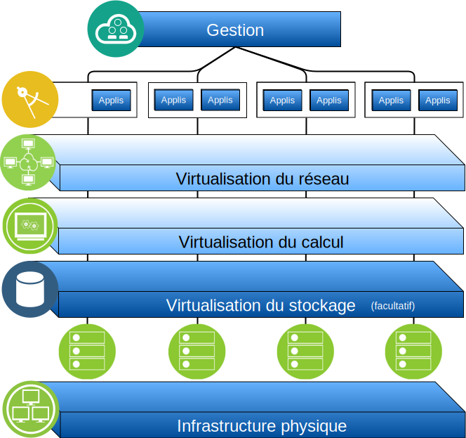

---

copyright:

  years:  2016, 2019

lastupdated: "2019-05-07"

subcollection: vmware-solutions

---

# Présentation d'IBM Cloud for VMware Solutions
{: #solution_overview}

Les offres {{site.data.keyword.vmwaresolutions_full}} vous permettent d'étendre votre centre de données virtuel VMware existant dans {{site.data.keyword.cloud_notm}} ou d'héberger vos applications natives en cloud.

La solution prend en charge des cas d'utilisation, tels que l'extension de capacité dans le cloud (et la contraction le cas échéant), la migration vers le cloud, la reprise après incident vers le cloud et la sauvegarde dans le cloud. Avec la solution, vous pouvez créer un environnement de cloud dédié pour le développement, les tests, la formation, les laboratoires ou la production.

Consultez ces informations pour la conception de l'offre {{site.data.keyword.vmwaresolutions_short}} vCenter Server, dont les charges de travail cible requièrent des niveaux élevés de disponibilité et d'évolutivité.

Cette conception sert d'architecture de référence pour les autres composants internes ou spécifiques des fournisseurs qui doivent être ajoutés pour des cas d'utilisation spécifiques.

## Principaux avantages d'IBM Cloud for VMware Solutions
{: #solution_overview-benefits}

VMware vCenter Server on {{site.data.keyword.cloud_notm}} fournit les blocs de construction fondamentaux, notamment VMware vSphere, vCenter Server, NSX et des options de stockage partagé, telles que vSAN. Ces composants sont nécessaires pour concevoir une solution de centre de données VMware souple et définie par le logiciel qui soit la mieux adaptée à vos charges de travail.

En exploitant l'automatisation avancée et l'infrastructure bare metal à service exclusif, vous pouvez rapidement déployer l'environnement VMware complet sur {{site.data.keyword.cloud_notm}} en quelques heures. Vous pouvez dès lors accéder à l'environnement hébergé par IBM et le gérer via les clients VMware natifs, l'interface de ligne de commande, des scripts existants ou d'autres outils compatibles avec l'API vSphere et qui vous sont familiers.

Après le déploiement, vous pouvez ajouter (et supprimer) des serveurs ESXi pour une instance, ajouter et supprimer des clusters, adjoindre des instances vCenter Server supplémentaires à une instance existante et ajouter des produits et des services à l'aide de la console {{site.data.keyword.vmwaresolutions_short}}. Il vous incombe de surveiller et gérer les instances vCenter Server.

Vous êtes également en charge des sauvegardes, de l'application des correctifs, de la configuration et de la surveillance du logiciel VMware et du matériel hyperviseur sous-jacent. {{site.data.keyword.vmwaresolutions_short}} offre des solutions automatisées qui vous aident dans vos tâches permanentes de gestion et de surveillance de l'instance vCenter Server.

De plus, des services professionnels et gérés d'{{site.data.keyword.cloud_notm}} sont également disponibles pour vous aider à accélérer votre transition vers le cloud avec des offres de services de migration, d'implémentation et d'intégration.

Contrairement à une offre de service géré, vCenter Server vous offre un accès total et complet à tous les composants de sorte que vous bénéficiez de plus de souplesse qu'avec un service géré. Cependant, certaines contraintes s'appliquent après le déploiement de vCenter Server pour que l'automatisation IBM Cloud for VMware Solutions fonctionne.

Les offres VMware on {{site.data.keyword.cloud_notm}} présentent les avantages suivants :

* Une **livraison plus rapide** des projets informatiques pour les développeurs et les secteurs d'activité. Le temps nécessaire à l'approvisionnement, à l'architecture, à l'implémentation et au déploiement des ressources passe de quelques semaines ou quelques mois à quelques heures.
* Une **sécurité renforcée** au moyen de serveurs bare metal dédiés dans un cloud privé hébergé, y compris le chiffrement des données au repos. Pour un stockage vSAN, le chiffrement des données au repos à l'aide du chiffrement vSAN ou vSphere est optionnel. Pour un stockage de niveau bloc ou fichier partagé, le chiffrement au repos géré par le fournisseur-service est disponible par défaut dans des centres de données sélectionnés ou optionnel à l'aide du chiffrement vSphere. Vous devez gérer les clés de chiffrement nécessaires.
* Une **gestion et une gouvernance cohérentes** du cloud hybride déployé grâce à des droits d'accès administrateur complets à la gestion de la virtualisation, ce qui permet de préserver vos outils et vos scripts VMware existants, ainsi que les efforts réalisés en matière de formation.
* Une **expertise VMware à l'échelle mondiale ** grâce aux services professionnels et gérés d'IBM qui couvrent plus de 30 centres de données {{site.data.keyword.CloudDataCents_notm}} dans le monde entier.

## Liens connexes
{: #solution_overview-related}

* [Présentation de la conception](/docs/services/vmwaresolutions/archiref/solution?topic=vmware-solutions-design_overview)
* [Mise à l'échelle de la capacité](/docs/services/vmwaresolutions/archiref/solution?topic=vmware-solutions-solution_scaling)
* [Sauvegarde des composants](/docs/services/vmwaresolutions/archiref/solution?topic=vmware-solutions-solution_backingup)
