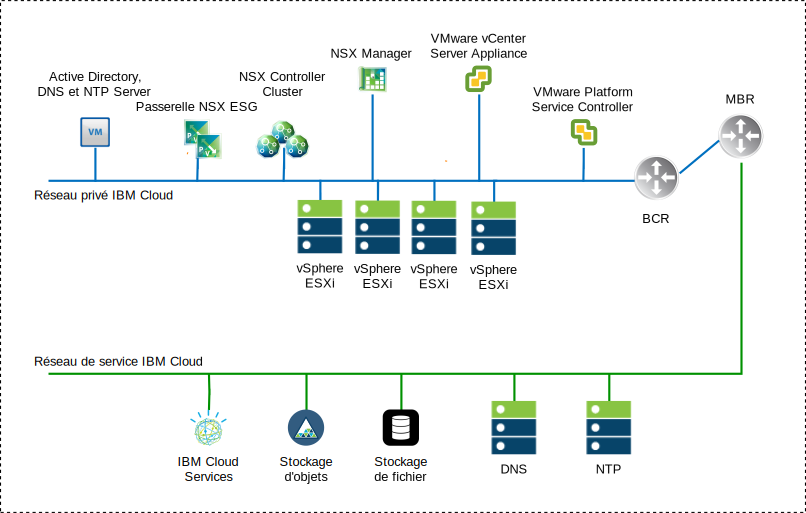
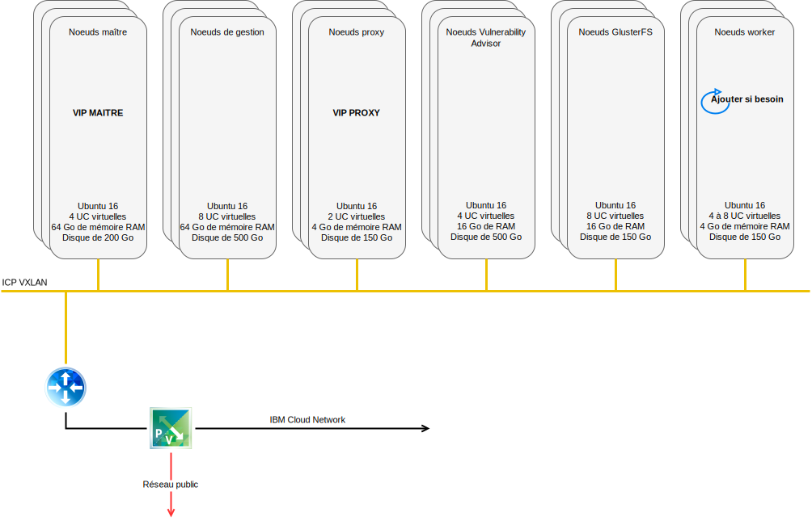
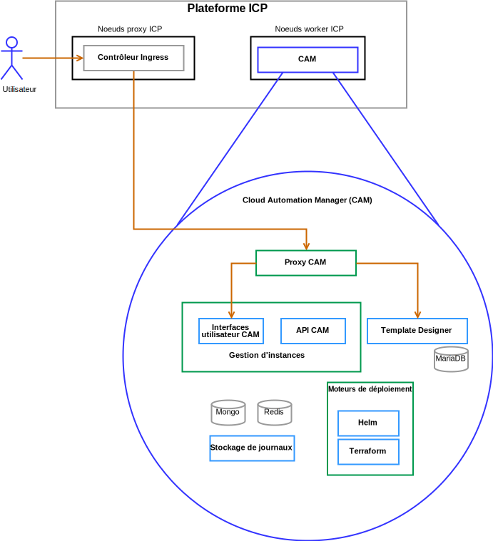

---

copyright:

  years:  2016, 2019

lastupdated: "2019-01-23"

---

# Composants de la solution

## Composants VMware vCenter Server on IBM Cloud

Figure 1. Diagramme de l'environnement vCenter Server

### Contrôleur PSC (Platform Service Controller)

Le déploiement vCenter Server utilise un seul contrôleur PSC externe installé sur un sous-réseau portable dans le réseau VLAN privé qui est associé à des machines virtuelles de gestion. Le routeur BCR (Back-end Customer Router) lui sert de passerelle par défaut.

### vCenter Server

A l'instar du contrôleur PSC, vCenter Server est déployé en tant que dispositif. De plus, vCenter Server est installé sur un sous-réseau portable sur le réseau VLAN privé qui est associé à des machines virtuelles de gestion. L'adresse IP affectée sur le routeur BCR pour ce sous-réseau spécifique lui sert de passerelle par défaut.

### NSX Manager

NSX Manager est déployé sur le cluster initial. De plus, NSX Manager se voit affecter une adresse IP VLAN provenant du bloc d'adresses portables privées conçu pour les composants de gestion et configuré avec les serveurs DNS et NTP

### Contrôleurs NSX

L'automatisation d'{{site.data.keyword.cloud}} déploie trois contrôleurs NSX dans le cluster initial. Les contrôleurs se voient affecter une adresse IP VLAN provenant du sous-réseau portable destiné aux composants de gestion.

### NSX Edge et Distributed Logical Router

Des paires de passerelles NSX ESG (Edge Services Gateway) sont déployées. Dans tous les cas, une paire de passerelles est utilisée pour le trafic sortant des composants d'automatisation qui résident sur le réseau privé. Pour vCenter Server et {{site.data.keyword.icpfull_notm}}, une seconde passerelle, appelée serveur de périphérie géré ICP, est déployée et configurée avec une liaison montante au réseau public et une interface qui est affectée au réseau privé. L'administrateur peut configurer les composants NSX requis, tels que le routeur DLR (Distributed Logical Router), les commutateurs logiques et les pare-feux.

Pour plus d'informations sur la conception de réseau, voir l'[architecture de référence pour la mise en réseau de vCenter Server](/docs/services/vmwaresolutions/archiref/vcsnsxt/vcsnsxt-intro.html).

Le tableau ci-après répertorie les spécifications ESG et DLR pour {{site.data.keyword.icpfull_notm}}.

Tableau 1. Spécifications ESG pour {{site.data.keyword.icpfull_notm}}

Attribut | Spécification
--|--
Edge Service Gateway | Dispositif virtuel
Edge size    Large | Nombre de vCPU	2
Memory    | 1 Go
Disk    | 1000 Go sur magasin de données local

Tableau 2. Spécifications DLR pour {{site.data.keyword.icpfull_notm}}

Attribut | Spécification
--|--|
Distributed Logical Router |     Dispositif virtuel
Edge size    Compact | Nombre de vCPU	1
Memory    | 512 Mo
Disk    | 1000 Go sur magasin de données local

## Composants IBM Cloud Private

{{site.data.keyword.icpfull_notm}} est une plateforme applicative pour le développement et la gestion sur site d'applications conteneurisées. {{site.data.keyword.icpfull_notm}} est un environnement intégré de gestion des conteneurs qui inclut l'orchestrateur de conteneurs Kubernetes, un référentiel d'images privé, une console de gestion et des infrastructures de surveillance.

Figure 2. Déploiement {{site.data.keyword.icpfull_notm}} virtuel avec vCenter Server

### Noeud d'amorçage

Un noeud d'amorçage (facultatif) est utilisé pour exécuter l'installation, la configuration, la mise à l'échelle du noeud et les mises à jour de cluster. Un seul noeud d'amorçage est requis pour un cluster. Utilisez un noeud unique pour le maître et l'amorçage.

### Noeud maître

Un noeud maître fournit des services de gestion et contrôle les noeuds worker dans un cluster. Les noeuds maître hébergent les processus responsables de l'allocation des ressources, de la maintenance des états, de la planification et de la surveillance.
Parce qu'un environnement à haute disponibilité comporte plusieurs noeuds maître, en cas de défaillance du noeud maître principal, une logique de basculement promeut automatiquement un autre noeud dans le rôle de maître. Les hôtes qui peuvent servir de maître sont appelés candidats maître.

### Noeud worker

Un noeud worker est un noeud qui fournit un environnement conteneurisé pour exécuter des tâches. Lorsque le nombre de demandes augmente, d'autres noeuds worker peuvent facilement être ajoutés à votre cluster afin d'améliorer les performances et l'efficience. Un cluster peut comporter n'importe quel nombre de noeuds worker, mais au moins un noeud worker est requis.

### Noeud proxy

Un noeud proxy est un noeud qui transmet une demande externe aux services créés dans votre cluster. Parce qu'un environnement à haute disponibilité comporte plusieurs noeuds proxy, en cas de défaillance du noeud proxy principal, une logique de basculement promeut automatiquement un autre noeud dans le rôle de proxy. Bien que vous puissiez utiliser un noeud unique comme maître et proxy, il est conseillé d'utiliser des noeuds proxy dédiés afin de réduire la charge sur le noeud maître. Un cluster doit comporter au moins un noeud proxy si l'équilibrage de charge est nécessaire dans le cluster.

### Noeud de gestion

Un noeud de gestion est un noeud facultatif qui héberge des services de gestion, tels que la surveillance, le décompte et la consignation. Configurer des noeuds de gestion dédiés vous permet d'éviter que le noeud maître ne soit en surcharge. Vous pouvez activer le noeud de gestion uniquement lors de l'installation d'{{site.data.keyword.icpfull_notm}}.

### Noeud Vulnerability Advisor

Un noeud Vulnerability Advisor (VA) est un noeud facultatif, utilisé pour l'exécution des services Vulnerability Advisor. Les services Vulnerability Advisor consomment un grand nombre de ressources. Si vous utilisez des services Vulnerability Advisor, spécifiez un noeud VA dédié.

Tableau récapitulant les spécifications de machine virtuelle requises pour une instance {{site.data.keyword.icpfull_notm}} à haute disponibilité :

Tableau 3. Spécifications de machine virtuelle {{site.data.keyword.icpfull_notm}}

Noeud |     Instances    | IP    | UC    | Mémoire RAM (Go)    | Disque (Go)
:-----|------------:|:----|----:|----------:|----------:|
Maître|    3    | IP (x3) VIP (x1)    | 4    | 64    | 200
Gestion    |3    | IP (x3)    |8    |64    |500
Proxy    | 3    | IP (x3)VIP (x1)    |2    |4    |150
Vulnerability Advisor    |3    | IP (x3)    | 4    | 16    |500
GlusterFS    | 3    | IP (x3)    |8    |16    |150
Worker    | 3-6    | IP (x3)    |4-8    |4    |150

CAM requiert une configuration d'UC virtuelle et de mémoire plus élevée pour les noeuds worker.

Tableau 4. Spécifications de machine virtuelle {{site.data.keyword.icpfull_notm}}

Noeud |     Instances    | IP    | UC    | Mémoire RAM (Go)    | Disque (Go)
:-----|------------:|:----|----:|----------:|----------:|
Worker  |  3 | IP (x3)  |  4-8 |16-20   |  150

## Composants IBM Cloud Automation Manager

{{site.data.keyword.cloud_notm}} Automation Manager (CAM) est une plateforme de gestion libre-service multi-cloud qui s'exécute sur {{site.data.keyword.icpfull_notm}} et permet aux développeurs et aux administrateurs de répondre aux besoins de l'entreprise.

Figure 3. Références des composants CAM

### Proxy CAM

Fournit un accès proxy nginx dans CAM.

### Interface utilisateur CAM

Les composants de l'interface utilisateur CAM sont répartis entre plusieurs conteneurs : interface utilisateur Connexions au cloud, interface utilisateur Bibliothèque de modèles et interface utilisateur Instances déployées.

### API CAM

Les API CAM sont réparties entre plusieurs conteneurs.

### Helm

Conteneur avec les fichiers binaires requis pour déployer des chartes helm dans des clusters Kubernetes.

### Terraform

Conteneur avec les fichiers binaires requis pour déployer des ressources Terraform dans plus d'un cloud.

### Journaux

Emplacement des journaux de conteneur.

### MongoDB

Base de données Core pour l'application CAM.

### Redis

La base de données Redis est utilisée pour stocker la mise en cache de sessions et les verrous dans CAM.

### Template Designer

Interface graphique permettant de créer des modèles Terraform, avec une fonction permettant de faire glisser des modules Terraform.

### MariaDB

Base de données de l'application Template Designer.

## Liens connexes

* [Présentation de vCenter Server on {{site.data.keyword.cloud_notm}} with Hybridity Bundle](/docs/services/vmwaresolutions/archiref/vcs/vcs-hybridity-intro.html)
