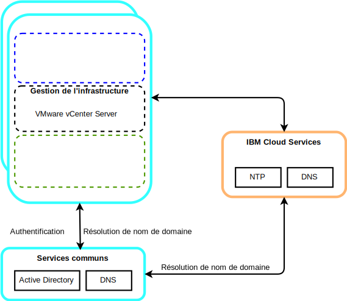

---

copyright:

  years:  2016, 2018

lastupdated: "2018-11-13"

---

# Composants des services communs

Les services communs fournissent les services qui sont utilisés par d'autres services de la plateforme de gestion du cloud. Il s'agit notamment des services d'identité et d'accès, des services de nom de domaine et des services NTP.

Figure 1. Services communs {{site.data.keyword.cloud}} Private (ICP)

## Services d'identité et d'accès

Dans le cadre de l'automatisation VMware vCenter Server on {{site.data.keyword.cloud_notm}}, un annuaire Microsoft Active Directory (AD) est utilisé pour la gestion des identités. Une seule instance de serveur virtuel AD est déployée. vCenter est configuré pour utiliser l'authentification AD et vous pouvez configurer ICP également pour l'authentification LDAP.

## Services de nom de domaine

Le déploiement utilise les instances de serveur virtuel AD déployées comme serveurs DNS pour l'instance. Tous les composants déployés sont configurés pour pointer vers l'annuaire AD comme serveur DNS par défaut. Les composants déployés sont notamment vCenter, PSC, NSX et les hôtes ESXi. 

## Services Network Time Protocol

Le déploiement vCenter Server utilise les serveurs NTP de l'infrastructure {{site.data.keyword.cloud_notm}}. Tous les composants déployés sont configurés pour utiliser ces serveurs NTP. Il est essentiel que tous les composants utilisent les mêmes serveurs NTP pour que les certificats et l'authentification AD puissent fonctionner correctement.

### Liens connexes

* [Présentation de vCenter Server on {{site.data.keyword.cloud_notm}} with Hybridity Bundle](../vcs/vcs-hybridity-intro.html)
