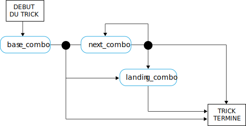

---

copyright:

  years:  2016, 2019

lastupdated: "2019-05-07"

subcollection: vmware-solutions


---

# Concepts du langage relatif au skateboard
{: #vcscar-concepts}

## Langage du skateur
{: #vcscar-concepts-skater}

Un aspect essentiel de Skate Advisor concerne les conversations possibles avec l'agent conversationnel piloté par Watson. La section ci-après décrit en détail les règles de conversation qui définissent une interaction humaine avec l'agent conversationnel skate Advisor.

Le langage du skateur est au coeur du système et il est utilisé de la façon suivante :
* Reconnaissance de trick : utilisé par Watson Discovery pour ingérer des documents à partir de sources en ligne afin de reconnaître des tricks existants et les mapper à des documents source.
* Conversations sur le skate : utilisé par l'agent conversationnel pour avoir de vraies conversations avec l'utilisateur système.
* Classification de trick : stocker et classifier un trick en fonction de son descriptif. Les tricks classifiés de cette façon peuvent se voir associer des métadonnées, telles que des références de lieu et de vidéo.

## Eléments de langage
{: #vcscar-concepts-lang-elem}

### Eléments principaux
{: #vcscar-concepts-core-elem}

Les éléments de langage principaux pour construire un trick sont les suivants :

Tableau 1. Eléments de langage principaux

Type d'élément | Texte de langage
---|---|---
Direction | fakie<br>nollie<br>switch
Rotation | halfcab<br>cab<br>180<br>360<br>540
Base | kickflip<br>heelflip<br>hardflip<br>bigspin<br>shuvit<br>impossible
Landing | manual (truck arrière)<br>nosemanual (truck avant)<br>5-0 (grind)<br>nosegrind<br>tailslide<br>noseslide<br>crooked grind<br>smithgrind<br>boardslide<br>lipslide<br>

### Modificateurs d'élément
{: #vcscar-concepts-elem-modifiers}

Les modificateurs d'élément sont des éléments de langage spéciaux qui apportent du contexte à certains aspects du langage.

Tableau 2. Modificateurs de langage

Type d'élément | Texte de langage |Remarques
---|---|---
Turn Prefix | Frontside<br>backside | Turn Prefix fait référence au sens d'un tour.
Varial | vers l'intérieur<br>vers l'extérieur |

## Règles de langage
{: #vcscar-concepts-lang-rules}

Le jeu de règles ci-après construit le langage. Les tricks sont divisés en une ou plusieurs combinaisons d'éléments appelées "Combo". Il y a une différence entre la première combo et les combo suivantes dans la mesure où l'on part du principe que le sens est le même que dans la combo de base sauf indication contraire.

Pour les règles suivantes, voir les sections relatives aux éléments principaux et modificateurs d'élément car ceux-ci sont utilisés pour construire le langage.

### Jeu de règles pour les tricks
{: #vcscar-concepts-trick-ruleset}

```
base_combo = 'direction \+ \[varial | turn_prefix\] \+ \[rotation\] \+ \[base_trick\]'
next_combo = ''\[varial | turn_prefix\] \+ \[rotation\] \+ \[base_trick\]'
landing_combo = ''\[varial | turn_prefix\] \+ landing'
trick = 'combo \+ \[“to” + combo\] \+ \[“to” \+ landing_combo\]'
```

### Moteur de règles pour les tricks
{: #vcscar-concepts-trick-rule-engine}

Le diagramme ci-après est un récapitulatif graphique du moteur de règles.



## Exemple de langage associé aux tricks
{: #vcscar-concepts-sample-trick}

Liste d'exemples de tricks :

```
fakie-kickflip
fakie-kickflip to fakie-5-0 to fronside-halfcab (out)
fakie-heeflip
fakie-heeflip to fakie-maual to fakie-hardflip
fakie-inward (varial) heeflip to fakie-backside tailslide to fakie
switch-heeflip to fakie-maual to fakie-hardflip
switch-hardflip to fakie-manual
fakie-hardflp to fakie-nosegrind
nollie-hardflip-to-tailslide
nollie-inward-heelflip to frontside noseslide
kickflip-frontside to crooked grind
halfcab-heelflip to crooked grind
frontside-shuvit to nosegrind to nollie-flip (out)
kickflip to nosegrind to nollie-impossilbe (out)
nollie-kickflip to noseslide to nollieflip
nollie-kickflip to frontside-lipslide
nollie-impossible to manual
nollie-impossible to 5-0
nollie-kickflip to crooked grind
nollie-kickflip to crooked grind to nollie-halfcab-kickflip (out)
frontside-nollie-halfcab-heelflip to fakie-nosegrind
backside-nollie-halfcab-kickflip to backside-tailslide to backside-180-out
frontside-nollie-cab-kicflip halfcab to backside-smithgrind
halfcab to backside-smithgrind to backside-180-bigspin (out)
kickflip-backside-tailslide to backside-180-kickflip
kickflip-backside-tailslide to backside-backside-bigspin
360-kicflip to nosemanual to nollie-360-kickflip
360-kicflip to frontside-lipslide
harflip to backside-lipslide
kicflip to frontside-boardslidev
nollie-heelflip to frontside-boardslide
```

## Langage de pertinence
{: #vcscar-concepts-relevance}

Le langage associé aux tricks est l'élément essentiel utilisé pour entraîner Watson à reconnaître et ingérer des documents et des éléments multimédia relatifs au skate et également pour former la base des conversations avec l'utilisateur.

## Liens connexes
{: #vcscar-concepts-related}

* [Présentation de vCenter Server on {{site.data.keyword.cloud}} with Hybridity Bundle](/docs/services/vmwaresolutions/archiref/vcs?topic=vmware-solutions-vcs-hybridity-intro)  
