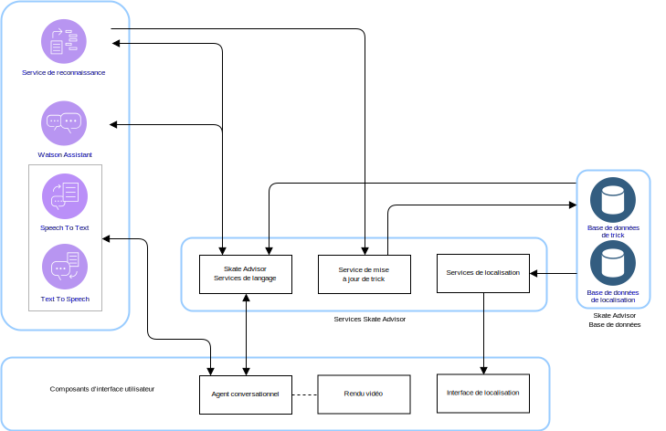
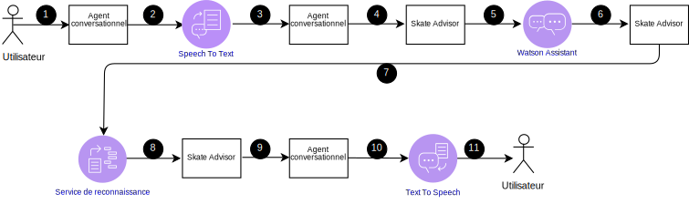
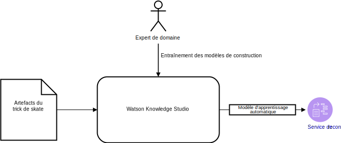

---

copyright:

  years:  2016, 2019

lastupdated: "2019-01-23"

---

# Conception logique de Skate Advisor

Les informations suivantes décrivent en détail les éléments d'application qui constituent la conception logique du système.

## Composants système

Figure 1. Composants Skate Advisor

Skate Advisor est principalement constitué d'un agent conversationnel capable d'accepter la reconnaissance de texte ou la reconnaissance vocale afin d'interagir avec le système de manière structurée.

## Tricks

Le principal élément de données de Skate Advisor est le trick. Le langage de trick permet de définir un trick de manière unique. Ce langage peut être utilisé pour accomplir les tâches suivantes :
- Converser avec l'agent conversationnel à propos de tricks.
- Rechercher des tricks via Watson Discovery.
- Identifier et classifier des tricks lors de l'entraînement de Watson Discovery à partir d'articles source.
- Identifier un trick en matière de lieu et d'affichage multimédia.

### Définition de trick

Un trick est défini de manière unique par les éléments de langage qui le décrivent. Pour obtenir une définition complète, voir la rubrique sur le modèle de règle de trick.

### Liste de tricks

Une liste de tricks est renvoyée par une requête du trick Base ou Landing défini dans des éléments de langage.

### Données de trick

Une fois renvoyés, les tricks peuvent comporter les informations suivantes :
- Description de trick
- Un ou plusieurs artefacts multimédia
- Informations de lieu

## Flux conversationnels

L'agent conversationnel comporte un nombre prédéfini et limité de conversations possibles. Mes conversations sont définies par les informations suivantes :
- Recherche de trick : Rechercher un ensemble de tricks valides à partir d'un paramètre de requête qui représente le trick Base ou Landing.
- Recherche de lieu : Rechercher un lieu proche pour un trick.
- Affichage multimédia : Afficher un élément multimédia, par exemple une vidéo en ligne, à partir duquel un trick a été classifié et trouvé.

Tableau 1. Conversation

Conversation | Structure | Résultat
---|---|---
Recherche de trick | Décrire un trick |Liste de tricks
Recherche de lieu | Où effectuer ce trick ? | Liste de lieux pour un trick spécifique
Affichage multimédia | Afficher une vidéo de trick |Liste de résultats multimédia

## Composants d'interface utilisateur

### Agent conversationnel

L'agent conversationnel est un composant Web qui converse avec l'utilisateur. L'agent conversationnel peut accepter du texte ou la parole. Des résultats, tels que des listes, sont rendus en texte accompagné éventuellement de paroles.

Les agents conversationnels interagissent avec le système de la façon suivante :

Figure 2. Requête d'agent conversationnel typique

Tableau 2. Interactions d'agent conversationnel

Etape | Description
---|---
1 | Initier une conversation valide. Voir la section Flux conversationnel.
2 | L'agent conversationnel envoie la parole au service Speech to Text.
3 | Le service Speech to Text envoie le texte à l'agent conversationnel.
4 | L'agent conversationnel envoie la requête de texte à Skate Advisor.
5 | Skate Advisor évalue la demande et l'envoie à Watson Assistant.
6 | Watson Assistant classifie la demande et répond à Skate Advisor avec l'action à effectuer.
7 | Skate advisor demande un jeu de données provenant de Discovery Service.
8 | Discovery Service évalue la requête et envoie la réponse.
9 |Skate Advisor forme une réponse et l'envoie à l'agent conversationnel sous forme de texte.
10 | L'agent conversationnel envoie le texte de réponse au service Text To Speech.
11 | Le résultat est envoyé à l'utilisateur via l'agent conversationnel.

### Rendu vidéo

Le composant de rendu vidéo lit une vidéo ou affiche un document. Ces artefacts représentent l'artefact source à partir duquel le trick a été découvert.

Le composant de rendu vidéo est un widget imbriqué dans l'interface Web qui affiche une vidéo. Les vidéos sont affichées dans l'agent conversationnel comme résultat d'une requête émise par l'utilisateur système. Le lien de vidéo obtenu, après sélection, déclenche le rendu de la vidéo.

### Interface de localisation

Skate Advisor inclut une interface permettant aux utilisateurs système d'enregistrer le lieu d'un trick spécifique. Le composant d'interface Web comprend deux principaux éléments :
1. Accepter un lieu émanant de l'utilisateur système comme endroit idéal pour effectuer un trick spécifique.
2. Afficher un ou plusieurs lieux recommandés pour un trick spécifique.

## Composants Watson

Les composants Watson suivants sont inclus dans cette architecture :
* Knowledge Studio - Watson Studio est un outil qui permet de concevoir le langage relatif au Skate pour le système et d'utiliser ce langage pour reconnaître des documents du Web qui implémentent ce langage. Knowledge Studio fournit un modèle qui sera utilisé par le service Watson Discovery.
* Speech to Text - Transcrit la parole en texte. Ce composant accepte des données audio provenant d'un appareil sur lequel l'agent conversationnel s'exécute et convertit ces données en un texte qui sera traité par Watson.
* Text to Speech - Synthétise le texte en parole. Ce composant accepte du texte provenant de l'application Skate Advisor et convertit ce texte en parole destinée à être lue sur l'appareil sur lequel s'exécute l'agent conversationnel.
* Discovery Service - Watson Discovery Service est utilisé par le système pour extraire du contenu lié au skate correspondant aux paramètres demandés. Par exemple, "Faire la liste de tous les enregistrements de trick Casper". Watson
Discovery utilise des techniques d'apprentissage automatique avancées pour faire émerger les passages les plus pertinents du contenu ingéré.
* Watson Assistant - Watson Assistant est un outil permettant de concevoir les interactions entre les utilisateurs et la machine (agent conversationnel). Il doit être entraîné avec un langage spécifique d'un domaine, par exemple, le skateboard, sous la forme d'une série de grammaires pour lesquelles l'Assistant reconnaît et génère les réponses appropriées.

## Services Skate Advisor

Skate Advisor est un composant d'application qui fournit un ensemble de services d'API afin de rendre des demandes. Les services qui sont exposés ont une corrélation directe avec les flux conversationnels décrits précédemment. L'API exposée possède les catégories générales suivantes :
* get_tricks - Renvoyer une liste de tricks à partir d'une <requête\> en langage naturel, qui est présentée au service de reconnaissance.
* show_tricks - Renvoyer une liste d'éléments multimédia pour un trick spécifique.
* find_trick - Renvoyer un trick spécifique.
* accept_command - Accepter une commande textuelle à partir de l'agent conversationnel et servir la demande.

## Entraînement du service de reconnaissance

Watson Discovery doit être entraîné au moyen d'un modèle d'apprentissage automatique, qui est créé de manière itérative par un expert de domaine à l'aide de Watson Knowledge Studio.

Figure 3. Entraînement du service de reconnaissance

Pour Skate Advisor, le modèle se compose de la relation entre les types d'entité et une combinaison d'entraînement basé sur des règles et d'entraînement basé sur un dictionnaire pour créer un modèle. Ce modèle permet au service de reconnaissance de reconnaître et classifier les tricks qui sont ingérés à partir d'articles et de descriptions de vidéos qui sont utilisés comme ensemble d'entraînement.

Une fois entraîné, le service de reconnaissance peut répondre à des requêtes, telles que les suivantes :
- Montre-moi tous les tricks avec le trick de base heelflip.
- Montre-moi tous les tricks.
- Montre-moi tous les tricks avec plusieurs combinaisons.

### Liens connexes

* [Présentation de vCenter Server on {{site.data.keyword.cloud}} with Hybridity Bundle](/docs/services/vmwaresolutions/archiref/vcs/vcs-hybridity-intro.html)
