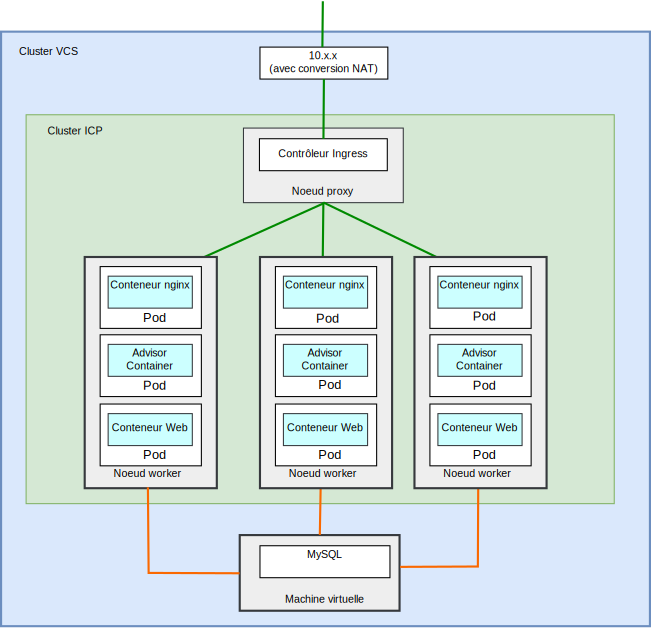
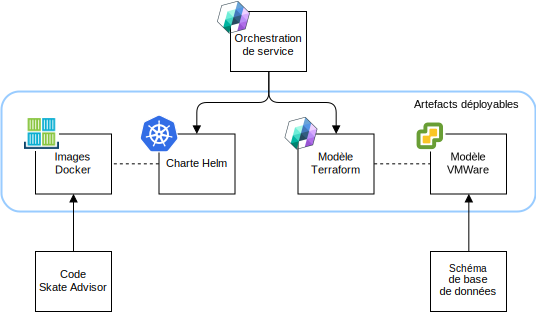
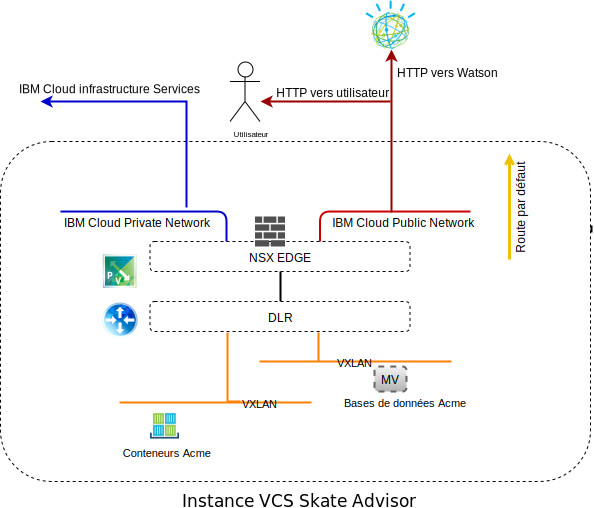
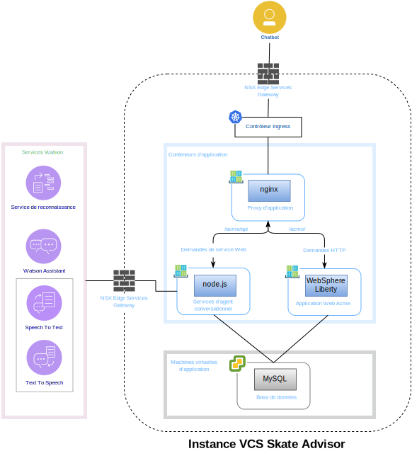
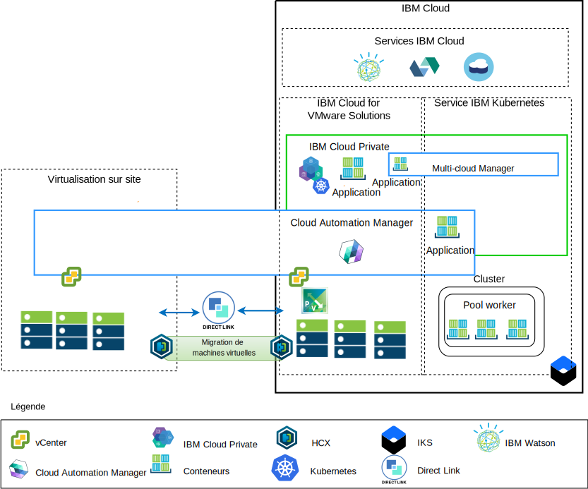

---

copyright:

  years:  2016, 2018

lastupdated: "2018-11-14"

---

# Composants Skate Advisor

{{site.data.keyword.vmwaresolutions_full}} fournit l'automatisation du déploiement des composants de technologie VMware dans les {{site.data.keyword.CloudDataCents_notm}} situés dans le monde entier. L'architecture est composée d'une région de cloud et a la capacité de s'étendre dans d'autres régions de cloud situées, au choix, dans l'un des emplacements suivants : 

1. Une autre zone géographique
2. Un autre pod {{site.data.keyword.cloud_notm}} au sein du même centre de données
3. Une autre zone géographique et un autre pod {{site.data.keyword.cloud_notm}} au sein du même centre de données

Les produits {{site.data.keyword.cloud_notm}} Private (ICP) et Cloud Automation Manager (CAM) peuvent être déployés manuellement dans votre plateforme de virtualisation sur site, permettant ainsi la gestion du cloud à partir d'emplacements locaux. Sinon, ICP et CAM sont offerts en tant qu'extension de service à un déploiement VMware vCenter Server on {{site.data.keyword.cloud_notm}} nouveau ou existant, via l'automatisation, permettant ainsi la gestion du cloud à partir d'{{site.data.keyword.cloud_notm}}. 

ICP est une plateforme applicative pour le développement et la gestion sur site d'applications conteneurisées. Il s'agit d'un environnement intégré pour la gestion de conteneurs qui inclut l'orchestrateur de conteneurs Kubernetes, un registre d'images privé, une console de gestion, ainsi que des infrastructures préfabriquées de surveillance.

IBM Multi-Cluster Manager fournit la visibilité utilisateur, la gestion orientée applications (règles, déploiements, santé, opérations) et la conformité basée sur les règles sur les clouds et les clusters. IBM Multi-Cluster Manager vous permet de contrôler vos clusters Kubernetes. Vous pouvez vérifier que vos clusters sont sécurisés, qu'ils fonctionnent efficacement et qu'ils distribuent les niveaux de service prévus pour les applications.

{{site.data.keyword.cloud_notm}} Automation Manager est une plateforme de gestion libre-service multi-cloud qui s'exécute sur {{site.data.keyword.cloud_notm}} Private et permet aux développeurs et aux administrateurs de répondre aux besoins de l'entreprise. Cloud Automation Manager Service Composer vous permet d'exposer des services cloud hybrides dans le catalogue ICP.

## Composants Skate Advisor

Le diagramme ci-après décrit l'implémentation de référence de l'application Acme Skate Advisor dans une implémentation d'infrastructure de modernisation des applications.

Figure 1. Composants physiques de Skate Advisor

L'application Skate Advisor étend l'application Web Acme existante avec un composant basé sur des micro-services qui interagit avec Watson et un conteneur nginx pour mettre en proxy des demandes vers le conteneur de micro-services et Web.

L'application Skate Advisor exploite la plateforme de modernisation des applications qui fournit l'infrastructure d'hébergement nécessaire.

### Conditionnement et déploiement d'application

L'application est déployée sous la forme d'une orchestration CAM contenant les éléments énumérés ci-après.

Figure 2. Orchestration CAM

Ces éléments sont décrits ci-dessous :
* Orchestration de service - Une orchestration de service CAM est une ressource de workflow qui décrit les modèles Terraform et les chartes Helm à déployer en tant que facette d'un service.
Un service peut être publié et correspond à l'artefact de contrôle à partir duquel l'ensemble du déploiement est orchestré.

* Charte Helm - La charte Helm réside dans le référentiel ICP local et déploie des conteneurs et d'autres ressources sur ICP. Une charte Helm est une description de ressources Kubernetes incluant les éléments suivants : 
 - Déploiements de conteneur
 - Services
 - Ingress
 - Règles
 - Noeuds finaux

* Images Docker - Les images Docker contiennent le système d'exploitation (ubuntu), les logiciels intermédiaires (WebSphere Liberty, nginx) et le code Skate Advisor et Skate Store. Les images Docker sont des objets statiques qui sont déployés dans des conteneurs en cours d'exécution.

* Modèle Terraform - Un modèle Terraform est un fichier qui décrit les ressources de cloud à déployer.
Pour Skate Advisor, la description porte sur un modèle ubuntu, qui est préinstallé avec mysql et le schéma de base de données.

* Modèle VMWare - Le modèle VMWare est un modèle Ubuntu préinstallé avec mysql et le schéma de base de données.

### Equilibrage de charge et mise en proxy

L'équilibrage de charge et la mise en proxy sont implémentés via le composant ICP Ingress Controller. Ce composant gère la mise à l'échelle et le basculement de conteneur de manière transparente.

La mise en proxy d'application est fournie par le conteneur nginx qui équilibre la charge de la manière suivante.

Tableau 1. Règles de proxy inverse Skate Advisor

URL	|Noeud final
---|---
/acme	|Acme Web Container Service
/acme/api	|Skate Advisor Service
/acme/api/explorer	|Skate Advisor Service

Les conteneurs possèdent des adresses IP imprévisibles qui peuvent être ajoutées ou retirées en fonction des demandes du système.
Pour remédier à ce problème, les services ICP sont utilisés pour effectuer une résolution d'adresse IP en temps réel au sein du système.

### Application Web Acme Skate
L'application Web Acme Skate est une plateforme Java Platform, Enterprise Edition basée sur Spring
Framework. L'application est déployée sur un conteneur WebSphere Liberty. 

### Application Acme Skate Advisor
L'application Acme Skate Advisor est une application basées sur un micro-service qui est déployée sur un conteneur WebSphere Liberty. Un serveur Web nginx fournit une interface frontale avec les micro-services.

### Base de données Acme Skate
La base de données Acme Skate est une base de données MySQL qui est déployée sur une machine virtuelle gérée par vSphere. 

### Présentation des communications
Skate Advisor requiert les communications suivantes :
-	Entre le conteneur Web et l'utilisateur système
-	Entre Advisor et le conteneur Web et les services Watson
-	Entre le conteneur et les aspects de machine virtuelle de l'implémentation

La plateforme de modernisation des applications est conçue avec les composants énumérés ci-après pour atteindre cet objectif.

Figure 3. Accès au réseau public

{{site.data.keyword.cloud_notm}} comporte deux réseaux. Le réseau public permet d'atteindre les serveurs à partir d'Internet et le réseau privé permet aux serveurs de communiquer entre eux via un réseau principal haute vitesse dans tous les {{site.data.keyword.CloudDataCents_notm}}.

Le dispositif VRA (Virtual Routing Appliance) permet aux clients de router un trafic réseau privé et public en associant les VLAN au dispositif.
vCenter Server NSX Edge et l'infrastructure IKS sont configurés avec une route par défaut vers le réseau public et avec une route 10.0.0.0/8 standard vers le réseau privé. 

Une route statique est requise sur l'infrastructure IKS vers le dispositif VRA pour n'importe quel VLAN NSX défini. A partir de NSX Edge, nous configurons un appairage BGP avec le dispositif VRA via le réseau privé, ce qui permet d'activer les annonces et l'interjection de routage des VLAN NSX.
Cet appairage permet au réseau dissocié VXLAN NSX de communiquer avec le réseau principal {{site.data.keyword.cloud_notm}} et inversement.

### Mappage de composant logiciel

L'application Skate Advisor utilise les composants logiciels énumérés ci-après.

Figure 4. mappage de logiciel Skate Advisor

Les composants logiciels suivants sont utilisés :

* nginx	- Fournit des services de proxy inverse à l'application.
Les micro-services et les demandes d'application sont distribués aux noeuds finaux de conteneur appropriés.

* WebSphere Liberty - Héberge l'application Acme, qui est une application Java Platform, Enterprise Edition basée sur Spring. 
* Node.js - Fournit l'infrastructure de micro-services à l'agent conversationnel. Cette application utilise des services de Watson.
* mysql - La base de données d'application est fournie par Oracle Mysql.
* JavaScript - L'agent conversationnel est une application basée sur JavaScript qui est hébergée dans le navigateur client.
L'agent conversationnel communique avec Watson via les micro-services basés sur Node.js. 

## Présentation de la gestion

L'application Acme Skate Advisor réside sur {{site.data.keyword.cloud_notm}} et de ce fait, elle est essentielle à l'architecture. {{site.data.keyword.cloud_notm}} comporte l'architecture décrite ci-après.

Figure 5. Gestion de cloud

Ce diagramme représente ICP et CAM déployés sur une instance vCenter Server, avec des connexions aux services vCenter et IKS sur site. A l'aide de CAM, les administrateurs système et les développeurs peuvent déployer des machines virtuelles présentes sur site ou dans l'instance et les conteneurs vCenter Server vers les clusters ICP et IKS.

Dans le diagramme, CAM crée des connexions de cloud aux services vCenter, aux fournisseurs de cloud et aux environnements ICP et IKS de façon logique. Des clusters ICP sont déployés dans chaque centre de données/environnement de cloud, MCM fournissant le mécanisme de connexion aux clusters ICP dans une seule vue de gestion.

### Liens connexes

* [Présentation de vCenter Server on {{site.data.keyword.cloud_notm}} with Hybridity Bundle](../vcs/vcs-hybridity-intro.html)
