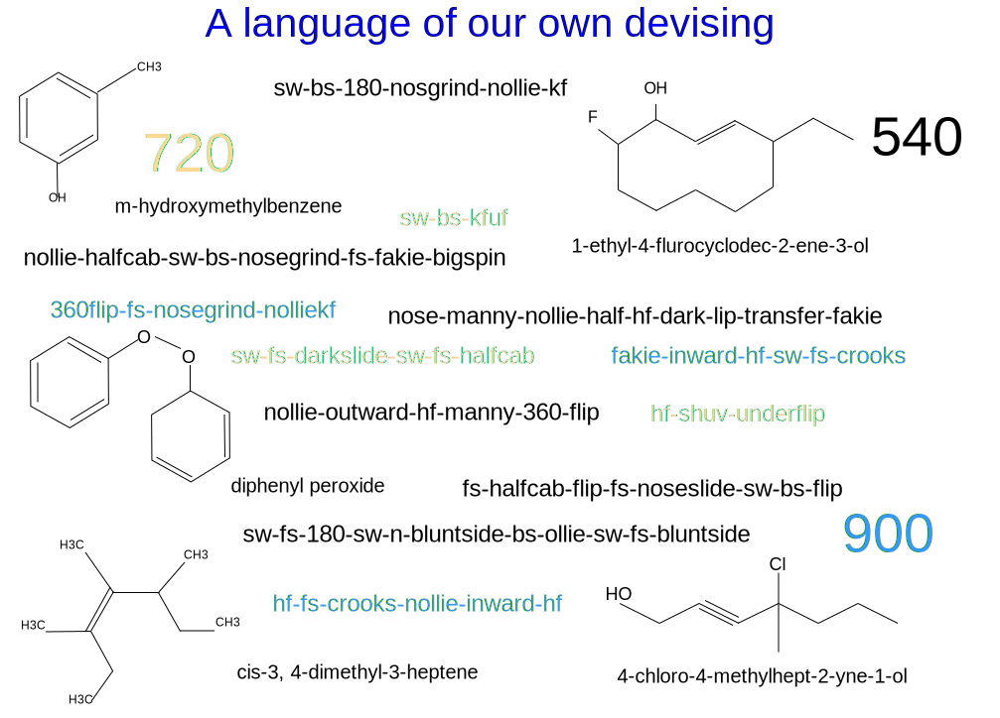

---

copyright:

  years:  2016, 2019

lastupdated: "2019-02-15"

---

# Préface
{: #vcscar-preface}

Figure 1. Un langage de notre propre invention

## Présentation du langage relatif au skateboard
{: #vcscar-preface-intro}

La manière dont les skateurs combinent des mouvements et des sous-mouvements pour former des tricks nécessite de mettre au point une grammaire ou une syntaxe spécifique, basée sur la physique de ce qui se produit, la nomenclature de chimie élaborée pour des raisons similaires. Aujourd'hui, un skateur peut envoyer par texto le nom d'un trick à un autre skateur vivant à l'autre bout de la planète, et le second comprend parfaitement les mouvements complexes décrits par le premier.

La richesse du langage se nourrit de la complexité de la pratique du skateboard proprement dite. Les mouvements du skate sont complexes, et donnent lieu à des douzaines de tricks de base qui peuvent être réalisés de plusieurs façons, répétées avec plusieurs variables, afin de générer un très grand nombre de combinaisons. Une structure préfixe-racine-suffixe pour chaque composant spécifie la façon dont chaque élément ou mouvement s'enchaîne, correspondant à des impulsions réelles données par le skate et le skateur. L'orientation physique et les mécanismes des forces déterminent ce qui s'emboîte et ce qui ne s'emboîte pas, et c'est ce qui impose cette syntaxe.

Les tricks peuvent être réalisés sur la partie arrière (*Ollie*) ou la partie avant (*Nollie*) de la planche, avec le pied avant ou arrière du skateur. La planche tourne, roule et tombe dans des combinaisons qui sont répétées sur trois axes, et dans le sens des aiguilles du montre ou dans le sens contraire des aiguilles d'une montre. Le skateur associe ses mouvements aux mouvements de la planche, ajoutant ainsi plusieurs dimensions aux répétitions en fonction du sens, de la rotation, de la position et selon que le skateur tourne en suivant ou non le mouvement de la planche.

Ces deux dernières variables nécessitent un peu plus d'explications. Tout d'abord, le terme *stance* (position) se confond facilement avec la directionnalité linéaire. Chaque skateur a sa position de prédilection, à savoir, le pied gauche ou droit vers l'avant ; par conséquent, réaliser un *switch* (pousser le skateboard avec le pied opposé) signifie qu'il s'agit d'une image inversée, comparable à un frappeur ambidextre en baseball. Le sens vers l'arrière est secondaire ; la principale distinction repose sur l'usage des mains (manualité) ou des pieds.  Par conséquent, n'importe quel trick que vous réalisez avec un *switch* a beaucoup plus de mérite, non pas parce qu'il est réalisé en arrière, mais parce que toutes les fonctions motrices sont inversées par rapport à votre côté le plus faible ou à votre "mauvais" pied. Réaliser un "fakie" (rouler en arrière sur son skate) consiste à ignorer le sens et implique les mêmes fonctions motrices, qui ne sont que légèrement plus difficiles.

La seconde subtilité essentielle aux yeux des skateurs de plus haut niveau concerne le flip *vers l'intérieur* ou *vers l'extérieur*, qui varie selon la manière dont la planche se retourne et pivote (2 axes) par rapport au corps proprement dit. Les tricks avec flip font appel à l'un ou l'autre des côtés du pied sur l'un ou l'autre des bords de la planche :
les *kickflips* peuvent être réalisés dans le sens des aiguilles d'une montre, tandis que les *heelflips* sont réalisés dans le sens inverse, avec un retournement dans le sens ou à contre-courant de l'enchaînement naturel du mouvement. Ainsi, le fait de tourner sa planche vers l'intérieur est tellement peu naturel qu'un terme bien distinct, *hard-flip*, est utilisé à juste titre pour nommer cette figure. Par conséquent, un *nollie-inward-kickflip* est identique à un *nollie-hardflip*, mais il nécessite plus de précision car il s'effectue dans le sens inverse.

Par conséquent, chaque composant de cette structure préfixe-racine-suffixe peut être décomposée en trois autres éléments binaires relatifs à la rotation, au sens et à la position ; certains tricks nécessitent de spécifier si le retournement se fait vers l'intérieur ou vers l'extérieur. Le skateboard serait un jeu d'enfants si ce n'était la possibilité de combiner des tricks, entraînant la multiplication du nombre d'itérations. Il est possible d'enchaîner plusieurs tricks de base à la suite deux fois, trois fois, voir même jusqu'à cinq ou six fois pour les professionnels chevronnés.

Pour l'instant, le nombre d'itérations pratiques se compte par centaines, ce qui ne fait que planter le décor ; la complexité réelle apparaît dans le *streetskating* (skate pratiqué dans la rue), qui fait passer le nombre de combinaisons à plusieurs milliers.

Au début des années 90, les skateurs réalisaient des tricks sur terrain plat avant de se projeter ultérieurement dans l'environnement "organique" qui les entourait : escaliers, rebords, rambardes, talus, arêtes, traverses, tables de pique-nique, bacs à fleurs. Tout cela a contribué à décloisonner la dimensionnalité de ce qui les caractérisait. Les possibilités infinies de combiner des tricks et des terrains afin de réaliser des couplages yin-yang ont maintenu les skateurs très occupés pendant des décennies. Cela s'applique également au *vert-skating* (skate vertical), incarné par Tony Hawk sur des rampes et dans des piscines.

Alors que la majeure partie des tricks de base a été développée au fil des années, c'est la capacité à les combiner et à les adapter qui éclipse souvent les aptitudes innées des professionnels. C'est là une autre raison pour laquelle la pratique du skateboard relève plus d'un art que d'un sport. L'expression individuelle prime toujours sur les performances brutes. Elle constitue également le moteur sous-jacent qui a alimenté les artistes à l'origine de la franchise de jeux vidéo à succès d'Activision, *Tony Hawk's Pro Skater*, présente pendant près d'une décennie et qui a fait naître des jeux concurrents développés par *Electronic Arts*.

En entraînant Watson Assistant pour qu'il imite la façon de penser des professionnels de haut niveau, nous pouvons fournir un outil puissant permettant de faire progresser la pensée créative de n'importe quel skateur, en particulier pour les skateurs d'élite. Bien que les autres sports de glisse soient nettement moins complexes, cet outil témoigne de l'influence démesurée du skateboard car ils adoptent également nos conventions. Par conséquent, Watson Assistant est non seulement en mesure de promouvoir, pour ne pas dire transformer, l'expression créative de cette nouvelle discipline sportive olympique, mais également d'influencer d'autres projets artistiques.

## Codification du langage
{: #vcscar-preface-codification}

A l'instar d'autres langages, le nôtre s'est développé au fil du temps, en récupérant de nouveaux mots et usages, en restituant des redondances et des exceptions occasionnelles au fur et à mesure. Cela étant, cette nomenclature est étonnamment cohérente, durable et spécifique. Ce sont cette rigueur et cette cohérence dénotatives qui permettent de résoudre ce problème apparemment insurmontable qu'est la conversion de métrage en texte par l'apprentissage automatique. Pour les skateurs, chaque nuance du mouvement complexe est créée dans la nomenclature proprement dite. En fait, ce langage est tellement robuste qu'il a été adopté non seulement par les skateurs, mais également par les surfeurs.

Pourtant, malgré toute cette complexité et toute cette puissance, la codification du langage est simple et concise. Chaque *trick de base* est associé à un composant lié au *sens* et à la *rotation*, et à un composant de *réception*, qui détermine si et comment il s'enchaîne avec le trick de base suivant pour former des combinaisons. Il s'agit des quatre *éléments fondamentaux*. Deux autres *modificateurs* ont été rajoutés :
un *préfixe de retournement* qui oriente la rotation du skateur (dans le sens des aiguilles du montre ou dans le sens contraire aux aiguilles d'une montre), tandis que l'autre composant *varial* permet de spécifier la façon dont la planche tourne, par rapport au corps (vers l'intérieur ou vers l'extérieur). A l'aide de cette codification, un jeu de règles concis peut être appliqué de façon récurrente afin de permettre des combinaisons de n'importe quelle longueur.

## Autres variables d'environnement
{: #vcscar-preface-env-var}

Aujourd'hui, les professionnels passent souvent autant de temps à rechercher de nouveaux spots qu'à pratiquer les tricks. En effet, un skateur se distingue en partie par sa capacité créative à trouver des moyens nouveaux et imaginatifs de pratiquer les tricks, ce qui le conduit souvent aux quatre coins du monde. S'il existe des applications de skate qui répertorient les spots, alimentées par la communauté, aucun concept ou aucune technologie n'a jamais été mis en oeuvre pour créer une application capable s'assister les skateurs, plus spécifiquement les professionnels, dans leur démarche créatrice.

Cette architecture de référence montre comment Watson et le cloud utilisent la présence en ligne massive des skateurs sur YouTube, Google
Images, les magazines en ligne (Trasher, Transworld), et les forums de skateurs et de jeux vidéo, et par-dessus tout, le flot inépuisable de nouveaux tricks publiés chaque jour sur les médias sociaux dans le monde entier, en particulier sur Instagram. En plus, il n'y a aucun problème de traduction puisqu'il s'agit d'un langage international, à l'image d'un langage informatique ou des mathématiques, où les mêmes noms et les mêmes conventions sont utilisés de façon homogène dans le monde entier.

Watson Knowledge Studio met à jour le service de reconnaissance avec des descriptions de trick, des artefacts multimédia, des informations de lieu (spot), etc. à partir des requêtes d'un skateur donné. L'agent conversationnel possède un nombre limité de conversations qui découlent de n'importe quel trick, basées sur des raisonnements créatifs et pragmatiques de skateurs chevronnés. Par conséquent, Watson Assistant peut répondre en indiquant le spot le plus proche ou optimal pour réaliser un trick spécifique, ou en indiquant un plus grand nombre de spots, non seulement pour ce trick, mais pour d'autres qui sont réalisés avec la même racine (autrement dit, les mêmes variations).

Par exemple, un skateur peut demander à Watson Assistant la liste de toutes les variations possibles d'un *hardflip-to-backside-5-0*. Cette demande est convertie de la parole en texte dans le service de reconnaissance, qui répond en indiquant non seulement les variations *hardflip-to-grind*, mais également une liste des différents terrains capturés par les variations, induisant d'autres informations, par exemple, une liste de rambardes pouvant être regroupées par code postal local, par taille, ou même par disponibilité, par exemple dans une cour d'école ou une entreprise. Les systèmes sont dans des données d'application existantes qui évaluent le risque d'être pris pour violation de propriété privée. Ce type d'assistance a un énorme impact sur les répercussions en cascade de variables telles que celles-ci et améliore les vies créatives de tous les skateurs professionnels.

## Plateforme cloud
{: #vcscar-preface-cloud-platform}

La superposition créative des systèmes informatiques pour générer de nouvelles combinaisons est au coeur du skateboard. Elle a des répercussions sur les vies de personnes créatives et favorise l'innovation partout dans le monde, où que nous allions.
Rien de tout cela ne serait possible sans {{site.data.keyword.cloud}}.

## Liens connexes
{: #vcscar-preface-related}

* [Présentation de vCenter Server on {{site.data.keyword.cloud_notm}} with Hybridity Bundle](/docs/services/vmwaresolutions/archiref/vcs?topic=vmware-solutions-vcs-hybridity-intro)
