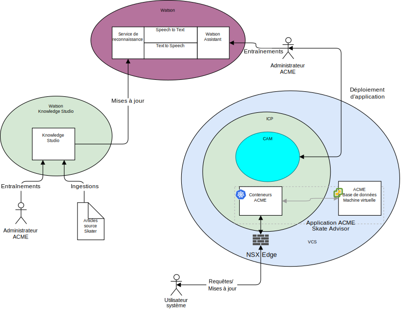

---

copyright:

  years:  2016, 2019

lastupdated: "2019-02-15"

subcollection: vmware-solutions

---

## Contexte système
{: #vcscar-syscontext}

Le diagramme ci-après illustre le contexte système pour cette architecture de référence. Un diagramme de contexte système définit les principaux éléments d'un système, les limites du système et les entités qui interagissent avec lui parallèlement aux interactions. Il s'agit d'un diagramme de haut niveau qui fournit au lecteur une vue initiale du système.

Figure 1. Contexte système

Les principaux composants d'un contexte système sont les suivants :
-	vCenter Server - VMware vCenter Server on {{site.data.keyword.cloud_notm}} est une instance {{site.data.keyword.cloud_notm}} for VMware Services qui est la cible des machines virtuelles migrées à partir de l'environnement local. Associé à la virtualisation sur site, il forme un environnement hybride dans lequel les machines virtuelles peuvent passer d'un environnement à l'autre.
-	{{site.data.keyword.icpfull_notm}} - {{site.data.keyword.icpfull_notm}} est une plateforme applicative pour le développement et la gestion d'applications conteneurisées. {{site.data.keyword.icpfull_notm}} est un environnement intégré qui inclut l'orchestrateur de conteneurs Kubernetes, un registre d'images privé, une console de gestion, ainsi que des infrastructures préfabriquées de surveillance et une interface graphique à partir de laquelle vous pouvez déployer, gérer, surveiller et mettre à l'échelle des applications de façon centralisée.
-	{{site.data.keyword.cloud_notm}} Automation Manager - CAM est une plateforme IaC (infrastructure as code) prête pour l'entreprise qui permet à partir d'un point unique de mettre à disposition des charges de travail basées sur des machines virtuelles, ainsi que des charges de travail Kubernetes, l'automatisation de la mise à disposition de charges de travail, qu'il s'agisse de machines virtuelles ou de conteneurs et leurs prérequis d'infrastructure.
-	Watson - Watson est une plateforme de solutions cognitives et d'intelligence artificielle d'IBM.
-	Watson Knowledge Studio - Watson Knowledge Studio fournit un modèle qui sera utilisé par le service Watson Discovery.

### Acteurs
{: #vcscar-syscontext-actors}

Le diagramme de contexte système identifie les acteurs suivants :

* Administrateur Acme - L'administrateur est chargé du déploiement et de la maintenance en continu de l'application, y compris des tâches permanentes suivantes :
 - Entraînement de l'agent conversationnel
 - Entraînement du service de reconnaissance
* Utilisateur système - Utilisateur du système. L'utilisateur communique avec le système via un périphérique compatible avec des navigateurs.

### Systèmes
Le diagramme de contexte système identifie les systèmes suivants :
* Knowledge Studio - Watson Studio est un outil qui permet de concevoir le langage relatif au skate pour le système et d'utiliser ce langage pour reconnaître des documents du Web qui implémentent ce langage.
* Speech to Text - Transcrit la parole en texte. Ce composant accepte des données audio provenant d'un appareil sur lequel l'agent conversationnel s'exécute et convertit ces données en un texte qui sera traité par Watson.
* Text to Speech - Synthétise le texte en parole. Ce composant accepte du texte provenant de l'application Skate Advisor et convertit ce texte en parole destinée à être lue sur l'appareil sur lequel s'exécute l'agent conversationnel.
* Discovery Service - Watson Discovery Service est utilisé par le système pour extraire des enregistrements de skate correspondant aux paramètres demandés. Par exemple,
"Faire la liste de tous les enregistrements de trick Casper".\ Watson
Assistant - Watson Discovery Service est utilisé par le système pour extraire du contenu lié au skate correspondant aux paramètres demandés. Par exemple, "Faire la liste de tous les enregistrements de trick Casper". Watson
Discovery utilise des techniques d'apprentissage automatique avancées pour faire émerger les passages les plus pertinents du contenu ingéré.  
* Base de données - La base de données Acme Skate Advisor est hébergée sur une machine virtuelle qui est gérée par vCenter Server.
* Conteneurs d'application - Applications qui ont terminé le parcours de modernisation des applications et qui s'exécutent désormais en tant que conteneurs. Pour cette architecture de référence et pour Acme Skateboards, l'une des applications conteneurisées est un serveur Web, qui fait partie de la charge de travail de présence en ligne. Les conteneurs ACME hébergent l'application Web Acme et l'application Acme Skate Advisor.
* NSX Edge - Les serveurs de périphérie NSX sont des dispositifs virtuels qui gèrent le trafic nord-sud vers et depuis l'instance vCenter Server.

## Liens connexes
{: #vcscar-syscontext-related}

* [Présentation de vCenter Server on {{site.data.keyword.cloud_notm}} with Hybridity Bundle](/docs/services/vmwaresolutions/archiref/vcs?topic=vmware-solutions-vcs-hybridity-intro)
