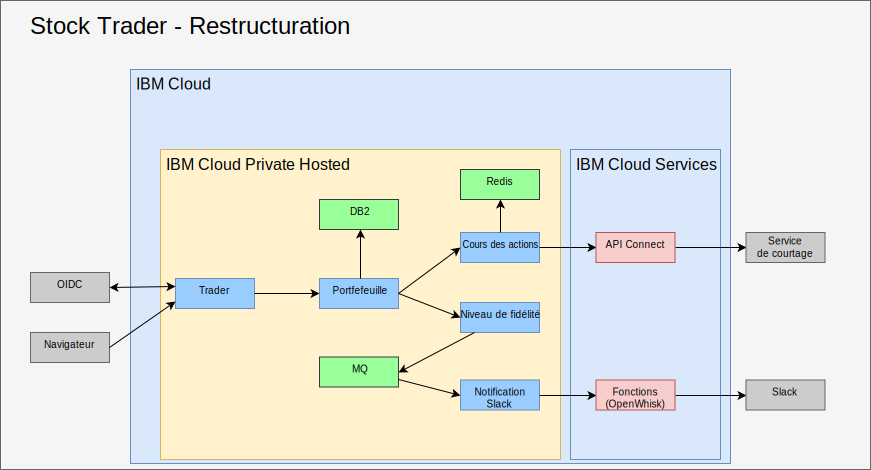
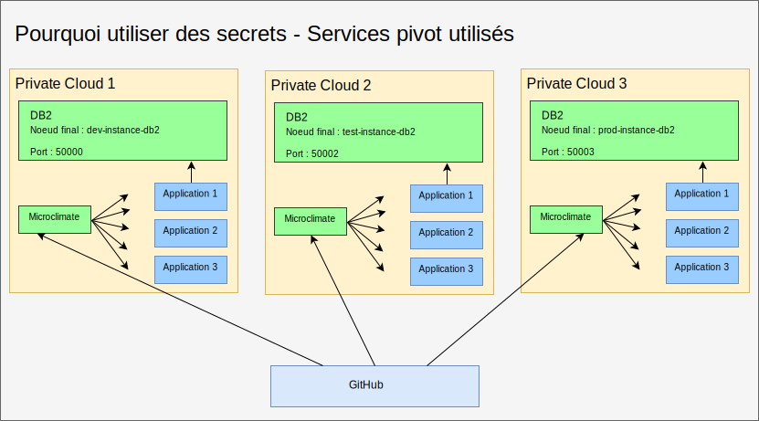
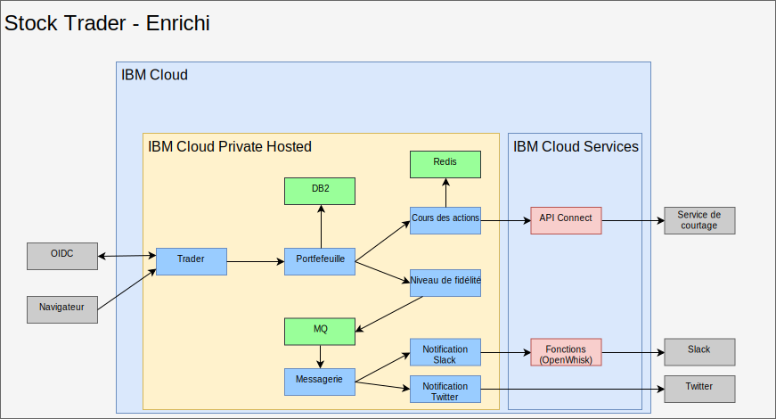

---

copyright:

  years:  2016, 2019

lastupdated: "2019-08-05"

subcollection: vmware-solutions

---

# Restructuration et ajout de logiciels intermédiaires dans IBM Cloud Private
{: #vcscontent-addmidware}

A présent que Stock Trader s'exécute dans un conteneur et que Jane est satisfaite avec les micro-services en cours, elle et Todd cherchent un moyen d'améliorer l'application avec des fonctions supplémentaires. En restructurant les micro-services Stock Trader pour gérer une augmentation des activités et une évolutivité accrue, ils constatent tous les deux qu'il est nécessaire d'ajouter des logiciels intermédiaires dans {{site.data.keyword.cloud}} Private. Certains des logiciels intermédiaires existaient dans leur centre de données, par conséquent, il s'agit plutôt d'un changement de plateforme avec l'ajout de nouveaux logiciels intermédiaires.

Cette restructuration de la solution voit émerger une plateforme commune pour exécuter l'application et les services requis, dans un plan de gestion simplifié.

## Choix de contenus
{: #vcscontent-addmidware-content-choices}

{{site.data.keyword.cloud_notm}} Private propose un vaste choix de contenus, et Todd et Jane doivent décider lequel de ces contenus répond le mieux à leurs besoins. Comme Todd peut le constater dans le catalogue {{site.data.keyword.cloud_notm}}, la plupart des contenus peuvent être testés, mais pour certains d'entre eux, l'achat et le téléchargement à partir de Passport Advantage sont nécessaires.

* Chaîne d'outils et Environnements d'exécution
  - UrbanCode Deploy
  - Microclimate
  - Jenkins (open source)
  - IBM WebSphere Liberty (MicroProfile, Web Profile, Java Platform, Enterprise Edition Profile)
  - Open Liberty (open source)
  - Node.js runtime (open source)
  - Swift runtime (open source)
  - nginx (open source)
  - IBM WebSphere Application Server for {{site.data.keyword.cloud_notm}} Private VM Quickstarter Community Edition

* Intégration
  -	IBM Integration Bus
  -	IBM Integration Bus for Developers
  -	IBM DataPower Gateway Virtual Edition
  -	IBM DataPower Gateway for Developers
  -	IBM API Connect Professional
  -	IBM API Connect Enterprise
  -	IBM App Connect Enterprise Developer Edition
  -	IBM App Connect Enterprise 11.0.0

* Data Science and Business Analytics
  -	IBM Data Science Experience Local
  -	IBM Data Science Experience Developer Edition
  -	IBM Watson Explorer Deep Analytics Edition
  -	IBM PowerAI (offre de support ILAN sous licence disponible)
  - IBM PowerAI Vision

* Gouvernance et intégration des données
  -	IBM InfoSphere Information Server for evaluation Mobile
  -	IBM Mobile Foundation

* Connectivité
  -	IBM Voice Gateway Developer Trial

* Outils de modernisation des applications
  -	IBM Transformation Advisor

* Messagerie
  -	IBM MQ Advanced
  -	IBM MQ Advanced for Developers
  -	Rabbit MQ (open source)
  -	Aperçu technologique d'IBM Event Streams (basé sur Apache Kafka)

* Digital Business Automation
  -	IBM Operational Decision Manager
  -	IBM Operational Decision Manager for Developers
  -	IBM FileNet Content Manager 5.5
  -	IBM Content Foundation 5.5

* Services de données
  -	IBM DB2 Direct Advanced Edition/AESE avec Data Server Manager
  -	IBM Db2 Dev-C
  -	IBM Data Server Manager (pour Db2 Dev-C)
  -	IBM Db2 Warehouse Enterprise
  - IBM Db2 Warehouse Dev-C
  -	IBM Cloudant Developer Edition
  -	MongoDB (open source)
  -	PostgreSQL (open source)
  -	MariaDB (open source)
  -	Mise en cluster Galera avec MariaDB (open source)
  -	Redis (open source)

* HPC/HPDA
  -	IBM Spectrum LSF Community Edition
  -	IBM Spectrum Symphony Community Edition
  -	Aperçu technologique d'IBM Spectrum Conductor

* Gestion multi-cloud
  -	{{site.data.keyword.cloud_notm}} Automation Manager

* Watson
  -	IBM Watson Compare & Comply: Element Classification
  -	Compliance Assist

* Gestion
  -	IBM Netcool - Intégration (Sonde pour services {{site.data.keyword.icpfull_notm}} – Evénements de journalisation et alertes de surveillance)
  - {{site.data.keyword.cloud_notm}} App Management 2018.2.0
  -	IBM Netcool - Intégration (Sonde de gestion d'événements {{site.data.keyword.icpfull_notm}}. Vendu avec IBM Netcool Insights.)
  - {{site.data.keyword.cloud_notm}} Event Management for IBM
Cloud Private (ILAN sous licence pour découverte et tests à partir du catalogue)
  - IBM Operations Analytics Predictive Insights Mediation Pack (gestion des métriques de surveillance {{site.data.keyword.icpfull_notm}}. ILAN sous licence pour découverte et tests à partir du catalogue)-	IBM Operations Analytics Predictive Insights Mediation Pack
(Vendu avec le produit Predictive Insights)

* Mise en réseau
  -	F5 BIGIP Controller (open source)
  -	Calico BGP-Peer (open source)
  -	strongSwan IPSec VPN (open source)

* Stockage
  -	IBM PowerVC FlexVolume Driver (open source et pris en charge par le produit PowerVC)
  - Cluster de stockage GlusterFS avec gestion de cycle de vie Heketi (open source)
  -	Exemple NFS d'interface CSI (Container Storage Interface)
  -	Pilote (open source)
  -	Cluster Rook Ceph (open source)

* Outils
  -	Terminal Web (open source)
  -	Skydive – Analyseur de réseau (open source)

Pour Stock Trader, à partir de l'architecture de solution de Jane, Todd va commencer avec [Db2](https://cloud.ibm.com/catalog/services/db2-hosted), [MQ](https://cloud.ibm.com/catalog/services/mq) et [Redis](https://cloud.ibm.com/catalog/services/databases-for-redis).

## Ajout de logiciels intermédiaires
{: #vcscontent-addmidware-add-middleware}

Pour ajouter des logiciels intermédiaires dans {{site.data.keyword.cloud_notm}} Private, recherchez la [charte Helm](https://github.com/IBM/charts/blob/master/stable/ibm-microclimate/README.md) dans le catalogue, lisez le fichier Readme, puis poursuivez l'installation.

Pour Stock Trader, Todd a décidé d'ajouter tous les logiciels intermédiaires. Les informations ci-après récapitulent ce que Todd a dû effectuer pour chaque logiciel intermédiaire qu'il souhaitait que Jane utilise.

### Db2
{: #vcscontent-addmidware-db2}

Todd commence avec Db2 car il utilise déjà Db2 et il peut dédier un environnement Db2 basé sur un conteneur à chaque solution.

Dans la mesure où Todd a préparé {{site.data.keyword.icpfull_notm}}, sa politique de sécurité de pod est déjà définie. Il peut se consacrer à la création d'un secret d'extraction d'image Docker :

`kubectl create secret docker-registry db2dockerregistry
--docker-username=dockeruser
--docker-password=XXXXXXXX-XXXX-XXXX-XXXX-XXXXXXXXX
--docker-email=dockeruser@email.com --namespace=default`

Enfin, puisque Todd a décidé d'utiliser NFS, il a créé des volumes NFS conformément aux exigences décrites dans le fichier Readme :

Accédez au tableau de bord {{site.data.keyword.icpfull_notm}} et créez un volume persistant. De quelle taille ? Pour le savoir, consultez le fichier Readme :

`capacity=20Gi
RWO
type=NFS
server = nfs.server.ip.address
path = /shared/db2trader1`

Dans l'interface utilisateur du catalogue, recherchez "Db2" et cliquez sur ibm-db2oldp-dev. Lisez le fichier Readme, puis cliquez sur Configurer.

La section Configuration comporte une section Démarrage rapide et une section Tous les paramètres. Ouvrez la section Tous les paramètres puisque Todd doit spécifier davantage de configuration :

*	Nom d'édition = db2trader1
*	Espace de nom = default
*	Acceptation du contrat de licence
*	Nom de base de données = trader
*	Nom de secret = db2dockerregistry
*	Nom de service = db2trader1-ibm-db2oltp-dev
*	Type de service = NodePort
*	Port = 50000
*	Nom d'instance db2 = db2inst1
*	Mot de passe pour le nom d'instance db2 = xxxxxx
*	Activation de la persistance pour ce déploiement

Une fois Db2 actif, Todd ou Jane doit créer les tableaux que la solution Stock Trader utilise.

### MQ
{: #vcscontent-addmidware-mq}

Todd et Jane ont besoin d'un logiciel de messagerie, et puisqu'ils utilisent déjà MQ, celui-ci sera parfait. De plus, il peut s'exécuter avec un faible encombrement et la version de développement peut être mise en place pour chaque développeur, ce qui permet d'économiser beaucoup de trafic de production. L'installation de MQ est plutôt simple. Todd crée le stockage comme il l'a fait avec Db2, puis il installe la charte Helm :

Tableau de bord {{site.data.keyword.icpfull_notm}} > Catalogue > Commencez à taper MQ > Sélectionnez
ibm-mqadvanced-server-dev. Lisez le fichier Readme, puis cliquez sur Configurer.
Fournissez ou vérifiez les valeurs d'entrée suivantes :

`release name = mqtrader1
target namespace = stock-trader
accept license
enable persistence
data PVC size = 2Gi
Service type = NodePort
Queue manager name = stocktrader
Admin pw = mq1pw
App password = LEAVE BLANK`

Initialement, Todd sélectionne NodePort pour accéder au logiciel intermédiaire à partir de l'interface utilisateur. Finalement, Todd peut utiliser ClusterIP de sorte que seuls les pods présents dans le cluster puissent accéder au logiciel intermédiaire.

Pour configurer MQ pour l'utilisation de Stock Trader, Todd ouvre l'interface utilisateur MQ Management, qui porte exactement le même nom que la version de machine virtuelle.

### Redis
{: #vcscontent-addmidware-redis}

Bien que Stock Trader s'exécute sur {{site.data.keyword.cloud_notm}} Private Hosted, ils s'interrogent tout de même sur les temps d'attente du service de courtage car la seule chose qui leur importe, c'est le cours des actions à la fin du jour précédent pour la plupart de leur travail. Pour améliorer les performances, un cache Redis est ajouté.

Ce déploiement utilise la charte ibm-redis-ha-dev provenant de ibm-charts.

Par défaut, cette charte installe six pods : un maître, deux esclaves et trois sentinelles. Voici un formidable exemple de résilience dans Kubernetes, où plusieurs pods fonctionnent ensemble sur un grand nombre de noeuds worker, même lorsque ces derniers figurent dans plusieurs sous-réseaux.

La configuration est simple, aussi Todd indique l'espace de nom dans lequel l'installation doit avoir lieu, puis il commence l'installation.

## Restructuration de Stock Trader
{: #vcscontent-addmidware-refactor-stock-trader}

La restructuration de Stock Trader est une étape importante pour Jane. Tandis que Todd était occupé à ajouter les logiciels intermédiaires dans {{site.data.keyword.cloud_notm}} Private, Jane structurait sa solution afin de l'optimiser pour les comportements de cloud et de Kubernetes.

Par exemple, lorsque Jane a transformé Stock Trader, elle a pris les fichiers .war et ajouté chacun d'eux dans un conteneur Liberty, mais elle a utilisé la configuration WebSphere Application Server Network Deployment pour pointer vers la source de données. C'était une bonne initiative, car ainsi l'application de Jane bénéficie immédiatement de la planification et de l'orchestration Kubernetes.

De nombreux autres avantages découlent de l'optimisation des micro-services de Jane (recodage et génération) pour Kubernetes.

Pour l'optimisation, Jane a procédé comme suit :
-	Elle a mis à jour son code dans son référentiel de code (Jane a utilisé GitHub Enterprise)
-	Elle a ajouté un pipeline (Jane a utilisé Jenkins)
-	Elle a utiliser Maven pour la génération

Voici un exemple illustrant le [référentiel de code](https://github.com/IBMStockTrader/) de Jane, ainsi que le fichier Jenkins, server.xml, etc. Avec ces éléments en place, Jane peut librement coder des fonctionnalités supplémentaires via des secrets pour accéder à des services, tels que ODM et Watson, avec davantage de micro-services comme référentiels individuels dans GitHub.

### Ajout de secrets
{: #vcscontent-addmidware-add-secrets}

A présent qu'elle a restructuré les micro-services Stock Trader, Jane doit trouver le moyen d'extraire les noms de service, les ID utilisateur et les mots de passe de sorte que son application puisse sélectionner des détails uniques sur le service lorsqu'il est déployé, sans avoir à coder en dur des noms spécifiques et régénérer l'application.

En utilisant des secrets Kubernetes, Jane configure un nom de secret et des paramètres bien définis dans chaque secret pour faire en sorte que lorsque le micro-service est déployé, il sélectionne le nom d'hôte, l'ID utilisateur et le mot de passe uniques ou n'importe quelle autre donnée d'identification sensible, faisant ainsi de son application une application portable.

Jane souhaite avoir une base de code unifiée, même lorsque Stock Trader peut s'exécuter sur plusieurs clouds. Le secret DB2 illustré dans la figure suivante comporte des détails de routage différents mais il utilise le même format. Lorsque le micro-service du portefeuille de Jane se déploie, il recherche le paramètre de noeud final de secret DB2 pour se connecter à l'instance Db2 appropriée. Peu importe pour l'application Stock Trader que ce micro-service s'exécute dans une machine virtuelle VMware, un service conteneurisé ou en tant que service géré par un cloud.

## Résultat
{: #vcscontent-addmidware-result}

Jane ayant restructuré sa solution Stock Trader et Todd ayant installé des logiciels intermédiaires dans {{site.data.keyword.cloud_notm}} Private Hosted, l'ensemble de la solution Stock Trader s'exécute dans un cloud privé. Jane ajoute à présent d'autres micro-services, tels qu'un service de notification Twitter. Les règles de routage Istio activent une messagerie de niveau de fidélité dynamique via un canal Slack interne ou un canal Twitter public.

