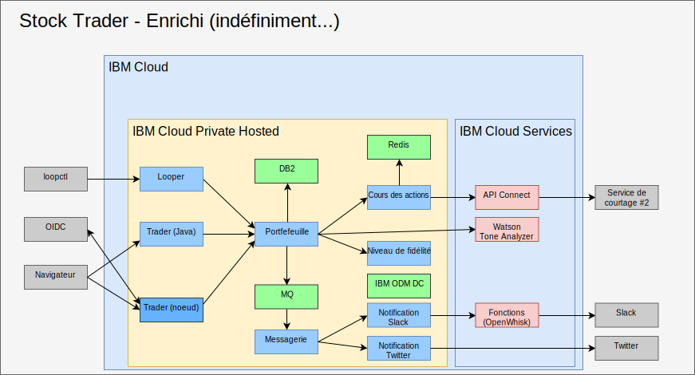

---

copyright:

  years:  2016, 2019

lastupdated: "2019-02-15"

subcollection: vmwaresolutions

---

# Enrichissement grâce à l'intelligence artificielle, aux analyses et à d'autres services cloud publics
{: #vcscontent-aianalytics}

L'enrichissement de Stock Trader ne se fait pas en une seule étape. Pour Todd et Jane, il s'agit d'un processus itératif. Dans la figure illustrée ci-après, vous verrez que Jane a ajouté le service Watson Tone Analyzer et une règle de niveau de fidélité en utilisant un centre décisionnel ODM. Les éléments présentés ci-après illustrement la manière dont Stock Trader a été enrichi.

Figure 1. Enrichissement supplémentaire de Stock Trader

## AI Watson Tone Analyzer
{: #vcscontent-aianalytics-ai-watson}

L'exemple ci-après illustre une façon simple, mais étonnamment puissante, d'enrichir une application. Jane recherche dans le [catalogue {{site.data.keyword.cloud}}](https://console.cloud.ibm.com/catalog/) les services [AI](https://console.cloud.ibm.com/catalog/?category=ai) et [Analytics](https://console.cloud.ibm.com/catalog/?category=analytics) et découvre un catalogue riche en contenu.

Jane sélectionne [Tone Analyzer](https://console.cloud.ibm.com/catalog/services/tone-analyzer), avec le plan standard, puis elle récupère des données d'identification pour effectuer l'appel.
Jane a restructuré Stock Trader et elle crée simplement un secret Kubernetes pour Tone Analyzer. Ainsi, même si elle modifie des plans ou des régions, elle n'a pas besoin de régénérer le code.

Grâce à la restructuration, Jane a pu essayer différentes infrastructures d'interface utilisateur sans interrompre l'expérience utilisateur. Par conséquent, la nouvelle interface utilisateur est disponible pour être utilisée et pour permettre de comprendre le ton des commentaires en retour de l'utilisateur.

Dans le futur, Jane pourra fournir des recommandations prédictives en matière de courtage basées sur la diversité des services d'analyse disponibles pour être exécutés dans l'instance cloud privée, {{site.data.keyword.cloud_notm}} Private.

## Règle métier de niveau de fidélité
{: #vcscontent-aianalytics-loyalty-rule}

Initialement, le code de Jane comportait une logique permettant de déterminer le montant monétaire susceptible d'entraîner un obstacle à la fidélité. Toutefois, après plusieurs demandes de la part du directeur marketing de Stock Trader visant à modifier la plage, Jane a décidé de décharger cette décision dans une règle métier que le directeur marketing peut modifier sans faire appel à Jane.

Jane a parlé avec Todd, qui a ajouté le [service](https://console.cloud.ibm.com/catalog/services/decision-optimization), puis créé la décision.

A présent, Margaret, la directrice marketing, peut se connecter et modifier les plages de niveaux de fidélité à chaque fois qu'une campagne est en cours, sans avoir à modifier du code.

## Nouveau service de courtage
{: #vcscontent-aianalytics-new-stock-service}

Vous avez peut-être constaté que le service de courtage avait été modifié.
Cela peut se produire lorsqu'un service public change de propriétaire ou de structure d'API. Heureusement, Jane a utilisé [API Connect](https://console.cloud.ibm.com/catalog/services/api-connect).
Au départ, elle a utilisé API Connect pour simplifier la réponse du service de courtage d'origine car recevoir et formater les données souhaitées de l'API brute mise à sa disposition était une entreprise un peu fastidieuse.

A présent, Jane est ravie car lors de la modification du service de courtage, elle a simplement changé la façon dont ce service est mappé à l'API simplifiée qu'elle a créée, et son code n'a même pas eu besoin de redémarrer. La solution Stock Trader a simplement continué de demander les données à la même API comme si elle n'avait pas changé. Toutes les modifications de l'API ont été effectuées en coulisse.

De plus, grâce aux fonctions de surveillance et de décompte d'API Connect, Jane peut savoir qui utilise son API simplifiée.

## Liens connexes
{: #vcscontent-aianalytics-related}

* [Présentation de vCenter Server on {{site.data.keyword.cloud_notm}} with Hybridity Bundle](/docs/services/vmwaresolutions/archiref/vcs?topic=vmware-solutions-vcs-hybridity-intro)
