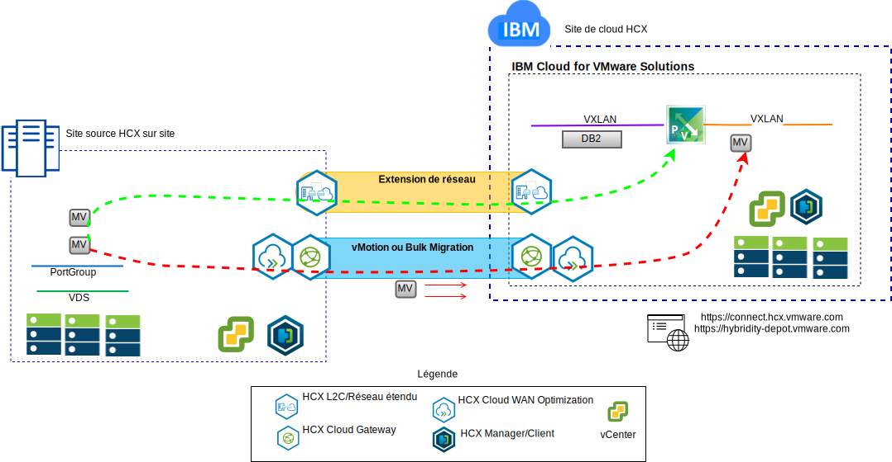

---

copyright:

  years:  2016, 2018

lastupdated: "2018-11-14"

---

# Migration "lift-and-shift" des machines virtuelles Stock Trader vers IBM Cloud
Todd souhaite étendre de façon transparente son instance VMware SDDC sur site dans une instance VMware vCenter Server on {{site.data.keyword.cloud}} pour la première étape de son parcours de modernisation. L'entreprise doit continuer de fonctionner et les temps d'indisponibilité doivent être réduits au minimum.

VMware vCenter Server on {{site.data.keyword.cloud_notm}} with Hybridity Bundle permet la création d'une connexion ininterrompue entre des instances vCenter Server et un centre de données virtuel VMware sur site.

Les composants vCenter Server with Hybridity Bundle, qui sont déployés en tant que machines virtuelles sur le site cible VMware {{site.data.keyword.cloud_notm}}, permettent d'établir une connexion avec les composants HCX qui sont installés sur le site source local homologue. 

Figure 1. vCenter Server with Hybridity Bundle

Le service vCenter Server with Hybridity Bundle crée une interconnectivité à couplage lâche entre le site local et {{site.data.keyword.cloud_notm}} et active les fonctionnalités suivantes : 

* Interconnectivité simple – Des connexions de réseau logique sont facilement établies sur n'importe quelle connexion physique, y compris l'Internet public, le VPN privé ou Direct Link. 
* Extension de couche 2 - Les réseaux locaux sont étendus au cloud et incluent les sous-réseaux locaux et l'adressage IP.
* Chiffrement – Le trafic réseau est chiffré entre les deux sites. 
* Réseau optimisé – Sélectionne la meilleure connexion et achemine efficacement la connexion de sorte que le trafic réseau soit déplacé le plus rapidement possible.
* Dédoublonnage de données - Jusqu'à 50 % de réduction de trafic réseau peut être réalisé.

* Routage intelligent - Lorsqu'une charge de travail est déplacée, le routage de proximité peut modifier la passerelle réseau, de sorte que le trafic réseau utilise la passerelle de site cible et ne dessine pas une "courbe en épingle à cheveux" vers le site d'origine.

* Migration sans interruption – Un système en cours d'exécution peut être déplacé vers (ou depuis) le cloud à l'aide de vMotion.
* Migration planifiée – N'importe quel nombre de machines virtuelles peut être répliqué vers le site de destination, puis activé sur ce site à une heure précise afin de remplacer les systèmes qui s'exécutent sur le site d'origine.
* Migration de règles de sécurité – Si NSX est utilisé sur site, toutes les règles de sécurité, tous les pare-feux et d'autres éléments de sécurité sont déplacés en même temps que la charge de travail.

Todd peut faire migrer Stock Trader depuis son environnement VMware sur site vers l'environnement VMware on {{site.data.keyword.cloud_notm}} et répondre à ses deux exigences, à savoir réduire ou éliminer ses temps d'indisponibilité et ne pas avoir à reconfigurer les applications.

### Liens connexes

* [Présentation de vCenter Server on {{site.data.keyword.cloud_notm}} with Hybridity Bundle](../vcs/vcs-hybridity-intro.html)
