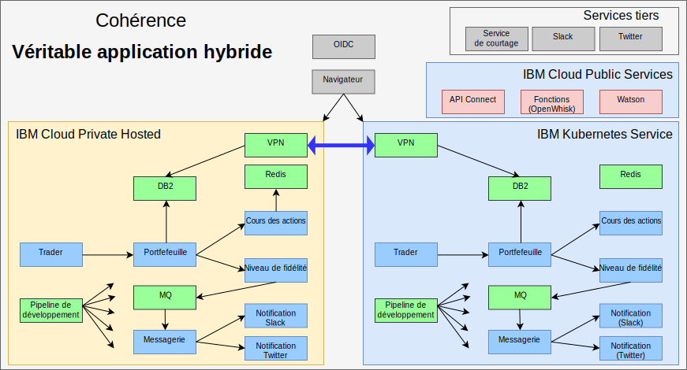

---

copyright:

  years:  2016, 2018

lastupdated: "2018-11-14"

---

# Véritable application hybride avec IBM Cloud Kubernetes Service

Comme son équipe de test s'est agrandie, Jane a souhaité fournir un environnement de test qui exécuterait les principales parties de son application et continuerait d'utiliser les données de son environnement.
Jane souhaite que son équipe de test se concentre sur les tests de son application et non sur la gestion du cluster Kubernetes. Jane et Todd décident de mettre en place une instance d'[{{site.data.keyword.cloud}} Kubernetes Service](https://www.ibm.com/cloud/container-service) et Jane déploie Stock Trader, sans y apporter de modifications de code. 

Todd ajoute ensuite le VPN strongSwan pour établir une connexion entre les réseaux privés de chaque cluster.

Figure 1. Stock Trader sous la forme d'une véritable application hybride

## Liens connexes

* [Présentation de vCenter Server on {{site.data.keyword.cloud_notm}} with Hybridity Bundle](../vcs/vcs-hybridity-intro.html)
