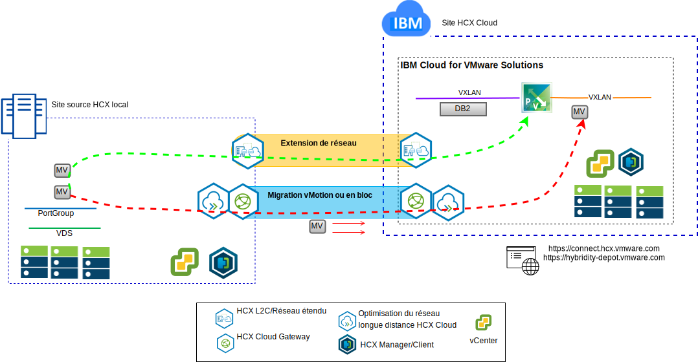

---

copyright:

  years:  2016, 2019

lastupdated: "2019-05-08"

subcollection: vmware-solutions

---

# Introduction à VMware Hybrid Cloud Services
{: #vcshcx-intro}

Les services VMware Hybrid Cloud Services (HCX) permettent à des instances distinctes de centres de données définis par logiciel vSphere (SDDC) d'interopérer sur différents types de réseaux. Il s'agit notamment des réseaux LAN ou WAN, qu'ils soient ou non sécurisés sur l'Internet public. HCX est conçu pour répondre aux problèmes de sécurité, de compatibilité, de complexité et de performance que l'on rencontrerait en essayant d'obtenir un déploiement multi-sites et multi-instances de vSphere s'étendant sur plusieurs sites et au-delà des frontières des fournisseurs de cloud.

HCX est la méthode préférée pour l'interopérabilité entre les offres vSphere entièrement automatisées dans {{site.data.keyword.cloud}} et toute autre instance déployée de vSphere. HCX est maintenant une offre entièrement intégrée dans {{site.data.keyword.vmwaresolutions_short}}.

Ce guide est conçu pour le déploiement et les opérations de HCX, et il comprend des renseignements sur les pratiques exemplaires et le dépannage tels qu'ils sont actuellement acceptés et compris. HCX étant développé selon la méthodologie de développement agile, n'utilisez pas ce guide comme source de facto des versions ou plates-formes prises en charge.

## Liens connexes
{: #vcshcx-intro-related}

* [Présentation de vCenter Server on {{site.data.keyword.cloud_notm}} with Hybridity Bundle](/docs/services/vmwaresolutions/archiref/vcs?topic=vmware-solutions-vcs-hybridity-intro)   
