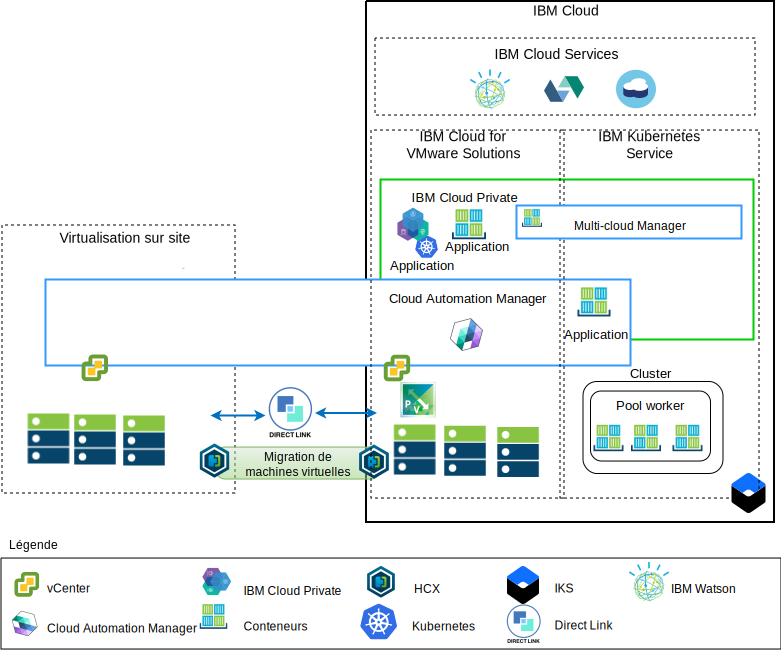

---

copyright:

  years:  2016, 2018

lastupdated: "2018-10-30"

---

# Présentation de la modernisation des applications

Le diagramme ci-après présente l'architecture de référence de la modernisation des applications qui sera déployée par l'entreprise Acme Skateboards et qui est décrite en détail dans cette documentation.

Figure 1. Diagramme général de l'architecture

Cette architecture hybride permettra à l'entreprise Acme Skateboards de :
- faire migrer des machines virtuelles VMware sur site vers IBM Cloud avec peu ou aucune durée d'indisponibilité et aucune reconfiguration d'application ;
- démarrer le parcours de modernisation des applications en lui permettant de se focaliser sur la conteneurisation des interfaces Web et des logiciels intermédiaires plus simples tout en permettant que d'autres bases de données plus complexes conservent leur statut de machines virtuelles ;
- d'optimiser Cloud Automation Manager (CAM) pour écrire un script IaC (Infrastructure as Code) afin de composer et d'orchestrer les services qui sont réalisés à partir de machines virtuelles et de conteneurs en vue de les intégrer à leurs chaînes d'outils DevOps et leur solution ITSM.

L'architecture de référence est composée des principaux composants suivants :
- **Virtualisation sur site** – Cluster VMware qui héberge actuellement les machines virtuelles Acme Skateboards. Ce sont ces machines virtuelles qui hébergent actuellement les applications qui seront modernisées. Ce cluster doit respecter les prérequis de l'architecture [VMware HCX on IBM Cloud Solution Architecture](https://www.ibm.com/cloud/garage/files/HCX_Architecture_Design.pdf) de manière à pouvoir exécuter HCX. HCX étend les réseaux sur site à IBM Cloud afin de permettre aux clients de faire migrer des machines virtuelles dans l'instance VMware vCenter Server on IBM Cloud (VCS) qui s'exécute sur IBM Cloud, et dans l'autre sens si besoin.

- **IBM Cloud for VMware Solutions** – L'instance VCS fournit les blocs de construction VMware fondamentaux, tels que vSphere, vCenter Server, NSX-V, et des options de stockage, telles que vSAN ou IBM Cloud Endurance, nécessaires pour déployer automatiquement une solution VMware Software Defined Data Center (SDDC). Le cluster VMware est la cible des machines virtuelles migrées ainsi que certaines des applications modernisées dans les conteneurs hébergés dans ICP. Les principaux composants de VCS sont les suivants :
    - **NSX-V** - NSX-V fournit la couche de virtualisation de réseau dans VCS offrant un réseau dissocié pour les machines virtuelles Acme Skateboards. NSX-V permet le mode BYOIP et isole les réseaux de charge de travail des réseaux IBM Cloud. NSX-V est programmé par HCX pour créer les réseaux qui seront étendus par Acme Skateboards à partir de l'environnement local.

    - **NSX-T** - NSX-T fournit un jeu commun d'outils de gestion du réseau et de la sécurité sur les conteneurs et les machines virtuelles. NSX-T est entièrement compatible avec l'interface Container Networking Interface (CNI) Kubernetes et s'intègre à celle-ci pour fournir une mise en réseau de conteneur. NSX-T fournit le réseau dissocié que les applications modernisées utilisent et il remplace Calico, qui est utilisé de façon native par ICP et IKS.

- **IBM Cloud Private** - ICP est une plateforme applicative pour le développement et la gestion d'applications conteneurisées. Il s'agit d'un environnement intégré qui inclut l'orchestrateur de conteneurs Kubernetes, un référentiel d'images privé, une console de gestion, ainsi que des infrastructures préfabriquées de surveillance et une interface graphique à partir de laquelle Acme Skateboards peut déployer, gérer, surveiller et mettre à l'échelle ses applications de façon centralisée. L'instance VCS héberge les composants ICP, les noeuds maître, les noeuds worker, etc. qui s'exécutent en tant que machines virtuelles. ICP héberge :
    - **IBM Cloud Automation Manager** – CAM est une plateforme IaC (Infrastructure as Code) prête pour l'entreprise qui fournit une interface centralisée permettant de mettre à disposition des charges de travail de machine virtuelle, sur site ou sur VCS, tout comme des charges de travail Kubernetes, dans ICP ou IKS, tout simplement à l'aide de modèles. CAM est une application Docker qui s'exécute par dessus ICP et est étroitement intégrée pour l'autorisation, le contrôle d'accès à base de rôles et d'autres fonctions.
    - Les applications Acme Skateboards conteneurisées à déployer dans cet environnement.

- **IBM Kubernetes Service** – IKS permet à l'entreprise Acme Skateboards de déployer ses applications modernisées dans des conteneurs Docker qui s'exécutent dans des clusters Kubernetes. Les modes maître sont entièrement gérés par IBM tandis que les noeuds worker présents dans le pool worker sont déployés dans le même compte IBM Cloud que leur instance VCS. Les noeuds worker peuvent être des noeuds bare metal, des noeuds publics ou des instances de serveur virtuel dédiées. Calico est installé et configuré automatiquement dans IKS. Calico fournit une connectivité de réseau sécurisée pour les conteneurs et est configuré dans IKS afin d'utiliser l'encapsulation IP-in-IP pour les paquets qui transitent par des sous-réseaux et afin d'utiliser NAT pour les connexions sortantes à partir des conteneurs.

- **Direct Link** – IBM Cloud Direct Link utilise le fournisseur WAN d'Acme Skateboard pour connecter son centre de données à IBM Cloud afin de fournir une connexion réseau sécurisée, à faible temps d'attente et fiable. Cette connexion fournit :
    - Un accès aux applications hébergées par le cloud à partir de vos utilisateurs d'entreprise.
    - Le trafic entre les machines virtuelles sur site et les machines virtuelles du cloud.
    - Le trafic entre les systèmes existants du centre de données sur site et les machines virtuelles du cloud.

## Principaux avantages pour l'entreprise Acme Skateboards

VMware vCenter Server on IBM Cloud (VCS) fournit les blocs de construction fondamentaux qui incluent notamment VMware vSphere, vCenter Server, NSX, et des options de stockage partagé, telles que vSAN, nécessaires pour concevoir avec souplesse une solution VMware Software Defined Data Center (SDDC) la mieux adaptée aux charges de travail du client.

En résumé, les offres IBM Cloud for VMware permettent :

* Une livraison plus rapide des projets informatiques pour les développeurs et les secteurs d'activité. En effet, le temps nécessaire à l'approvisionnement, à l'architecture, à l'implémentation et au déploiement des ressources passe de quelques semaines ou quelques mois à quelques heures.
* Une sécurité renforcée au moyen de serveurs bare metal dédiés dans un cloud privé hébergé, y compris le déploiement de noeud final privé dans des services IBM Cloud, tels qu'IKS et KMIP.
* Une gestion et une gouvernance cohérentes du cloud hybride déployé grâce à des droits d'accès administrateur complets à la gestion de la virtualisation, ce qui permet de préserver vos outils et vos scripts VMware existants, ainsi que les efforts réalisés en matière de formation.
* Une optimisation de l'expertise VMware à l'échelle mondiale grâce aux services professionnels et gérés d'IBM qui couvrent plus de 30 centres de données IBM Cloud dans le monde entier.

Les clients qui se tournent vers des plateformes applicatives natives en cloud, telles qu'ICP et IKS, se concentrent sur la vitesse et l'innovation et perdent parfois de vue la sécurité et la mise en réseau. Attendre que les équipes dédiées à la mise en réseau ou à la sécurité mettent à disposition des services, tels que les équilibreurs de charge, les pare-feu, les commutateurs et les routeurs, a pour conséquence de réduire le délai de rentabilisation des applications. Cette architecture de référence montre comment VCS, ICP et IKS permettent à l'entreprise Acme Skateboards de se déplacer en toute sécurité tout au long de son parcours de modernisation des applications.

## Liens connexes

* [Présentation de VCS Hybridity Bundle](../vcs/vcs-hybridity-intro.html)
