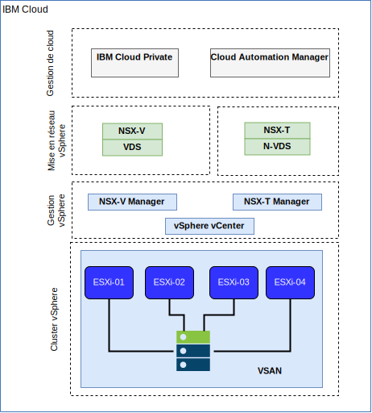

---

copyright:

  years:  2016, 2018

lastupdated: "2018-10-30"

---

# Mise en réseau et infrastructure IBM Cloud

## Acheminement et routage virtuels (VRF)

Les comptes IBM Cloud peuvent également être configurés en tant que comptes VRF. Cela permet de fournir une fonctionnalité similaire à VLAN spanning et ainsi d'activer le routage automatique entre les blocs d'adresses IP de sous-réseau. Tous les comptes dotés de connexions Direct Link doivent être convertis en ou créés en tant que compte VRF.

## Direct Link

IBM Cloud Direct Link Connect offre un accès privé à votre infrastructure IBM Cloud, ainsi qu'à d'autres clouds liés à votre fournisseur de services réseau, via votre centre de données IBM Cloud local. Cette option est idéale pour la création d'une connectivité multi-cloud dans un environnement individuel. Nous connectons des clients au réseau privé IBM Cloud grâce à une topologie de bande passante partagée. A l'instar de tous les produits Direct Link, vous pouvez ajouter le routage mondial, qui active le trafic de réseau privé vers tous les emplacements IBM Cloud.

## Réseaux privés virtuels

### VPN strongSwan

Le service VPN IPSec strongSwan fournit un canal de communication de bout en bout sécurisé sur Internet, basé sur l'ensemble de protocoles IPSec (Internet Protocol Security) aux normes de l'industrie.

### Hybridité (HCX)

Le service VCS Hybridity Bundle on IBM Cloud peut en toute transparence étendre les réseaux des centres de données local dans IBM Cloud, ce qui permet de faire migrer les machines virtuelles vers et depuis IBM Cloud sans aucune conversion ni modification.

## Structure physique

L'infrastructure physique nécessaire pour déployer une instance de production ICP (IBM Cloud Private) sur un cluster VMware vCenter Server on IBM Cloud (VCS) requiert la spécification minimale suivante :

Tableau 1. Spécification VCS pour ICP

| Déploiement NFS  |  Déploiement vSAN |
:--|:----:|:----:
Nombre de serveurs  |  3 |  4
UC | 28 coeurs 2,2 GHz | 28 coeurs 2,2 GHz
Mémoire | 384 Go | 384 Go
Stockage | Gestion 2000 Go 2IOPS/Go, Charge de travail 2000 Go 4IOPS/Go, ICP 4000 Go 4IOPS/Go | 2 SSD 960 Go au minimum

En plus de la configuration matérielle IBM Cloud Private requise, vous devez créer des volumes persistants dans l'environnement ICP pour stocker les données de journal et la base de données Cloud Automation Manager (CAM). CAM prend en charge tous les types de volume persistant pris en charge par ICP, mais les deux configurations de stockage recommandées pour CAM sont NFS et GlusterFS.

## Structure virtuelle

Figure 1. Structure physique du déploiement VCS et ICP

Dans l'instance VCS, l'instance ICP est déployée avec une passerelle NSX Edge Services Gateway (ESG) dédiée et un routeur logique distribué (DLR). L'installation ICP est chargée dans le sous-réseau VXLAN défini dans les composants ci-dessus.

La passerelle ESG est configurée avec une règle NAT source (SNAT) pour autoriser le trafic sortant, activant ainsi la connectivité Internet pour télécharger les prérequis ICP et la connectivité à GitHub et Docker, ou un proxy Web peut être utilisé pour fournir la connectivité Internet. La passerelle ESG est également configurée pour fournir l'accès aux services DNS et NTP.

La passerelle ESG est également configurée avec une règle NAT de destination (DNAT) vers les adresses IP virtuelles maître/proxy ICP à partir du réseau IBM Cloud 10.x jusqu'à l'environnement VXLAN.

### Liens connexes

* [Présentation de VCS Hybridity Bundle](../vcs/vcs-hybridity-intro.html)
