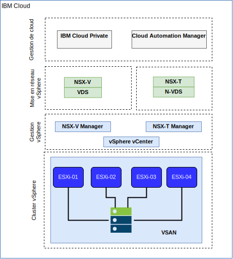

---

copyright:

  years:  2016, 2019

lastupdated: "2019-05-08"

subcollection: vmware-solutions

---

# Mise en réseau et infrastructure IBM Cloud
{: #vcsicp-arch-overview-infrastructure}

## Virtual Routing and Forwarding (VRF)
{: #vcsicp-arch-overview-infrastructure-vrf}

Vous pouvez configurer le compte {{site.data.keyword.cloud}} en tant que compte VRF (Virtual Routing and Forwarding) pour activer le routage global automatique entre les blocs d'adresses IP de sous-réseau. Tous les comptes dotés de connexions Direct Link doivent être convertis en ou créés en tant que compte VRF.

## Direct Link
{: #vcsicp-arch-overview-infrastructure-direct-link}

{{site.data.keyword.cloud_notm}} Direct Link Connect offre un accès privé à votre infrastructure {{site.data.keyword.cloud_notm}}, ainsi qu'à d'autres clouds liés à votre fournisseur de services réseau, via votre centre de données IBM Cloud local. Cette option est idéale pour la création d'une connectivité multi-cloud dans un environnement individuel. Une topologie de bande passante partagée est utilisée pour connecter des clients au réseau {{site.data.keyword.icpfull_notm}}. A l'instar de tous les produits Direct Link, vous pouvez ajouter le routage mondial, qui active le trafic de réseau privé vers tous les emplacements {{site.data.keyword.cloud_notm}}.

## Réseaux privés virtuels
{: #vcsicp-arch-overview-infrastructure-vp-networks}

### VPN strongSwan
{: #vcsicp-arch-overview-infrastructure-strongswan}

Le service VPN IPSec strongSwan fournit un canal de communication de bout en bout sécurisé sur Internet, basé sur l'ensemble de protocoles IPSec (Internet Protocol Security) aux normes de l'industrie.

### Hybridité (HCX)
{: #vcsicp-arch-overview-infrastructure-hcx}

Le service vCenter Server on {{site.data.keyword.cloud_notm}} with Hybridity Bundle étend en toute transparence les réseaux des centres de données locaux dans {{site.data.keyword.cloud_notm}}, ce qui permet de faire migrer les machines virtuelles vers et depuis {{site.data.keyword.cloud_notm}} sans aucune conversion ni modification.

## Structure physique
{: #vcsicp-arch-overview-infrastructure-phys-struct}

L'infrastructure physique nécessaire pour déployer une instance de production {{site.data.keyword.icpfull_notm}} sur un cluster VMware vCenter Server on {{site.data.keyword.cloud_notm}}, requiert la spécification minimale suivante.

Tableau 1. Spécification vCenter Server for {{site.data.keyword.icpfull_notm}}

| Déploiement NFS | Déploiement vSAN |
:--|:----:|:----:
Nombre de serveurs | 3 | 4
UC | 28 coeurs 2,2 GHz | 28 coeurs 2,2 GHz
Mémoire | 384 Go | 384 Go
Stockage | 2000 GB 2IOPS/GB Management, Charge de travail 2000 GB 4IOPS/GB, 4000 GB 4IOPS/GB {{site.data.keyword.icpfull_notm}} | Min 960-GB SSD x 2

En plus de la configuration matérielle {{site.data.keyword.icpfull_notm}} requise, vous devez créer des volumes persistants dans l'environnement {{site.data.keyword.icpfull_notm}} pour stocker les données de journal et la base de données Cloud Automation Manager (CAM). CAM prend en charge tous les types de volume persistant pris en charge par {{site.data.keyword.icpfull_notm}}, mais les deux configurations de stockage recommandées pour CAM sont NFS et GlusterFS.

## Structure virtuelle
{: #vcsicp-arch-overview-infrastructure-virtual-struct}

Dans l'instance vCenter Server, l'instance {{site.data.keyword.icpfull_notm}} est déployée avec une passerelle NSX Edge Services Gateway (ESG) dédiée et un routeur logique distribué (DLR). L'installation {{site.data.keyword.icpfull_notm}} est chargée dans le sous-réseau VXLAN qui est défini dans les composants ci-dessus.

La passerelle ESG est configurée avec une règle SNAT pour autoriser le trafic sortant, activant ainsi la connectivité pour télécharger les prérequis {{site.data.keyword.icpfull_notm}} et la connectivité à GitHub et Docker. Vous pouvez aussi utiliser un proxy Web pour la connectivité Internet. La passerelle ESG est également configurée pour fournir l'accès aux services DNS et NTP.

La passerelle ESG est également configurée avec une règle NAT de destination (DNAT) vers les adresses IP virtuelles maître/proxy {{site.data.keyword.icpfull_notm}} à partir du réseau {{site.data.keyword.cloud_notm}} 10.x jusqu'à l'environnement VXLAN.

## Liens connexes
{: #vcsicp-arch-overview-infrastructure-related}

* [Présentation de vCenter Server on {{site.data.keyword.cloud_notm}} with Hybridity Bundle](/docs/services/vmwaresolutions/archiref/vcs?topic=vmware-solutions-vcs-hybridity-intro)
