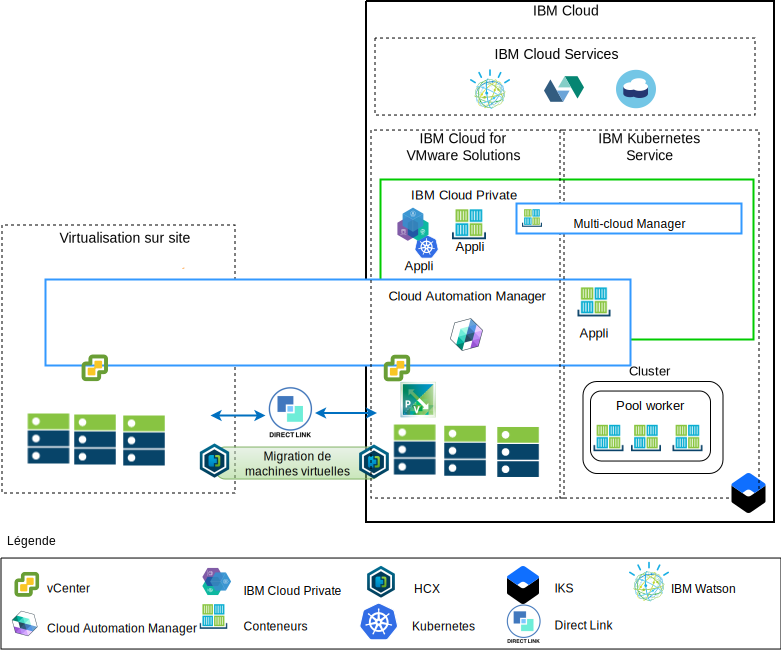
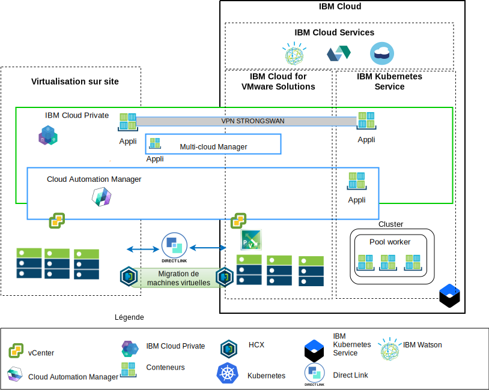

---

copyright:

  years:  2016, 2019

lastupdated: "2019-02-15"

subcollection: vmwaresolutions

---

# Présentation de l'architecture
{: #vcsicp-arch-overview}

Les offres {{site.data.keyword.vmwaresolutions_full}} fournissent l'automatisation du déploiement des composants de technologie VMware dans les {{site.data.keyword.CloudDataCents_notm}} situés dans le monde entier.
L'architecture est composée d'une région de cloud et a la capacité de s'étendre dans d'autres régions de cloud situées dans une autre zone géographique ou dans un autre pod {{site.data.keyword.cloud_notm}} au sein du même centre de données.

Vous pouvez déployer manuellement les produits {{site.data.keyword.cloud_notm}} Private et Cloud Automation Manager (CAM) dans votre plateforme de virtualisation sur site, permettant ainsi la gestion du cloud à partir des emplacements locaux. Sinon, {{site.data.keyword.icpfull_notm}} et CAM sont offerts en tant qu'extension de service à un déploiement VMware vCenter Server on {{site.data.keyword.cloud_notm}} nouveau ou existant, via l'automatisation, permettant ainsi la gestion du cloud à partir d'{{site.data.keyword.cloud_notm}}.

{{site.data.keyword.cloud_notm}} Private est une plateforme applicative pour le développement et la gestion sur site d'applications conteneurisées. {{site.data.keyword.cloud_notm}} Private est un environnement intégré de gestion des conteneurs qui inclut l'orchestrateur de conteneurs Kubernetes, un référentiel d'images privé, une console de gestion et des infrastructures de surveillance.

IBM Multi-Cluster Cloud Manager (MCM) fournit la visibilité utilisateur, la gestion orientée applications (règles, déploiements, santé, opérations) et la conformité basée sur les règles sur les clouds et les clusters. MCM vous permet de contrôler vos clusters Kubernetes. Avec MCM, vous pouvez vous assurer que vos clusters sont sécurisés, qu'ils fonctionnent correctement et qu'ils fournissent une plateforme de gestion de service qui s'exécute sur {{site.data.keyword.cloud_notm}} et permet aux développeurs et aux administrateurs de répondre aux besoins de l'entreprise.

Utilisez Cloud Automation Manager Service Composer pour afficher des services cloud hybrides dans le catalogue {{site.data.keyword.cloud_notm}}.

## Plateforme de gestion du cloud côté IBM Cloud
{: #vcsicp-arch-overview-ibm-cloud-side-platform}

Le diagramme ci-dessous illustre un exemple d'un déploiement {{site.data.keyword.icpfull_notm}} et CAM avec l'infrastructure {{site.data.keyword.cloud_notm}}, avec des connexions au vCenter local et au {{site.data.keyword.containerlong_notm}} déployés sur {{site.data.keyword.cloud_notm}}. Les utilisateurs peuvent déployer des machines virtuelles sur site et des machines virtuelles dans une instance vCenter Server, ainsi que des conteneurs sur le cluster {{site.data.keyword.icpfull_notm}} et {{site.data.keyword.containerlong_notm}}.

Figure 1. Gestion du cloud côté IBM Cloud

Dans le diagramme, CAM crée des connexions de cloud aux services vCenter, aux fournisseurs de cloud et aux environnements {{site.data.keyword.icpfull_notm}} and {{site.data.keyword.containerlong_notm}} de façon logique. Des clusters {{site.data.keyword.icpfull_notm}} doivent être déployés dans chaque environnement de cloud de centre de données, MCM fournissant le mécanisme de connexion aux clusters {{site.data.keyword.icpfull_notm}} dans une seule vue de gestion.

Vous pouvez déployer {{site.data.keyword.icpfull_notm}} avec des composants NSX-V ou NSX-T. {{site.data.keyword.icpfull_notm}} avec NSX-V permet d'exécuter les machines virtuelles {{site.data.keyword.icpfull_notm}} sur le réseau VXLAN et d'utiliser la mise en réseau interne Kubernetes Calico.

{{site.data.keyword.icpfull_notm}} with NSX-T permet aux utilisateurs de contrôler et configurer la mise en réseau, le sous-réseau et les règles à partir d'une interface utilisateur centralisée (NSX-T Manager). Pour savoir ce qui distingue NSX-V de NSX-T, voir le [Guide de mise en réseau de vCenter Server](/docs/services/vmwaresolutions/archiref/vcsnsxt?topic=vmware-solutions-vcsnsxt-intro).

## Plateforme de gestion du cloud sur site
{: #vcsicp-arch-overview-on-premises-platform}

Le diagramme ci-dessous illustre un exemple d'un déploiement {{site.data.keyword.icpfull_notm}} et CAM dans l'infrastructure sur site, avec des connexions aux services vCenter et {{site.data.keyword.containerlong_notm}} déployés sur {{site.data.keyword.cloud_notm}}. Les utilisateurs peuvent déployer des machines virtuelles et des conteneurs sur site, des machines virtuelles dans des instances vCenter Server et des conteneurs sur le cluster {{site.data.keyword.containerlong_notm}}.

Figure 2. Gestion du cloud sur site

Le réseau privé virtuel strongSwan est utilisé pour établir une connectivité avec les conteneurs {{site.data.keyword.containerlong_notm}} déployés. Le réseau privé virtuel strongSwan sera peut-être remplacé par la connectivité Direct Link.

Dans le diagramme, CAM crée des connexions de cloud aux services vCenter, aux fournisseurs de cloud et aux environnements {{site.data.keyword.icpfull_notm}} and {{site.data.keyword.containerlong_notm}} de façon logique. Des clusters {{site.data.keyword.icpfull_notm}} doivent être déployés dans chaque environnement de cloud de centre de données, MCM fournissant le mécanisme de connexion aux clusters {{site.data.keyword.icpfull_notm}} dans une seule vue de gestion.

## Liens connexes
{: #vcsicp-arch-overview-related}

* [Présentation de vCenter Server on {{site.data.keyword.cloud_notm}} with Hybridity Bundle](/docs/services/vmwaresolutions/archiref/vcs?topic=vmware-solutions-vcs-hybridity-intro)
