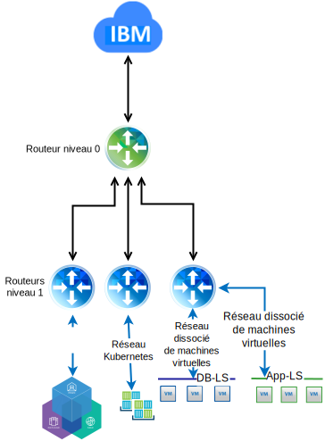

---

copyright:

  years:  2016, 2019

lastupdated: "2019-02-15"

subcollection: vmware-solutions

---

# Conception détaillée
{: #vcsicp-detail-design}

## Composants des services communs
{: #vcsicp-detail-design-common-services}

Les services communs fournissent les services qui sont utilisés par d'autres services de la plateforme de gestion du cloud. Il s'agit notamment des services d'identité et d'accès, des services de nom de domaine et des services NTP.

Figure 1. Services communs {{site.data.keyword.icpfull_notm}}

### Services d'identité et d'accès
{: #vcsicp-detail-design-identity}

Dans le cadre de l'automatisation VMware vCenter Server on {{site.data.keyword.cloud}}, un annuaire Microsoft Active Directory (AD) est utilisé pour la gestion des identités. Une seule instance de serveur virtuel AD est déployée. vCenter est configuré pour utiliser l'authentification AD et vous pouvez configurer {{site.data.keyword.icpfull_notm}} pour l'authentification LDAP.

###	Services de nom de domaine
{: #vcsicp-detail-design-dns}

Le déploiement vCenter Server utilise les instances de serveur virtuel AD déployées comme serveurs DNS pour l'instance. Tous les composants déployés, tels que vCenter, PSC, NSX et les hôtes ESXi, sont configurés pour pointer vers l'annuaire AD comme serveur DNS par défaut.

###	Services NTP
{: #vcsicp-detail-design-ntp}

Le déploiement vCenter Server utilise les serveurs NTP de l'infrastructure {{site.data.keyword.cloud_notm}}. Tous les composants déployés sont configurés pour utiliser ces serveurs NTP. Il est essentiel que tous les composants de la conception utilisent les mêmes serveurs NTP pour que les certificats et l'authentification AD puissent fonctionner correctement.

## Mise en réseau
{: #vcsicp-detail-design-networking}

### Mise en réseau NSX-V
{: #vcsicp-detail-design-nsx-v}

L'architecture de NSX-V est telle qu'une seule plateforme NSX-V Manager est associée à une seule instance vCenter Server. NSX-V fournit des services de mise en réseau aux applications qui s'exécutent dans un environnement vSphere.

En utilisant la mise en réseau NSX-V incluse dans le déploiement VCS, nous pouvons déployer {{site.data.keyword.icpfull_notm}} dans un réseau dissocié VXLAN.

{{site.data.keyword.icpfull_notm}} est déployé avec la pile de mise en réseau Calico par défaut pour Kubernetes, ce qui fournit l'isolement réseau dans votre cluster.

Figure 2. {{site.data.keyword.icpfull_notm}} avec mise en réseau NSX-V

Pour plus d'informations, voir le [guide de mise en réseau de vCenter Server](/docs/services/vmwaresolutions/archiref/vcsnsxt?topic=vmware-solutions-vcsnsxt-intro).

### Mise en réseau NSX-T
{: #vcsicp-detail-design-nst-t}

L'architecture de NSX-T est telle qu'une plateforme de mise en réseau pouvant se connecter à n'importe quel type d'application, reposant sur une machine virtuelle ou un conteneur, s'exécute dans ou en dehors d'un environnement vSphere.

{{site.data.keyword.icpfull_notm}} fournit une option permettant de remplacer la mise en réseau Calico par une instance NSX-T, fournissant ainsi un emplacement unique pour la gestion de la mise en réseau et de la sécurité.

Figure 3. {{site.data.keyword.icpfull_notm}} avec mise en réseau NSX-T

## Liens connexes
{: #vcsicp-detail-design-related}

* [Présentation de vCenter Server on {{site.data.keyword.cloud_notm}} with Hybridity Bundle](/docs/services/vmwaresolutions/archiref/vcs?topic=vmware-solutions-vcs-hybridity-intro)
