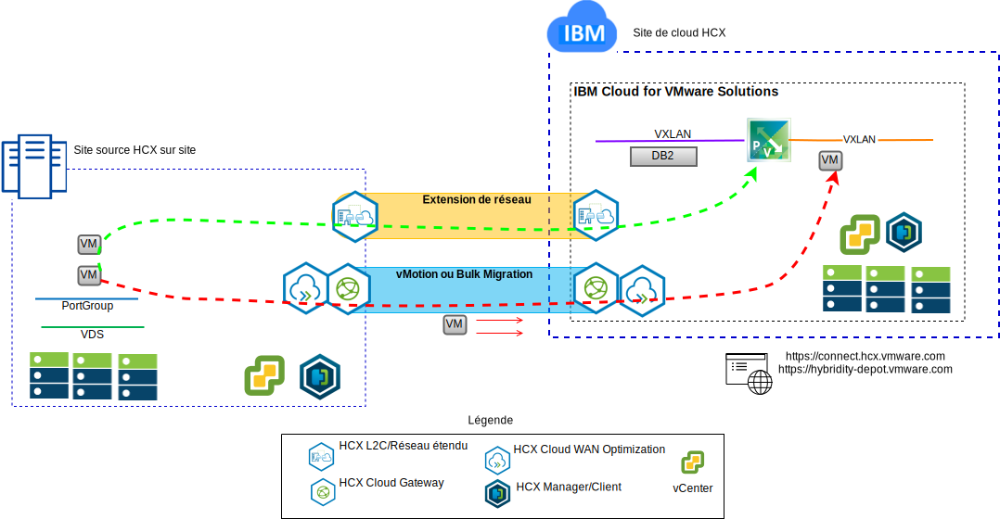
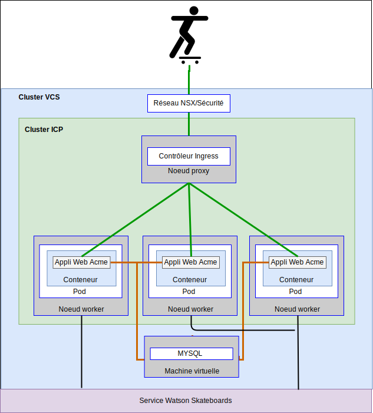

---

copyright:

  years:  2016, 2018

lastupdated: "2018-10-30"

---

# Cas d'utilisation

## Migration de charge de travail vers IBM Cloud
L'entreprise Acme Skateboards souhaite étendre de façon transparente son environnement VMware SDDC sur site dans une instance VCS sur IBM Cloud. Elle doit faire en sorte de rester opérationnelle et de réduire au maximum la durée d'indisponibilité. Reconfigurer ses applications pour qu'elles s'exécutent dans le cloud n'est pas une solution optimale.

Le service VMware Hybridity on IBM Cloud permet la création de connexions ininterrompues entre IBM Cloud et un centre de données virtuel VMware sur site.

L'offre vCenter Server with Hybridity Bundle d'IBM Cloud permet d'établir des connexions sécurisées entre le site source local homologue et le site cible IBM Cloud.

Figure 1. Services VMware Hybridity

Cela crée une interconnectivité à couplage lâche entre le site local et IBM Cloud et active des fonctionnalités telles que :
- **Interconnectivité simple** – Des connexions de réseau logique sont facilement établies sur n'importe quelle connexion physique, y compris l'internet public, le réseau privé virtuel ou IBM Cloud Direct Link.
- **Extension de couche 2** – Les réseaux locaux sont étendus au cloud, y compris les sous-réseaux locaux et l'adressage IP.
- **Chiffrement** – Le trafic réseau est chiffré entre les sites homologues.
- **Optimisation de réseau** – Sélectionne la meilleure connexion et achemine efficacement la connexion de sorte que le trafic réseau soit déplacé le plus rapidement possible.
- **Dédoublonnage de données** – Jusqu'à 50 % de réduction de trafic réseau peut être réalisé.
- **Routage intelligent** – Lorsqu'une charge de travail est déplacée, le routage de proximité peut modifier le chemin réseau (c'est-à-dire la passerelle) de sorte que le trafic réseau utilise la passerelle de site cible et ne dessine pas une "courbe en épingle à cheveux" vers le site d'origine.
- **Migration sans interruption** – Une machine virtuelle en cours d'exécution peut être déplacée vers (ou depuis) le cloud à l'aide de vMotion.
- **Migration planifiée** – N'importe quel nombre de machines virtuelles peut être répliqué vers le site de destination, puis activé sur ce site à une heure précise afin de remplacer les systèmes qui s'exécutent sur le site d'origine.
- **Migration de règles de sécurité** – Si NSX est utilisé sur site, toutes les règles de sécurité, tous les pare-feu, etc. sont déplacés en même temps que la charge de travail.

Grâce à cette solution, Acme Skateboards a pu faire migrer ses charges de travail VMware locales vers IBM Cloud tout en respectant ses deux exigences, à savoir réduire au maximum la durée d'indisponibilité et ne pas avoir à reconfigurer les applications.

## Déploiement d'architecture hybride

L'entreprise Acme Skateboards souhaite déployer une architecture hybride sur IBM Cloud composée de VCS et d'ICP, pour son parcours vers la modernisation de ses applications. Ses exigences sont les suivantes : exécuter ses bases de données sur des machines virtuelles, les applications et les services Web dans des conteneurs, et utiliser un jeu commun d'outils pour la gestion du réseau et de la sécurité.

Figure 2. Application hybride d'Acme Skateboards

IBM Cloud for VMware Solutions fournit l'automatisation du déploiement des composants de technologie VMware dans les centres de données IBM Cloud <situés dans le monde entier. L'architecture est composée d'une région de cloud et a la capacité de s'étendre dans des régions de cloud supplémentaires situées dans une autre zone géographique et/ou dans un autre pod IBM Cloud au sein du même centre de données.

Les produits IBM Cloud Private (ICP) et Cloud Automation Manager (CAM) sont déployés manuellement dans votre plateforme de virtualisation sur site, permettant ainsi la gestion du cloud à partir des emplacements locaux. Sinon, ICP et CAM sont offerts en tant qu'extension de service à un déploiement VCS nouveau ou existant, via l'automatisation, permettant ainsi la gestion du cloud à partir d'IBM Cloud.

Le diagramme ci-dessous représente ICP s'exécutant par dessus une instance VCS. NSX-V est configuré avec un commutateur/réseau VXLAN dédié, un routeur DLR et une passerelle ESG pour le réseau dissocié ICP, le routage est configuré via la passerelle ESG pour accéder au réseau sous-jacent.

A l'aide de l'automatisation d'IBM Cloud, l'entreprise Acme Skateboards peut mettre à disposition une solution hybride comprenant VMware on IBM Cloud afin d'exécuter ses machines virtuelles de base de données et ICP sur VMware on IBM Cloud et pour exécuter ses applications et des services Web frontaux dans des conteneurs. NSX lui fournit un jeu commun d'outils de gestion du réseau et de la sécurité dans le réseau dissocié.

Figure 3. VCS avec ICP

### Liens connexes

* [Présentation de VCS Hybridity Bundle](../vcs/vcs-hybridity-intro.html)
