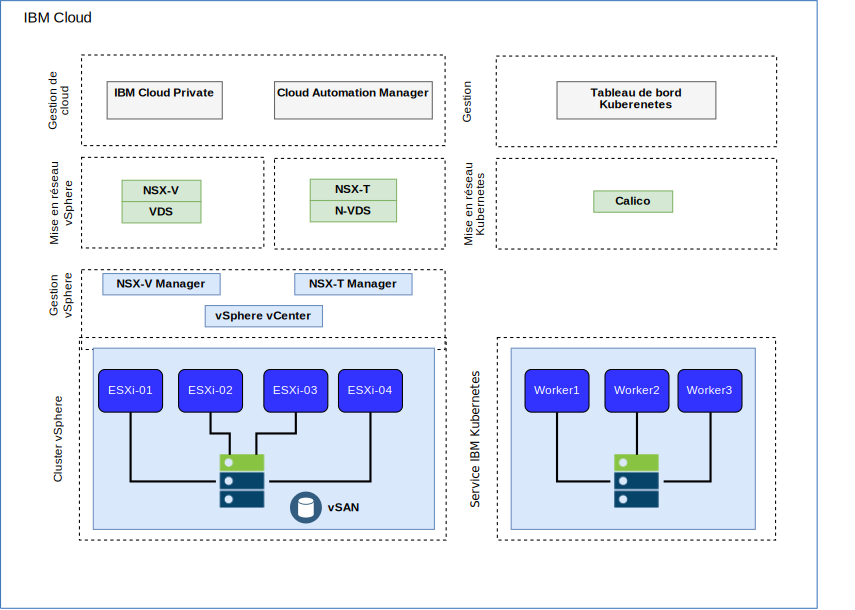
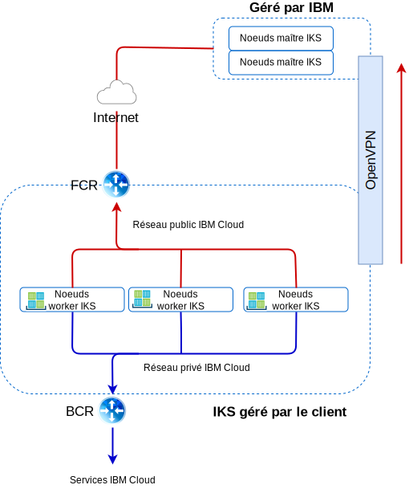

---

copyright:

  years:  2016, 2019

lastupdated: "2019-03-01"

---

# Mise en réseau et infrastructure IBM Cloud
{: #vcsiks-arch-overview-infrastructure}

## Virtual Routing and Forwarding (VRF)
{: #vcsiks-arch-overview-infrastructure-vrf}

Les comptes {{site.data.keyword.cloud}} peuvent être configurés en tant que comptes VRF (Virtual Routing and Forwarding). Les comptes VRF activent le routage global automatique entre des blocs IP de sous-réseau. Tous les comptes dotés de connexions Direct Link doivent être convertis en ou créés en tant que compte VRF.

## Direct Link
{: #vcsiks-arch-overview-infrastructure-direct-link}

{{site.data.keyword.cloud_notm}} Direct Link Connect offre un accès privé à votre infrastructure {{site.data.keyword.cloud_notm}}, ainsi qu'à d'autres clouds liés à votre fournisseur de services réseau, via votre centre de données {{site.data.keyword.CloudDataCent_notm}} local. Cette option est idéale pour la création d'une connectivité multi-cloud dans un environnement individuel.
Nous connectons des clients au réseau privé {{site.data.keyword.cloud_notm}} Private grâce à une topologie de bande passante partagée. A l'instar de tous les produits Direct Link, vous pouvez ajouter le routage mondial, qui active le trafic de réseau privé vers tous les emplacements {{site.data.keyword.cloud_notm}}.

## Réseaux privés virtuels
{: #vcsiks-arch-overview-infrastructure-virt-private-network}

### VPN strongSwan
{: #vcsiks-arch-overview-infrastructure-strongswan}

Le service VPN IPSec strongSwan fournit un canal de communication de bout en bout sécurisé sur Internet, basé sur l'ensemble de protocoles IPSec (Internet Protocol Security) aux normes de l'industrie.

### Hybridité (HCX)
{: #vcsiks-arch-overview-infrastructure-hcx}

Le service VMware vCenter Server on {{site.data.keyword.cloud_notm}} with Hybridity Bundle étend en toute transparence les réseaux des centres de données locaux dans
{{site.data.keyword.cloud_notm}}, ce qui permet de faire migrer les machines virtuelles vers et depuis {{site.data.keyword.cloud_notm}} sans aucune conversion ni modification.

## Structure physique
{: #vcsiks-arch-overview-infrastructure-physical-structure}

L'infrastructure physique nécessaire pour déployer un cluster vCenter Server requiert la spécification minimale suivante :

Tableau 1. Spécifications vCenter Server

  | Déploiement NFS | Déploiement VSAN
---|---|---
Nombre de serveurs | 3 | 4
UC | 28 coeurs 2,2 GHZ | 28 coeurs 2,2 GHZ
Mémoire | 384 Go | 384 Go
Stockage |Gestion : 2 To 2 IOPS, Charge de travail : 2 To 4 IOPS|Min SSD : 960 Go (x2)   

Les options de déploiement {{site.data.keyword.containerlong_notm}} varient en fonction des vos exigences en matière de noeud worker

Tableau 2. Spécifications pour {{site.data.keyword.containerlong_notm}}

  | Machine virtuelle | Serveur bare metal
--|---|--
Nombre de serveurs | 3 | 3
UC | 2 – 56 coeurs | 4 – 28 coeurs
Mémoire | 4 Go - 242 Go | 32 Go - 512 Go
Stockage | 100 Go |  SATA : 2 To / SSD : 960 Go

## Structure virtuelle
{: #vcsiks-arch-overview-infrastructure-virtual-structure}

Figure 1. Structure physique des déploiements {{site.data.keyword.containerlong_notm}} et {{site.data.keyword.icpfull_notm}}

Dans l'instance vCenter Server, les machines virtuelles de client sont déployées sur des passerelles NSX Edge Services Gateway (ESG) et des routeurs logiques distribués (DLR) dédiés.

La passerelle ESG est configurée avec une règle SNAT pour autoriser le trafic sortant, activant ainsi la connectivité pour télécharger les prérequis {{site.data.keyword.icpfull_notm}} et la connectivité à GitHub et Docker. Vous pouvez aussi utiliser un proxy Web pour la connectivité Internet. La passerelle ESG est configurée pour accéder aux services DNS et NTP via le réseau privé. L'intégration à l'instance {{site.data.keyword.containerlong_notm}} est disponible via la mise en réseau {{site.data.keyword.cloud_notm}} entre l'instance vCenter Server et {{site.data.keyword.containerlong_notm}}.

## Composants vCenter Server
{: #vcsiks-arch-overview-infrastructure-vcs-comp}

Figure 2. Composants de la plateforme vCenter Server

### Contrôleur PSC (Platform Service Controller)
{: #vcsiks-arch-overview-infrastructure-psc}

Le déploiement vCenter Server utilise un seul contrôleur PSC externe installé sur un sous-réseau portable dans le réseau VLAN privé associé à des machines virtuelles de gestion. Le routeur BCR (Back-end Customer Router) lui sert de passerelle par défaut.

### vCenter Server
{: #vcsiks-arch-overview-infrastructure-vcs}

A l'instar du contrôleur PSC, vCenter Server est déployé en tant que dispositif.
En outre, vCenter Server est installé sur un sous-réseau portable, sur le VLAN privé associé aux machines virtuelles de gestion. Le routeur BCR lui sert de passerelle par défaut.

### NSX Manager
{: #vcsiks-arch-overview-infrastructure-nsx-manager}

NSX Manager est déployé sur le cluster vCenter Server initial. De plus, NSX Manager se voit affecter une adresse IP provenant du bloc d'adresses portables privées qui est conçu pour les composants de gestion.

### Contrôleurs NSX
{: #vcsiks-arch-overview-infrastructure-nsx-controllers}

L'automatisation d'{{site.data.keyword.cloud_notm}} déploie trois contrôleurs NSX dans le cluster initial. Les contrôleurs se voient affecter des adresses IP provenant du sous-réseau portable privé destiné aux composants de gestion.

### Passerelles NSX ESG/Routeurs DLR
{: #vcsiks-arch-overview-infrastructure-nsx-esg}

Des paires de passerelles NSX ESG (Edge Services Gateway) sont déployées. Dans tous les cas, une paire de passerelles est utilisée pour le trafic sortant des composants d'automatisation qui résident sur le réseau privé. Pour vCenter Server et {{site.data.keyword.icpfull_notm}}, une seconde passerelle, appelée serveur de périphérie géré ICP, est déployée et configurée avec une liaison montante au réseau public et une interface qui est affectée au réseau privé.
Les composants NSX requis, tels que le routeur DLR (Distributed Logical Router), les commutateurs logiques et les pare-feu peuvent être configurés par l'administrateur. Pour plus d'informations sur les passerelles NSX ESG déployées dans le cadre de la solution, voir le [guide de mise en réseau de vCenter Server](/docs/services/vmwaresolutions/archiref/vcsnsxt?topic=vmware-solutions-vcsnsxt-intro).

Les tableaux ci-après répertorient les spécifications {{site.data.keyword.icpfull_notm}} ESG/DLR pour ICP.

Tableau 3. Spécifications ESG pour {{site.data.keyword.icpfull_notm}}

Attribut |  Spécification
--|--
Edge Service Gateway | Dispositif virtuel
Edge size	Large | Nombre de vCPU	2
Memory	| 1 Go
Disk	| 1000 Go sur magasin de données local

Tableau 4. Spécifications DLR pour {{site.data.keyword.icpfull_notm}}

Attribut  |  Spécification
--|--|
Distributed Logical Router |	Dispositif virtuel
Edge size	Compact | Nombre de vCPU	1
Memory	| 512 Mo
Disk	| 1000 Go sur magasin de données local

## Composants IBM Cloud Kubernetes Service
{: #vcsiks-arch-overview-infrastructure-iks-comp}

Figure 3. Composants {{site.data.keyword.containerlong_notm}} components

### Maître Kubernetes
{: #vcsiks-arch-overview-infrastructure-kube-master}

Le maître Kubernetes est chargé de gérer toutes les ressources de calcul, de réseau et de stockage dans le cluster. Il assure que vos applications et services conteneurisés sont déployés de manière égale sur les noeuds worker dans le cluster.

###	Noeud worker
{: #vcsiks-arch-overview-infrastructure-worker-node}

Chaque noeud worker est une machine physique (bare metal) ou une machine virtuelle qui s'exécute sur du matériel physique dans l'environnement de cloud. Lorsque vous mettez à disposition un noeud worker, vous déterminez les ressources disponibles dans les conteneurs qui sont hébergés sur ce noeud worker. Prêts à l'emploi, vos noeuds worker sont configurés avec un moteur Docker géré par IBM, des ressources de calcul distinctes, la mise en réseau et un services de volumes. Les fonctions de sécurité intégrées assurent l'isolement, offrent des capacités de gestion des ressources et garantissent la conformité des noeuds worker en matière de sécurité.

## Liens connexes
{: #vcsiks-arch-overview-infrastructure-related}

* [Présentation de vCenter Server on {{site.data.keyword.cloud_notm}} with Hybridity Bundle](/docs/services/vmwaresolutions/archiref/vcs?topic=vmware-solutions-vcs-hybridity-intro)
