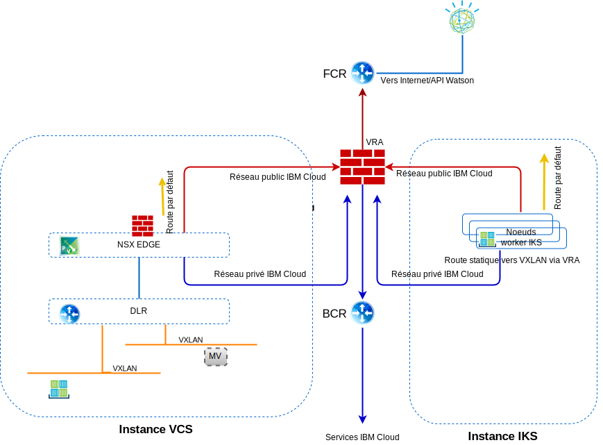

---

copyright:

  years:  2016, 2019

lastupdated: "2019-08-05"

subcollection: vmware-solutions

---

# Mise en réseau, sauvegarde, reprise après incident et évolutivité
{: #vcsiks-overview-network}

Cette section fournit des informations sur la mise en réseau, la sauvegarde, la reprise après incident ainsi que des remarques sur l'évolutivité.

## Mise en réseau
{: #vcsiks-overview-network-networking}

{{site.data.keyword.cloud}} comporte deux réseaux. Le réseau public permet d'atteindre les serveurs à partir d'Internet et le réseau privé permet aux serveurs de communiquer entre eux via un réseau principal haute vitesse dans tous les {{site.data.keyword.CloudDataCents_notm}}.

Par défaut, {{site.data.keyword.containerlong_notm}} configure le cluster avec un accès à un VLAN public et à un VLAN privé.
- Une adresse IP publique pour chaque noeud worker, ce qui offre aux noeuds worker une interface réseau publique.
  - L'ensemble du trafic réseau sortant est autorisé pour tous les noeuds worker.
  - Le trafic réseau entrant est bloqué à l'exception de quelques ports. Ces ports sont ouverts de sorte qu'IBM puisse surveiller le trafic réseau et installer automatiquement les mises à jour de sécurité pour le maître Kubernetes.
- Une adresse IP privée pour chaque noeud worker, ce qui offre aux noeuds worker une interface réseau privée
- Une connexion OpenVPN sécurisée automatique entre tous les noeuds worker et le noeud maître

### Intégration d'IBM Cloud Kubernetes Service et vCenter Server
{: #vcsiks-overview-network-iks-vcs-integration}

Actuellement, les scénarios suivants permettent d'intégrer la mise en réseau d'{{site.data.keyword.containerlong_notm}} et de VMware vCenter Server on {{site.data.keyword.cloud_notm}} :
- **Routage VRA** - Ce scénario nécessite que les noeuds worker {{site.data.keyword.containerlong_notm}} soient déployés sur le même VLAN que l'instance vCenter. Ce scénario permet l'appairage d'une passerelle ESG avec VRA via BGP et active le routage entre le réseau dissocié et le réseau sous-jacent entre vCenter Server et {{site.data.keyword.containerlong_notm}}. Une route statique est nécessaire sur les noeuds worker {{site.data.keyword.containerlong_notm}} pour chaque réseau VXLAN afin de réacheminer ces demandes vers BCR/VRA.
- **Réseau privé virtuel strongSwan** – Ce scénario utilise la solution de connectivité {{site.data.keyword.containerlong_notm}} vers l'entreprise standard. Un conteneur strongSwan fournit une passerelle VPN pour le cluster qui réachemine les paquets vers les réseaux distants le long d'un tunnel IPSec vers la passerelle éloignée. Cette passerelle éloignée est une passerelle ESG sur l'instance vCenter Server. Sur les passerelles, les routes sont configurées en envoyant toutes les plages d'adresses IP de service et de cluster vers le conteneur StrongSwan et toutes les adresses vCenter Server BYOIP vers la passerelle ESG. Les adresses IP cible pour les passerelles sont l'adresse IP portable privée du service d'équilibrage de charge qui est affecté au conteneur strongSwan et l'adresse IP portable privée de la passerelle ESG.

#### Réseaux VLAN de mise en réseau IBM Cloud Kubernetes Service
{: #vcsiks-overview-network-iks-vlans}

Les informations suivantes s'appliquent aux sous-réseaux VLAN publics :
- Le sous-réseau public principal détermine les adresses IP publiques qui sont affectées aux noeuds worker lors de la création du cluster. Plusieurs clusters figurant dans le même VLAN peuvent partager un sous-réseau public principal.
- Le sous-réseau public portable est lié à un seul cluster et fournit huit adresses IP publiques au cluster. Trois adresses IP sont réservées aux fonctions de réseau. Une adresse IP est utilisée par l'équilibreur de charge d'application (ALB) Ingress public par défaut et quatre adresses IP sont utilisées pour créer des services réseau d'équilibreur de charge public.
- Les adresses IP publiques portables sont des adresses IP fixes permanentes qui permettent d'accéder aux services d'équilibreur de charge sur Internet.

Les informations suivantes s'appliquent aux sous-réseaux VLAN privés :
- Le sous-réseau privé principal détermine les adresses IP privées qui sont affectées aux noeuds worker lors de la création du cluster. Plusieurs clusters figurant dans le même VLAN peuvent partager un sous-réseau privé principal.
- Le sous-réseau privé portable est lié à un seul cluster et fournit huit adresses IP privées au cluster. Trois adresses IP sont réservées aux fonctions de réseau. Une adresse IP est utilisée par l'équilibreur de charge d'application (ALB) Ingress privé par défaut et quatre adresses IP sont utilisées pour créer des services réseau d'équilibreur de charge privé.
- Les adresses IP privées portables sont des adresses IP fixes permanentes qui permettent d'accéder aux services d'équilibreur de charge sur Internet.

#### Plug-in réseau Calico
{: #vcsiks-overview-network-calico}

Chaque cluster Kubernetes est configuré avec un plug-in réseau nommé Calico.

Des règles réseau par défaut sont configurées pour sécuriser l'interface de réseau public de chaque noeud worker dans {{site.data.keyword.containerlong_notm}}. Si vous avez des exigences particulières en matière de sécurité ou si vous disposez d'un cluster à zones multiples avec le Spanning VLAN ou la fonction Virtual Routing and Forwarding (VRF) activés, vous pouvez utiliser Calico et Kubernetes afin de créer des règles réseau pour un cluster. Avec les règles réseau Kubernetes, vous pouvez spécifier le trafic réseau que vous désirez autoriser ou bloquer vers et depuis un pod au sein d'un cluster.

Pour définir des règles réseau plus avancées, par exemple le blocage de trafic entrant (ingress) vers les services d'équilibreur de charge (LoadBalancer), utilisez les règles réseau Calico.

Les règles de réseau Kubernetes spécifient de quelle façon les pods peuvent communiquer avec d'autres pods et avec des noeuds finaux de service de réseau public. Le trafic peut également être filtré en fonction des libellés de pod et d'espace de nom. Les règles réseau Kubernetes sont appliquées à l'aide de commandes kubectl ou d'API Kubernetes. Lorsque ces règles sont appliquées, elles sont converties automatiquement en règles réseau Calico et imposées par Calico.

Les règles réseau Calico pour Kubernetes constituent un sur-ensemble des règles réseau Kubernetes et sont appliquées à l'aide de commandes calicoctl.

Les règles Calico ajoutent les fonctions suivantes :
- Autorisation ou blocage du trafic réseau sur des interfaces réseau spécifiques, sans tenir compte de la source de pod Kubernetes, de l'adresse IP de destination ou du routage CIDR.
- Autorisation ou blocage du trafic réseau pour les pods entre les espaces de nom.
- Blocage de trafic entrant (ingress) vers les services Kubernetes LoadBalancer ou NodePort.

Calico met en vigueur ces règles, y compris les éventuelles règles réseau Kubernetes converties automatiquement en règles Calico, en configurant des règles Linux iptables sur les noeuds worker Kubernetes. Les règles iptables font office de pare-feu pour le noeud worker en définissant les caractéristiques que le trafic réseau doit respecter pour être acheminé vers la ressource ciblée.

### Flux de trafic
{: #vcsiks-overview-network-traffic-flows}

#### Utilisateur externe sur Internet vers un niveau Web hébergé dans un conteneur dans IBM Cloud Kubernetes Service
{: #vcsiks-overview-network-web-tier-iks}

1. L'utilisateur externe émet une demande vers le niveau Web à l'aide de l'URL.
2. Le serveur de noms de domaine est utilisé pour déterminer l'adresse IP. Cette adresse IP est une adresse publique {{site.data.keyword.cloud_notm}} sur un sous-réseau portable qui est affecté au service ALB ou Ingress.
3. Le réseau public achemine automatiquement la demande vers le noeud worker qui héberge le service ALB ou Ingress.
4. Le noeud worker achemine la demande vers l'adresse IP de cluster interne et le numéro de port du service ALB ou Ingress. Cette adresse IP de cluster interne est accessible uniquement dans le cluster.
5. Au sein du noeud worker, le proxy kube achemine la demande vers l'ALB ou le service Ingress.
6. Si l'application figure sur le même noeud worker, iptables est utilisé pour déterminer quelle interface interne est utilisée pour acheminer la demande. Si l'application figure sur un autre noeud worker, Calico vRouter est acheminé vers le noeud worker qui s'applique à l'aide de l'encapsulation IP-in-IP, uniquement si le noeud worker se trouve sur un autre sous-réseau.

#### Niveau Web hébergé dans un conteneur dans IBM Cloud Kubernetes Service vers un groupe de serveurs d'application de base de données hébergé dans une machine virtuelle dans vCenter Server.
{: #vcsiks-overview-network-web-tier-vm}

Des ressources Endpoint sont créées afin de détailler les machines virtuelles de base de données externes qui incluent l'adresse IP NAT et le numéro de port des machines virtuelles de base de données mysql, par exemple.

- kind: Endpoints
- apiVersion: v1
- metadata:
  - name: mysqldb
- subsets:
  - addresses:
      - ip: 10.x.x.x
  - ports:
      - port: 3306

Plusieurs adresses peuvent être répertoriées pour la ressource Endpoint et Kubernetes effectuera un équilibrage circulaire entre ces adresses.  

Des ressources sont utilisées pour créer une adresse IP et un nom DNS dans kube-dns pour des services :

- kind: Service
- apiVersion: v1
- metadata:
  - name: mysqldb
- labels:
  - name: mysqldb
- spec:
  - ports:
    - protocol: TCP
    - port: 3306

#### Flux
{: #vcsiks-overview-network-flow}

1. Le niveau Web qui s'exécute dans un conteneur dans {{site.data.keyword.containerlong_notm}} émet une demande vers la base de données qui s'exécute sur une machine virtuelle dans l'instance vCenter Server en appelant mysqldb. Kubernetes transforme ce nom en une adresse IP et envoie cette demande à partir du cluster avec une adresse IP cible correspondant à l'adresse IP ayant fait l'objet d'une conversion NAT du serveur de base de données (10.x/26) et une adresse IP source du noeud worker (10.x/26).
2. Etant donné que l'adresse IP cible ne figure pas sur le même sous-réseau que le noeud worker, elle est acheminée vers le routeur BCR {{site.data.keyword.cloud_notm}}.
3. Le routeur BCR achemine la demande et la place sur le VLAN **A privé**, sous-réseau des charges de travail client, sur lequel customer-nsx-edge est connecté.

Ce serveur de périphérie NSX Edge est doté :
- D'une règle de pare-feu qui autorise cette connexion.
- D'une règle DNAT qui modifie l'adresse IP cible, 10.x, et la remplace par l'adresse 192.168 utilisée pour le serveur de base de données.
4. La passerelle ESG achemine ensuite la demande vers le routeur DLR.
5. Le routeur DLR place la demande sur le réseau VXLAN requis.
6. La machine virtuelle de base de données reçoit la demande.

## Sauvegarde et reprise après incident
{: #vcsiks-overview-network-backup-dr}

### Sauvegarde vCenter Server
{: #vcsiks-overview-network-vcs-backup}

Dans le cadre d'{{site.data.keyword.vmwaresolutions_short}}, le logiciel de sauvegarde Veeam peut éventuellement être déployé sur une instance de serveur virtuel {{site.data.keyword.cloud_notm}} qui utilise le stockage {{site.data.keyword.cloud_notm}} Endurance en dehors du cluster VMware. La finalité de ce logiciel est de sauvegarder les composants de gestion dans cette solution.

### Sauvegarde NSX
{: #vcsiks-overview-network-nsx-backup}

Il est essentiel de sauvegarder correctement tous les composants NSX afin de pouvoir restaurer l'état opérationnel du système dans l'éventualité d'une panne. Sauvegarder les machines virtuelles NSX ne suffit pas. En revanche, la fonction de sauvegarde NSX dans NSX manager doit être utilisée pour effectuer une sauvegarde appropriée. Pour ce faire, un serveur FTP ou SFTP doit être spécifié pour le référentiel des données de sauvegarde NSX. La sauvegarde NSX Manager contient toute la configuration NSX, y compris les contrôleurs, les entités de routage et de commutation logiques, la sécurité, les règles de pare-feu et tout ce que vous configurez dans l'interface utilisateur ou l'API NSX Manager. La base de données vCenter et les éléments connexes, tels que les commutateurs virtuels, sont sauvegardés séparément. La sauvegarde de la configuration NSX doit être effectuée en même temps qu'une sauvegarde vCenter.

### Sauvegarde et reprise après incident pour IBM Cloud Kubernetes Service
{: #vcsiks-overview-network-backup-dr-iks}

Des sauvegardes de la base de données etcd sont fournies au client dans le cadre du service géré, mais il incombe au client de sauvegarder toutes les données d'application.

## Evolutivité
{: #vcsiks-overview-network-scalability}

### Evolutivité vCenter Server
{: #vcsiks-overview-network-vcs-scalability}

Après le déploiement des hôtes initiaux, l'utilisateur peut ajouter de la capacité de calcul depuis le portail {{site.data.keyword.vmwaresolutions_short}}. Cette opération d'ajout à l'environnement peut être effectuée de l'une des trois façons suivantes :
- Ajout de nouveaux sites gérés par des serveurs vCenter Server distincts.
- Ajout de nouveaux clusters.
- Ajout de nouveaux hôtes à un cluster existant.

#### Déploiements multisite
{: #vcsiks-overview-network-multi-site}

VMware on {{site.data.keyword.cloud_notm}} peut utiliser la présence de centres de données IBM Cloud partout dans le monde et un réseau principal intégré pour déployer et rendre opérationnels divers scénarios d'utilisation multi-régions en une fraction du temps que prendrait la construction d'une telle infrastructure.

#### Ajout d'un nouveau cluster
{: #vcsiks-overview-network-scale-out-new-cluster}

L'utilisateur peut également ajouter de l'activité de calcul en créant un nouveau cluster à partir de la console et en commandant des hôtes qui seront ajoutés automatiquement au nouveau cluster. Cette option crée un cluster supplémentaire dans l'environnement et offre aux utilisateurs la possibilité de dissocier physiquement et logiquement des charges de travail de gestion des charges de travail d'application, de dissocier des charges de travail en fonction d'autres caractéristiques (par exemple, un cluster de base de données Microsoft SQL) et de déployer des applications dans des topologies hautement disponibles.

#### Ajout à un cluster existant
{: #vcsiks-overview-network-scale-out-existing-cluster}

L'utilisateur peut effectuer un ajout à un cluster existant en commandant des hôtes à partir de la console qui seront ajoutés automatiquement au nouveau cluster.
Les utilisateurs devront peut-être ajuster la règle de réservation haute disponibilité pour le cluster en fonction de leurs exigences de réservation.

### Extension d'IBM Cloud Kubernetes Service
{: #vcsiks-overview-network-iks-expansion}

Les utilisateurs peuvent mettre à disposition un environnement {{site.data.keyword.containerlong_notm}} via le portail {{site.data.keyword.cloud_notm}} pour étendre ou utiliser un environnement de conteneur. Les déploiements d'application dans {{site.data.keyword.containerlong_notm}} peuvent être réalisés via :
  - Le développement de la connexion et des services {{site.data.keyword.containerlong_notm}} dans CAM et leur publication dans le catalogue ICP.
  - L'apport d'améliorations à Multi-Cloud Manager pour la gestion des instances {{site.data.keyword.containerlong_notm}}.
  - L'interface de ligne de commande Helm.
  - L'utilisation de clusters multizone pour augmenter la haute disponibilité.

La rubrique [Planification de la configuration de votre cluster et de votre noeud worker](/docs/containers?topic=containers-plan_clusters#plan_clusters) décrit les options et le processus de conception d'une solution qui réponde à vos besoins.

## Sécurité et conformité
{: #vcsiks-overview-network-sec-compliance}

En matière de respect des instructions strictes du secteur, {{site.data.keyword.cloud_notm}} a effectué ce travail pour vous, favorisant ainsi une véritable conformité. Vous trouverez sur le site [Compliance on the {{site.data.keyword.cloud_notm}}](https://www.ibm.com/cloud/compliance) des informations détaillées sur les certifications de conformité spécifiques, la réglementation au niveau mondial, les alignements et les infrastructures en matière de sécurité et de confidentialité. La rubrique [Sécurité pour {{site.data.keyword.containerlong_notm}}](/docs/containers?topic=containers-security#security) présente en détail les fonctions de sécurité {{site.data.keyword.containerlong_notm}}.
