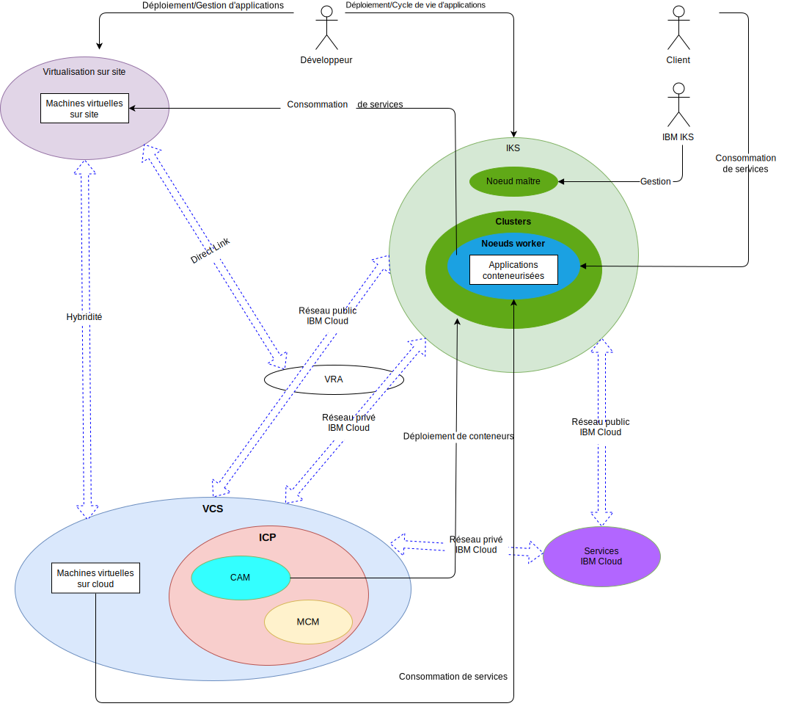

---

copyright:

  years:  2016, 2018

lastupdated: "2018-11-16"

---

# Contexte système

Figure 1. Contexte système

Les composants de base sont les suivants :

- **Virtualisation sur site** – Ce composant est un environnement VMware hébergé dans les locaux du client ou dans un emplacement tiers et qui héberge actuellement les machines virtuelles qui exécutent les applications à moderniser. Environnement source pour les migrations de machine virtuelle, il est couplé de manière lâche à une instance {{site.data.keyword.cloud}} via VMware Hybridity (HCX).
- **vCenter Server** – VMware vCenter Server on {{site.data.keyword.cloud_notm}} est une instance {{site.data.keyword.cloud_notm}} for VMware Services qui est la cible des machines virtuelles migrées à partir de l'environnement local. Associé à l'environnement virtualisé local, il forme un environnement hybride dans lequel les machines virtuelles peuvent passer d'un site à l'autre.
- **{{site.data.keyword.cloud_notm}} Kubernetes Service** - IKS utilise Kubernetes comme solution d'orchestration de conteneur. IBM exploite et gère le noeud maître Kubernetes tandis que les noeuds worker sont déployés sur l'infrastructure gérée par le client. IBM fournit des outils de gestion pour le déploiement de correctifs de système d'exploitation, des mises à jour de moteur Docker et des nouvelles versions Kubernetes. IKS fournit une plateforme isolée et sécurisée de gestion de conteneurs qui est portable, extensible et qui se répare spontanément en cas de basculements.
- **{{site.data.keyword.cloud_notm}} Private** - ICP est une plateforme applicative pour le développement et la gestion d'applications conteneurisées. ICP est un environnement intégré qui inclut l'orchestrateur de conteneurs Kubernetes, un registre d'images privé, une console de gestion, ainsi que des infrastructures préfabriquées de surveillance et une interface graphique à partir de laquelle vous pouvez déployer, gérer, surveiller et mettre à l'échelle des applications de façon centralisée.
- **{{site.data.keyword.cloud_notm}} Automation Manager** – CAM est une plateforme IaC (Infrastructure as Code) prête pour l'entreprise qui permet à partir d'un point unique de mettre à disposition des charges de travail VMware, ainsi que des charges de travail Kubernetes. L'automatisation de la mise à disposition de charge de travail pour des machines virtuelles et des conteneurs, et les prérequis d'infrastructure correspondants sont activés via CAM.
- **IBM Multi Cloud Manager** – MCM fournit la visibilité utilisateur, la gestion orientée applications (règles, déploiements, santé, opérations) et la conformité basée sur les règles sur les clouds et les clusters. MCM vous permet de contrôler vos clusters Kubernetes.
- **{{site.data.keyword.cloud_notm}} Services** – {{site.data.keyword.cloud_notm}} Services englobe une vaste gamme de services consommables, y compris des offres d'analyse, AI et IoT. 

## Acteurs

Tableau 1. Acteurs

Acteur | Description
--|--
Administrateur système | Spécialiste VMware vSphere qui utilise vCenter Server pour gérer la virtualisation sur site et l'instance vCenter Server.
Développeur | Spécialiste en conteneur qui utilise la console IKS (CLI/Kubectl) pour créer et gérer des conteneurs. Il crée les nouveaux services dans le cadre de la modernisation des applications.
Client | Acteur externe qui consomme les services de l'entreprise. Dans le cas d'Acme Skateboards, il s'agit d'un skater qui souhaite acheter du matériel de skate. Un accès Internet sécurisé au catalogue est requis pour le client.
IBM IKS | Ressource IBM qui gère le noeud maître IKS pour le service.

## Systèmes

Tableau 2. Systèmes

Acteur | Description
--|--
vCenter Server | Principale interface utilisée par l'administrateur système pour gérer à la fois les machines virtuelles sur site et les machines virtuelles {{site.data.keyword.cloud_notm}} dans l'instance vCenter Server.
Machines virtuelles sur site| Serveurs virtuels qui hébergent les applications ciblées pour la migration dans {{site.data.keyword.cloud_notm}}. Initialement migrés en tant que machines virtuelles et refactorisés de machines virtuelles en conteneurs pour la modernisation des applications.
Machines virtuelles {{site.data.keyword.cloud_notm}} | Serveurs virtuels qui hébergent les applications migrées depuis le centre de données sur site. Pour cette architecture de référence et Acme Skateboards, l'une des machines virtuelles {{site.data.keyword.cloud_notm}} est un serveur de base de données, qui fait partie de la charge de travail de présence en ligne.
Catalogue de contenu d'entreprise | Emplacement centralisé à partir duquel vous pouvez rechercher et installer des packages dans votre cluster. Le catalogue comporte un certain nombre de packages IBM qui sont utilisés pour créer des conteneurs et pour accéder à des chartes Helm. Helm est un outil qui permet de gérer des chartes Kubernetes. Les chartes sont des packages de ressources Kubernetes préconfigurées qui facilitent la gestion des versions, le conditionnement, la publication, le déploiement, la suppression, la mise à niveau et même l'annulation des déploiements de conteneur. Helm est le système de gestion de package natif Kubernetes et il est utilisé pour la gestion des applications dans un cluster ICP.
Principaux services opérationnels | ICP comprend un certain nombre d'outils permettant de collecter, stocker et analyser des journaux et des métriques. Ces outils fournissent un magasin centralisé pour tous les journaux et toutes les métriques et permettent d'obtenir de meilleures performances et une plus grande stabilité lors de l'accès et de l'analyse des journaux et des métriques.
Console de gestion | La console de gestion ICP vous permet de gérer, surveiller et traiter les incidents liés à vos applications et à votre cluster à partir d'une console de gestion unique, centralisée et sécurisée.
Terraform |  Gère la mise à disposition des ressources de cloud et d'infrastructure qui utilisent des fournisseurs tels que VMware vSphere, {{site.data.keyword.cloud_notm}}, Microsoft Azure, Amazon Web Services, Google Cloud Platform et OpenStack.
HELM | Gestionnaire de package pour Kubernetes. Les chartes Helm sont utilisées pour définir des ressources Kubernetes et déployer des applications.
Chef | Chargé de la gestion des configurations et de l'automatisation de la conformité. Chef déploie et configure les logiciels intermédiaires et les applications une fois que la mise à disposition initiale par Terraform est terminée.
Services | Représente Service Composer, où les administrateurs créent, composent et conçoivent des services qui sont construits à partir de ressources Kubernetes et d'une ou plusieurs machines virtuelles.
Applications conteneurisées | Applications qui ont terminé le parcours de modernisation des applications et qui s'exécutent désormais en tant que conteneurs. Pour cette architecture de référence et Acme Skateboards, l'une des applications conteneurisées est un serveur Web, qui fait partie de la charge de travail de présence en ligne.
Watson |  Pour cette architecture de référence et Acme Skateboards, Watson représente le service d'intelligence artificielle qui est utilisé dans l'architecture "Concept Car". 

La migration, la mise en réseau et la sécurité des applications sont souvent les principales difficultés posées par la modernisation des applications. VMware vCenter Server on {{site.data.keyword.cloud_notm}}, VMware Hybridity, VMware NSX, {{site.data.keyword.cloud_notm}} Private et {{site.data.keyword.cloud_notm}} Kubernetes Service vous permettent de surmonter ces difficultés et de créer des applications modernes qui sont résilientes, sécurisées et robustes. 

### Liens connexes

* [Présentation de vCenter Server on {{site.data.keyword.cloud_notm}} with Hybridity Bundle](../vcs/vcs-hybridity-intro.html)
