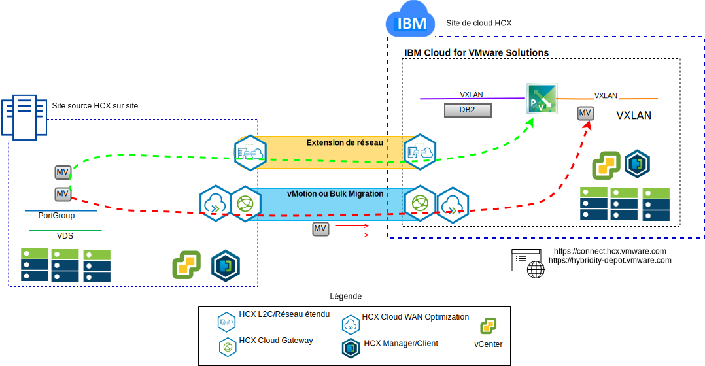

---

copyright:

  years:  2016, 2019

lastupdated: "2019-08-05"

subcollection: vmware-solutions

---

# Cas d'utilisation
{: #vcsiks-usecases}

## Migration de charge de travail vers IBM Cloud
{: #vcsiks-usecases-workload-mig}

L'entreprise Acme Skateboards souhaite étendre de façon transparente son environnement VMware SDDC sur site dans une instance VMware vCenter Server on {{site.data.keyword.cloud}}. Elle doit faire en sorte de rester opérationnelle et de réduire le plus possible ses temps d'indisponibilité. Reconfigurer ses applications pour qu'elles s'exécutent dans le cloud n'est pas une solution optimale.

Le service VMware vCenter Server on {{site.data.keyword.cloud_notm}} with Hybridity Bundle permet la création de connexions ininterrompues entre {{site.data.keyword.cloud_notm}} et un centre de données virtuel VMware sur site.

L'offre vCenter Server with Hybridity Bundle d'{{site.data.keyword.cloud_notm}} permet d'établir des connexions sécurisées entre le site source local homologue et le site cible {{site.data.keyword.cloud_notm}}.

Le service vCenter Server with Hybridity Bundle crée une interconnectivité à couplage lâche entre le site local et {{site.data.keyword.cloud_notm}} et active des fonctionnalités telles que :
- **Interconnectivité simple** – Des connexions de réseau logique sont facilement établies sur n'importe quelle connexion physique, y compris l'internet public, le réseau privé virtuel ou {{site.data.keyword.cloud_notm}} Direct Link.
- **Extension de couche 2** – Les réseaux locaux qui incluent les sous-réseaux et l'adressage IP sont étendus au cloud.
- **Chiffrement** – Le trafic réseau est chiffré entre les sites homologues.
- **Optimisation de réseau** – Sélectionne la meilleure connexion et achemine efficacement la connexion de sorte que le trafic réseau soit déplacé le plus rapidement possible.
- **Dédoublonnage de données** – Jusqu'à 50 % de réduction de trafic réseau peut être réalisé.
- **Routage intelligent** – Lorsqu'une charge de travail est déplacée, le routage de proximité peut modifier le chemin réseau, c'est-à-dire la passerelle, de sorte que le trafic réseau utilise la passerelle de site cible et ne dessine pas une "courbe en épingle à cheveux" vers le site d'origine.
- **Migration sans interruption** – Une machine virtuelle en cours d'exécution peut être déplacée vers (ou depuis) le cloud à l'aide de vMotion.
- **Migration planifiée** – N'importe quel nombre de machines virtuelles peut être répliqué vers le site de destination, puis activé sur ce site à une heure précise afin de remplacer les systèmes qui s'exécutent sur le site d'origine.
- **Migration de règles de sécurité** – Si NSX est utilisé sur site, toutes les règles de sécurité, tous les pare-feu, etc. sont déplacés en même temps que la charge de travail.

Grâce à cette solution, Acme Skateboards a pu faire migrer ses charges de travail VMware locales vers {{site.data.keyword.cloud_notm}} tout en respectant ses deux exigences, à savoir réduire le plus possible ses temps d'indisponibilité et ne pas avoir à reconfigurer les applications.

## Déploiement d'architecture hybride
{: #vcsiks-usecases-hybrid-archi-deployment}

L'entreprise Acme Skateboards souhaite déployer une architecture hybride sur {{site.data.keyword.cloud_notm}} composée de vCenter et d'{{site.data.keyword.icpfull_notm}}, pour son parcours vers la modernisation de ses applications. Ses exigences sont les suivantes : exécuter ses bases de données sur des machines virtuelles, les applications et les services Web dans des conteneurs, et utiliser un jeu commun d'outils pour la gestion du réseau et de la sécurité.

{{site.data.keyword.vmwaresolutions_short}} fournit l'automatisation du déploiement des composants de technologie VMware dans les {{site.data.keyword.CloudDataCents_notm}} situés dans le monde entier. L'architecture est composée d'une région de cloud et a la capacité de s'étendre dans d'autres régions de cloud situées dans une autre zone géographique ou dans un autre pod {{site.data.keyword.cloud_notm}} au sein du même centre de données.

Les produits {{site.data.keyword.icpfull_notm}} et Cloud Automation Manager (CAM) sont déployés manuellement dans votre plateforme de virtualisation sur site, permettant ainsi la gestion du cloud à partir des emplacements locaux. Sinon, {{site.data.keyword.icpfull_notm}} et CAM sont offerts en tant qu'extension de service à un déploiement vCenter nouveau ou existant, via l'automatisation, permettant ainsi la gestion du cloud à partir d'{{site.data.keyword.cloud_notm}}.

Le diagramme ci-dessous représente {{site.data.keyword.icpfull_notm}} s'exécutant par dessus une instance vCenter Server. NSX-V est configuré avec un commutateur/réseau VXLAN dédié, un routeur DLR et une passerelle ESG pour le réseau dissocié {{site.data.keyword.icpfull_notm}}, le routage est configuré via la passerelle ESG pour accéder au réseau sous-jacent.

A l'aide de l'automatisation {{site.data.keyword.cloud_notm}}, l'entreprise Acme Skateboards peut mettre à disposition une solution hybride comprenant VMware on {{site.data.keyword.cloud_notm}} afin d'exécuter ses machines virtuelles de base de données et {{site.data.keyword.icpfull_notm}} sur VMware on {{site.data.keyword.cloud_notm}} et pour exécuter ses applications et des services Web frontaux dans des conteneurs. NSX lui fournit un jeu commun d'outils de gestion du réseau et de la sécurité dans le réseau dissocié.
