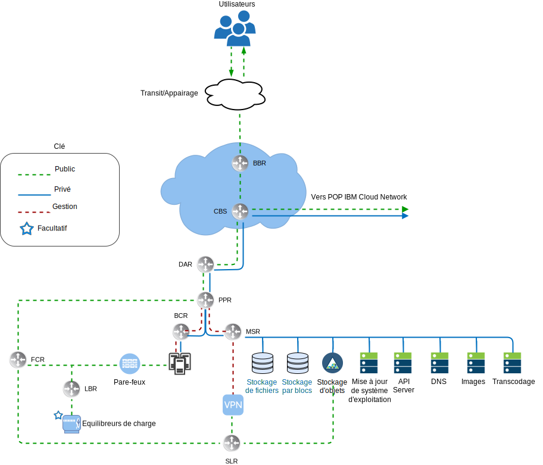
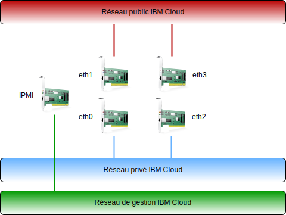

---

copyright:

  years:  2016, 2019

lastupdated: "2019-01-23"

---

# Présentation de la mise en réseau IBM Cloud

{{site.data.keyword.cloud}} gère la mise en réseau physique. Les informations ci-après décrivent le réseau physique qui est fourni par {{site.data.keyword.cloud_notm}} et les connexions hôte physiques (VLAN, MTU) qui sont associées aux hôtes physiques décrits précédemment.

Le réseau physique d'{{site.data.keyword.cloud_notm}} est divisé en trois réseaux distincts : public, privé et gestion.

Figure 1. Vue de réseau de haut niveau pour {{site.data.keyword.cloud_notm}}

## Réseau public

{{site.data.keyword.CloudDataCents_notm}} et les points de présence (PoP) sont dotés de plusieurs connexions 1 Gbps ou 10 Gbps aux opérateurs réseau d'appairage et de transit de premier plan. Le trafic réseau depuis n'importe où dans le monde se connecte au PoP de réseau le plus proche et transite directement par le réseau vers son centre de données, réduisant ainsi le nombre de segments réseau et de relais entre les fournisseurs. Au sein du centre de données, 1 Gbps ou 10 Gbps de bande passante sont fournis à des serveurs individuels via une paire de commutateurs client frontaux distincts homologues. Ces commutateurs agrégés sont connectés à une paire de routeurs distincts, à savoir des routeurs FCR (Front-end Customer Router), pour la mise en réseau L3. Cette conception multiniveau permet la mise à l'échelle du réseau dans des armoires, des lignes et des pods au sein d'un {{site.data.keyword.CloudDataCent_notm}}.

## Réseau privé

Tous les {{site.data.keyword.CloudDataCents_notm}} et PoP sont connectés par le réseau principal privé. Le réseau privé est distinct du réseau public et il permet la connectivité aux services dans des {{site.data.keyword.CloudDataCents_notm}} situés dans le monde entier. Le transfert de données entre des centres de données est effectué en utilisant plusieurs connexions 10 Gbps ou 40 Gbps au réseau privé. Similaire au réseau public, le réseau privé est multiniveau, ce qui signifie que les serveurs et les autres infrastructures sont connectés aux commutateurs BCS (Back-end Customer Switch) agrégés. Ces commutateurs agrégés sont connectés à une paire de routeurs distincts, à savoir des routeurs BCR (Back-end Customer Router), pour la mise en réseau L3. Le réseau privé prend également en charge l'utilisation de trames jumbo (MTU 9000) pour des connexions hôte physiques.

## Réseau de gestion

Outre les réseaux publics et privés, chaque serveur {{site.data.keyword.cloud_notm}} est connecté à un serveur de gestion externe. Ce réseau de gestion, accessible via VPN, permet un accès IPMI (Intelligent Platform Management Interface) au serveur quels que soient son unité centrale, son microprogramme et son système d'exploitation, à des fins de maintenance et d'administration.

## Blocs d'adresses IP principales et portables

{{site.data.keyword.cloud_notm}} alloue deux types d'adresses IP à utiliser dans l'infrastructure {{site.data.keyword.cloud_notm}} :
* Les adresses IP principales sont affectées aux unités, aux serveurs bare metal et aux serveurs virtuels qui sont mis à disposition par {{site.data.keyword.cloud_notm}}. Les utilisateurs ne doivent pas affecter d'adresses IP dans ces blocs.
* Des adresses IP portables sont fournies à l'utilisateur et il peut les affecter et les gérer en fonction de ses besoins.

Les adresses IP principales ou portables peuvent devenir routables vers n'importe quel VLAN au sein du compte client si le spanning VLAN est activé dans le compte ou que le compte est configuré en tant que compte VRF.

## Spanning VLAN

Le paramètre Spanning VLAN est un paramètre de compte global {{site.data.keyword.cloud_notm}} qui permet à chacun des blocs d'adresses IP de sous-réseau portable et principal de tous les VLAN du compte d'être routables entre eux. Lorsque ce paramètre est indisponible, les blocs d'adresses IP peuvent tout de même être routés vers les services {{site.data.keyword.cloud_notm}}, mais pas entre eux. Cette architecture requiert que le paramètre Spanning VLAN soit activé dans le compte où VMware vCenter Server on {site.data.keyword.cloud_notm}} est déployé de sorte que les connexions soient établies en toute transparence sur les différents sous-réseaux sur lesquels résident les composants de solution.

## Virtual Routing and Forwarding (VRF)

Les comptes {{site.data.keyword.cloud_notm}} peuvent également être configurés en tant que comptes VRF. Un compte VRF permet de fournir des fonctionnalités similaires au spanning VLAN et ainsi d'activer le routage automatique entre les blocs d'adresses IP de sous-réseau. Tous les comptes dotés de connexions Direct Link doivent être convertis en ou créés en tant que compte VRF.

## Connexions d'hôte physique

Chaque hôte physique de la conception possède deux paires redondantes de connexions Ethernet 10 Gbps dans chaque commutateur {{site.data.keyword.cloud_notm}} de niveau supérieur (ToR) (public et privé). Les adaptateurs sont configurés comme des connexions individuelles (non liées) pour un total de 4 connexions 10 Gbps. Cela permet à chacune des connexions NIC de mise en réseau de fonctionner indépendamment des autres.

Figure 2. Connexions hôte physiques

## Réseaux locaux virtuels

Les offres VMware on {{site.data.keyword.cloud_notm}} sont conçues avec trois réseaux locaux virtuels( un public et deux privés) affectés lors du déploiement. Le réseau local virtuel public est affecté à eth1 et eth3 et les connexions privées sont affectées à eth0 et eth2. Il convient de noter que le réseau public et le premier réseau local virtuel privé créés et affectés à cette conception ne sont pas balisés par défaut. Plus tard, le réseau local virtuel privé supplémentaire est joint sur les ports de commutation physique et balisé dans les groupes de ports VMware qui utilisent ces sous-réseaux.

Comme indiqué précédemment, le réseau privé est composé de deux réseaux locaux virtuels dans cette conception. Trois sous-réseaux sont alloués au premier de ces réseaux locaux virtuels (appelé ici VLAN privé A). Le premier est une plage de sous-réseaux d'adresses IP privées principales affectées par {{site.data.keyword.cloud_notm}} aux hôtes physiques. Le deuxième sous-réseau est utilisé pour les machines virtuelles de gestion, telles que vCenter Server Appliance et Platform Services Controller. Le troisième sous-réseau est utilisé pour les VTEP (VXLAN Tunnel Endpoint) affectés à chaque hôte à l'aide de NSX Manager.

Outre VLAN privé A, il existe un deuxième réseau local virtuel (appelé ici VLAN privé B) permettant la prise en charge de fonctions VMware, telles que vSAN et vMotion, ainsi que la connectivité au stockage NAS. En tant que tel, le réseau local virtuel est divisé en deux ou trois sous-réseaux portables. Le premier sous-réseau est affecté à un groupe de ports de noyau pour le trafic vMotion. Le ou les sous-réseaux restants sont utilisés pour le trafic de stockage et lorsque vSAN est utilisé, un sous-réseau est affecté aux groupes de ports de noyau qui sont utilisés pour le trafic vSAN. Lorsque NAS est utilisé, un sous-réseau est affecté au groupe de ports qui est dédié au trafic NFS. Tous les sous-réseaux configurés dans le cadre d'un déploiement vCenter Server automatisé utilisent des plages gérées par {{site.data.keyword.cloud_notm}}. Cela garantit que toutes les adresses IP peuvent être routées vers n'importe quel centre de données dans le compte {{site.data.keyword.cloud_notm}} utilisé lorsque vous en avez besoin que ce soit immédiatement ou ultérieurement.

Tableau 1. Récapitulatif VLAN et sous-réseau

VLAN 	|Type de sous-réseau 	|Description
---|---|---
Public 	|Principal 	|Affecté à des hôtes physiques pour l'accès au réseau public. Non utilisé lors du déploiement initial.
Public	|Portable 	|Affecté pour l'utilisation des liaisons montantes et de la conversion NAT sur customer-nsx-esg.
Public	|Portable 	|Affecté pour l'utilisation des liaisons montantes et de la conversion NAT sur mgmt-nsx-esg.
Public	|Portable 	|Affecté pour l'utilisation des liaisons montantes et de la conversion NAT sur hcx-mgmt-esg, si Hybridity Bundle est sélectionné.
Privé A 	|Principal 	  |Affecté aux hôtes physiques affectés par {{site.data.keyword.cloud_notm}}. Utilisé par l'interface de gestion pour le trafic de gestion vSphere.
Privé A 	|Portable 	|Affecté aux machines virtuelles qui fonctionnent en tant que composants de gestion.
Privé A 	|Portable 	|Affecté aux VTEP NSX.
Privé A 	|Portable 	|Affecté à HCX pour un usage interne, si Hybridity Bundle est sélectionné.
Privé A 	|Portable 	|Affecté pour l'utilisation des liaisons montantes sur customer-nsx-esg.
Privé A 	|Portable 	|Affecté à HCX, si Hybridity Bundle est sélectionné.
Privé B	  |Principal	  |Non utilisé lors du déploiement initial.
Privé B 	|Portable 	|Affecté pour vSAN s'il est utilisé.
Privé B 	|Portable 	|Affecté pour NAS s'il est utilisé.
Privé B 	|Portable 	|Affecté pour vMotion.

Cette conception est implémentée avec des hôtes physiques et des instances de serveur virtuel sur des VLAN et configurée pour pointer vers le routeur {{site.data.keyword.cloud_notm}} BCR (routeur client "réseau privé" de back end) comme route par défaut. Tandis que les instances vCenter Server permettent d'utiliser la mise en réseau définie par les logiciels. Les réseaux dissociés créés par NSX incluant le routage vers les sous-réseaux VLAN ne sont pas connus des routeurs gérés par {{site.data.keyword.cloud_notm}}, par conséquent, vous devrez peut-être créer des routes statiques, des règles de pare-feu et des règles NAT pour gérer correctement les flots réseau.

Les connexions de réseau privé sont configurées pour utiliser 9000 comme taille MTU de trame jumbo afin d'améliorer les performances des transferts d'importantes quantités de données, comme le stockage et vMotion. Il s'agit de la taille MTU maximale autorisée au sein de VMware et par {{site.data.keyword.cloud_notm}}. Les connexions de réseau public utilisent 1500 comme taille MTU Ethernet standard. Cette valeur doit être conservée ; tout changement peut provoquer une fragmentation des paquets sur Internet.

### Liens connexes

* [Présentation de vCenter Server on {{site.data.keyword.cloud_notm}} with Hybridity Bundle](/docs/services/vmwaresolutions/archiref/vcs/vcs-hybridity-intro.html)
