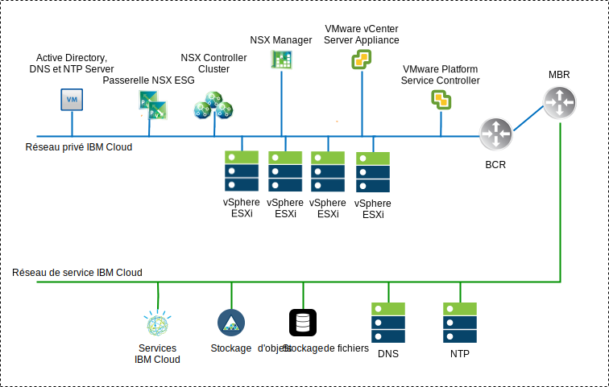
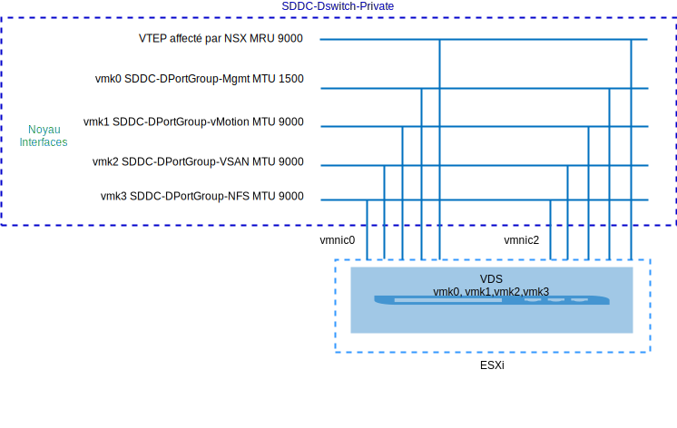
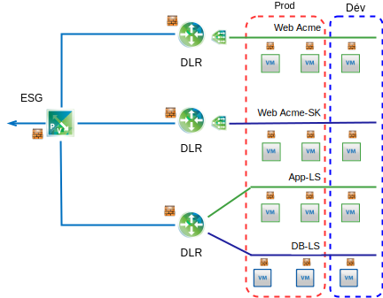

---

copyright:

  years:  2016, 2019

lastupdated: "2019-05-28"

subcollection: vmware-solutions

---

# Présentation de NSX-V
{: #vcsnsxt-overview-ic4vnsxv}

La virtualisation de réseau fournit un réseau dissocié qui existe dans la couche virtuelle. NSX-V offre à l'architecture des fonctions telles que la mise à disposition, le déploiement, la reconfiguration et la destruction rapides de réseaux virtuels à la demande. Cette conception utilise le commutateur vDS et VMware NSX for vSphere pour implémenter la mise en réseau virtuelle.

Dans cette conception, NSX Manager est déployé sur le cluster initial. NSX Manager se voit affecter une adresse IP VLAN provenant du bloc d'adresses portables privées qui est conçu pour les composants de gestion. En outre, il est configuré avec les serveurs DNS et NTP présentés précédemment.

Tableau 1. Spécifications du dispositif virtuel NSX-V Manager

Attribut | Spécification
---|---
NSX Manager | Dispositif virtuel
Nombre d'unités centrales virtuelles | 4
Mémoire | 16 Go
Disque | 60 Go sur le partage NFS de gestion
Type de disque | A allocation dynamique
Réseau | Sous-réseau portable **Privé A** conçu pour les composants de gestion

La vue d'ensemble de réseau NSX-V Manager présentée ci-dessous illustre l'emplacement de NSX Manager par rapport aux autres composants dans cette architecture.

Après le déploiement initial, l'automatisation {{site.data.keyword.cloud}} déploie trois contrôleurs NSX dans le cluster initial. Les contrôleurs se voient affecter une adresse IP provenant du sous-réseau portable **privé A** destiné aux composants de gestion. Les règles d'anti-affinité MV–MV sont créées de telle sorte que les contrôleurs soient répartis parmi les hôtes du cluster. Le cluster initial doit être déployé avec un minimum de trois noeuds pour garantir la haute disponibilité des contrôleurs.

Outre les contrôleurs, l'automatisation {{site.data.keyword.cloud_notm}} prépare les hôtes vSphere déployés avec NSX VIBS pour permettre l'utilisation d'un réseau virtuel via des point d'extrémité de tunnel VXLAN (VTEP). Les VTEP se voient affecter des adresses IP provenant de la plage d'adresses IP du sous-réseau portable **Privé A** qui est spécifié pour les VTEP. Le trafic VXLAN réside sur le réseau local virtuel non balisé et est affecté au commutateur vDS privé. Par la suite, un pool d'ID de segment est affecté et les hôtes du cluster sont ajoutés à la zone de transfert. Seul unicast est utilisé dans la zone de transfert car la surveillance IGMP n'est pas configurée dans {{site.data.keyword.cloud_notm}}.

Des paires de passerelles NSX ESG (Edge Services Gateway) sont ensuite déployées. Pour tous les déploiements, une paire de passerelles est utilisée pour le trafic sortant des composants d'automatisation qui résident sur le réseau privé. Les instances VMware vCenter Server on {{site.data.keyword.cloud_notm}} incluent une seconde passerelle, appelée serveur de périphérie géré par le client, qui est déployée et configurée avec une liaison montante au réseau public et une interface qui est affectée au réseau privé. Les composants NSX requis, tels que les routeurs DLR (Distributed Logical Router), les commutateurs logiques et les pare-feux peuvent être configurés par l'administrateur.

## Conception de commutateur distribué
{: #vcsnsxt-overview-ic4vnsxv-distributed-switch}

La conception utilise un nombre minimal de commutateurs vDS. Les hôtes du cluster sont connectés aux réseaux public et privé. Ils sont configurés avec deux commutateurs distribués virtuels. L'utilisation de deux commutateurs est conforme à la séparation de réseau physique des réseaux public et privé qui sont implémentés dans {{site.data.keyword.cloud_notm}}.

Au total, deux commutateurs distribués sont configurés. Le premier est utilisé pour la connectivité de réseau public (SDDC-Dswitch-Public) et le second est utilisé pour la connectivité de réseau privé (SDDC-Dswitch-Private).
La séparation des différents types de trafic est nécessaire pour réduire les conflits et les temps d'attente. Des réseaux séparés sont également requis pour la sécurité des accès. Les VLAN sont utilisés pour segmenter les fonctions de réseau physique. Cette conception utilise trois VLAN. Deux sont utilisés pour le trafic de réseau privé et le troisième est utilisé pour le trafic de réseau public.

Tableau 2. Mappage de trafic VLAN

VLAN |Désignation |Type de trafic
---|---|---
VLAN1 | Public | Disponible pour l'accès Internet
VLAN2 | Privé A | Gestion ESXi, gestion, VXLAN (VTEP)
VLAN3 | Privé B | vSAN, NFS, vMotion

Le trafic issu des charges de travail transite sur des commutateurs logiques NSX. Le cluster vSphere utilise deux commutateurs distribués vSphere (vDS) pour le cluster convergé.

Tableau 3. Commutateurs distribués de cluster convergé

Nom de commutateur distribué vSphere |Fonction |Contrôle d'E-S de réseau |Mode d'équilibrage de charge |Ports NIC physiques |MTU
---|---|---|---|---|---
SDDC-Dswitch-Private | Gestion ESXi SAN virtuel vSphere vMotion VXLAN Tunnel Endpoint (VTEP) NFS | Activé | Route basée sur le basculement explicite (vSAN, vMotion) Port virtuel d'origine (tout le reste) | 2 | 9 000 (trames Jumbo)
SDDC-Dswitch-Public | Trafic de gestion externe (Nord-Sud) | Activé |Route basée sur le port virtuel d'origine | 2 | 1 500 (par défaut)

Tableau 4. Groupage de ports de commutation distribuée et configuration du basculement

Paramètre | Paramètre
---|---
Equilibrage de charge | Route basée sur le port virtuel d'origine \*
Détection de basculement | Statut de liaison uniquement
Commutateurs de notification | Activé
Reprise par restauration | Activé
Commande de basculement | Liaisons montantes actives : Uplink1, Uplink2 \*

\* Le groupe de ports vSAN utilise le basculement explicite actif ou en veille car il ne prend pas en charge l'équilibrage de charge du trafic de stockage vSAN.
{:note}

Tableau 5. Groupes de ports de commutation virtuelle de cluster, VLAN et règle de groupage

Commutateur vDS (vSphere Distributed Switch)	|Nom de groupe de ports	|Groupage	|Liaisons montantes	|ID VLAN
---|---|---|---|---
SDDC-Dswitch-Private	|SDDC-DPortGroup-Mgmt	|Port virtuel d'origine	|Actives : 0, 1	|VLAN1
SDDC-Dswitch-Private	|SDDC-DPortGroup-vMotion	|Port virtuel d'origine	|Actives : 0, 1	|VLAN2
SDDC-Dswitch-Private	|SDDC-DPortGroup-VSAN	|Basculement explicite	|Actives : 0 En veille : 1	|VLAN2
SDDC-Dswitch-Private	|SDDC-DPortGroup-NFS	|Port virtuel d'origine	|Actives : 0, 1	|VLAN2
SDDC-Dswitch-Private	|Généré automatiquement par NSX	|Port virtuel d'origine	|Actives : 0, 1	|VLAN1
SDDC-Dswitch-Public	  |SDDC-DPortGroup-External	|Port virtuel d'origine	|Actives : 0, 1	|VLAN3

## NSX-V
{: #vcsnsxt-overview-ic4vnsxv-nsx-v}

Cette conception spécifie la configuration des composants NSX mais n'applique aucune configuration de réseau dissocié. Il appartient au client de concevoir le réseau dissocié en fonction de ses besoins.

Les composants suivants sont configurés :
-	Les serveurs et contrôleurs de gestion sont installés et intégrés dans l'interface utilisateur Web vCenter.
-	Les agents ESXi sont installés et des adresses IP VTEP sont configurées par hôte ESXi.
-	Configuration VTEP, configuration de contrôleur et configuration VXLAN (zone de transfert).
-	Dispositifs NSX Edge Services Gateway (ESG) destinés à être utilisés par les composants de gestion.
-	Pour vCenter Server uniquement, dispositifs ESG (NSX Edge Services Gateway) pour une utilisation par les clients.

Les composants suivants ne sont pas configurés :
- Routeurs distribués virtuels
- Micro segmentation
- Réseaux VXLAN
- Gestion NSX liée à d'autres instances VMware

### Sécurité NSX-V
{: #vcsnsxt-overview-ic4vnsxv-nsx-v-security}

NSX for vSphere permet aux organisations de diviser le centre de données en segments de sécurité distincts, jusqu'au niveau de la charge de travail individuelle, indépendamment de l'emplacement de l'exécution de celle-ci. Les équipes informatiques peuvent définir des règles pour chaque charge de travail en fonction du contexte d'utilisateur et du contexte d'application, pour une réponse immédiate aux menaces qui pèsent dans le centre de données et une mise en application au niveau des applications.

Les principaux composants NSX sont les suivants :
- Le pare-feu avec état distribué NSX est intégré dans le noyau de l'hyperviseur pour une capacité de pare-feu maximale de 20 Gbps par hôte hyperviseur. Fournit une capacité de pare-feu nord-sud via NSX Edge.
- NSX permet la création de groupes de sécurité dynamiques et de règles associées pour plus d'une adresse IP et MAC. Ces règles incluent les objets et les balises vCenter, le type de système d'exploitation et les informations d'application de couche 7 afin d'activer la micro-segmentation en fonction du contexte de l'application.
- La règle basée sur l'identité qui utilise les informations de connexion à partir des machines virtuelles, Active Directory et l'intégration Mobile Device Management permet de mettre en place une sécurité basée sur l'utilisateur, y compris une sécurité de niveau session dans les environnements de poste de travail virtuel et distants.
- Les fonctions Application Rule Manager et Endpoint Monitoring activent une visualisation du flux du trafic réseau de bout en bout jusqu'à la couche 7, permettant ainsi aux équipes d'application d'identifier les points finaux dans et entre les centres de données et d'apporter des réponses en créant les règles de sécurité appropriées.
- Prise en charge de l'intégration de la gestion, du plan de contrôle et du plan de données à des fournisseurs tiers, par exemple, des pare-feux de la génération suivante, IDS/IPS, des anti-virus sans agent, la commutation, la sécurité avancée, etc.

Le diagramme de haut niveau illustré ci-après montre comment implémenter certaines des fonctions de micro-segmentation de NSX-V en créant des groupes de sécurité. Dans cet exemple, production et développement sont les groupes de sécurité et des règles de sécurité sont affectées en fonction de ces groupes.

## Liens connexes
{: #vcsnsxt-overview-ic4vnsxv-related}

* [Présentation de vCenter Server on {{site.data.keyword.cloud_notm}} with Hybridity Bundle](/docs/services/vmwaresolutions/archiref/vcs?topic=vmware-solutions-vcs-hybridity-intro)
