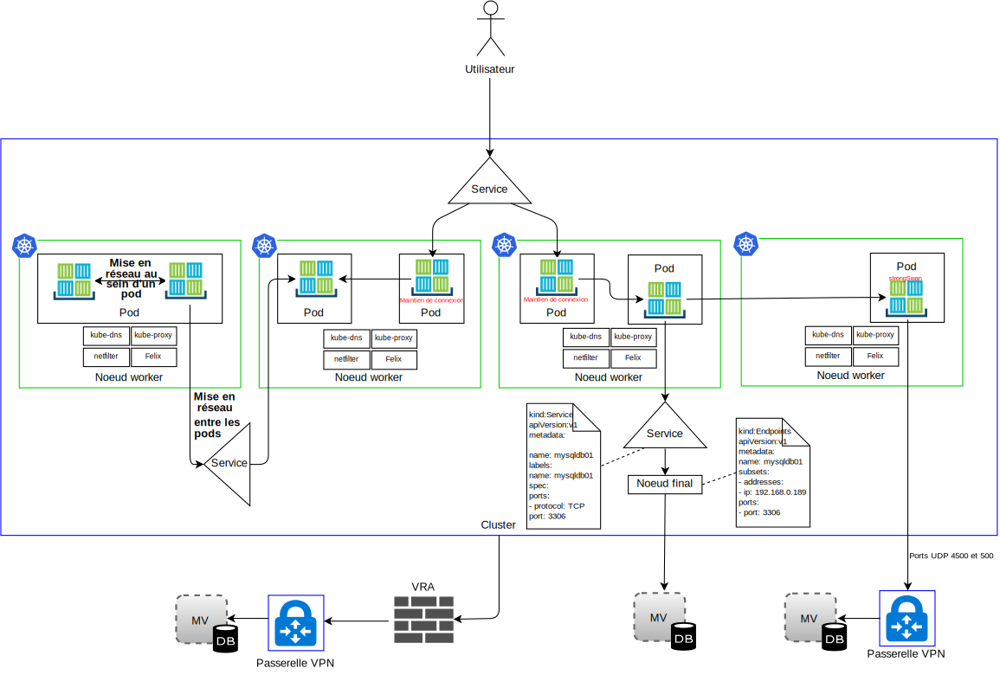
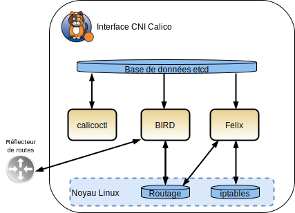

---

copyright:

  years:  2016, 2019

lastupdated: "2019-05-08"

subcollection: vmware-solutions

---

# IBM Cloud Kubernetes Service
{: #vcsnsxt-overview-iks}

## Présentation d'IBM Cloud Kubernetes Service
{: #vcsnsxt-overview-iks-ovw}

{{site.data.keyword.containerlong_notm}} fournit une plateforme isolée et sécurisée de gestion de conteneurs. Cette plateforme est portable, extensible et se répare spontanément en cas de basculement.

L'architecture est composée des principaux composants suivants :
-	**Compte {{site.data.keyword.cloud}}** – Des noeuds worker sont déployés dans un compte {{site.data.keyword.cloud_notm}}. Le noeud maître est déployé dans un compte cloud central qui est géré par IBM.
-	**Cluster** - Un cluster Kubernetes est constitué d'un ou de plusieurs noeuds worker.
-	**Noeuds worker** – Un noeud worker est une instance de serveur virtuel ou bare metal qui est hébergée dans un compte IBM. Lorsque vous mettez à disposition un noeud worker, vous déterminez les ressources disponibles dans les conteneurs qui sont hébergés sur ce noeud worker. Les noeuds worker comportent un moteur Docker géré par IBM, des ressources de calcul distinctes, la mise en réseau et un services de volumes de stockage.
-	**Noeud maître** - Les noeuds worker sont gérés par un noeud maître Kubernetes qui contrôle et surveille de manière centralisée toutes les ressources Kubernetes du cluster. Ce noeud maître est géré par IBM.

Les concepts qui s'appliquent à {{site.data.keyword.containerlong_notm}} sont les suivants :
-	**Service** - Un service est une ressource Kubernetes qui regroupe un ensemble de pods et fournit la connectivité du réseau à ces pods sans afficher l'adresse IP privée réelle de chaque pod. Vous pouvez utiliser un service pour rendre votre application accessible dans votre cluster ou sur l'Internet public.
-	**Déploiement** - Un déploiement est une ressource Kubernetes dans laquelle vous pouvez spécifier des informations sur d'autres ressources ou fonctionnalités qui sont requises pour exécuter votre application, par exemple, les services, le stockage de persistance ou les annotations. Vous documentez un déploiement dans un fichier de configuration YAML que vous appliquez au cluster. Le maître Kubernetes configure les ressources et déploie des conteneurs dans des pods sur les noeuds worker avec la capacité disponible. Définissez des stratégies de mise à jour de votre application, notamment le nombre de pods que vous voulez ajouter lors d'une mise à jour en continu et le nombre de pods pouvant être désactivés à un moment donné. Lorsque vous effectuez une mise à jour en continu, le déploiement vérifie si la mise à jour fonctionne et l'arrête si des échecs sont détectés.
-	**Pod** - Chaque application présente dans un cluster est déployée, exécutée et gérée par une ressource Kubernetes que l'on appelle un pod. Les pods sont de petites unités déployables dans un cluster Kubernetes et servent à regrouper des conteneurs devant être traités comme une seule unité. Dans la plupart des cas, chaque conteneur est déployé sur son propre pod. Une application peut nécessiter un conteneur et d'autres conteneurs d'aide programmable qui doivent être déployés dans un pod de sorte que ces conteneurs soient adressables à l'aide de la même adresse IP privée.
-	**Application** - Une application peut faire référence à une application complète ou à un composant d'une application. Vous pourriez déployer des composants d'une application dans des pods distincts ou des noeuds worker distincts.

Kubernetes n'impose aucune solution de mise en réseau spécifique.

Le modèle de réseau Kubernetes stipule trois exigences fondamentales :
* Les conteneurs peuvent communiquer avec tous les autres conteneurs sans conversion NAT
* Les noeuds peuvent communiquer avec tous les autres conteneurs (et inversement) sans conversion NAT
* L'adresse IP vue par un conteneur est la même que celle vue par les autres conteneurs.

### Espaces de nom
{: #vcsnsxt-overview-iks-namespaces}

Les espaces de nom sont un aspect fondamental de la mise en réseau de conteneur. Il s'agit d'une fonction du noyau Linux qui partitionne des ressources de noyau de telle façon qu'un ensemble de processus voit un ensemble de ressources tandis qu'un autre ensemble de processus voir un autre ensemble de ressources. Les ressources sont notamment des points de montage, des ID de processus, une pile réseau, IPC et des ID utilisateur. Chaque espace de nom possède un ensemble privé d'adresses IP, sa propre table de routage, sa propre liste de sockets, sa propre table de suivi des connexions, son propre pare-feu et d'autres ressources réseau.

### Interface CNI (Container Network Interface)
{: #vcsnsxt-overview-iks-container-network-interfaces}

Kubernetes utilise l'interface CNI (Container Network Interface) comme solution de mise en réseau orientée plug-in. Elle comprend une spécification et des bibliothèques permettant d'écrire des plug-in pour configurer des interfaces réseau dans des conteneurs Linux. La spécification CNI est simple car elle ne concerne que la connectivité réseau des conteneurs, ainsi que la récupération de place pour les ressources une fois que les conteneurs sont supprimés.

Il existe deux définitions centrales dans le contexte de CNI dans Kubernetes :
- **Pod** - Synonyme d'un espace de nom de réseau Linux. L'unité de planification dans Kubernetes est un pod. Il s'agit essentiellement d'un ensemble fortement couplé d'un ou de plusieurs conteneurs qui sont toujours colocalisés (planifiés sur un noeud en tant qu'unité). Un pod ne peut être réparti sur plusieurs noeuds worker.
- **Réseau** - Groupe d'entités avec des adresses uniques qui peuvent communiquer entre elles. Ces entités peuvent être un conteneur individuel, une machine, ou un autre périphérique réseau, tel qu'un routeur.

Pour que l'interface CNI puisse ajouter un conteneur à un réseau, le contexte d'exécution de conteneur doit d'abord créer un nouvel espace de nom de réseau pour le conteneur, puis démarrer un ou plusieurs des plug-in définis. La configuration de réseau est au format JSON et inclut des zones obligatoires telles que le nom, le type, ainsi que des zones spécifiques au type de plug-in. Un plug-in CNI est censé affecter une adresse IP à l'interface et configurer des routes de réseau pertinentes. {{site.data.keyword.containerlong_notm}} utilise Calico comme plug-in de réseau pour l'interface CNI. Calico affecte à chaque charge de travail une adresse IP. Dans {{site.data.keyword.containerlong_notm}}, Calico utilise la tunnellisation IP-in-IP de sorte que les adresses IP de réseau de conteneur sont masquées à partir du réseau {{site.data.keyword.cloud_notm}}.

Nous distinguons quatre types de trafic réseau dans {{site.data.keyword.containerlong_notm}}, comme illustré dans le diagramme ci-après.

- **Mise en réseau au sein d'un pod** – On parle également de communications de conteneur à conteneur. Tous les conteneurs contenus dans un pod partagent un espace de nom de réseau, la même adresse IP et peuvent se voir sur le système hôte local. Le trafic pour chaque application se distingue par un numéro de port spécifique. Le développeur doit s'assurer que les conteneurs au sein d'un pod ne sont pas en conflit par rapport aux ports utilisés. Au sein d'un pod, il existe un conteneur d'infrastructure. Premier conteneur lancé par kubelet, il acquiert l'adresse IP du pod et configure l'espace de nom de réseau. Ensuite, tous les autres conteneurs du pod rejoignent le réseau et l'espace de nom IPC du conteneur d'infrastructure. Le mode de pont de réseau est activé pour le conteneur et tous les autres conteneurs du pod rejoignent cet espace de nom via le mode de conteneur. Si le conteneur d'infrastructure s'arrête, kubelet arrête tous les autres conteneurs du pod, puis effectue une nouvelle mise à disposition, généralement avec une nouvelle adresse IP. Nous ne communiquerons pas d'autres détails sur ce flux de circulation dans ce document.

- **Mise en réseau entre les pods** – On parle également de communications de pod à pod. Il existe trois types de trafic Est-Ouest :
  - Les pods peuvent communiquer directement avec d'autres pods sur le même sous-réseau. Dans {{site.data.keyword.containerlong_notm}}, chaque pod possède une adresse IP qui est affectée à partir d'une plage fournie par {{site.data.keyword.containerlong_notm}}. Chaque noeud worker se voit affecter un sous-réseau lors de la mise à disposition. La communication de pod à pod sans proxy, tunnellisation ou NAT se produit alors que les pods se trouvent dans le même sous-réseau et le même hôte.
  - Les pods peuvent communiquer directement avec d'autres pods sur différents sous-réseaux. L'encapsulation IP-in-IP est configurée automatiquement dans {{site.data.keyword.containerlong_notm}} pour encapsuler uniquement les paquets qui transitent par des sous-réseaux. Cette encapsulation masque l'espace d'adresse de réseau de pod à partir du réseau {{site.data.keyword.cloud_notm}}. L'encapsulation utilise l'adresse IP à partir du sous-réseau privé principal d'{{site.data.keyword.cloud_notm}}.
  - Les pods peuvent utiliser des services pour communiquer avec d'autres pods, appelés communications de pod à service. Toutefois, les pods peuvent communiquer directement avec d'autres pods car les deux points situés au-dessus des pods sont mortels. Ils sont nés et lorsqu'ils meurent, ils ne sont pas ressuscités. Des jeux de répliques créent et détruisent des pods dynamiquement par exemple, lors de l'extension ou de la réduction. Bien que chaque pod possède sa propre adresse IP, la fiabilité de ces adresses IP au fil du temps n'est pas garantie. Les développeurs préfèrent utiliser une construction de service pour la communication, dans laquelle une adresse IP virtuelle est utilisée et peut être découverte via DNS.

- **Ingress** - Fait référence au routage de trafic entre des utilisateurs externes ou des applications et des pods. Un service fournit une adresse IP virtuelle stable (vIP) pour un ensemble de pods. Même si les pods sont éphémères, les services permettent aux clients de découvrir et de se connecter aux conteneurs qui s'exécutent dans les pods à l'aide de l'adresse IP virtuelle, et ce de façon fiable. Cette adresse IP virtuelle n'est pas une adresse IP réelle connectée à une interface réseau. Elle vise uniquement à agir en tant que noeud final stable pour acheminer le trafic vers un ou plusieurs pods. Accéder à un pod depuis l'extérieur du cluster est un peu plus compliqué. Kubernetes s'attache a fournir un équilibrage de charge hautes performances à haute disponibilité pour les services.
Il existe trois options pour le trafic Nord-Sud dans {{site.data.keyword.containerlong_notm}} :

  - **NodePort** - Le service NodePort est jugé approprié pour les tests ou si vous avez besoin d'un accès public ou privé uniquement pendant une courte période. Un service NodePort ouvre un port sur un noeud worker via à la fois l'adresse IP privée et l'adresse IP publique du noeud worker. Vous devez utiliser une règle réseau Calico preDNAT pour bloquer le réseau public ou privé. Les adresses IP publique et privée du noeud worker ne sont pas permanentes.
  - **LoadBalancer** - Les adresses IP publique et privée portables qui sont affectées à l'équilibreur de charge sont permanentes et ne changent pas lorsqu'un noeud worker est recréé dans le cluster. Vous pouvez personnaliser votre équilibreur de charge en exposant n'importe quel port dont votre application a besoin. Un service d'équilibreur de charge avec une adresse IP privée portable dispose toujours d'un port de noeud public ouvert sur chaque noeud worker. Vous devez utiliser une règle réseau Calico preDNAT pour bloquer les ports de noeud publics figurant dedans.
  - **Services Ingress** - L'équilibreur de charge d'application utilise un point d'entrée public ou privé unique et sécurisé pour acheminer les demandes entrantes vers vos applications. L'équilibreur de charge d'application (ALB) est à l'écoute des demandes de service HTTP, HTTPS, TCP ou UDP entrantes. Il achemine les demandes sur les pods d'application en fonction des règles que vous avez définies dans la ressource Ingress. Lorsque vous créez un cluster, un équilibreur de charge d'application Ingress public et un équilibreur de charge d'application Ingress privé sont créés automatiquement. Etant que l'équilibreur de charge d'application Ingress public est activé et que l'équilibreur de charge d'application Ingress privé est indisponible par défaut, vous devez désactiver le premier et activer le second.

- **Egress** - Fait référence à l'appel de ressources externes en dehors des pods, par exemple des API, ou à la consommation de ressources à partir de machines virtuelles. Options Egress :
    - Définissez une ressource de service pour un système qui s'exécute en dehors du cluster. Une ressource Endpoint est créée afin de spécifier le système externe, l'adresse IP et le numéro de port. Plusieurs adresses peuvent être répertoriées pour la ressource Endpoint et Kubernetes effectuera un équilibrage circulaire entre ces adresses, comme entre les pods qui s'exécutent au sein du cluster. Ensuite, une ressource Service est utilisée pour créer une adresse IP de cluster et un nom DNS dans kube-dns pour le service.
    - Utilisez le VPN IPSec strongSwan pour vous connecter aux applications qui sont externes au cluster. Un service VPN IPSec strongSwan au sein d'un pod Kubernetes est déployé et configuré à l'aide d'une charte Helm. Lorsque la connectivité VPN est établie, des routes sont automatiquement configurées sur tous les noeuds worker dans le cluster. Ces routes permettent d'établir une connectivité bidirectionnelle via le tunnel VPN entre les pods d'un noeud worker et le système distant. Si le pod tombe en panne, il est redémarré par le cluster, toutefois, une courte interruption peut se produire pendant le démarrage du nouveau pod et le rétablissement de connexion VPN. Une adresse IP publique ou privée portable est utilisée pour le service VPN strongSwan. Le paramètre local.subnet peut utiliser le sous-réseau de pod de cluster, le sous-réseau de service de cluster ou le sous-réseau portable privé ou public. Remappez les sous-réseaux de cluster qui peuvent être obtenus à l'aide du paramètre localSubnetNAT. Sinon, les adresses IP de cluster peuvent être masquées derrière une adresse IP unique en affectant la valeur true au paramètre enableSingleSourceIP. Pour remapper les sous-réseaux de réseau, utilisez le paramètre remoteSubnetNAT.
    - Un dispositif {{site.data.keyword.cloud_notm}} Virtual Router Appliance (VRA) peut être déployé en tant que passerelle VPN pour établir une connexion sécurisée à un réseau externe. Le trafic réseau public ou privé peut être acheminé via le dispositif VRA. Ce dernier crée un tunnel IPSec chiffré vers la passerelle VPN distante.

## Composants IBM Cloud Kubernetes Service
{: #vcsnsxt-overview-iks-components}

Les noeuds worker sont gérés par un noeud maître Kubernetes qui contrôle et surveille de manière centralisée toutes les ressources Kubernetes du cluster. Lorsqu'un développeur déploie les ressources pour un conteneur, le noeud maître détermine le noeud worker sur lequel déployer ces ressources en tenant compte des exigences de déploiement et de la capacité disponible dans le cluster. Le noeud maître et le noeud worker communiquent entre eux au moyen de certificats TLS sécurisés et une connexion openVPN via le réseau public {{site.data.keyword.cloud_notm}}. Les développeurs accèdent au serveur kube-apiserver, hébergé sur le noeud maître via internet.

Le kubelet présent dans le noeud worker recherche des mises à jour sur le serveur kube-apiserver dans le noeud maître et génère un rapport d'état. Le kubelet est un pod qui s'exécute sur tous les noeuds worker et qui est chargé de surveiller la santé des pods qui s'exécutent sur le noeud worker et de contrôler les événements envoyés par le serveur d'API Kubernetes. Selon les événements, le kubelet crée ou retire des pods, émet des analyses d'activité et de disponibilité et renvoie au serveur d'API Kubernetes un rapport relatif à l'état des pods.

Sur le plan du réseau, les composants suivants sont déployés sur le noeud worker :

-	**openvpn-client** - Le client OpenVPN s'associe au serveur OpenVPN pour établir une connexion sécurisée entre le maître et le noeud worker. Ce composant fonctionne dans l'espace de nom kube-system.
-	**Noeud Calico** - Il s'agit d'un conteneur qui regroupe les différents composants requis pour la mise en réseau des conteneurs avec Calico. Ce composant fonctionne dans l'espace de nom kube-system.
-	**Contrôleur de règles Calico** - Ce contrôleur observe le trafic réseau entrant et sortant et s'assure tout est conforme avec les règles réseau définies. Si le trafic n'est pas autorisé dans le cluster, l'accès au cluster est bloqué. Le contrôleur de règles Calico est également utilisé afin de créer et définir des règles réseau pour un cluster. Ce composant fonctionne dans l'espace de nom kube-system.
-	**Interface CNI Calico** - Cette interface gère la connectivité réseau des conteneurs et retire les ressources allouées lorsqu'un conteneur est supprimé.
-	**Calico IPAM** - Calico IPAM gère l'affectation d'adresse IP aux conteneurs.
-	**Proxy kube** - Le proxy réseau Kubernetes est un démon qui s'exécute sur chaque noeud worker et qui achemine ou équilibre la charge du trafic réseau TCP et UDP pour les services qui s'exécutent dans le cluster. Ce composant fonctionne dans l'espace de nom kube-system.
-	**DNS kube**  - Le serveur de noms de domaine Kubernetes planifie un pod et un service DNS sur le cluster. Les conteneurs utilisent automatiquement l'adresse IP du service DNS pour résoudre les noms DNS dans leur recherche d'autres pods et services. Ce composant fonctionne dans l'espace de nom kube-system.
-	**ALB Ingress** - Ingress est un service Kubernetes que vous pouvez utiliser pour équilibrer les charges de travail de trafic réseau dans votre cluster en acheminant des demandes publiques ou privées vers plusieurs applications dans votre cluster. Pour exposer vos applications sur le réseau public ou privé, vous devez créer une ressource Ingress pour enregistrer vos applications auprès de l'équilibreur de charge d'application (ALB) Ingress. L'accès à plusieurs applications peut alors s'effectuer en utilisant une seule adresse URL ou une seule adresse IP. Ce composant fonctionne dans l'espace de nom ibm-system.
-	**Equilibreur de charge** - Un équilibreur de charge est un service Kubernetes que vous pouvez utiliser pour équilibrer les charges de travail de trafic réseau dans votre cluster en acheminant des demandes publiques ou privées vers une application. Ce composant fonctionne dans l'espace de nom ibm-system.

### Calico
{: #vcsnsxt-overview-iks-calico}

{{site.data.keyword.containerlong_notm}} utilise Calico comme fournisseur de réseau. Calico utilise une approche de couche 3 au lieu de réseaux dissociés. Calico s'intègre à Kubernetes via les plug-in CNI pour fournir une mise en réseau qui utilise une approche consistant à utiliser un réseau IP pur combiné au protocole BGP (Border Gateway Protocol) pour la distribution de route.

Calico fournit une solution de matrice L3 et à la place d'un commutateur vSwitch, il utilise une fonction vRouter dans chaque noeud de traitement. Le routeur vRouter optimise les fonctions d'acheminement L3 existantes du noyau Linux. Calico connecte chaque charge de travail via le routeur vRouter directement au réseau d'infrastructure. Le routeur vRouter utilise le protocole BGP pour faire connaître les routes vers les pods hébergés dans chaque noeud worker. Chaque routeur vRouter annonce tous les noeuds finaux auxquels il est connecté, à tous les autres routeurs vRouter qui utilisent BGP.

Dans Calico, les paquets IP transmis vers ou depuis un pod sont acheminés et protégés par un pare-feu à l'aide de la table de routage Linux et de l'infrastructure iptables sur le noeud worker.

-	Pour une charge de travail qui envoie des paquets, Calico s'assure que le noeud worker est toujours renvoyé comme saut d'adresse MAC suivant quel que soit le routage pouvant être configuré par la charge de travail proprement dite.
-	Pour les paquets adressés à une charge de travail, le dernier saut d'adresse IP est celui entre le noeud worker de la charge de travail de destination et la charge de travail proprement dite.

Le diagramme ci-dessus illustre les composants Calico suivants :
-	**calicoctl** - Interface de ligne de commande.
-	**Plug-in CNI**
-	**Magasin de valeur de clé** - Contient l'état de configuration du réseau et les règles de Calico. Calico utilise etcd pour fournir la communication entre les composants et en tant que magasin de données cohérent, afin de toujours pouvoir créer un réseau fiable. Le composant etcd est réparti sur l'ensemble du déploiement. Il est divisé en deux groupes de machines : le cluster principal et les proxy.
-	**Noeud Calico** - Il s'agit d'un conteneur d'aide programmable qui regroupe les différents composants requis pour la mise en réseau :
 -	**Felix** - Agent Calico principal qui s'exécute sur chaque machine hébergeant des noeuds finaux. Il est chargé de la programmation des routes et des listes de contrôle d'accès et de tout ce qui est requis sur le système hôte, afin de fournir la connectivité souhaitée pour les noeuds finaux sur cet hôte.
 - **BIRD** - Client BGP open source qui est utilisé pour échanger les informations de routage entre des hôtes. Lorsque Felix insère des routes dans la base d'informations de routage (FIB) du noyau Linux, le client BGP les récupère et les distribue aux autres noeuds du déploiement. Cela permet de garantir que le trafic est acheminé efficacement autour du déploiement.
 - **Confd** - Le moteur de création de modèles confd recherche dans le magasin de données etcd d'éventuelles modifications de la configuration BGP et d'une configuration par défaut globale de niveau supérieur, par exemple, le paramètre AS Number, les niveaux de journalisation et les informations IPAM. Ensuite, il génère des fichiers de configuration BIRD de façon dynamique en fonction des données contenues dans etcd et automatiquement à partir des mises à jour apportées aux données. Lorsque le fichier de configuration est modifié, confd déclenche BIRD pour charger les nouveaux fichiers.

Comme le réseau {{site.data.keyword.cloud_notm}} Private transmet uniquement des schémas d'adressage IP {{site.data.keyword.cloud_notm}}, Calico doit utiliser l'encapsulation IP-in-IP du trafic interne aux charges de travail dans {{site.data.keyword.containerlong_notm}} pour masquer les adresses IP de réseau de pod. {{site.data.keyword.containerlong_notm}} utilise l'encapsulation IP-in-IP en mode sous-réseau.

### Calico dans IBM Cloud Kubernetes Service
{: #vcsnsxt-overview-iks-calico-iks}

Calico est installé et configuré automatiquement dans {{site.data.keyword.containerlong_notm}}. Des règles par défaut sont créées pour protéger le cluster Kubernetes, avec la possibilité de créer vos propres règles pour protéger des services spécifiques. L'encapsulation IP-in-IP est configurée automatiquement pour encapsuler uniquement les paquets qui transitent par des sous-réseaux et elle utilise NAT pour les connexions sortantes à partir de vos conteneurs. Le trafic Charge de travail-vers-WAN est également activé automatiquement dans {{site.data.keyword.containerlong_notm}} ; par conséquent, aucune configuration supplémentaire de Calico n'est requise.

#### Evolutivité de réseau avec Calico
{: #vcsnsxt-overview-iks-net-scalability-calico}

Calico est créé sur une architecture évolutive distribuée en raison de sa capacité à passer facilement de déploiements sur un ordinateur portable de développeur à des déploiements en entreprise d'envergure et il utilise le plan de données Linux standard pour fournir des performances bare metal pour des charges de travail virtuelles.

#### Sécurité avec Calico
{: #vcsnsxt-overview-iks-sec-calico}

Calico utilise un ensemble de règles qui contrôle chaque composant du système ; ces règles peuvent être configurées pour permettre aux services et aux instances de conteneur de communiquer entre eux uniquement lorsque cela est nécessaire. Il utilise des adresses IP pour identifier des instances de conteneur et crée des règles basées sur ces adresses. L'intégration de Kubernetes à Calico est sensible à l'infrastructure et peut mettre à l'échelle des règles de sécurité en fonction des modifications de l'infrastructure.

#### Intégration à Calico
{: #vcsnsxt-overview-iks-integration-calico}

Calico fournit une solution de règles de réseau et de mise en réseau hautement évolutive permettant de connecter des pods Kubernetes en fonction des mêmes principes de mise en réseau IP que l'Internet. Cette solution peut être déployée sans encapsulation ou réseaux dissociés pour fournir une mise en réseau de centre de données hautement évolutive et hautes performances. Calico fournit des règles de sécurité des réseaux à granularité fine et basées sur les intentions pour les pods Kubernetes via son pare-feu distribué. Calico peut également s'exécuter en mode d'application des politiques avec d'autres solutions de mise en réseau, telles que Flannel, également appelée canal, ou la mise en réseau GCE native.

## Mise en réseau d'IBM Cloud Kubernetes Service
{: #vcsnsxt-overview-iks-networking}

Par défaut, {{site.data.keyword.containerlong_notm}} configure le cluster avec un accès à un VLAN public et à un VLAN privé.
- Une adresse IP publique pour chaque noeud worker, ce qui offre aux noeuds worker une interface réseau publique. Par défaut :
  -	L'ensemble du trafic réseau sortant est autorisé pour tous les noeuds worker.
  -	Le trafic réseau entrant est bloqué à l'exception de quelques ports. Ces ports sont ouverts de sorte qu'IBM puisse surveiller le trafic réseau et installer automatiquement les mises à jour de sécurité pour le maître Kubernetes.
-	Une adresse IP privée pour chaque noeud worker, ce qui offre aux noeuds worker une interface réseau privée.
-	Une connexion OpenVPN sécurisée automatique entre tous les noeuds worker et le noeud maître.

La première fois qu'un cluster est créé dans une zone, un VLAN public et un VLAN privé présents dans cette zone sont automatiquement mis à votre disposition dans le compte d'infrastructure {{site.data.keyword.cloud_notm}}. Pour chaque cluster créé par la suite dans cette zone, vous pouvez réutiliser le même VLAN public et privé car plusieurs clusters peuvent partager des VLAN.

Des noeuds worker peuvent être connectés à un VLAN public et au VLAN privé ou uniquement au VLAN privé. Si vous souhaitez connecter vos noeuds worker uniquement à un VLAN privé, vous pouvez utiliser l'ID d'un VLAN existant ou créer un VLAN privé et utiliser l'ID lors de la création du cluster.

Des sous-réseaux IP pour les noeuds worker et les pods sont également automatiquement mis à disposition sur des VLAN. Les sous-réseaux fournissent une connectivité de réseau aux composants de cluster en leur affectant des adresses IP. Les sous-réseaux suivants sont automatiquement mis à disposition sur les VLAN public et privé :
-	**Sous-réseaux de VLAN public :**
    - Le sous-réseau public principal détermine les adresses IP publiques qui sont affectées aux noeuds worker lors de la création du cluster. Plusieurs clusters figurant dans le même VLAN peuvent partager un sous-réseau public principal.
    - Le sous-réseau public portable est lié à un seul cluster et fournit 8 adresses IP publiques au cluster. Trois adresses IP sont réservées aux fonctions de réseau. 1 adresse IP est utilisée par l'équilibreur de charge d'application (ALB) Ingress public par défaut et 4 adresses peuvent être utilisées pour créer des services réseau d'équilibreur de charge public. Les adresses IP publiques portables sont permanentes, ces adresses IP fixes peuvent être utilisées pour accéder aux service d'équilibreur de charge via Internet.
-	**Sous-réseaux de VLAN privé :**
    - Le sous-réseau privé principal détermine les adresses IP privées qui sont affectées aux noeuds worker lors de la création du cluster. Plusieurs clusters figurant dans le même VLAN peuvent partager un sous-réseau privé principal.
    - Le sous-réseau privé portable est lié à un seul cluster et fournit 8 adresses IP privées au cluster. Trois adresses IP sont réservées aux fonctions de réseau. 1 adresse IP est utilisée par l'équilibreur de charge d'application (ALB) Ingress privé par défaut et 4 adresses peuvent être utilisées pour créer des services réseau d'équilibreur de charge privé. Les adresses IP privées portables sont permanentes, ces adresses IP fixes peuvent être utilisées pour accéder aux service d'équilibreur de charge via Internet.

## Liens connexes
{: #vcsnsxt-overview-iks-links}

* [Présentation de vCenter Server on {{site.data.keyword.cloud_notm}} with Hybridity Bundle](/docs/services/vmwaresolutions/archiref/vcs?topic=vmware-solutions-vcs-hybridity-intro)
