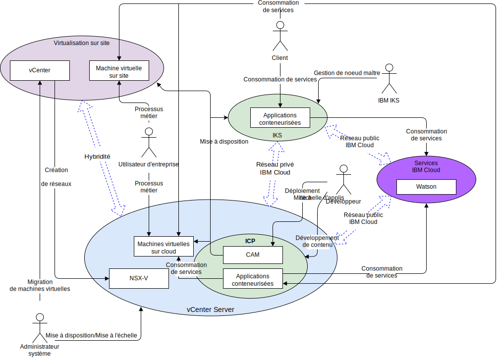

---

copyright:

  years:  2016, 2019

lastupdated: "2019-01-23"

---

# Contexte système

Le diagramme de contexte système définit les principaux éléments d'un système, les limites du système et les entités qui interagissent avec lui parallèlement aux interactions. Il s'agit d'un diagramme de haut niveau qui fournit au lecteur une vue initiale du système.

Figure 1. Contexte système

Les quatre principaux composants, d'un point de vue réseau, sont les suivants :
- **Virtualisation sur site** - Environnement VMware hébergé dans les locaux du client ou dans un emplacement tiers et qui héberge actuellement les machines virtuelles qui exécutent les applications à moderniser. Environnement source pour les migrations de machine virtuelle, il est couplé de manière lâche à {{site.data.keyword.cloud}} via VMware HCX.
- **vCenter Server** - Instance {{site.data.keyword.vmwaresolutions_short}} qui est la cible des machines virtuelles migrées à partir de l'environnement local. Associée à la virtualisation sur site, elle forme un environnement hybride dans lequel les machines virtuelles peuvent passer de façon transparente d'un environnement à l'autre.
- **{{site.data.keyword.containerlong_notm}}** - Utilise Kubernetes comme solution d'orchestration de conteneur. IBM exploite et gère le noeud maître Kubernetes tandis que les noeuds worker sont déployés sur l'infrastructure gérée par le client. IBM fournit des outils de gestion pour le déploiement de correctifs de système d'exploitation, des mises à jour de moteur Docker et des nouvelles versions Kubernetes. {{site.data.keyword.containerlong_notm}} fournit une plateforme isolée et sécurisée de gestion de conteneurs qui est portable, extensible et qui se répare spontanément en cas de basculements.
- **IBM Cloud Private** - Plateforme applicative pour le développement et la gestion d'applications conteneurisées. Il s'agit d'un environnement intégré qui inclut l'orchestrateur de conteneurs Kubernetes, un registre d'images privé, une console de gestion, ainsi que des infrastructures préfabriquées de surveillance et une interface graphique à partir de laquelle vous pouvez déployer, gérer, surveiller et mettre à l'échelle des applications de façon centralisée.
- **IBM Cloud Services** - Vaste gamme de services disponibles à partir d'{{site.data.keyword.cloud_notm}} et consommables. Les options de service sont notamment les analyses, l'intelligence artificielle et l'IdO.

## Acteurs

Le diagramme de contexte système identifie les acteurs suivants :

Tableau 1. Acteurs

Acteur  |  Description
---|---
Administrateur système |Les administrateurs système sont les ressources VMware de l'entreprise qui utilisent vCenter et le plug-in HCX. Ils identifient les candidats à la migration, étendent les réseaux, font migrer des machines virtuelles et gèrent NSX-V. Ils utilisent la console {{site.data.keyword.cloud_notm}} pour mettre à disposition des instances VMware Server on {{site.data.keyword.cloud_notm}} et pour échelonner la capacité.
Développeur	| Les développeurs sont les spécialistes en conteneur au sein de l'entreprise qui utilisent les consoles {{site.data.keyword.containerlong_notm}}, {{site.data.keyword.icpfull_notm}} et CAM, ainsi que les API permettant de créer et gérer des conteneurs. Ils créent les nouveaux services dans le cadre de la modernisation des applications.
Utilisateur d'entreprise | Cette ressource de l'entreprise a besoin d'accéder aux applications pour effectuer des processus métier, tels que la mise à jour de contenu.
Client | Le client est un acteur externe qui souhaite consommer des services de l'entreprise. Dans le cas d'Acme Skateboards, il s'agit d'un skateur qui souhaite acheter du matériel de skate. Un accès internet sécurisé au catalogue est requis pour le client.
{{site.data.keyword.containerlong_notm}} | Ressource IBM qui gère le noeud maître {{site.data.keyword.containerlong_notm}} du service.

## Systèmes

Le diagramme de contexte système identifie les systèmes suivants :

Tableau 2. Systèmes

Acteur | Description
---|---
vCenter | vCenter est la principale interface qu'utilise l'administrateur système pour gérer les machines virtuelles sur site et accéder au plug-in HCX afin d'étendre les réseaux et faire migrer les machines virtuelles. Grâce à vCenter Server with Hybridity Bundle, l'administrateur système peut intégrer en toute transparence des réseaux vSphere locaux dans l'instance vCenter Server qui s'exécute sur {{site.data.keyword.cloud_notm}}. La mise en réseau hybride étend les réseaux locaux à {{site.data.keyword.cloud_notm}} afin de permettre aux clients de faire migrer leurs applications dans une instance vCenter Server qui s'exécute sur {{site.data.keyword.cloud_notm}}, et dans l'autre sens si besoin. Pour plus d'informations sur vCenter Server with Hybridity Bundle, voir le document [VMware HCX on {{site.data.keyword.cloud_notm}} Solution Architecture](https://www.ibm.com/cloud/garage/files/HCX_Architecture_Design.pdf).
Machines virtuelles sur site | Les machines virtuelles sur site hébergent les applications qui font l'objet d'une migration vers le cloud. Initialement, elles sont migrées en tant que machines virtuelles, puis elles sont migrées des machines virtuelles vers les conteneurs via le parcours de modernisation des applications.
Machines virtuelles sur cloud | Les machines virtuelles sur cloud hébergent les applications qui ont fait l'objet d'une migration depuis l'environnement local. Elles communiquent avec les applications locales via le réseau L2 étendu. Dans le cas de cette architecture de référence et pour Acme Skateboards, l'une des machines virtuelles sur cloud est un serveur de base de données, qui fait partie de la charge de travail de présence en ligne.
NSX-V | NSX-V on vCenter Server fournit le réseau dissocié défini par le logiciel qui est géré par l'administrateur système. Le réseau dissocié est la cible des réseaux étendus HCX pour gérer le trafic provenant des machines virtuelles pour {{site.data.keyword.icpfull_notm}}. NSX-V offre à l'architecture de référence des fonctions telles que le déploiement, la reconfiguration et la destruction de réseaux virtuels à la demande et de services de micro-segmentation dans VMware à l'aide de commutateurs vDS. Pour plus d'informations, voir [Présentation de NSX–V](/docs/services/vmwaresolutions/archiref/vcsnsxt/vcsnsxt-overview-ic4vnsxv.html).
CAM | {{site.data.keyword.cloud_notm}} Automation Manager (CAM) s'exécute sur {{site.data.keyword.icpfull_notm}} et permet à partir d'un point unique de mettre à disposition des charges de travail basées sur des machines virtuelles, ainsi que des charges de travail Kubernetes simplement en utilisant des modèles. CAM permet au développeur d'effectuer les actions suivantes :   - Mettre à disposition des charges de travail sur vCenter, {{site.data.keyword.icpfull_notm}} ou {{site.data.keyword.containerlong_notm}}.  - Composer et orchestrer des services constitués de machines virtuelles et de conteneurs.   - Intégrer ses chaînes d'outils DevOps et sa solution ITSM de 2 jours.
Applications conteneurisées | Il s'agit des applications qui ont terminé le parcours de modernisation des applications et qui s'exécutent désormais en tant que conteneurs. Pour cette architecture de référence et pour Acme Skateboards, l'une des applications conteneurisées est un serveur Web, qui fait partie de la charge de travail de présence en ligne.
Watson | Dans le cas de cette architecture de référence et pour Acme Skateboards, Watson représente le service d'intelligence artificielle qui est utilisé dans l'architecture "Concept Car".

### Liens connexes

* [Présentation de vCenter Server on {{site.data.keyword.cloud_notm}} with Hybridity Bundle](/docs/services/vmwaresolutions/archiref/vcs/vcs-hybridity-intro.html)
