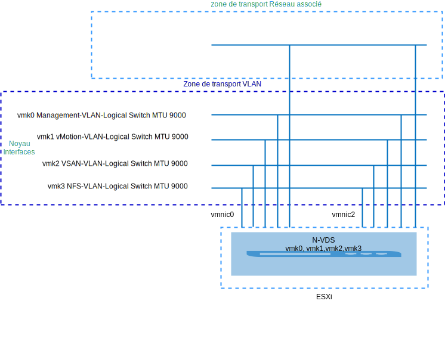
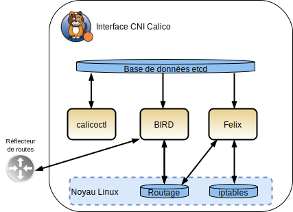
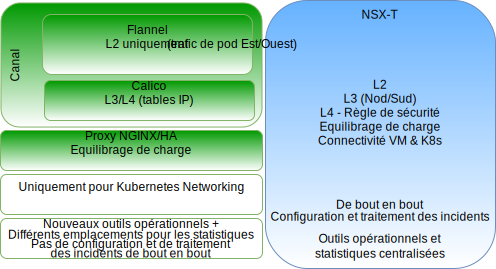
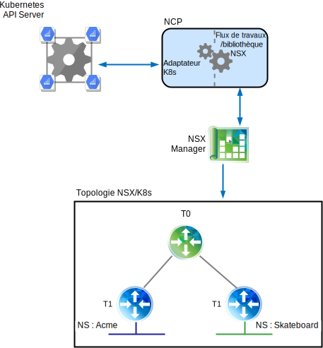
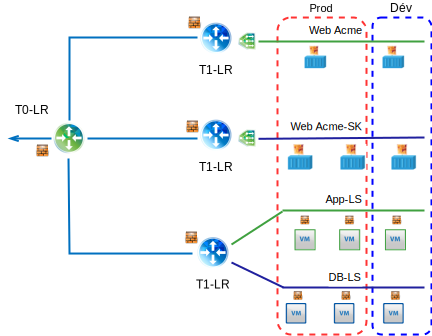
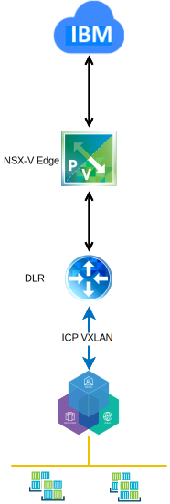
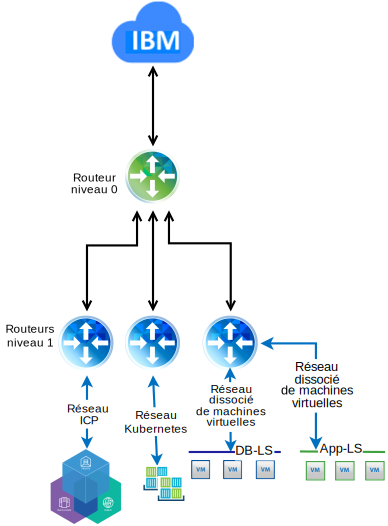

---

copyright:

  years:  2016, 2019

lastupdated: "2019-02-15"

---

# Aperçu technologique de VMware NSX-T dans VMware vCenter Server on IBM Cloud
{: #vcsnsxt-techpreview}

## Présentation de NSX–T
{: #vcsnsxt-techpreview-nsx-t-ovw}

VMware NSX-T a été conçu pour prendre en charge les structures et les architectures d'application comportant des points finaux et des piles technologiques hétérogènes. En plus de vSphere, ces environnements peuvent inclure d'autres hyperviseurs, KVM, des conteneurs et des serveurs bare metal. NSX-T permet aux équipes informatiques et aux équipes de développement de choisir les technologies les mieux adaptées à leurs applications. NSX-T est également conçu pour être géré, exploité et consommé par les organisations de développement en plus des équipes informatiques.

Dans cette conception, l'infrastructure de gestion NSX-T est déployée sur le cluster vCenter Server initial ou sur un cluster existant.

NSX Manager se voit affecter une adresse IP VLAN provenant du bloc d'adresses portables privées conçu pour les composants de gestion et configuré pour utiliser les serveurs DNS et NTP.

Un cluster supplémentaire est déployé et utilisé en tant que noeuds Hypervisor Transport, avec le stockage vSAN ou NFS utilisé en tant que magasin de données de charge de travail. Le tableau 1 récapitule les exigences relatives à un environnement de taille moyenne.

Tableau 1. Spécifications de composant NSX-T

Ressources	|NSX-T Manager	|Contrôleur x 3	|Serveur de périphérie x 2	|Serveur de périphérie Bare Metal*
---|---|---|---|---
Taille moyenne	|Dispositif virtuel	|Dispositif virtuel	|Dispositif virtuel	|Serveur physique*
Nombre d'unités centrales virtuelles	|4	|4	|4	|8
Memory	|16 Go	|16 Go	|8 Go	|32 Go
Disque	|vSAN 140 Go ou partage NFS de gestion	|vSAN 120 Go ou partage NFS de gestion	|vSAN 120 Go ou partage NFS de gestion	|200 Go
Type de disque	|A allocation dynamique	|A allocation dynamique	|A allocation dynamique	|Physique
Réseau	|Réseau portable Privé A conçu pour les composants de gestion	|Réseau portable Privé A conçu pour les composants de gestion	|Réseau portable Privé A conçu pour les composants de gestion	|Réseau portable Privé A conçu pour les composants de gestion

\* **Remarque** : vérifiez la liste de compatibilité matérielle pour des exigences spécifiques.

Figure 1. Présentation du composant de gestion NSX-V et T

### Configuration initiale
{: #vcsnsxt-techpreview-init-config}

Déployez NSX-T Manager, un cluster de contrôleurs composé de trois contrôleurs et un cluster de périphérie dans le cluster vCenter Server initial. Affectez une adresse IP à tous les composants à partir du sous-réseau portable **Privé A**.

Créez des règles d'anti-affinité MV–MV de telle sorte que les contrôleurs soient répartis parmi les hôtes du cluster. Le cluster initial est déployé avec un minimum de trois noeuds pour garantir la haute disponibilité des contrôleurs.

Déployez deux autres hôtes vSphere pour NSX-T Manager et installez le logiciel NSX-T (VIB) dessus. Créez les profils de liaison montante d'hôte et de serveur de périphérie, le profil NIOC et définissez le pool d'adresses IP qui est utilisé pour la communication TEP (Tunnel Endpoint). Pour plus d'informations, voir le tableau de définition de profil de liaison montante et le tableau de définition de profil NIOC.

Les adresses IP définies dans les pools proviennent de la plage d'adresses IP du sous-réseau portable **Privé A**. Les zones de transport VLAN et Réseau associé sont créées, et les deux hôtes ESXi supplémentaires sont configurés en tant que noeuds de transport pour les deux zones. Actuellement, les profils de liaison montante équivalents sont affectés. Créez une mise sous tension N-VDS sur les hôtes ESXi et affecté à uplink1 et uplink2.

Actuellement, deux VLAN supplémentaires sont nécessaires pour prendre en charge les politiques de groupage, de basculement et de liaison montante pour la migration de port vmkernel entre le groupe de ports vDS et les commutateurs VLAN logiques NSX-T. Les commutateurs VLAN logiques sont créés avec les ID VLAN appropriés et les ports vmkernel sont migrés.

NSX-T crée vmk10, qui est utilisé pour l'interface d'encapsulation, et vmk50, qui est utilisé pour les sous-réseaux de transit internes Tier0 et Tier0-Tier1 sur les hôtes ESXi. Par défaut, le sous-réseau 169.254.0.0/28 est utilisé pour le transit Tier0 interne et le sous-réseau 100.64.0.0/16 est utilisé pour le transit Tier0-Tier1.

Tableau 2. Définition de profil de liaison montante

Profil de liaison montante	|Spécification
---|---
LAG	|Non défini actuellement
Groupage	|Basculement : Actif = Uplink1 = vmnic0, De secours = Uplink2 = vmnic2
VLAN de transport	|0
MTU	|9000

Tableau 3. Définition de profil NIOC

Type de trafic/Nom de trafic	|Limite (%)	|Partages	|Réservation (%)
---|---|---|---
Trafic de gestion	|Illimité	|20	|0
Trafic de machine virtuelle	|Illimité	|30	|0
Trafic de tolérance aux pannes	|Illimité	|50	|0
Trafic de réplication vSphere	|Illimité	|50	|0
Trafic iSCSI	|Illimité	|50	|0
Trafic de sauvegarde de protection des données vSphere	|Illimité	|50	|0
Trafic vMotion	|Illimité	|50	|0
Trafic NFS	|Illimité	|100	|0
Trafic vSAN	|Illimité	|100	|0

Figure 2. Commutateur VLAN logique pour l'interface vmkernel

## NSX-T
{: #vcsnsxt-techpreview-nsx-t}

Cette conception spécifie la configuration des composants NSX-T, les zones de transport VLAN et Réseau associé mais n'applique aucune configuration de composant de réseau dissocié. Il vous appartient de concevoir le réseau dissocié en fonction de vos besoins.

Eléments configurés :
-	Les serveurs et contrôleurs de gestion sont installés.
-	Les agents ESXi sont installés et un pool d'adresses IP TEP est configuré pour les noeuds de transport.
-	Les noeuds de transport sont configurés pour les zones de transport VLAN et Réseau dissocié.
-	N-VDS est créé sur les noeuds de transport ESXi.
-	Les ports VMkernel sont migrés de VSS/VDS vers N-VDS.
-	Routeur de niveau 0 pour utilisation par les composants de gestion.

Eléments non configurés :
-	Commutateurs logiques de réseau dissocié
-	Micro-segmentation
-	Gestion NSX liée à d'autres instances VMware

### vCenter Server et NSX-V and NSX-T
{: #vcsnsxt-techpreview-vcs-nsx-v-nsx-t}

Le cluster vCenter Server d'origine contient tous les composants de gestion pour NSX-V et NSX-T, ainsi que les dispositifs vCenter Server. Les hôtes de ce cluster sont préparés pour NSX-V comme indiqué dans la rubrique [Présentation de NSX-V](/docs/services/vmwaresolutions/archiref/vcsnsxt?topic=vmware-solutions-vcsnsxt-overview-ic4vnsxv). Les hôtes du second cluster sont préparés pour NSX-T et configurés en tant que noeuds de transport. Cette configuration permet aux clients d'effectuer une migration depuis NSX-V vers NSX-T s'ils le souhaitent.

### NSX-T ou NSX-V
{: #vcsnsxt-techpreview-nsx-t-vs-nsx-v}

Les informations suivantes présentent les principales différences entre les produits SDN VMware, NSX-V et NSX-T. Les deux solutions fournissent des services de micro-segmentation dans un environnement VMware, mais NSX-T va encore un peu plus loin, comme indiqué dans les sections ci-après.

Pour plus de détails sur les différences d'architecture, voir le document [VMware NSX-T Reference Design Guide](https://communities.vmware.com/servlet/JiveServlet/download/37591-3-195840/VMware%20NSX-T%20Reference%20Design%20Guide.pdf) (téléchargement de fichier PDF).

#### NSX for vSphere
{: #vcsnsxt-techpreview-nsx-vsphere}

NSX-V a été conçu pour les déploiements vSphere uniquement et son architecture est telle qu'une seule plateforme NSX-V Manager est associée à une seule instance VMware vCenter Server. En fait, si la virtualisation de réseau est requise dans votre environnement VMware, NSX-V est la solution appropriée.

Caractéristiques du produit NSX-V :
-	Centré sur VMware.
-	Conçu pour SDN au sein de vSphere (point unique pour la virtualisation de réseau dans l'interface utilisateur vSphere).
-	Utilise le protocole d'encapsulation VXLAN (pris en charge par la plupart des fournisseurs tiers).
-	Les cartes NIC physiques ne sont pas la propriété de NSX-V ; elles sont affectées aux commutateurs distribués virtuels (vDS) SDDC-Dswitch-Private et SDDC-Dswitch-Public.
-	Différences de terminologie : routeur DLR (Distributed Logical Router) pour le trafic Est-Ouest et routeur ESG (Edge Service Gateway) pour le trafic Nord-Sud.

#### Transformateurs NSX
{: #vcsnsxt-techpreview-nsx-transformers}

NSX-T est une solution autonome pour les environnements vCenter et vSphere, mais elle prend aussi en charge KVM, le cloud public, les conteneurs, et peut être intégrée dans des infrastructures, telles que {{site.data.keyword.containerlong_notm}} et {{site.data.keyword.icpfull_notm}}, Redhat OpenShift, Pivotal, et bien d'autres. Avec NSX-T, vous avez ainsi la possibilité de gérer votre mise en réseau définie par logiciel sur plusieurs hyperviseurs, conteneurs et clouds.

Points forts de NSX-T
-	Produit autonome. vCenter n'est pas requis.
-	Soutien mutihyperviseur
    - Les contrôleurs peuvent être déployés sur KVM ou ESXi.
    - Les serveurs de périphérie peuvent être déployés en tant que serveurs virtuels ou bare metal.
-	Intégration de conteneur (plug-in CNI NSX-T)
-	Prise en charge OpenSwitch (OvS).
- Routage multi-niveau optimisé :
    - Annonces de routage au niveau du routeur de niveau 1
    - Redistribution de routage au niveau du routeur de niveau 0
-	Utilise le protocole d'encapsulation Geneve.
-	Les cartes NIC sont la propriété du noeud de transport NSX-T et affectées à N-VDS.
-	Différences de terminologie : routeur logique de niveau 1 pour le trafic Est-Ouest et routeur logique de niveau 0 pour le trafic Nord-Sud.

## Calico
{: #vcsnsxt-techpreview-calico}

Calico est créé sur une architecture évolutive distribuée en raison de sa capacité à passer facilement de déploiements sur un ordinateur portable de développeur à des déploiements en entreprise d'envergure et il utilise le plan de données Linux standard pour fournir des performances bare metal pour des charges de travail virtuelles. Calico est constitué de plusieurs composants interdépendants :
-	Felix, un démon qui s'exécute sur chaque noeud hébergeant un noeud final, un conteneur ou une machine virtuelle. Felix est chargé de la gestion d'interface, du routage et de la programmation ACL, du routage vers le noeud final, de la validation du trafic entre les noeuds finaux et de la génération de rapports d'état, essentiellement sur la santé du réseau pour l'hôte qu'il gère.
- Le plug-in Orchestrator, qui associe des plug-in d'orchestration à Calico, en l'occurrence, les plug-in Kubernetes, fournit des services de conversion d'API entre Kubernetes et Calico et permet à Calico d'envoyer des commentaires à Kubernetes sur les configurations de réseau de noeuds finaux ayant échoué.
-	etcd, qui fournit la communication entre les composants et stocke des informations dans un magasin de données cohérent, de sorte que Calico puisse toujours créer un réseau fiable.
-	BIRD, qui fournit des fonctions client BGP sur chaque noeud qui héberge également Felix. Lorsque Felix insère une route dans le noyau Linux, le client BGP la récupère et la distribue aux autres noeuds du déploiement. Dans des environnements d'envergure, un réflecteur de routes BGP est également déployé pour agir en tant que point central auquel les clients BGP peuvent se connecter. Ainsi, chaque client n'a pas besoin de parler avec chacun des autres clients ni de distribuer les routes aux autres noeuds du déploiement.

Figure 3. Présentation de Calico

### NSX-T et Calico
{: #vcsnsxt-techpreview-nsx-t-calico}

#### Détails des composants NSX-T
{: #vcsnsxt-techpreview-nsx-t-comp-details}

L'architecture NSX-T fournit une séparation intégrée du plan de données, du plan de contrôle et du plan de gestion. Cette séparation offre plusieurs avantages, notamment, l'évolutivité, les performances, la résilience et l'hétérogénéité. Les principales caractéristiques de l'architecture sont les suivantes :
-	Plan de gestion : un plan de gestion NSX-T a été conçu de toute pièce à l'aide d'une technologie de regroupement avancée, qui permet à la plateforme de traiter des demandes d'API simultanées à grande échelle.
-	Plan de contrôle : le plan de contrôle NSX-T assure le suivi de la mise en réseau virtuelle et de l'état de sécurité en temps réel du système. Le plan de contrôle NSX-T scinde le plan de contrôle en un plan de contrôle en cluster central (CPP) et un plan de contrôle local (LCP). Cela simplifie considérablement la tâche du CCP et permet à la plateforme de s'étendre et d'être mise à l'échelle pour des noeuds finaux hétérogènes.
-	Plan de données : le plan de données NSX-T introduit un commutateur d'hôte (au lieu de s'appuyer sur le commutateur vSwitch), ce qui le découple du gestionnaire de traitement et normalise la connectivité de mise en réseau. Toutes les opérations CRUD (création, lecture, mise à jour et suppression) sont effectuées via NSX-T Manager.

#### Différences entre Calico et NSX
{: #vcsnsxt-techpreview-diff-calico-nsx}

Calico est un projet open source Tigera, principalement géré par l'équipe Tigera. Il est fourni sous la forme d'une interface CNI qui permet la mise en réseau et la sécurité pour des systèmes d'orchestration, tels que Kubernetes, lequel est utilisé par {{site.data.keyword.icpfull_notm}} et par {{site.data.keyword.containerlong_notm}}.

Calico crée et gère un réseau L3 plat, en affectant à chaque de travail une adresse IP entièrement routable. Les charges de travail peuvent communiquer sans encapsulation IP ou conversion NAT pour améliorer les performances bare metal, faciliter le traitement des incidents et obtenir une meilleure interopérabilité. Dans les environnements nécessitant un réseau dissocié, Calico utilise la tunnellisation IP-in-IP ou peut fonctionner avec une mise en réseau dissociée, telle que Flannel. Le projet open source nommé Canel vise à fournir l'installation simultanée de Calico et de Flannel, ainsi que la mise en réseau VXLAN prête à l'emploi, tout en vous permettant de bénéficier également de l'isolement des politiques par rapport aux politiques Calico.

Calico est constitué de plusieurs composants interdépendants qui fournissent la communication des points finaux, la sécurité, le routage et l'intégration de plug-in avec Kubernetes. Tout cela est effectué via un fichier de configuration et une ligne de commande, ce qui ne facilite pas la mise en place de règles de sécurité et de mise en réseau cohérentes sur un environnement hybride. Pour plus d'informations sur les composants Calico, voir la documentation sur le [projet Calico](https://www.projectcalico.org/).

NSX-T est une solution autonome pour les environnements vCenter et vSphere, mais elle prend aussi en charge KVM, le cloud public, les conteneurs, et peut être intégrée dans des infrastructures, telles que {{site.data.keyword.containerlong_notm}} et {{site.data.keyword.icpfull_notm}}, Redhat OpenShift, Pivotal, et bien d'autres. Vous avez ainsi la possibilité de gérer votre mise en réseau définie par logiciel sur plusieurs hyperviseurs, conteneurs et clouds. NSX-T fonctionne au niveau des couches 2, 3 et 4 et fournit des fonctionnalités à chaque couche.

NSX-T permet de gérer les règles de sécurité et de réseau à l'échelle d'un environnement de machine virtuelle et de conteneur dans une interface Web facile à comprendre.

Figure 4. Comparaison détaillée des composants NSX-T et Calico

## NSX-T et Kubernetes
{: #vcsnsxt-techpreview-nsx-t-kube}

Le composant de base qui fournit l'intégration entre Kubernetes et NSX Manager est NCP (NSX Container plug-in). NCP s'exécute en tant que conteneur dans un pod Kubernetes, contrôle et surveille les éventuelles modifications apportées à des objets pertinents sur le serveur d'API Kubernetes, par exemple, des espaces de nom et des pods. Les développeurs exécutent des tâches côté Kubernetes et NCP voit ces modifications auxquelles il réagit en créant les objets NSX connexes, tels que des commutateurs logiques, des routeurs logiques et des objets de pare-feu à l'aide d'une collection d'appels API à destination de NSX Manager.

Dans la figure ci-après, deux espaces de nom Kubernetes sont illustrés, Acme et Skateboards, chacun ayant un commutateur logique dédié, un routeur de niveau 1 et un segment IP permettant de le connecter à un routeur logique T0.

Figure 5. NCP Kubernetes

### Gestionnaire de politiques de sécurité NSX
{: #vcsnsxt-techpreview-nsx-sec-policy-manager}

En plus de fournir la virtualisation de réseau, NSX-T sert également de plateforme de sécurité avancée qui offre un ensemble complet de fonctions pour rationaliser le déploiement de solutions de sécurité. Les informations suivantes présentent les fonctions de micro-segmentation qui peuvent être appliquées sur plusieurs plateformes.

Principaux concepts :
-	Un pare-feu distribué NSX-T fournit une protection avec état de la charge de travail au niveau des cartes réseau virtuelles (vNIC). L'application DFW se produit dans le noyau d'hyperviseur, ce qui contribue à fournir des services de micro-segmentation.
-	Un modèle de politique de sécurité uniforme pour les déploiements sur site et sur cloud, prenant en charge plusieurs hyperviseurs (autrement dit, ESXi et KVM) et plusieurs charges de travail, avec un niveau de granularité pouvant atteindre les attributs de machine virtuelle et de conteneur.
-	Une gestion de traitement agnostique, prenant en charge des hyperviseurs qui sont gérés par différents gestionnaires de traitement tout en permettant la mise en application des politiques de micro-segmentation définies sur des hyperviseurs dans plusieurs environnements vCenter.
-	Le pare-feu NSX-T Edge sert de service de pare-feu avec état centralisé pour le trafic N-S. Le pare-feu Edge est implémenté au niveau des routeurs logiques et pris en charge à l'échelle des niveaux 0 et 1. Le pare-feu Edge est indépendant de NSX-T DFW du point de vue de la configuration et de la mise en application des règles.
-	Le regroupement dynamique d'objets dans des constructions logiques appelées NSGroups en fonction de différents critères, tels qu'une balise, un nom de machine virtuelle, un sous-réseau et un commutateur logique.
-	La portée de la mise en application des politiques peut être sélective, avec une granularité de niveau application ou charge de travail.
-	DNE (Distributed Network Encryption) assure la confidentialité et l'intégrité des données qui transitent par le réseau.
-	Le mécanisme de reconnaissance d'adresse IP identifie l'adressage des charges de travail de manière dynamique.
-	SpoofGuard bloque l'usurpation d'adresse IP au niveau vNIC.
-	La sécurité Switch fournit les fonctions de contrôle et de sécurité Storm contre le trafic non autorisé.

Figure 6. Micro-segmentation NSX-T

### Différences entre NSX–T et NSX-V
{: #vcsnsxt-techpreview-diff-nsx-t-nsx-v}

NSX-V for vSphere (NSX-V) a été conçu pour les déploiements vSphere uniquement et son architecture est telle qu'une seule plateforme NSX-V Manager est associée à une seule instance VMware vCenter Server. En fait, si la virtualisation de réseau est requise dans votre environnement VMware, NSX-V est probablement la solution appropriée.

NSX Transformers (NSX-T) est une solution autonome qui peut prendre en charge plusieurs environnements vCenter et vSphere, mais elle prend aussi en charge KVM, le cloud public, les conteneurs, et peut être intégrée dans des infrastructures, telles que IBM IKS et ICP, Redhat OpenShift, Pivotal, et bien d'autres. Vous avez ainsi la possibilité de gérer votre mise en réseau définie par logiciel sur plusieurs hyperviseurs, conteneurs et clouds à l'aide d'un même jeu d'outils.

#### Evolutivité de réseau avec NSX-V
{: #vcsnsxt-techpreview-net-scalability-nsx-v}

VMware NSX-V a été conçu pour prendre en charge des structures et des architectures d'application comportant des milliers de points finaux et de piles technologiques hétérogènes, ce qui lui permet de s'étendre et de passer d'un cluster vSphere comportant trois hôtes à un déploiement Cross-vCenter comportant plus d'un millier d'hôtes et des milliers de machines virtuelles.

#### Evolutivité de réseau avec NSX-T
{: #vcsnsxt-techpreview-net-scalability-nsx-t}

VMware NSX-T a été conçu pour prendre en charge les structures et les architectures d'application comportant des points finaux et des piles technologiques hétérogènes, ce qui lui permet de s'étendre à partir de n'importe quel site, n'importe quel cloud ou n'importe quelle unité de noeud final. Il peut ainsi passer d'un centre de données de petite taille à un environnement multi-cloud.

#### Sécurité avec NSX-V
{: #vcsnsxt-techpreview-sec-nsx-v}

VMware NSX-V vous permet de définir des politiques de sécurité de façon cohérente à l'échelle de l'environnement, quel que soit le type de l'application ou l'endroit où elle a été déployée dans votre infrastructure VMware. A mesure que de nouvelles charges de travail sont déployées, elles héritent automatiquement des politiques de sécurité qui leur restent associées tout au long de leur cycle de vie, quel que soit l'endroit où elles ont été mises à disposition ou déplacées. NSX découple les politiques de sécurité des attributs de réseau statique, tels que l'adresse IP, le port et le protocole, et permet de définir des politiques en fonction d'une compréhension contextuelle de l'application et de l'infrastructure. NSX permet également d'insérer des services de sécurité tiers avancés dans un micro-segment donné au lieu de router tout le trafic réseau via une unité physique ou un dispositif virtuel. Ce faisant, les services de sécurité avancés peuvent être insérés aux emplacements appropriés et au bon moment, maximisant ainsi l'efficience du trafic réseau tout en augmentant l'efficacité des services de sécurité proprement dits.

#### Sécurité avec NSX-T
{: #vcsnsxt-techpreview-sec-nsx-t}

VMware NSX-T fournit les mêmes fonctions que NSX-V dans un environnement VMware vSphere. En outre, NSX-T fournit une sécurité de micro-segmentation cohérente et évolutive pour les applications qui s'exécutent dans des environnements privés et publics, tels qu'{{site.data.keyword.cloud}} Private et {{site.data.keyword.containerlong_notm}} et d'autres offres de cloud.

#### Intégration NSX-V
{: #vcsnsxt-techpreview-integration-nsx-v}

Pour l'intégration NSX-V à Kubernetes, l'automatisation d'{{site.data.keyword.cloud_notm}} installe {{site.data.keyword.icpfull_notm}} sur une instance vCenter. Un commutateur/réseau VXLAN dédié, un routeur DLR et une passerelle ESG sont créés spécifiquement pour le réseau Kubernetes. Le réseau dissocié du jour 1 pour {{site.data.keyword.icpfull_notm}} est un sous-réseau 192.168.20.0/24 avec une configuration de routage via la passerelle ESG pour un accès au réseau sous-jacent.

Figure 7. NSX-V et Kubernetes

#### Intégration NSX-T
{: #vcsnsxt-techpreview-integration-nsx-t}

L'intégration NSX-T à Kubernetes s'effectue via NCP (NSX-T Container Plug-in). NCP s'exécute sur chaque noeud Kubernetes et communique avec NSX Manager et le plan de contrôle Kubernetes. Le plug-in NSX-T crée automatiquement une topologie logique pour le cluster Kubernetes, crée des réseaux logiques distincts pour chaque espace de nom, connecte les pods Kubernetes à des réseaux logiques et alloue des adresses IP et MAC.

Le pare-feu distribué NSX-T permet la création de politiques de réseau, qui sont implémentées pour le cluster Kubernetes. Il prend en charge des politiques de sortie et d'entrée, des libellés et des politiques de correspondance d'expression, ainsi que des fonctionnalités d'équilibrage de charge, qui peuvent toutes être appliquées à l'infrastructure Kubernetes.

Figure 8. NSX-T et Kubernetes

## Liens connexes
{: #vcsnsxt-techpreview-related}

* [VMware NSX-T Reference Design Guide](https://communities.vmware.com/servlet/JiveServlet/download/37591-3-195840/VMware%20NSX-T%20Reference%20Design%20Guide.pdf) (téléchargement de fichier PDF)
* [Route to Cloud NSX-T](https://www.routetocloud.com/category/nsx-t/)
* [VMware containers and container networking for network engineers](https://www.vmware.com/content/dam/digitalmarketing/vmware/en/pdf/products/nsx/vmware-containers-and-container-networking-whitepaper.pdf)
