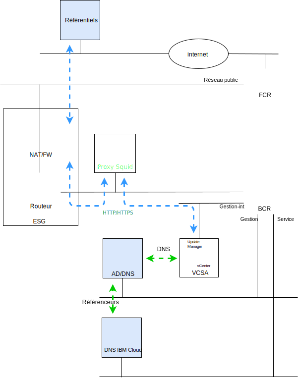

---

copyright:

  years:  2016, 2018

lastupdated: "2018-11-12"

---

# Introduction à VMware Update Manager

L'objectif de ce document est de fournir, à vous qui êtes administrateur système de l'instance {{site.data.keyword.vmwaresolutions_full}} vCenter Server, les instructions permettant de configurer VMware Update Manager (VUM) afin de maintenir votre environnement vCenter Server à jour.

VUM active la gestion automatique centralisée des versions et des correctifs pour VMware vSphere et vous permet d'exécuter les tâches suivantes dans votre environnement VMware vCenter Server on {{site.data.keyword.cloud_notm}} :
* Mettre à niveau et appliquer des correctifs aux hôtes vSphere ESXi.
* Installer et mettre à jour des logiciels tiers sur les hôtes.
* Mettre à niveau le matériel des machines virtuelles, les outils VMware Tools et les dispositifs virtuels.

Ce document décrit également les processus permettant de gérer les composants suivants de votre instance vCenter Server :
* vCenter Server Appliance
* NSX
* vSAN

Ce document présente l'utilisation de l'implémentation d'un serveur proxy, basé sur CentOS et Squid, pour permettre à VUM d'accéder aux référentiels de VMware. Lorsque VUM demande une ressource du serveur de mises à jour dans VMware, la demande est d'abord envoyée au serveur proxy qui l'envoie ensuite au serveur de mise à jour via la passerelle ESG (External Services Gateway). Une fois que le serveur proxy obtient la ressource, il l'envoie à VUM.

Figure 1. Diagramme de présentation

vCenter Server déploie actuellement vSphere 6.5, ce qui signifie que VUM est désormais intégré dans le dispositif vCenter Server Appliance (VCSA), et comme le composant client de VUM est un plug-in qui s'exécute sur vSphere Web Client, il est automatiquement activé après le déploiement du dispositif VCSA. Cependant, VUM n'a aucun accès à Internet pour accéder aux référentiels de VMware.

La configuration présentée dans ce document utilise un modèle de déploiement VUM connecté à Internet de type "tout en un" ("all-in-one"), qui utilise le réseau public d'{{site.data.keyword.cloud_notm}} pour fournir l'accès Internet permettant de télécharger les mises à niveau et les correctifs.

Les clients qui nécessitent l'utilisation d'autres connexions Internet doivent se renseigner sur le service VMware vSphere Update Manager Download Service (UMDS), qui n'entre pas dans le cadre de cette publication.

VUM peut être configuré pour importer des mises à jour depuis un référentiel partagé ou importer des correctifs et des extensions manuellement à partir d'un fichier .zip, mais ces rubriques ne sont pas traitées dans ce document.

Ainsi, notez que dans vSphere 6.5, l'enregistrement de VUM dans un dispositif VCSA n'est plus pris en charge lors de l'installation du serveur VUM sur une machine Windows distincte. Vous ne pouvez pas déployer VUM sur une machine virtuelle dans un environnement vCenter Server.

Ce document comprend les sections suivantes :
* [Présentation de VMware Update Manager](vum-overview.html) - Cette section présente le processus VUM et les termes clés nécessaires pour comprendre les opérations et l'interface utilisateur de l'outil.
* **Installation, configuration et utilisation** - Cette section présente les étapes requises pour le fonctionnement de VUM dans une instance vCenter Server :
  - [Configuration initiale](vum-init-config.html) - Tâche unique pour :
      - Configurer la mise en réseau NSX pour autoriser l'accès du serveur proxy à Internet
      - Installer et configurer un serveur proxy pour fournir l'accès Internet pour VUM
      - Effectuer la configuration initiale de VUM pour l'utilisation du serveur proxy
  - [Collecte des métadonnées](vum-metadata.html) - VUM télécharge des métadonnées relatives aux mises à niveau, aux correctifs ou aux extensions via un processus automatique prédéfini que vous pouvez modifier. A intervalles réguliers pouvant être configurés, VUM contacte VMware ou des sources tierces, pour rassembler les métadonnées les plus récentes sur les mises à niveau, les correctifs ou les extensions disponibles.
  - [Création de lignes de base](vum-baselines.html) - Utilisez les lignes de base et les groupes de lignes de base prédéfinis ou créez les vôtres. Les lignes de base et les groupes de lignes de base sont ensuite rattachés aux objets d'inventaire.
  - [Analyse et vérification](vum-scanning.html) - Les objets d'inventaire sont analysés et les résultats sont vérifiés pour déterminer leur conformité par rapport aux lignes de base et aux groupes de lignes de base. Les résultats d'analyse peuvent être filtrés avec une recherche de texte, une sélection de groupe ou de ligne de base et une sélection d'état de conformité.
  - [Transfert et résolution](vum-staging.html) - Des correctifs et des extensions peuvent être éventuellement transférés avant la résolution pour s'assurer qu'ils sont téléchargés sur l'hôte. Lors de la résolution, VUM applique les correctifs, les extensions et les mises à niveau aux objets d'inventaire.

Ce document considère que vous disposez d'une instance vCenter Server principale déployée ou d'un certain nombre d'instances vCenter Server principales distinctes. Si vous disposez d'instances vCenter Server principales et secondaires déployées et que vous utilisez SSO (Single Sign On), voir [vCenters liés via SSO](vum-updating-vcsa.html).

Si vous avez déployé une instance vCenter Server à l'aide de vSAN, consultez d'abord [Mise à jour de clusters vSAN](vum-updating-vsan.html).

Si vous souhaitez mettre à jour l'automatisation de gestion de l'infrastructure {{site.data.keyword.cloud_notm}}, utilisez la console {{site.data.keyword.vmwaresolutions_short}}

La [console {{site.data.keyword.vmwaresolutions_short}} ](https://console.cloud.ibm.com/infrastructure/vmware-solutions/console) vous permet d'effectuer les actions suivantes : 
*	Mettre à niveau les licences, par exemple, mettre à niveau NSX Base à une autre version
*	Lancer des mises à jour sur la plateforme vCenter Server, par exemple passer à la version 2.5
*	Afficher le statut des mises à jour
*	Afficher les mises à jour installées

Cette fonction permet la mise à jour automatique des composants de gestion des instances vCenter Server uniquement. Les mises à jour de produit VMware doivent être appliquées à l'aide des procédures explicitées dans ce document.

### Liens connexes

* [VMware HCX on {{site.data.keyword.cloud_notm}} Solution Architecture](https://www.ibm.com/cloud/garage/files/HCX_Architecture_Design.pdf)
* [VMware Solutions on {{site.data.keyword.cloud_notm}} Digital Technical Engagement](https://ibm-dte.mybluemix.net/ibm-vmware) (Demos)
