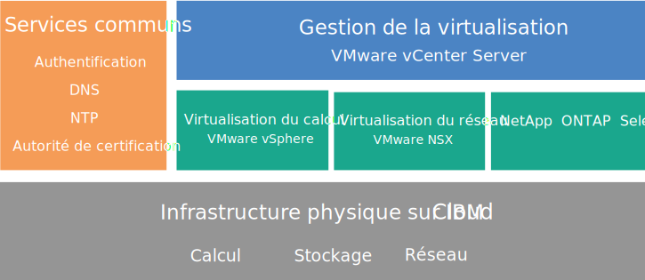
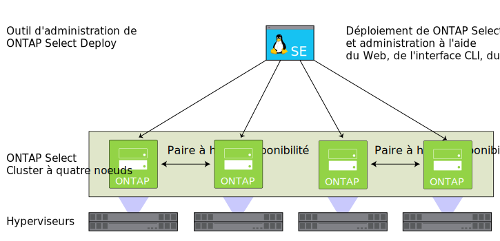

---

copyright:

  years:  2016, 2018

lastupdated: "2018-09-21"

---

# Présentation de NetApp ONTAP Select

Passez en revue l'architecture et les composants du déploiement NetApp ONTAP Select on {{site.data.keyword.cloud}}.

## Architecture de NetApp ONTAP Select

L'offre NetApp ONTAP Select on {{site.data.keyword.cloud_notm}} complète le déploiement vCenter Server par l'apport de services de virtualisation du stockage.

Le graphique suivant illustre l'architecture globale du déploiement NetApp ONTAP Select on vCenter Server.

Figure 1. Architecture NetApp ONTAP Select on {{site.data.keyword.cloud_notm}} de haut niveau

### Infrastructure physique

Cette couche fournit l'infrastructure physique (ressources de calcul, de stockage et réseau) qu'utilise l'infrastructure virtuelle.

### Infrastructure de virtualisation (calcul, réseau et NetApp ONTAP Select)

Cette couche virtualise l'infrastructure physique par le biais des produits VMware suivants et du produit NetApp ONTAP Select :
* VMware vSphere virtualise les ressources de calcul physiques.
* VMware NSX est la plateforme de virtualisation réseau qui fournit les composants de mise en réseau logique et les réseaux virtuels.
* NetApp ONTAP Select on {{site.data.keyword.cloud_notm}} déploie un cluster ONTAP Select qui est composé de quatre machines virtuelles pour les quatre hôtes.

Le graphique suivant illustre les composants du déploiement NetApp ONTAP Select.

Figure 2. Composants de NetApp ONTAP Select

### Gestion de la virtualisation

La couche de gestion de virtualisation comprend les composants suivants :

* Dispositif virtuel vCenter Server
* NSX Manager
* Deux passerelles NSX ESG (Edge Services Gateway)
* Trois contrôleurs NSX
* Dispositif virtuel PSC (Platform Services Controller)
* Dispositif vCenter Server Appliance (vCSA)
* Instance de serveur virtuel (VSI) IBM CloudDriver

NetApp ONTAP Select s'exécute dans un cluster VMware et virtualise le stockage local sur les hôtes. NetApp ONTAP Select est déployé dans le modèle dédié, où ce déploiement n'est pas censé partager le cluster avec d'autres charges de travail. Par conséquent, la configuration matérielle de l'offre NetApp ONTAP Select on {{site.data.keyword.cloud_notm}} n'est dimensionnée qu'en fonction des besoins de NetApp ONTAP Select.

## Spécifications techniques relatives aux instances NetApp ONTAP Select

Les composants suivants sont inclus dans votre instance NetApp ONTAP Select.

**Remarque** : la disponibilité et la tarification des configurations normalisées varient en fonction de l'{{site.data.keyword.CloudDataCent_notm}} sélectionné pour le déploiement.

### Stockage

* Choisissez l'une des trois options suivantes : **Hautes performances (Moyenne)**, **Hautes performances (Grande)** et **Haute capacité**.
* RAID 5 sans unité de secours à chaud
* Deux unités SATA ESXi OS de 1 To – RAID 1
* Magasin de données de gestion – 500 Go pour les machines virtuelles de gestion

### Configurations prédéfinies

Quatre serveurs {{site.data.keyword.cloud_notm}} {{site.data.keyword.baremetal_short}} avec les options de configuration suivantes fournies :
* **Hautes performances (Moyenne)** – Licence Premium/Dual Intel Xeon E5-2650 v4 (24 coeurs au total, 2,2 GHz)/128 Go de RAM/capacité de 22 unités SSD de 1,9 To par noeud/capacité effective d'un cluster de 4 noeuds – 59 To
* **Hautes performances (Grande)** – Licence Premium/Dual Intel Xeon E5-2650 v4 (24 coeurs au total, 2,2 GHz)/128 Go de RAM/capacité de 22 unités SSD de 3,8 To par noeud/capacité effective d'un cluster de 4 noeuds – 118 To
* **Haute capacité** – Licence Standard/Dual Intel Xeon E5-2650 v4 (24 coeurs au total, 2,2 GHz)/64 Go de RAM/capacité de trente-quatre unités SATA de 4 To par noeud/capacité effective d'un cluster de 4 noeuds – 190 To

**Remarque :** les unités SSD (Solid-State Disk) de 3,8 To sont prises en charge une fois qu'elles sont officiellement disponibles dans un centre de données.

### Matériel

* Trois options de RAM et de disque : **Hautes performances (Moyenne)**, **Hautes performances (Grande)** et **Haute capacité**
* Deux unités SATA ESXi OS de 1 To
* Un contrôleur de disque RAID
* VMware Server Virtualization 6.5

### Utilisation en réseau

* Liaisons montantes réseau public et privé double de 10 Gbps
* Trois VLAN (réseaux locaux virtuels) : un VLAN public et deux VLAN privés
* Une passerelle VMware NSX Edge Services Gateway sécurisée

### Instance de serveur virtuel

Deux instances de serveur virtuel :
* Une pour les services Microsoft Active Directory (AD) et système de noms de domaine (DNS, Domain Name System).
* Une instance de serveur virtuel pour IBM CloudBuilder, fermée une fois le déploiement de l'instance terminé.

### Licences et frais

*  Quatre licences Premium or Standard Edition NetApp ONTAP Select (fournies par l'utilisateur)
*  Edition VMware vSphere 6.5 Enterprise Plus
*  VMware vCenter Server 6.5
*  VMware NSX Service Providers Edition (Base, Advanced ou Enterprise) 6.4
*  Frais de prise en charge et de services (une licence par noeud)

**Important** : vous devez gérer les composants {{site.data.keyword.vmwaresolutions_short}} créés dans votre compte {{site.data.keyword.cloud_notm}} uniquement depuis la console {{site.data.keyword.vmwaresolutions_short}}, et non pas le {{site.data.keyword.slportal}} ou tout autre élément extérieur à la console. Si vous modifiez ces composants en dehors de la console {{site.data.keyword.vmwaresolutions_short}}, les modifications ne sont pas synchronisées avec la console.

**ATTENTION** : gérer des composants {{site.data.keyword.vmwaresolutions_short}} (installés dans votre compte {{site.data.keyword.cloud_notm}} lorsque vous avez commandé l'instance) en dehors de la console {{site.data.keyword.vmwaresolutions_short}} risque de rendre votre environnement instable. Ces activités de gestion incluent :
*  L'ajout, la modification, le retour ou la mise hors tension de composants
*  L'extension ou la réduction de la capacité de l'instance via l'ajout ou la suppression de serveurs ESXi
*  Le redémarrage de services

   Seules les activités de gestion des partages de fichiers du stockage partagé depuis le portail {{site.data.keyword.slportal}} font exception. Il s'agit des activités suivantes : commande, suppression (pouvant avoir un impact sur des magasins de données éventuellement montés), accord d'autorisation et montage de partages de fichiers de stockage partagé.

## Remarques relatives aux pare-feu

Si vous utilisez des pare-feu, vous devez configurer des règles pour toutes les communications établies à partir de l'instance de serveur virtuel {{site.data.keyword.IBM}} CloudDriver et des machines virtuelles SDDC Manager. Ces règles doivent autoriser tous les protocoles à communiquer sur les adresses IP `10.0.0.0/8` et `161.26.0.0/16`. Ces types de pare-feu sont notamment les pare-feu DFW (Distributed Firewall) NSX ou les pare-feu Vyatta. 

### Liens connexes

* [Planification des instances NetApp ONTAP Select](np_planning.html)
* [Commande d'instances NetApp ONTAP Select](np_orderinginstances.html)
* [Présentation de vCenter Server](../vcenter/vc_vcenterserveroverview.html)
* [Centre de documentation NetApp ONTAP](http://docs.netapp.com/ontap-9/index.jsp?topic=%2Fcom.netapp.doc.exp-clus-peer%2Fhome.html){:new_window}
