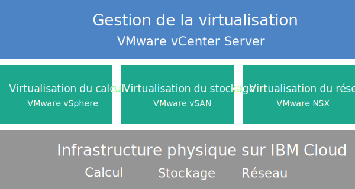

---

copyright:

  years:  2016, 2018

lastupdated: "2018-11-05"

---

{:tip: .tip}
{:note: .note}
{:important: .important}

# Présentation de Cloud Foundation

Lorsque vous commandez VMware Cloud Foundation on {{site.data.keyword.cloud}}, un environnement VMware complet est automatiquement déployé. Le déploiement de base se compose de quatre serveurs {{site.data.keyword.cloud_notm}} {{site.data.keyword.baremetal_short}} avec la pile VMware Cloud Foundation préinstallée et configurée de manière à fournir une plateforme de centre de données défini par les logiciels (SDDC, Software-Defined Data Center). Cloud Foundation intègre en natif VMware vSphere, VMware NSX, VMware Virtual SAN et son architecture est basée sur des conceptions validées par VMware.

## Architecture Cloud Foundation

Le graphique suivant décrit l'architecture globale et les composants du déploiement Cloud Foundation.

Figure 1. Architecture Cloud Foundation

### Infrastructure physique

Cette couche fournit l'infrastructure physique (ressources de calcul, de stockage et réseau) qu'utilise l'infrastructure virtuelle.

### Infrastructure de virtualisation (calcul, stockage et réseau)

Cette couche virtualise l'infrastructure physique par le biais de différents produits VMware :
* VMware vSphere virtualise les ressources de calcul physiques.
* VMware Virtual SAN (vSAN) fournit un stockage partagé défini par les logiciels basé sur le stockage des serveurs physiques.
* VMware NSX est la plateforme de virtualisation réseau qui fournit les composants de mise en réseau logique et les réseaux virtuels.

### Gestion de la virtualisation

Cette couche se compose de vCenter Server, qui représente la couche de gestion de l'environnement virtualisé. Les mêmes outils et scripts habituels compatibles API vSphere peuvent être utilisés pour gérer l'environnement VMware hébergé par IBM.

Sur la console {{site.data.keyword.vmwaresolutions_short}}, vous pouvez augmenter et réduire la capacité de vos instances à l'aide des fonctions d'ajout et de suppression de serveurs ESXi. De plus, des fonctions de gestion du cycle de vie, telles que l'application de mises à jour et de mises à niveau des composants VMware dans l'environnement hébergé sont également disponibles.

Pour plus d'informations sur l'architecture, voir [Présentation de la solution](../archiref/solution/solution_overview.html).

## Spécifications techniques relatives aux instances Cloud Foundation

Les composants suivants sont inclus dans votre instance Cloud Foundation.

Les frais encourus pour le matériel, la mise en réseau, les machines virtuelles et le stockage peuvent varier en fonction de l'{{site.data.keyword.CloudDataCent_notm}} sélectionné pour le déploiement.
{:note}

### Serveur bare metal

Vous pouvez commander les serveurs {{site.data.keyword.cloud_notm}} {{site.data.keyword.baremetal_short}} dans l'une des configurations suivantes :
*  **Skylake** : Génération Intel Skylake 2 UC (série Intel Xeon 4100/5100/6100) avec le modèle d'UC et la taille de mémoire RAM que vous avez sélectionnés.    
*  **Broadwell** : Génération Intel Broadwell 2 UC (série Intel Xeon E5-2600 v4) avec le modèle d'UC et la taille de mémoire RAM que vous avez sélectionnés.    
   Si vous prévoyez d'utiliser un stockage vSAN, la configuration requiert quatre serveurs {{site.data.keyword.baremetal_short}}.
   {:note}

### Utilisation en réseau

Les composants réseau suivants sont commandés :
* Liaisons montantes réseau public et privé double de 10 Gbps
* Trois VLAN (réseaux locaux virtuels) : un VLAN public et deux VLAN privés
* Passerelle de gestion sécurisée VMware NSX Edge Services Gateway (ESG) pour le trafic de gestion HTTPS sortant, déployée par IBM dans le cadre de la topologie de réseau de gestion. Les machines virtuelles de gestion IBM utilisent cette passerelle ESG pour communiquer avec des composants de gestion IBM externes spécifiques liés à l'automatisation. Pour plus d'informations, voir [La passerelle NSX Edge des services de gestion présente-t-elle un risque pour la sécurité ?](../vmonic/faq.html#does-the-management-services-nsx-edge-pose-a-security-risk-)

  Vous n'avez pas accès à cette passerelle ESG et vous ne pouvez pas l'utiliser. Si vous la modifiez, vous ne pourrez plus gérer l'instance Cloud Foundation depuis la console {{site.data.keyword.vmwaresolutions_short}}. De plus, si vous utilisez un pare-feu ou désactivez les communications ESG vers des composants de gestion IBM externes, {{site.data.keyword.vmwaresolutions_short}} sera inutilisable.
  {:important}

* La fonction EVC (Enhanced vMotion Compatibility) est automatiquement activée si vous disposez d'un cluster existant avec des serveurs ESXi qui sont pris en charge par la version en cours de VMware vSphere. EVC fournit la compatibilité vMotion pour tous les serveurs ESXi d'un cluster en s'assurant que tous les serveurs ESXi d'un cluster exposent le même jeu de fonctions d'UC aux machines virtuelles. Grâce à EVC, les machines virtuelles peuvent migrer d'un serveur ESXi à l'autre dans le cluster, même si les UC réelles sur les serveurs ESXi sont potentiellement différentes.

### Instance de serveur virtuel

Les instances de serveur virtuel suivantes sont commandées :
* Une pour les services Microsoft Active Directory (AD) et système de noms de domaine (DNS, Domain Name System). L'instance de serveur virtuel est requise pour le support de configuration multisite. La spécification de cette instance de serveur virtuel est la suivante : Windows 2012 R2 (8 Go de RAM / 2 coeurs d'UC / disque de 100 Go / liaisons montantes privées doubles de 1 Gbps).
* Une instance de serveur virtuel pour IBM CloudBuilder, fermée une fois le déploiement de l'instance terminé.
* (Si vous commandez Veeam on {{site.data.keyword.cloud_notm}}) Une instance de serveur virtuel pour le service de sauvegarde Veeam est commandée.

### Stockage

Le stockage suivant est commandé selon la configuration des serveurs {{site.data.keyword.baremetal_short}} sélectionnée :
* Deux disques d'amorçage SATA de 1 To
* Deux disques cache SSD (Solid-State Disk) de 960 Go
* Un contrôleur de disque RAID
* Pour les configurations **Skylake** et **Broadwell** uniquement, vous pouvez définir le nombre d'unités de disque ainsi que le type et la capacité des disques en fonction de vos besoins. De plus, vous disposez de l'option Hautes performances avec Intel Optane, qui fournit deux baies de disques de capacité supplémentaires pour un total de dix disques de capacité. L'option Hautes performances avec Intel Optane dépend du modèle d'UC.

### Licences (fournies par IBM ou BYOL) et frais

* Quatre pour VMware vSphere Enterprise Plus 6.5u1
* Quatre pour VMware vCenter Server 6.5
* Quatre pour VMware NSX Enterprise 6.3
* Quatre pour VMware vSAN Advanced ou Enterprise 6.6
* Quatre licences de gestionnaire SDDC (fournies par IBM uniquement)
* Frais de quatre licences de support et services

## Spécifications techniques relatives aux noeuds d'extension Cloud Foundation

Chaque noeud d'extension Cloud Foundation déploie et génère des frais, imputés à votre compte {{site.data.keyword.cloud_notm}}, pour les composants suivants.

### Matériel pour les noeuds d'extension

Un serveur bare metal {{site.data.keyword.cloud_notm}} doté de la configuration présentée dans [Spécifications techniques relatives aux instances Cloud Foundation](../sddc/sd_cloudfoundationoverview.html#technical-specifications-for-cloud-foundation-instances).

### Licences et frais pour les noeuds d'extension

* Une pour VMware vSphere Enterprise Plus 6.5u1
* Une pour VMware vCenter Server 6.5
* Une pour VMware NSX Enterprise 6.3
* Une pour VMware vSAN Advanced ou Enterprise 6.6
* Une licence de gestionnaire SDDC
* Frais de support et de services

Vous devez gérer les composants {{site.data.keyword.vmwaresolutions_short}} créés dans votre compte {{site.data.keyword.cloud_notm}} uniquement depuis la console {{site.data.keyword.vmwaresolutions_short}} et non depuis le portail {{site.data.keyword.slportal}} ou tout autre élément extérieur à la console. Si vous modifiez ces composants en dehors de la console {{site.data.keyword.vmwaresolutions_short}}, les modifications ne sont pas synchronisées avec la console.
{:important}

**ATTENTION :** gérer des composants {{site.data.keyword.vmwaresolutions_short}} (installés dans votre compte {{site.data.keyword.cloud_notm}} lors de la commande de l'instance) en dehors de la console {{site.data.keyword.vmwaresolutions_short}} risque d'entraîner une instabilité de votre environnement. Ces activités de gestion incluent :
*  L'ajout, la modification, le retour ou la suppression de composants
*  L'extension ou la réduction de la capacité de l'instance via l'ajout ou la suppression de serveurs ESXi
*  La mise hors tension de composants
*  Le redémarrage de services

   Seules les activités de gestion des partages de fichiers du stockage partagé depuis le portail {{site.data.keyword.slportal}} font exception. Il s'agit des activités suivantes : commande, suppression (pouvant avoir un impact sur des magasins de données éventuellement montés), accord d'autorisation et montage de partages de fichiers de stockage partagé.

### Liens connexes

* [Nomenclature du logiciel Cloud Foundation](sd_bom.html)
* [Planification des instances Cloud Foundation](sd_planning.html)
* [Commande d'instances Cloud Foundation](sd_orderinginstance.html)
* [Centre de documentation VMware vSphere](https://pubs.vmware.com/vsphere-60/index.jsp){:new_window}
* [Centre de documentation VMware NSX 6](https://pubs.vmware.com/NSX-6/index.jsp){:new_window}
* [Foire aux questions sur la comptabilité entre EVC et les UC](https://kb.vmware.com/s/article/1005764)
