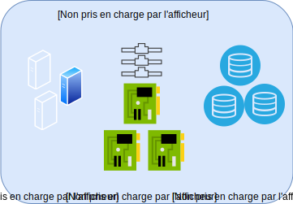

---

copyright:

  years:  2019

lastupdated: "2019-08-06"

keywords: vmware solutions shared, get started shared, tech specs shared

subcollection: vmware-solutions

---

{:external: target="_blank" .external}
{:tip: .tip}
{:note: .note}
{:important: .important}

# Présentation des solutions IBM Cloud for VMware - Shared
{: #shared_overview}

{{site.data.keyword.vmwaresolutions_full}} - Shared est fourni en tant qu'offre expérimentale.
{:note}

Avec des centres de données virtuels VMware, vous pouvez migrer ou déployer rapidement et en toute transparence des charges de travail VMware vers le cloud au-dessus de votre infrastructure VMware gérée de manière professionnelle. IBM fournit une plateforme cloud computing VMware à la demande en libre-service avec vCloud Director s'exécutant sur {{site.data.keyword.cloud_notm}}. 
Cette offre d'infrastructure sous forme de service (IaaS) de type "paiement à la carte" permet aux utilisateurs de consommer des vCPU, du stockage, de la mémoire vRAM, des réseaux et IP spécifiques, selon leurs besoins.

{{site.data.keyword.vmwaresolutions_short}} dispose de trois types de service d'abonnement "infrastructure en tant que service" (IaaS) :
- Centre de données virtuel réservé mutualisé
- Centre de données virtuel paiement à la carte mutualisé
- Centre de données virtuel dédié à service exclusif

Les clients gèrent le cycle de vie des centres de données virtuels à l'aide de l'offre {{site.data.keyword.vmwaresolutions_short}}. Les fonctions suivantes sont prises en charge, soit à l'aide de l'interface utilisateur Web ou de l'API publique :
- Création de centre de données virtuel
- Elasticité du centre de données virtuel
- Suppression du centre de données virtuel
- Ajout et suppression de services VMware
- Octroi de licence Windows à la demande
- Octroi de licence Red Hat à la demande

Les trois offres de centre de données virtuel {{site.data.keyword.cloud_notm}} sont fournies en standard avec cinq adresses IP publiques sur une passerelle de service NSX Edge avec une entrée illimitée sur le réseau public. 

Les centres de données virtuels impliquent des frais pour les composants suivants :
- Allocations de stockage avec tarification différenciée en fonction des performances de stockage
- Utilisation de l'UC virtuelle
- Utilisation de la mémoire virtuelle
- Sortie sur le réseau public
- Licences de système d'exploitation commercial utilisées
- Services VMware facultatifs

## Architecture des solutions IBM Cloud for VMware - Shared
{: #shared_overview-archi}

Le graphique suivant décrit l'architecture de haut niveau et les composants d'un déploiement {{site.data.keyword.vmwaresolutions_short}} - Shared.

Architecture 

### VMware vCloud Director
{: #shared_overview-vcloud-dir}

Cette couche représente l'interface de gestion. VMware® vCloud Director fournit un accès basé sur les rôles à un portail Web mutualisé qui permet aux membres d'une organisation d'interagir avec les ressources de l'organisation afin de créer et d'utiliser des applications virtuelles et des machines virtuelles.

### Organisation
{: #shared_overview-org}

Une organisation est une unité d'administration pour une collection d'utilisateurs, de groupes et de ressources informatiques. Les utilisateurs s'authentifient au niveau de l'organisation, en fournissant des données d'identification établies par l'administrateur de l'organisation lors de la création ou de l'importation de l'utilisateur. Les administrateurs d'une organisation gèrent les utilisateurs, les groupes et les catalogues de l'organisation.

### Utilisateurs et politiques
{: #shared_overview-users-policies}

Une organisation peut contenir un nombre arbitraire d'utilisateurs et de groupes. Les utilisateurs peuvent être créés localement par l'administrateur de l'organisation ou importés à partir d'un service d'annuaire tel que LDAP. Les autorisations au sein d'une organisation sont contrôlées par l'attribution de droits et de rôles aux utilisateurs et aux groupes.

### Catalogues
{: #shared_overview-cat}

Les organisations utilisent des catalogues pour stocker des modèles d'application virtuelle (vApp) et des fichiers de support. Les membres d'une organisation qui ont accès à un catalogue peuvent utiliser les modèles vApp du catalogue et les fichiers de support pour créer leurs propres vApp. Les administrateurs d'organisation peuvent créer des éléments à partir de catalogues publics dans leur catalogue d'organisations.

### Centres de données virtuels
{: #shared_overview-vc}

Un centre de données virtuel d'une organisation fournit des ressources à une organisation. Les centres de données virtuels fournissent un environnement dans lequel stocker, déployer et exploiter des systèmes virtuels. Ils fournissent également de l'espace de stockage pour les supports CD et DVD virtuels. Une organisation peut avoir plusieurs centres de données virtuels.

## Spécifications techniques pour les solutions IBM Cloud for VMware - Shared
{: #shared_overview-specs}

Les composants suivants sont inclus dans votre {{site.data.keyword.cloud_notm}} :

### Calcul
{: #shared_overview-specs-comp}

Le traitement des calculs est alloué aux centres de données virtuels par incréments d'UC virtuelles (vCPU). Chaque incrément vCPU représente un seul noyau de 2,0 GHz. La mémoire de calcul est allouée en incréments de Go.

### Utilisation en réseau
{: #shared_overview-specs-net}

Par défaut, chaque centre de données virtuel est configuré avec une passerelle Edge avec cinq adresses IP publiques et une adresse IP de service privé. La passerelle Edge est configurable et personnalisable par l'utilisateur.

Les adresses publiques peuvent être utilisées pour les applications virtuelles (vApp) côté public du trafic Internet public entrant ou sortant.

L'adresse de service peut être utilisée pour l'accès aux services d'infrastructure IBM Cloud sur le réseau privé interne IBM Cloud, y compris les services suivants :
- NTP
- Mises à jour et octroi de licence de système d'exploitation Windows
- Mises à jour et octroi de licence de système d'exploitation Red Hat
- Stockage d'objets Cloud

### Stockage
{: #shared_overview-specs-storage}

Lorsque vous créez ou déployez des applications virtuelles ou des machines virtuelles, une politique de stockage est sélectionnée. Il existe quatre niveaux de stockage différents, en fonction des performances de stockage requises:

- NFS Platinum : niveau de stockage avec un débit maximal de 10 IOPS/Go ; les performances les plus élevées
- NFS Gold : niveau de stockage avec un débit maximal de 4 IOPS/Go
- NFS Silver : niveau de stockage avec un débit maximal de 2 IOPS/Go
- NFS Bronze : niveau de stockage avec un débit maximal de 0.25 IOPS/Go

## Liens connexes
{: #shared_overview-related}

* [Commande de la solution Shared - On-demand](/docs/services/vmwaresolutions/services?topic=vmware-solutions-shared_ordering_ondemand)
* [Commande de la solution Shared - Reserved](/docs/services/vmwaresolutions/services?topic=vmware-solutions-shared_ordering_reserved)
* [Gestion des solutions {{site.data.keyword.cloud_notm}} for VMware - Shared](/docs/services/vmwaresolutions/services?topic=vmware-solutions-shared_managing)
* [VMware vCloud Director](https://docs.vmware.com/en/vCloud-Director/9.7/com.vmware.vcloud.tenantportal.doc/GUID-74C9E10D-9197-43B0-B469-126FFBCB5121.html){:external}
