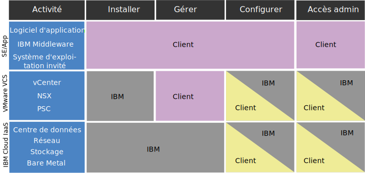

---

copyright:

  years:  2016, 2019

lastupdated: "2019-06-17"

keywords: vCenter Server compliance, compliance info, vCenter Server policy

subcollection: vmware-solutions

---

{:tip: .tip}
{:note: .note}
{:important: .important}

# Informations de conformité relatives aux instances vCenter Server
{: #vc_compl_info}

Passez en revue les informations suivantes pour obtenir des détails relatifs à la conformité pour les instances VMware vCenter Server.

L'offre VMware vCenter Server on {{site.data.keyword.cloud_notm}} with NSX-T n'est pas prise en charge pour les clients HIPAA.
{:important}

## Responsabilité du client ou d'IBM pour vCenter Server on IBM Cloud
{: #vc_compl_info-responsibility}

Le diagramme suivant fournit des détails sur les responsabilités du client (vous) et d'IBM concernant les activités de conformité.

## Restrictions liées aux données de santé
{: #vc_compl_info-health-data-restrictions}

Les termes de cette section s'appliquent à l'ensemble du portefeuille {{site.data.keyword.vmwaresolutions_full}}.

### HIPAA
{: #vc_compl_info-hipaa}

Nonobstant les informations de la fiche technique de ce service cloud relatives à la loi Health Insurance Portability Accountability Act de 1996 ("HIPAA") et l'utilisation autorisée des informations sur la santé et des données de santé en tant que types de données personnelles et/ou catégories spéciales de données personnelles (collectivement appelées "données de santé") avec ce service cloud, l'utilisation des données de santé avec ce service cloud est soumise aux conditions et limitations suivantes :

{{site.data.keyword.vmwaresolutions_short}}

Seules les offres mentionnées ci-dessus peuvent être mises à disposition pour implémenter les contrôles de la loi HIPAA sur la confidentialité et la sécurité des données pour une utilisation avec les données de santé si le client informe préalablement IBM qu'il utilisera des données de santé avec le service cloud et qu'IBM confirme par écrit que le service cloud sera mis à disposition pour l'utilisation des données de santé. En conséquence, le service cloud ne pourra pas être utilisé pour la transmission, le stockage ou tout autre utilisation des données de santé protégées dans le cadre de la loi HIPAA, sauf si (i) le client communique cette notification à IBM ; (ii) IBM et le client concluent un accord de partenariat accrédité applicable ; et (iii) IBM fournit au client la confirmation par écrit que le service cloud peut être utilisé avec des données de santé. En aucun cas le service cloud ne pourra être utilisé pour le traitement de renseignements médicaux protégés comme documentation de soins au sens de la loi HIPAA.

En cas d'incident système, un fournisseur de service tiers peuvent demander le débogage d'artefacts depuis le client (journaux, vidages de mémoire centrale, etc.). Il incombe au client de collecter et transmettre ces artefacts au fournisseur tiers. L'équipe de support IBM peut porter assistance au client en lui fournissant des liens vers de la documentation ou des instructions via des sessions de partage d'écran. Cependant, il incombe au client de nettoyer les données contenues dans d'éventuels renseignements médicaux protégés et de s'assurer qu'elles sont correctement chiffrées avant de les transmettre. Il revient également au client de déterminer s'il doit conclure un accord de partenariat accrédité avec le fournisseur tiers avant l'envoi des données.

## Informations personnelles et données réglementées
{: #vc_compl_info-personal-info-and-regulated-data}

Ce service cloud n'est pas destiné à des exigences de sécurité spécifiques pour un contenu réglementé, par exemple, des informations personnelles ou des informations personnelles sensibles. Il appartient au client de déterminer si ce service cloud répond à ses besoins par rapport au type de contenu qu'il utilise dans le cadre du service cloud.

## Configurations de règles
{: #vc_compl_info-default-policy-config}

Le mot de passe vCenter généré pour les instances principales de vCenter Server est maintenant composé de 15 caractères. Auparavant, le mot de passe généré était la valeur par défaut vCenter de huit caractères. 

Tableau 1. Configurations de règles vCenter pour une nouvelle instance principale 

| Règle | Version 3.1 ou ultérieure | Version 3.0 ou antérieure  |
|:------------- |:------------------------------ |:------------- |
| Règle de mot de passe vCenter | Longueur minimale de 15 caractères | Longueur minimale de 8 caractères (valeur par défaut vCenter) |
| Règle de verrouillage vCenter | Maximum de trois tentatives de connexion infructueuses | Maximum de cinq tentatives de connexion infructueuses (valeur par défaut vCenter)  |
| Règle de verrouillage vCenter | 900 secondes entre les échecs de connexion | 180 secondes entre les échecs de connexion (valeur par défaut vCenter) |

Le mot de passe NSX Manager généré pour les instances principales de vCenter Server est maintenant composé de 15 caractères. Auparavant, le mot de passe généré comportait huit caractères. 

## Politique d'accès aux instances des clients
{: #vc_compl_info-policy-for-access-client-inst}

Les environnements VMware vCenter Server, distribués en tant que solutions {{site.data.keyword.vmwaresolutions_short}}, fournissent à nos clients une couche de plateforme de gestion VMware afin de leur permettre gérer les fonctions de virtualisation. Tout au long du cycle de vie des produits et services IBM Cloud for VMware, il peut s'avérer nécessaire de faire appel au support IBM pour garantir leur bon fonctionnement. Dans la plupart des cas, une intervention du support IBM résulte d'une demande du client (au moyen de la création d'un ticket de demande de service). Toutefois, dans de rares cas, le support IBM peut fournir de l'aide de manière proactive et sans qu'un ticket de demande de service ne soit créé par le client, afin de prévenir de futurs problèmes. Cet accès, qui s'effectue via le réseau de support interne IBM Cloud, est documenté dans un ticket de demande de service généré par le support IBM et fait l'objet d'une surveillance en continu de la part d'IBM Cloud SOC. Le support IBM ne peut en aucun cas modifier la configuration d'instance sans le consentement préalable du client. Le support IBM accède aux composants de gestion VMware et/ou aux composants de gestion IBM Cloud, mais jamais aux machines virtuelles ou aux applications du client.

## Support proactif
{: #vc_compl_info-proactive-support}

### Support proactif pour la mise à disposition initiale
{: #vc_compl_info-proactive-support-for-initial-provision}

* Durant le processus initial de commande et de mise à disposition d'une instance ou d'un service, le support IBM peut accéder aux instances et aux informations du client sans le prévenir préalablement, afin de s'assurer que les commandes sont correctement exécutées.
* Le support IBM surveille activement les opérations de cycle de vie des instances, par exemple, l'ajout de nouveaux hôtes, en plus des processus de commande, de mise à disposition et d'installation.
* Pour résoudre des problèmes qui sont survenus ou des incidents susceptibles de se produire, le support IBM peut exécuter un certain nombre d'actions, notamment passer en revue les caractéristiques d'une commande client, redémarrer les travaux d'automatisation, effectuer des opérations de rechargement de système d'exploitation ou créer des tickets de demande de service en utilisant le nom d'utilisateur et la clé d'API IBM Cloud du client.

### Support proactif pour les opérations d'état stabilisé
{: #vc_compl_info-proactive-support-for-steady-state-operations}

* Dans de rares cas, le support IBM peut avoir besoin d'accéder aux instances du client lors des opérations d'état stabilisé afin d'identifier et résoudre des incidents de manière proactive sur une instance ou de vérifier le fonctionnement des services ou composants mis à disposition.
* Cet accès s'effectue via le réseau de support interne IBM Cloud. Le support IBM ne peut en aucun cas modifier la configuration d'instance sans le consentement préalable du client.
* Le support IBM accède aux composants de gestion VMware et/ou aux composants de gestion IBM Cloud, mais jamais aux machines virtuelles ou aux applications du client.

### Tickets de demande de service
{: #vc_compl_info-support-tickets}

* Les environnements vCenter Server ne font pas l'objet d'une surveillance active de la part d'IBM et, en temps normal, le support IBM ne pénètre jamais dans la couche de gestion VMware s'il ne dispose pas d'un ticket de demande de service écrit par le client.
* Lorsqu'un client crée un ticket de demande de service pour une instance, un service ou un problème de mise à disposition, le ticket est rapidement affecté à l'équipe de support IBM appropriée qui devient la principale partie chargée de résoudre le problème.
* En raison du niveau de spécialisation requis pour maintenir une expertise technique optimale au niveau de l'équipe, il peut s'avérer nécessaire de faire appel à plus d'une équipe de support pour résoudre un problème logiciel spécifique. Cette situation est facilement gérée, car nos équipes de support sont toutes regroupées en réseau et fonctionnement comme une seule et même équipe pour résoudre tous les problèmes.
* Pour déterminer la cause du problème, IBM peut avoir besoin d'accéder aux informations liées à la panne qui sont contenues sur votre système ou de recréer l'incident pour obtenir des informations supplémentaires.
* Un ticket de demande de service créé par le client sert de confirmation attestant que le support IBM peut accéder à la couche de gestion VMware à des fins d'investigation, de débogage et d'analyse des besoins. En cas d'indisponibilité liée à des opérations de maintenance ou si des modifications doivent être apportées à l'environnement, le support IBM demande au client une confirmation écrite supplémentaire via des tickets dans le cadre du processus de gestion des modifications.
* Pour plus d'informations sur les tickets de demande de service, voir [Guide du support IBM](https://www-01.ibm.com/support/docview.wss?uid=ibm10733923) et [Contacter le support IBM](/docs/services/vmwaresolutions/vmonic?topic=vmware-solutions-trbl_support).

## Responsabilités du client
{: #vc_compl_info-client-responsibilities}

* Bien que nous recommandions aux clients de prendre certaines mesures pour renforcer la sécurité de leurs environnements, il convient de noter que certaines pratiques peuvent avoir des effets néfastes sur l'efficacité d'IBM Cloud for VMware.
* Les clients sont responsables des pare-feu qu'ils créent et des limitations qui en découlent sur les communications entre les composants IBM Cloud for VMware. Ces pare-feu peuvent également compromettre la capacité du support IBM à accéder aux instances du client et à résoudre les problèmes.
* Les clients sont chargés de chiffrer les données contenues dans leur système.
* Après le déploiement initial, l'automatisation de l'offre et le compte du client sont dissociés. Le client est autorisé et encouragé à modifier tous les mots de passe fournis par IBM dans le portail.
* Les données d'identification et les droits d'accès à vCenter sont créés durant les déploiements initiaux et fournis au client. Dans le cadre des conditions requises pour notre offre, le support IBM doit conserver un accès complet à la couche de gestion pour fournir une gestion du cycle de vie et un support à nos clients.
* Si des données d'identification, telles que des mots de passe, sont modifiées, le support IBM ne peut plus aider le client à récupérer des données d'identification perdues ou oubliées ni identifier et résoudre les incidents sur les environnements du client.
* Pour plus d'informations sur l'importance de ce sujet et sur les questions connexes, voir [Remarques relatives à la modification de mots de passe pour des composants NSX](/docs/services/vmwaresolutions/vcenter?topic=vmware-solutions-vc_networkingonvcenterserver#vc_networkingonvcenterserver-change-nsx-component-password-considerations) et [Remarques relatives à la modification des artefacts vCenter Server](/docs/services/vmwaresolutions/vcenter?topic=vmware-solutions-vcenter_chg_impact).

### Communication et identification et résolution des problèmes
{: #vc_compl_info-communication-troubleshooting}

* IBM ne garantit pas que ses produits sont exempts de défauts, mais s'efforce de corriger ces problèmes afin que ses produits fonctionnent correctement. Les clients ont un rôle essentiel à jouer dans le cadre de cet effort.
* Si le support IBM est disponible pour fournir une assistance tout au long du cycle de vie du produit, il peut être limité par les informations et l'accès fournis par le client.
* Il incombe au client de fournir des informations précises au moment où un incident se produit et de répondre rapidement au support IBM lorsque des informations supplémentaires sont nécessaires.
* Les clients doivent également suivre les instructions énoncées dans ce document afin de donner leur consentement pour le support proactif.
* S'il refuse de donner son consentement ou s'il ne respecte pas les instructions fournies, le client s'expose à un retard possible dans la résolution du problème causé par des délais de communication entre lui-même et l'équipe de support.
* Le client doit se préparer à effectuer des actions d'identification et de résolution des problèmes supplémentaires qui, sinon, seraient effectuées par le support IBM. IBM fournira la documentation et l'aide appropriées si nécessaire.

### Mesures de sécurité
{: #vc_compl_info-security-measures}

* Gestion de service cloud : il incombe au client de gérer l'administration, le fonctionnement, la maintenance et la sécurité des applications, y compris le logiciel intermédiaire sous-jacent.
* Intégrité et disponibilité du service : IBM communiquera au client toutes les notifications d'intrusion réseau détectées pour ce service cloud. Il est de la responsabilité du client d'évaluer l'impact de chaque notification signalée. Le client sera informé des pannes matérielles. La surveillance et le traitement des incidents liés au système d'exploitation ou aux logiciels relèvent de la responsabilité du client, avec la participation du support IBM si nécessaire.
* Consignation d'activité : le client est chargé de consigner les activités du système d'exploitation/système et de la base de données/des applications, si nécessaire.
* Chiffrement : le client est tenu de configurer et gérer l'ensemble du chiffrement (pour les données au repos et en transit), si nécessaire.
* Continuité des opérations et reprise après incident : le client est tenu de configurer et gérer tous les processus de continuité des opérations et de reprise après incident, si nécessaire.

### Services tiers
{: #vc_compl_info-third-party-services}

* Un logiciel ou code tiers est inclus ou fourni avec certaines de nos offres IBM. Ce code est inclus pour plus de commodité mais il n'est pas considéré comme faisant partie du Logiciel IBM.
* Ces Logiciels non IBM sont directement proposés sous licence par leurs fournisseurs. Le client accepte d'utiliser les Logiciels non IBM conformément aux dispositions du fournisseur. Ils sont fournis dans le cadre du contrat de licence IBM qui accompagne l'offre IBM au moment de l'achat.
* IBM effectue des tests visant à garantir la compatibilité des produits tiers avec les Logiciels IBM et leur bon fonctionnement.
* Le support des Logiciels IBM effectuera un diagnostic des problèmes du client en utilisant sa connaissance du fonctionnement de nos offres IBM avec les Logiciels tiers. Une fois qu'il est établi que le Logiciel IBM fonctionne correctement, si le problème persiste, IBM doit diriger le client vers le fournisseur tiers pour obtenir un diagnostic plus approfondi.
* Pour plus d'informations sur les responsabilités du client concernant les logiciels ou le code tiers, voir [Guide du support IBM](https://www-01.ibm.com/support/docview.wss?uid=ibm10733923).

## Consentement pour l'accès aux environnements du client
{: #vc_compl_info-consent-to-access-client-environment}

* Le support IBM doit pouvoir accéder aux instances du client afin de pouvoir garantir leur mise à disposition et leur maintenance de façon appropriée. Il incombe aux clients de contrôler et fournir les droits d'accès requis.
* Un ticket de demande de service écrit par le client sert de confirmation et de consentement autorisant le support IBM à accéder à une instance du client pour évaluer les problèmes décrits dans ledit ticket de demande de service.
* Les clients doivent suivre les instructions énoncées dans ce document afin de donner leur consentement pour le support proactif. S'il refuse de donner son consentement ou s'il ne respecte pas les instructions fournies, le client s'expose à un retard dans l'identification et la résolution du problème causé par des délais de communication entre lui-même et l'équipe de support, et à des opérations d'identification et résolution des problèmes supplémentaires.

## Mise à disposition initiale
{: #vc_compl_info-initial-provision}

* Ce document est présenté au client lors du processus initial de commande et de mise à disposition.
* En soumettant la commande, le client accepte ces dispositions et de ce fait, autorise le support IBM à accéder à ses instances à tout moment, sans notification préalable, afin de résoudre immédiatement les problèmes liés à l'environnement ou prévenir de futurs incidents.
* Ce consentement s'applique à toutes les instances actuellement commandées, tout au long de leur cycle de vie. Les instances et les composants d'instance qui seront mis à disposition ultérieurement pourront nécessiter un consentement supplémentaire.

## Opérations d'état stabilisé
{: #vc_compl_info-steady-state-operations}

Si le client n'a pas donné son consentement pour le support proactif d'une instance lors du processus initial de commande et de mise à disposition, il doit ajouter un consentement explicite dans les éventuels futurs tickets de demande de service, le cas échéant. Les déclarations de consentement doivent être conformes aux instructions énoncées, faute de quoi, elles seront considérées comme nulles et non avenues.

## Liens connexes
{: #vc_compl_info-related}

* [Présentation de vCenter Server](/docs/services/vmwaresolutions/vcenter?topic=vmware-solutions-vc_vcenterserveroverview)
* [Contacter le support IBM](/docs/services/vmwaresolutions/vmonic?topic=vmware-solutions-trbl_support)
