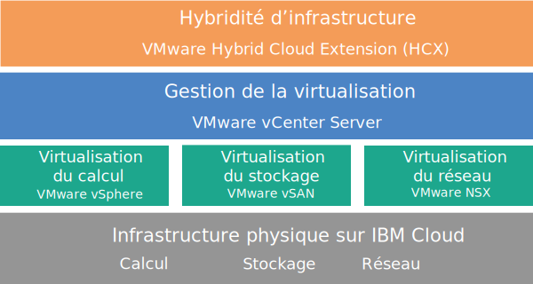

---

copyright:

  years:  2016, 2018

lastupdated: "2018-07-18"

---

# Présentation de vCenter Server with Hybridity Bundle

vCenter Server with Hybridity Bundle est une instance disponible en V2.3 et dans les éditions ultérieures.

The VMware vCenter Server on {{site.data.keyword.cloud}} with Hybridity Bundle est un cloud privé hébergé qui offre la pile VMware vSphere en tant que service. L'environnement VMware, qui est construit par dessus quatre serveurs {{site.data.keyword.baremetal_short}} {{site.data.keyword.cloud_notm}}, inclut VMware vSAN comme stockage dédié, fournit un déploiement et une configuration automatiques d'un pare-feu périphérique logique simple à gérer optimisé pour VMware NSX et comprend le service VMware HCX on {{site.data.keyword.cloud_notm}}.

Dans de nombreux cas, l'ensemble de l'environnement peut être mis à disposition en moins d'une journée et l'infrastructure bare metal peut rapidement et de manière élastique augmenter ou diminuer en fonction des besoins de la capacité de calcul.

Pour augmenter la capacité d'un stockage basé sur vSAN d'un cluster vSAN, vous pouvez ajouter d'autres serveurs ESXi après le déploiement.

Vous pouvez mettre à niveau l'édition Advanced de VMware NSX vers l'édition Enterprise et vous pouvez acheter des composants VMware supplémentaires, tels que VMware vRealize Operations.

Vous pouvez ajouter IBM Managed Services si vous voulez décharger les opérations quotidiennes et la maintenance de la virtualisation, du système d'exploitation invité ou des couches application. L'équipe {{site.data.keyword.cloud_notm}} Professional Services est également disponible pour vous aider à accélérer votre transition vers le cloud en vous offrant des services de migration, d'implémentation, de planification et d'intégration.

## Architecture vCenter Server with Hybridity Bundle

Le graphique suivant décrit l'architecture de haut niveau et les composants d'un déploiement vCenter Server with Hybridity Bundle à trois noeuds.

Figure 1. Architecture vCenter Server with Hybridity Bundle de haut niveau

### Infrastructure physique

Cette couche fournit l'infrastructure physique (ressources de calcul, de stockage et réseau) qu'utilise l'infrastructure virtuelle.

### Infrastructure de virtualisation (calcul, stockage et réseau)

Cette couche virtualise l'infrastructure physique par le biais de différents produits VMware :
* VMware vSphere virtualise les ressources de calcul physiques.
* VMware Virtual SAN (vSAN) fournit un stockage partagé défini par les logiciels basé sur le stockage des serveurs physiques.
* VMware NSX est la plateforme de virtualisation réseau qui fournit les composants de mise en réseau logique et les réseaux virtuels.

### Gestion de la virtualisation

Cette couche se compose du dispositif vCenter Server Appliance (vCSA), de NSX Manager, de deux passerelles NSX ESG, de trois contrôleurs NSX, du dispositif virtuel PSC (Platform Services Controller) et de l'instance de serveur virtuel IBM CloudDriver. L'instance de serveur virtuel CloudDriver est déployée à la demande en fonction des besoins de certaines opérations, telles que l'ajout d'hôtes à l'environnement. 

L'offre de base est déployée avec un dispositif vCenter Server dimensionné de manière à prendre en charge un environnement comportant jusqu'à 400 hôtes et jusqu'à 4000 machines virtuelles. Les mêmes outils et scripts compatibles API vSphere peuvent être utilisés pour gérer l'environnement VMware hébergé par IBM.

Au total, l'offre de base nécessite 38 UC virtuelles et 67 Go de vRAM réservés pour la couche de gestion de la virtualisation. La capacité hôte restante pour vos machines virtuelles dépend de plusieurs facteurs, tels que le taux de dépassement de capacité, le dimensionnement des machines virtuelles et les besoins de performances de la charge de travail.

Pour connaître les besoins en ressources de gestion supplémentaires lors du déploiement du service HCX on {{site.data.keyword.cloud_notm}}, voir [Présentation de VMware HCX on {{site.data.keyword.cloud_notm}}](../services/hcx_considerations.html).

### Hybridité d'infrastructure

Cette couche fournit une abstraction de ressources entre les sites locaux et les sites {{site.data.keyword.cloud_notm}} de sorte que vous pouvez déplacer les charges de travail vers l'arrière et vers l'avant facilement et en toute sécurité sans avoir à modifier les caractéristiques des machines virtuelles, par exemple, leurs adresses IP.

Sur la base de VMware Hybrid Cloud Extension (HCX), vous pouvez créer des interconnexions à couplage lâche entre les sites locaux et les sites {{site.data.keyword.cloud_notm}} afin d'activer la migration en bloc de machines virtuelles ou le déplacement opérationnel de machines virtuelles via vMotion, sans temps d'indisponibilité.

## Spécifications techniques relatives aux instances vCenter Server with Hybridity Bundle

Les composants suivants sont inclus dans votre instance vCenter Server with Hybridity Bundle :

**Remarque :** la disponibilité et la tarification des configurations matérielles normalisées peuvent varient en fonction de l'{{site.data.keyword.CloudDataCent_notm}} sélectionné pour le déploiement.

### Serveur bare metal

Quatre serveurs {{site.data.keyword.baremetal_short}} personnalisés sont inclus avec votre commande vCenter Server with Hybridity Bundle. Les modèles d'UC suivants sont disponibles :
  * Génération Intel Broadwell 2 UC (série Intel Xeon E5-2600 v4)
  * Génération Intel Skylake 2 UC (série Intel Xeon 4100/5100/6100)

### Utilisation en réseau

Les composants réseau suivants sont commandés :
*  Liaisons montantes réseau public et privé double de 10 Gbps
*  Trois VLAN (réseaux locaux virtuels) : un VLAN public et deux VLAN privés
*  Un VXLAN (réseau local virtuel extensible) avec routeur logique distribué (DLR) pour éventuelle communication d'est en ouest entre des charges de travail locales connectées à des réseaux de la couche 2 (L2). Le VXLAN est déployé en tant qu'exemple de topologie de routage, que vous pouvez modifier, à partir duquel vous pouvez construire et que vous pouvez supprimer. Vous pouvez également ajouter des zones de sécurité en connectant d'autres VXLAN aux nouvelles interfaces logiques sur le DLR.
*  Deux passerelles de services périphériques VMware NSX :
  * Une passerelle de gestion sécurisée VMware NSX Edge Services Gateway (ESG) pour le trafic de gestion HTTPS sortant, déployée par IBM dans le cadre de la topologie de réseau de gestion. Les machines virtuelles de gestion IBM utilisent cette passerelle ESG pour communiquer avec des composants de gestion IBM externes spécifiques liés à l'automatisation. Pour plus d'informations, voir [Configuration du réseau en vue d'utiliser la passerelle ESG gérée par le client](../vcenter/vc_esg_config.html#configuring-your-network-to-use-the-customer-managed-nsx-esg-with-your-vms).

    **Important** : vous n'avez pas accès à cette passerelle ESG et vous ne pouvez pas l'utiliser. Si vous la modifiez, vous ne pourrez peut-être plus gérer l'instance vCenter Server with Hybridity Bundle depuis la console {{site.data.keyword.vmwaresolutions_short}}. De plus, sachez que si vous utilisez un pare-feu ou désactivez les communications ESG vers des composants de gestion IBM externes, {{site.data.keyword.vmwaresolutions_short}} sera inutilisable.
  * Une passerelle VMware NSX Edge Services Gateway sécurisée gérée par le client pour le trafic de charge de travail HTTPS sortant et entrant, déployée par IBM en tant que modèle que vous pouvez modifier pour fournir un accès au réseau privé virtuel ou un accès public. Pour plus d'informations, voir [La passerelle NSX Edge gérée par le client présente-t-elle un risque pour la sécurité ?](../vmonic/faq.html#does-the-customer-managed-nsx-edge-pose-a-security-risk-).

Pour plus d'informations sur les composants de mise en réseau commandés lors du déploiement du service HCX on {{site.data.keyword.cloud_notm}}, voir [Présentation de HCX on {{site.data.keyword.cloud_notm}}](../services/hcx_considerations.html).

### Instance de serveur virtuel

Les instances de serveur virtuel suivantes sont commandées :
* Une instance de serveur virtuel pour IBM CloudBuilder, fermée une fois le déploiement de l'instance terminé.
* Vous pouvez choisir de déployer une seule instance de serveur virtuel Microsoft Windows Server pour Microsoft Active Directory (AD) ou deux machines virtuelles à haute disponibilité Microsoft Windows dans le cluster de gestion pour plus de sécurité et de robustesse.

### Stockage

Le stockage vSAN offre des configurations personnalisées, avec différentes options en matière de quantité de disques et de type de disque :
* Quantité de disques : 2, 4, 6 ou 8.
* Disque de stockage : SSD SED de 960 Go, SSD SED de 1,9 To ou SSD SED de 3,8 To.

  De plus, 2 disques cache de 960 Go par hôte sont également commandés.

### Licences fournies par IBM et frais

Les licences suivantes sont incluses avec votre commande d'instance vCenter Server with Hybridity Bundle.

* VMware vSphere Enterprise Plus 6.5u1
* VMware vCenter Server 6.5
* VMware NSX Service Providers Edition (Advanced ou Enterprise) 6.4
* VMware vSAN (Advanced ou Enterprise) 6.6

Des frais supplémentaires de support et de services peuvent s'appliquer.

## Spécifications techniques relatives aux noeuds d'extension vCenter Server with Hybridity Bundle

Chaque noeud d'extension vCenter Server with Hybridity Bundle déployé génère des frais, imputés à votre compte {{site.data.keyword.cloud_notm}}, pour les composants suivants.

### Matériel pour les noeuds d'extension

Un serveur bare metal avec la configuration personnalisée.

### Licences et frais pour les noeuds d'extension

* Une pour VMware vSphere Enterprise Plus 6.5u1
* Une pour VMware NSX Service Providers Edition (Advanced ou Enterprise) 6.4
* Frais de support et de services
* VMware vSAN (Advanced ou Enterprise) 6.6

**Important** : vous devez gérer les composants {{site.data.keyword.vmwaresolutions_short}} créés dans votre compte {{site.data.keyword.cloud_notm}} uniquement depuis la console {{site.data.keyword.vmwaresolutions_short}}, et non depuis le portail	{{site.data.keyword.slportal}} ou autre élément extérieur à la console. Si vous modifiez ces composants en dehors de la console {{site.data.keyword.vmwaresolutions_short}}, les modifications ne sont pas synchronisées avec la console.

**ATTENTION** : gérer des composants {{site.data.keyword.vmwaresolutions_short}} (installés dans votre compte {{site.data.keyword.cloud_notm}} lors de la commande de l'instance) en dehors de la console {{site.data.keyword.vmwaresolutions_short}} risque d'entraîner une instabilité de votre environnement. Ces activités de gestion incluent :
*  L'ajout, la modification, le retour ou la suppression de composants
*  L'extension ou la réduction de la capacité de l'instance via l'ajout ou la suppression de serveurs ESXi
*  La mise hors tension de composants
*  Le redémarrage de services

   Seules les activités de gestion des partages de fichiers du stockage partagé depuis le portail {{site.data.keyword.slportal}} font exception. Il s'agit des activités suivantes : commande, suppression (pouvant avoir un impact sur des magasins de données éventuellement montés), accord d'autorisation et montage de partages de fichiers de stockage partagé.

### Liens connexes

* [Nomenclature du logiciel vCenter Server](vc_bom.html)
* [Exigences et planification pour les instances vCenter Server with Hybridity Bundle](vc_hybrid_planning.html)
* [Commande d'instances vCenter Server with Hybridity Bundle](vc_hybrid_orderinginstance.html)
* [Présentation de HCX on {{site.data.keyword.cloud_notm}}](../services/hcx_considerations.html)
* [Contacter le support IBM](../vmonic/trbl_support.html)
