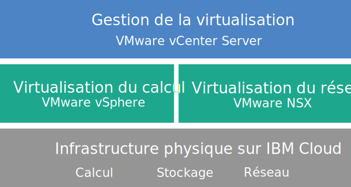

---

copyright:

  years:  2016, 2018

lastupdated: "2018-11-05"

---

{:tip: .tip}
{:note: .note}
{:important: .important}

# Présentation de vCenter Server

VMware vCenter Server sur {{site.data.keyword.cloud}} est un cloud privé hébergé qui offre la pile VMware vSphere en tant que service. L'environnement VMware, constitué au-dessus d'un minimum de deux (trois recommandé) serveurs {{site.data.keyword.cloud_notm}} {{site.data.keyword.baremetal_short}}, offre un stockage sur réseau partagé et des options de stockage à définition logicielle dédié. Il inclut également la configuration et le déploiement automatique d'un pare-feu périphérique logique simple à gérer optimisé pour VMware NSX.

Dans de nombreux cas, l'ensemble de l'environnement peut être mis à disposition en moins d'une journée et l'infrastructure bare metal peut rapidement et de manière élastique augmenter ou diminuer en fonction des besoins de la capacité de calcul.

Après le déploiement, vous pouvez augmenter le stockage partagé en commandant davantage de partages de fichiers NFS (Network File System) à partir du portail {{site.data.keyword.slportal}} et en les connectant manuellement à tous les serveurs ESXi d'un cluster. Si vous avez besoin d'un stockage dédié, [NetApp ONTAP Select on {{site.data.keyword.cloud_notm}}](../netapp/np_netappoverview.html) est offert en configuration hautes performances (entièrement SSD) et en configuration haute capacité (entièrement SATA).

VMware vSAN est également disponible en tant qu'option de stockage dédié. Pour augmenter la capacité d'un stockage basé sur vSAN d'un cluster vSAN, vous pouvez ajouter d'autres serveurs ESXi après le déploiement.

Si vous avez acheté une licence VMware fournie par IBM, vous pouvez mettre l'édition de base VMware NSX au niveau Advanced ou Enterprise et vous pouvez acheter davantage de composants VMware, tels que VMware vRealize Operations.

Vous pouvez ajouter des services gérés par IBM si vous voulez décharger les opérations quotidiennes et la maintenance de la virtualisation, du système d'exploitation invité ou des couches application. L'équipe {{site.data.keyword.cloud_notm}} Professional Services est également disponible pour vous aider à accélérer votre transition vers le cloud en vous offrant des services de migration, d'implémentation, de planification et d'intégration.

## Architecture vCenter Server

Le graphique suivant décrit l'architecture de haut niveau et les composants d'un déploiement vCenter Server à trois noeuds.

Figure 1. Architecture vCenter Server de haut niveau pour un cluster à trois noeuds 

### Infrastructure physique

Cette couche fournit l'infrastructure physique (ressources de calcul, de stockage et réseau) qu'utilise l'infrastructure virtuelle.

### Infrastructure de virtualisation (calcul et réseau)

Cette couche virtualise l'infrastructure physique par le biais de différents produits VMware :
* VMware vSphere virtualise les ressources de calcul physiques.
* VMware NSX est la plateforme de virtualisation réseau qui fournit les composants de mise en réseau logique et les réseaux virtuels.

### Gestion de la virtualisation

Cette couche se compose du dispositif vCenter Server Appliance (vCSA), de NSX Manager, de deux passerelles NSX ESG, de trois contrôleurs NSX, du dispositif virtuel PSC (Platform Services Controller) et de l'instance de serveur virtuel IBM CloudDriver. L'instance de serveur virtuel CloudDriver est déployée à la demande en fonction des besoins de certaines opérations, telles que l'ajout d'hôtes à l'environnement.

L'offre de base est déployée avec un dispositif vCenter Server dimensionné de manière à prendre en charge un environnement comportant jusqu'à 400 hôtes et jusqu'à 4000 machines virtuelles. Les mêmes outils et scripts compatibles API vSphere peuvent être utilisés pour gérer l'environnement VMware hébergé par IBM.

Au total, l'offre de base nécessite 38 UC virtuelles et 67 Go de vRAM réservés pour la couche de gestion de la virtualisation. La capacité hôte restante pour vos machines virtuelles dépend de plusieurs facteurs, tels que le taux de surabonnement, le dimensionnement des machines virtuelles et les besoins de performances de la charge de travail.

Pour plus d'informations sur l'architecture, voir [Référence de l'architecture {{site.data.keyword.vmwaresolutions_short}}](../archiref/solution/solution_overview.html).

## Spécifications techniques relatives aux instances vCenter Server

Les composants suivants sont inclus dans votre instance vCenter Server.

La disponibilité et la tarification des configurations matérielles normalisées peuvent varier en fonction de l'{{site.data.keyword.CloudDataCent_notm}} sélectionné pour le déploiement.
{:note}

### Serveur bare metal

Vous pouvez commander trois serveurs {{site.data.keyword.baremetal_short}} ou plus dans l'une des configurations suivantes :
* **Skylake** : Génération Intel Skylake 2 UC (série Intel Xeon 4100/5100/6100) avec le modèle d'UC et la taille de mémoire RAM que vous avez sélectionnés.   
* **Certifiés SAP** : Sserveur {{site.data.keyword.baremetal_short}} avec le modèle d'UC que vous avez sélectionné. 
  * Processeur Dual Intel Xeon Gold 6140/36 coeurs au total, 2,3 GHz/192 Go de mémoire RAM
  * Processeur Dual Intel Xeon Gold 6140/36 coeurs au total, 2,3 GHz/384 Go de mémoire RAM
  * Processeur Dual Intel Xeon Gold 6140/36 coeurs au total, 2,3 GHz/768 Go de mémoire RAM
* **Broadwell** : Génération Intel Broadwell 2 UC (série Intel Xeon E5-2600 v4) avec le modèle d'UC et la taille de mémoire RAM que vous avez sélectionnés.   
     Si vous prévoyez d'utiliser un stockage vSAN, la configuration requiert quatre serveurs {{site.data.keyword.baremetal_short}}.
     {:note}
     
### Utilisation en réseau

Les composants réseau suivants sont commandés :
*  Liaisons montantes réseau public et privé double de 10 Gbps
*  Trois VLAN (réseaux locaux virtuels) : un VLAN public et deux VLAN privés
*  Un VXLAN (réseau local virtuel extensible) avec routeur logique distribué (DLR) pour éventuelle communication d'est en ouest entre des charges de travail locales connectées à des réseaux de la couche 2 (L2). Le VXLAN est déployé en tant qu'exemple de topologie de routage, que vous pouvez modifier, à partir duquel vous pouvez construire et que vous pouvez supprimer. Vous pouvez également ajouter des zones de sécurité en connectant des VXLAN supplémentaires aux nouvelles interfaces logiques sur le DLR.
*  Deux passerelles de services périphériques VMware NSX :
  * Une passerelle de gestion sécurisée VMware NSX Edge Services Gateway (ESG) pour le trafic de gestion HTTPS sortant, déployée par IBM dans le cadre de la topologie de réseau de gestion. Les machines virtuelles de gestion IBM utilisent cette passerelle ESG pour communiquer avec des composants de gestion IBM externes spécifiques liés à l'automatisation. Pour plus d'informations, voir [Configuration du réseau en vue d'utiliser la passerelle ESG gérée par le client](../vcenter/vc_esg_config.html#configuring-your-network-to-use-the-customer-managed-nsx-esg-with-your-vms).

    Cette passerelle ESG se nomme **mgmt-nsx-edge**. Vous n'avez pas accès à cette passerelle ESG et vous ne pouvez pas l'utiliser. Si vous la modifiez, vous ne pourrez plus gérer l'instance vCenter Server depuis la console {{site.data.keyword.vmwaresolutions_short}}. De plus, si vous utilisez un pare-feu ou désactivez les communications ESG vers des composants de gestion IBM externes, {{site.data.keyword.vmwaresolutions_short}} sera inutilisable.
    {:important}
  * Une passerelle VMware NSX Edge Services Gateway sécurisée gérée par le client pour le trafic de charge de travail HTTPS sortant et entrant. Cette passerelle est déployée par IBM en tant que modèle que vous pouvez modifier pour fournir un accès au réseau privé virtuel ou un accès public. Pour plus d'informations, voir [La passerelle NSX Edge gérée par le client présente-t-elle un risque pour la sécurité ?](../vmonic/faq.html#does-the-customer-managed-nsx-edge-pose-a-security-risk-)

### Instance de serveur virtuel

Les instances de serveur virtuel suivantes sont commandées :
* Une instance de serveur virtuel pour IBM CloudBuilder, fermée une fois le déploiement de l'instance terminé.
* (Pour les instances V2.2 et ultérieures) Vous pouvez choisir de déployer une seule instance de serveur virtuel Microsoft Windows Server pour Microsoft Active Directory (AD) ou deux machines virtuelles à haute disponibilité Microsoft Windows dans le cluster de gestion pour plus de sécurité et de robustesse.
* (Pour les instances V1.9 à V2.1) Une instance de serveur virtuel Microsoft Windows Server pour Microsoft Active Directory (AD) est déployée et peut être interrogée. L'instance de serveur virtuel fonctionne en tant que serveur de noms de domaine pour l'instance où sont enregistrés les hôtes et les machines virtuelles.
* (Pour les instances V1.8 et antérieures) Une instance de serveur virtuel pour la sauvegarde basée sur des instantanés des composants de gestion, qui continue à s'exécuter une fois le déploiement de l'instance terminé.

### Stockage

Lors du déploiement initial, vous avez le choix entre les options de stockage vSAN et NFS.

#### Stockage vSAN

L'option vSAN offre des configurations personnalisées, avec différentes options en matière de quantité de disques et de taille et de type de disque :
* Quantité de disques : 2, 4, 6 ou 8
* Disque de stockage : SSD SED de 960 Go, SSD SED de 1,9 To ou SSD SED de 3,8 To.

  De plus, deux disques cache de 960 Go par hôte sont également commandés.

  Les unités SSD (Solid State Disk) de 3,8 To sont prises en charge une fois qu'elles sont officiellement disponibles dans un centre de données.
  {:note}
* L'option Hautes performances avec Intel Optane, qui fournit deux baies de disques de capacité supplémentaires pour un total de dix disques de capacité. Cette option dépend du modèle d'UC.

#### Stockage NFS

L'option NFS offre un stockage de niveau fichier partagé personnalisé pour les charges de travail avec diverses options de taille et de performance :
* Taille : 1, 2, 4, 8 ou 12 To
* Performance : 2, 4 ou 10 E-S/s/Go.
* Configuration individuelle des partages de fichiers.

Si vous sélectionnez l'option NFS, un partage de fichiers de 2 To et 4 IOPS/Go pour les composants de gestion est commandé.

### Licences (fournies par IBM ou BYOL) et frais

* VMware vSphere Enterprise Plus 6.5u1
* VMware vCenter Server 6.5
* VMware NSX Service Providers Edition (Base, Advanced ou Enterprise) 6.4
* (Pour les clusters vSAN) VMware vSAN Advanced ou Enterprise 6.6
* Frais de prise en charge et de services (une licence par noeud)

## Spécifications techniques relatives aux noeuds d'extension vCenter Server

Chaque noeud d'extension vCenter Server déployé génère des frais, imputés à votre compte {{site.data.keyword.cloud_notm}}, pour les composants suivants.

### Matériel pour les noeuds d'extension

Un serveur bare metal doté de la configuration présentée dans [Spécifications techniques relatives aux instances vCenter Server](vc_vcenterserveroverview.html#technical-specifications-for-vcenter-server-instances).

### Licences et frais pour les noeuds d'extension

* Une pour VMware vSphere Enterprise Plus 6.5u1
* Une pour VMware NSX Service Providers Edition (Base, Advanced ou Enterprise) 6.4
* Frais de support et de services
* (Pour les clusters vSAN) VMware vSAN Advanced ou Enterprise 6.6

Vous devez gérer les composants {{site.data.keyword.vmwaresolutions_short}} créés dans votre compte {{site.data.keyword.cloud_notm}} uniquement depuis la console {{site.data.keyword.vmwaresolutions_short}}, et non depuis le portail	{{site.data.keyword.slportal}} ou tout autre élément extérieur à la console. Si vous modifiez ces composants en dehors de la console {{site.data.keyword.vmwaresolutions_short}}, les modifications ne sont pas synchronisées avec la console.
Gérer des composants {{site.data.keyword.vmwaresolutions_short}} (installés dans votre compte {{site.data.keyword.cloud_notm}} lors de la commande de l'instance) en dehors de la console {{site.data.keyword.vmwaresolutions_short}} risque d'entraîner une instabilité de votre environnement. Ces activités de gestion incluent :
*  L'ajout, la modification, le retour ou la suppression de composants
*  L'extension ou la réduction de la capacité de l'instance via l'ajout ou la suppression de serveurs ESXi
*  La mise hors tension de composants
*  Redémarrage des services
   Seules les activités de gestion des partages de fichiers du stockage partagé depuis le portail {{site.data.keyword.slportal}} font exception. Il s'agit des activités suivantes : commande, suppression (pouvant avoir un impact sur des magasins de données éventuellement montés), accord d'autorisation et montage de partages de fichiers de stockage partagé.
   {:important}

### Liens connexes

* [Nomenclature du logiciel vCenter Server](vc_bom.html)
* [Planification des instances vCenter Server](vc_planning.html)
* [Commande d'instances vCenter Server](vc_orderinginstance.html)
* [Stockage de fichiers et de blocs d'{{site.data.keyword.cloud_notm}}](https://www.ibm.com/cloud/garage/content/architecture/virtualizationArchitecture/shared-storage){:new_window}
