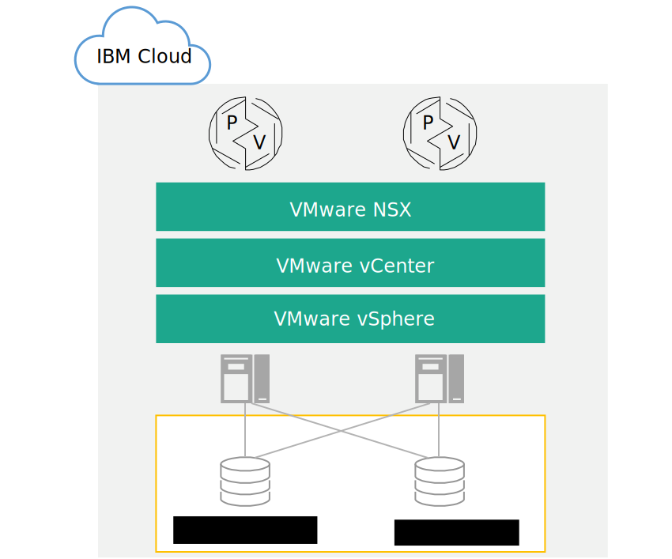

---

copyright:

  years:  2016, 2019

lastupdated: "2019-02-27"

---

{:tip: .tip}
{:note: .note}
{:important: .important}

# Progettazione dell'infrastruttura di archiviazione collegata
{: #storage-infra-design}

{{site.data.keyword.vmwaresolutions_full}} fornisce la tecnologia VMware che viene distribuita in modo automatizzato all'interno dei {{site.data.keyword.CloudDataCents_notm}} in tutto il mondo. All'interno del portfolio di soluzioni {{site.data.keyword.cloud_notm}}, l'offerta VMware vCenter Server on {{site.data.keyword.cloud_notm}} di base comprende fino a 10 cluster, ciascuno contenente fino a 59 host vSphere, un singolo PSC (Platform Services Controller) e un vCenter Server Appliance in grado di gestire fino a 400 host e 4.000 VM (Virtual Machine).

L'architettura qui presentata integra la soluzione vCenter Server aggiungendo l'archiviazione collegata come un dispositivo di archiviazione condivisa per l'ambiente. Il dispositivo di archiviazione collegato si trova nello stesso {{site.data.keyword.CloudDataCent_notm}} della distribuzione del vCenter Server e consiste in una singola condivisione NFS (Network file system) o più esportazioni NFS da {{site.data.keyword.cloud_notm}}.

Il seguente grafico fornisce l'architettura generale dell'archiviazione collegata sulla distribuzione di vCenter Server.

Figura 1. Architettura di alto livello dell'archiviazione collegata su {{site.data.keyword.cloud_notm}}

## Progettazione dell'infrastruttura fisica
{: #storage-infra-design-phys-infra-design}

L'infrastruttura fisica è costituita da tre componenti principali: il calcolo fisico, l'archiviazione fisica e la rete fisica. L'infrastruttura fisica include la rete di servizi {{site.data.keyword.cloud_notm}} e l'archiviazione fisica utilizzata dall'infrastruttura.

## Progettazione della rete fisica
{: #storage-infra-design-phys-net-design}

La rete fisica è gestita da {{site.data.keyword.cloud_notm}}. La seguente sezione descrive la rete fisica fornita da {{site.data.keyword.cloud_notm}} come si correla all'archiviazione collegata.

### Panoramica della rete di IBM Cloud
{: #storage-infra-design-ibm-cloud-net-ovw}

La rete fisica di {{site.data.keyword.cloud_notm}} è suddivisa in tre reti distinte: Pubblica, Privata e di Gestione. Per ulteriori informazioni sulle reti pubbliche, private e di gestione, vedi [Panoramica della soluzione](/docs/services/vmwaresolutions/archiref/solution?topic=vmware-solutions-solution_overview).

Per ulteriori informazioni sulla rete {{site.data.keyword.cloud_notm}}, vedi [The {{site.data.keyword.cloud_notm}} network](https://www.ibm.com/cloud-computing/bluemix/our-network){:new_window}.

Esamina le seguenti informazioni per una descrizione della rete dei servizi che fa parte della rete privata.

### Rete dei servizi privata
{: #storage-infra-design-private-net}

{{site.data.keyword.cloud_notm}} ha una rete dei servizi privati che fornisce servizi comuni quali l'archiviazione blocchi, l'archiviazione file, l'Object Storage, i resolver DNS e i server NTP. Questa rete privata è separata dalla rete privata del cliente e consente agli ambienti di connettersi senza soluzione di continuità ai servizi che si trovano in {{site.data.keyword.cloud_notm}}. La rete privata è multilivello in quanto i server ed altra infrastruttura sono connessi a switch BCS (back-end customer switch) aggregati. Questi switch aggregati sono collegati a una coppia di router separati, come ad esempio i BCR (back-end customer router), per la rete L3. La rete privata supporta anche la possibilità di utilizzare i frame Jumbo, come ad esempio MTU 9000, per connessioni all'host fisico.

### VLAN
{: #storage-infra-design-vlans}

Per ulteriori informazioni sulle VLAN, vedi la sezione _Progettazione della rete fisica_ in [Progettazione dell'infrastruttura fisica](/docs/services/vmwaresolutions/archiref/solution?topic=vmware-solutions-design_physicalinfrastructure).

## Progettazione dell'archiviazione fisica
{: #storage-infra-design-phys-storage-design}

La seguente sezione descrive la configurazione del dispositivo di archiviazione collegato che è presente in {{site.data.keyword.cloud_notm}}. Il dispositivo di archiviazione collegato integra la soluzione vCenter Server esistente. Di conseguenza, i dischi collegati localmente che sono interni agli host fisici non vengono presentati.

## Prestazioni dell'archiviazione collegata
{: #storage-infra-design-perf}

Le archiviazioni Performance e Endurance sono soluzioni di archiviazione {{site.data.keyword.cloud_notm}} progettate per supportare applicazioni ad elevato I/O che richiedono dei livelli prevedibili di prestazioni. Queste prestazioni prevedibili vengono raggiunte tramite l'assegnazione di IOPS (input/output operations per second) a livello di protocollo ai singoli volumi.

È possibile ordinare IOPS da 100 a 96.000 con dimensioni di archiviazione da 20 GB a 24 TB. I volumi di archiviazione Performance ed Endurance sono disponibili sia per l'archiviazione blocchi che per l'archiviazione file.

In questa progettazione la soluzione vCenter Server offre l'archiviazione Endurance per l'archiviazione collegata. Di conseguenza, puoi selezionare e collegare (mediante l'automazione) le esportazioni NFS Endurance in un intervallo di dimensioni che va da 20 GB a un massimo di 24 TB. {{site.data.keyword.cloud_notm}} consente a un massimo di 64 host vSphere ESXi di connettersi a una singola esportazione NFS Endurance.

Endurance è disponibile in tre livelli di prestazioni IOPS per supportare esigenze applicative diverse.

Dopo essere stata ordinata, una condivisione NFS può essere ridimensionata o riconfigurata per consentire più o meno IOPS.
{:note}

Per le opzioni IOPS dettagliate, vedi la sezione _Impostazioni di archiviazione_ in [Ordine di istanze vCenter Server](/docs/services/vmwaresolutions/vcenter?topic=vmware-solutions-vc_orderinginstance).

Oltre ai livelli di archiviazione, l'archiviazione Endurance di {{site.data.keyword.cloud_notm}} supporta un'ampia selezione di esigenze applicative, comprese le istantanee e la replica e la crittografia dei dati inattivi nelle ubicazioni {{site.data.keyword.CloudDataCent_notm}}.

## Link correlati
{: #storage-infra-design-related}

* [Panoramica della soluzione](/docs/services/vmwaresolutions/archiref/solution?topic=vmware-solutions-solution_overview)
