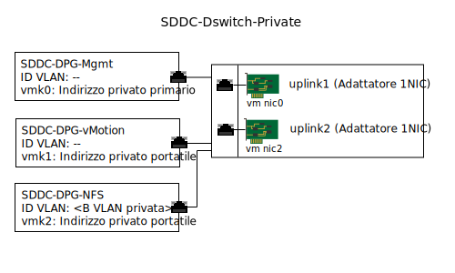

---

copyright:

  years:  2016, 2018

lastupdated: "2018-08-13"

---

# Gestione dell'infrastruttura di archiviazione collegata

La gestione dell'infrastruttura fa riferimento ai componenti VMware che stanno gestendo l'infrastruttura vSphere ESXi.

Per ulteriori informazioni sui componenti, vedi la Figura 2. Panoramica sulla rete NSX Manager in [Progettazione dell'infrastruttura virtuale](../solution/design_virtualinfrastructure.html).

## Progettazione della rete virtuale

La virtualizzazione di rete utilizzata in questa progettazione utilizza il vDS (vSphere Distributed Switch) esistente associato alla rete privata e specificato nell'[architettura {{site.data.keyword.vmwaresolutions_full}} ](../solution/solution_overview.html).

## vDS (vSphere Distributed Switch)

Come indicato in precedenza, un'altra VLAN viene creata all'interno della soluzione vCenter Server e utilizzata per collegare il punto di montaggio NFS agli host ESXi nel cluster esistente. Poiché la soluzione vCenter Server già ha un vDS (vSphere Distributed Switch) associato alla rete privata, un altro gruppo di porte viene creato e contrassegnato con tag con il numero VLAN aggiuntivo poiché questa VLAN aggiuntiva non è nativa.

La seguente tabella descrive le impostazioni predefinite del nuovo gruppo di porte.

**Importante**: non modificare queste impostazioni predefinite.

Tabella 1. Riepilogo del gruppo di porte NFS

| Nome gruppo di porte | SDDC-DPG-NFS |
|:--------------- |:------------ |
| Port binding | Static |
| VLAN type | Private VLAN B |
| Load balancing | Route base on originating virtual port |
| Active Uplinks | Uplink1 e Uplink2 |

Oltre alla creazione del gruppo di porte vDS per il traffico di archiviazione NFS, viene creata una porta VMkernel su ogni host vSphere ESXi nella distribuzione e viene assegnata al gruppo di porte SDDC-DPG-NFS. Alla porta VMkernel viene anche assegnato un indirizzo IP dalla sottorete portatile privata associata alla VLAN di archiviazione collegata, ossia la VLAN privata B, e la relativa MTU viene impostata su 9000 per supportare i frame Jumbo.

Figura 1. Gruppi di porte vDS private e uplink

### Instradamento statico host vSphere

Anche se il vDS è configurato con un nuovo gruppo di porte e una porta VMkernel è assegnata al gruppo di porte, la soluzione crea una rotta statica su ogni host vSphere ESXi nella distribuzione in modo che tutto il traffico NFS attraversi la VLAN e la sottorete per NFS. La rotta statica viene creata in `/etc/rc.local.d/local.sh` in modo che persista attraverso i riavvii host.

### Link correlati

* [Panoramica della soluzione](../solution/solution_overview.html)
