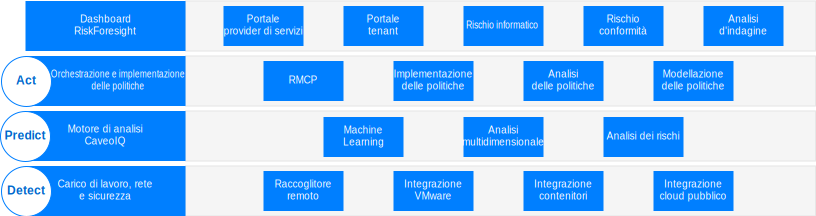
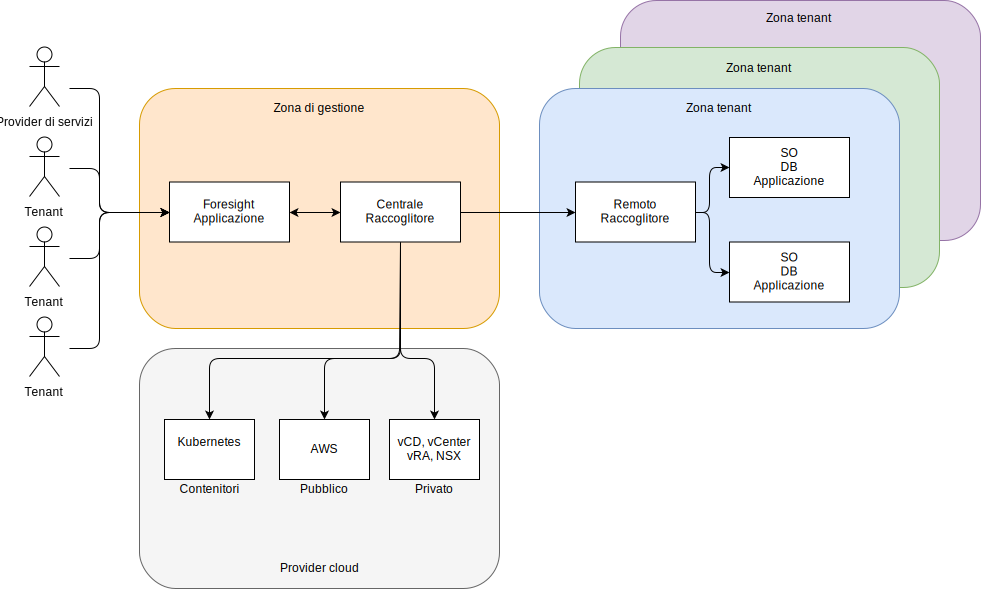

---

copyright:

  years:  2016, 2019

lastupdated: "2019-02-14"

---

# Panoramica dell'architettura per Caveonix RiskForesight
{: #caveonix-arch}

L'architettura di Caveonix RiskForesight è mostrata nel seguente diagramma.

Figura 1. Architettura per Caveonix RiskForesight

L'architettura di Caveonix RiskForesight ha quattro livelli:
-	Detect - il modulo Detect è completamente integrato nello stack VMware e in molti cloud pubblici. Utilizzando i plugin, RiskForesight utilizza vCenter e NSX Manager come repository di asset, raccogliendo dettagli sulle macchine virtuali (VM, Virtual machine), sulle reti e sui flussi di rete. I raccoglitori remoti scansionano i carichi di lavoro, i sistemi operativi e le applicazioni per consentire una visualizzazione “full-stack” di conformità e vulnerabilità.
-	Predict - il modulo Predict utilizza l'analisi per identificare gli asset rischiosi e i passi di attenuazione con i modelli di riduzione dei rischi per migliorare la posizione che hanno per quanto riguarda il rischio.
-	Act - il modulo Act implementa i passi di attenuazione in base alla priorità indicata e alle azioni protettive automatizzate per fornire una protezione del carico di lavoro proattiva contro i rischi imputabili a minacce informatiche.
    - RMCP – l'RMCP (Risk Management Control Plane) fornisce una protezione continua e proattiva dei carichi di lavoro monitorando il full-stack all'interno di data center cloud gestiti, pubblici e privati.
    - Gestore politiche - attualmente supporta tre tipi di lavori di machine learning per ogni organizzazione; Log Caveo, Reti Caveo, Scansione Caveo. In base alle anomalie rilevate nei dati, l'utente può configurare le politiche per intervenire in base alle condizioni definite dall'utente, selezionare il tipo di lavoro e configurare le condizioni booleane per il punteggio di anomalie e definire l'azione nel caso in cui la condizione ricorra (sia true). Ad esempio:
        - Lavoro: "Log Caveo" Il punteggio dell'anomalia è > 90 allora contrassegna l'asset per la quarantena e invia una notifica al canale slack.
        - Lavoro: "Rete Caveo" Il punteggio dell'anomalia è > 95 quindi metti in quarantena l'asset e invia una notifica email e invia anche una notifica IU.
- Dashboard - i dashboard, mediante l'accesso basato sui ruoli, consentono a un provider di servizi, ad esempio un reparto IT, di assegnare asset IT a tenant o unità di business. Le unità di business assegnano quindi tali asset IT alle applicazioni. Queste applicazioni associano servizi IT e business, sono soggette a una valutazione dell'impatto di business e a un regime di conformità come: NIST, NESA, PCI, ISO e HIPAA. Queste applicazioni sono quindi soggette a diverse scansioni quali vulnerabilità, flussi NSX, software e dati di log per aumentare la visibilità su quanto è in esecuzione e il rischio informatico e di conformità associato all'applicazione. Eseguendo il drill-down attraverso questi dashboard, gli utenti di conformità e sicurezza possono vedere un elenco di azioni con indicazione della priorità per l'attenuazione e abilitare le azioni di implementazione automatizzabili nei moduli Predict e Act. RiskForesight fornisce sia un dashboard unificato per identificare gli asset nel cloud ibrido che un'analisi di mappa termica per i rischi informatici, i rischi di configurazione della conformità, le tendenze chiave e le metriche delle operazioni di sicurezza. Abilita gli utenti a determinare rapidamente la natura e l'ubicazione dei rischi e quali azioni intraprendere che utilizzano uno strumento di visualizzazione potente e intuitivo. Questi dashboard forniscono:
  - Una vista con indicazione delle priorità dei rischi informatici e di conformità nel cloud ibrido con le viste del dashboard di rilevamento (Detect), previsione (Predict) e azione (Act).
  - La capacità di un utente di interagire visivamente con i dati per identificare rapidamente gli asset a rischio, sulla base delle priorità di rischio.
  - Grafici, metriche e filtri facili da usare per sviluppare un'analisi approfondita nei rischi identificati.
  - Drill-down interattivi per un maggiore dettaglio delle informazioni sui flussi di dati delle applicazioni, le vulnerabilità o i problemi di configurazione nelle ubicazioni, nelle organizzazioni, nelle applicazioni e negli asset.
  - La capacità all'utente di sviluppare una conoscenza completa dello stack operativo che include infrastruttura, piattaforma, applicazione e dati.
  - La capacità di visualizzare e implementare politiche per la segmentazione di reti, macchine virtuali o applicazioni nel cloud ibrido.

## Zone
{: #caveonix-arch-zones}

Caveonix RiskForesight ha il concetto di zone:

Figura 2. Zone di Caveonix RiskForesight

-	Zona del provider di servizi o della gestione - la zona del provider di servizi o della gestione include i seguenti componenti:
    - Applicazione RiskForesight - contiene più componenti ed è descritta in dettaglio nella sezione relativa ai componenti dell'applicazione.
    - Raccoglitore centrale – raccoglie informazioni dalle zone tenant e provider cloud.
- Provider cloud - questa zona fornisce l'infrastruttura su cui sono ospitate le applicazioni:
    - Privata – VMware on {{site.data.keyword.cloud}}, e in loco, piattaforme dell'infrastruttura VMware. Queste piattaforme sono integrate in RiskForesight tramite: vCenter, NSX Manager, vCD (VMware Cloud Director) o vRA (vRealize Automation).
    - Pubblico – attualmente il solo provider cloud pubblico supportato è AWS. {{site.data.keyword.cloud_notm}} sarà disponibile a breve.
    - Contenitori - attualmente è supportato solo AWS EKS (Elastic Kubernetes Service). {{site.data.keyword.cloud_notm}} privato e {{site.data.keyword.cloud_notm}} Kubernetes Services (IKS) sarà disponibile a breve.
-	Zona dell'ambiente tenant o cliente – queste zone vengono utilizzate per separare tenant, clienti o unità di business. In queste zone ci sono i carichi di lavoro e, pertanto, è necessario un raccoglitore remoto.Per una distribuzione minima, ti serve un singolo raccoglitore remoto ma, per una distribuzione generale, ti serve un raccoglitore remoto per ogni tenant/cliente/unità di business.

## Link correlati
{: #caveonix-arch-related}

*   [VMware vCenter Server on {{site.data.keyword.cloud_notm}} with Hybridity Bundle](/docs/services/vmwaresolutions/archiref/vcs/vcs-hybridity-intro.html)
*   [Progettazione dettagliata di Caveonix](/docs/services/vmwaresolutions/archiref/caveonix/caveonix-detailed.html)
