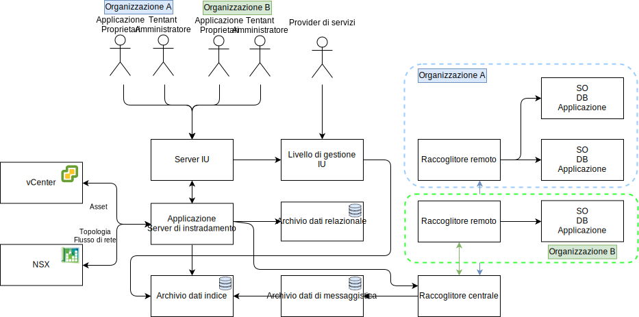

---

copyright:

  years:  2016, 2019

lastupdated: "2019-03-05"

---

# Progettazione dettagliata
{: #caveonix-detailed}

Il diagramma e le descrizioni di seguito riportati forniscono informazioni sui componenti dell'applicazione RiskForesight.

Figura 1. Componenti dell'applicazione

-	GUI (Graphical User Interface) - interfaccia web che puoi usare per accedere all'applicazione RiskForesight.
-	Raccoglitore centrale - raccoglie diversi tipi di payload dei dati che provengono dai plugin e li rende disponibili nell'archivio di messaggistica. RiskForesight supporta i seguenti tipi di payload:
    - Scansione
    - Log
    - Netflow
    - Software
    - Metadati di carico di lavoro
- Router centrale - gestisce tutti i touchpoint di integrazione con il livello di orchestrazione VMware. Tutti i plugin RiskForesight devono comunicare con il router centrale per ottenere l'autorizzazione a comunicare con l'ecosistema RiskForesight.
-	Server API - è il middleware endpoint REST che connette la GUI e gli archivi dati di backend. Convalida inoltre le richieste di accesso degli utenti e gestisce il RBAC.
-	Raccoglitore dati vCenter - il plugin estrae i dettagli della VM (Virtual Machine) da vCenter. Il plugin generico utilizza le API VMware per stabilire una connessione a vCenter ed estrae le informazioni pertinenti del carico di lavoro. Quando le informazioni sono disponibili, il plugin assembla il payload e lo invia al raccoglitore centrale.
-	Raccoglitore dati vCD - il plugin estrae i dettagli della VM (Virtual Machine) da VMware vCloud Director. Il plugin generico utilizza le API VMWare per stabilire una connessione a VMware vCloud Director ed estrae le informazioni correlate ai carichi di lavoro. Quando le informazioni sono disponibili, il plugin assembla il payload e lo invia al raccoglitore centrale.
-	Raccoglitore dati di rete vCD - il plugin estrae i dettagli Netflow da VMware vCD. Il plugin generico utilizza le API VMware per stabilire una connessione a VMware NSX ed estrae i gruppi e le regole di sicurezza, FW e rete. Quando le informazioni sono disponibili, il plugin assembla il payload e lo invia al raccoglitore centrale.
-	Raccoglitore dati di rete - un plugin che estrae i dettagli Netflow da VMware vCenter. Il plugin generico utilizza le API VMware per stabilire una connessione a VMware NSX ed estrae le informazioni sui gruppi e le regole di sicurezza, firewall e rete. Quando le informazioni sono disponibili, il plugin assembla il payload e lo invia al raccoglitore centrale.
-	Raccoglitore remoto - si trova nell'ambiente tenant o un'altra ubicazione dove ha un accesso di rete alle VM tenant. Gestisce tutta la scansione dei rischi informatici e di conformità.
-	Archivio dati relazionale - conserva i seguenti tipi di metadati:
    - Provider di servizi cloud
    - Tenant
    - Asset
    - Risultati della scansione
    - Software
    - Insieme di dati aggregati giornaliero o settimanale
- Archivio dati di messaggistica - RiskForesight utilizza la coda di messaggistica persistente per fornire una perdita di dati pari a zero e una riduzione del carico per i componenti.
- Archivio dati indice - indicizza e archivia i dati non elaborati in entrata per ciascun tenant per un'ulteriore analisi per supportare la funzionalità multi-tenant.
- Plugin – si trovano nel server Application Routing e includono l'impostazione e l'integrazione con i componenti VMware per sincronizzare tutte le VM con le loro informazioni tenant.

La seguente tabella mostra le porte e i protocolli necessari per ciascun componente.

Tabella 1. Porte e protocolli

|Componente	|Protocollo / Porte|
|---|---|
|IU|443|
|API|443, 1337|
|RiskForesight|8082, 8083, 8084|
|Raccoglitore centrale (Cluster)|8080|
|Raccoglitore remoto|8081|
|Archivio dati relazionale primario o secondario|5432|
|Cluster archivio dati di messaggistica|9092|
|Nodi master archivio dati indice|9200, 9300, 5601, 443|

Il seguente diagramma mostra la topologia di rete con la subnet privata portatile Caveonix che è associata alla VLAN Privata A. Sei responsabile della gestione dello spazio di indirizzo IP per questa subnet in modo da poter eseguire manualmente il ridimensionamento incrementale dal modello di distribuzione “tutto-in-uno” a quello completamente distribuito, passando per il modello parzialmente distribuito come necessario.

Figura 2. Diagramma di rete

La subnet IP e le assegnazioni VLAN sono descritte nella seguente tabella.

Tabella 2. VLAN e subnet

|VLAN 	|Tipo di subnet 	|Descrizione|
|---|---|---|
|Pubblica 	|Primaria 	|Assegnata agli host fisici per l'accesso alla rete pubblica. Non utilizzata al momento della distribuzione iniziale.|
|Pubblica	|Portatile 	|Assegnata per l'utilizzo di uplink e NAT su customer-nsx-esg.|
|Pubblica	|Portatile 	|Assegnata per l'utilizzo di uplink e NAT su mgmt-nsx-esg.|
|Pubblica	|Portatile 	|Assegnata per l'utilizzo NAT di uplink su hcx-mgmt-esg, se viene selezionato Hybridity Bundle.|
|Privata A 	|Primaria 	|Assegnata agli host fisici assegnati da {{site.data.keyword.cloud}}. Utilizzata dall'interfaccia di gestione per il traffico di gestione vSphere.|
|Privata A 	|Portatile 	|Assegnata alle VM che funzionano come componenti di gestione.|
|Privata A 	|Portatile 	|Assegnata al VTEP NSX.|
|Privata A 	|Portatile 	|Assegnata a HCX per uso interno, se viene selezionato Hybridity Bundle.|
|Privata A 	|Portatile 	|Assegnata per l'utilizzo di uplink su customer-nsx-esg.|
|Privata A 	|Portatile 	|Assegnata a HCX, se viene selezionato Hybridity Bundle.|
|Privata A 	|Portatile 	|Assegnata ai VRA Zerto, se viene selezionata l'opzione Zerto.|
|Privata A 	|Portatile 	|Assegnata per Caveonix RiskForesight, se viene selezionata l'opzione Caveonix.|
|Privata B	|Primaria	|Non utilizzata al momento della distribuzione iniziale.|
|Privata B 	|Portatile 	|Assegnata per vSAN, se in uso.|
|Privata B 	|Portatile 	|Assegnata per NAS, se in uso.|
|Privata B 	|Portatile 	|Assegnata per vMotion.|

## Link correlati
{: #caveonix-detailed-related}

* [VMware vCenter Server on {{site.data.keyword.cloud_notm}} with Hybridity Bundle](/docs/services/vmwaresolutions/archiref/vcs?topic=vmware-solutions-vcs-hybridity-intro)
