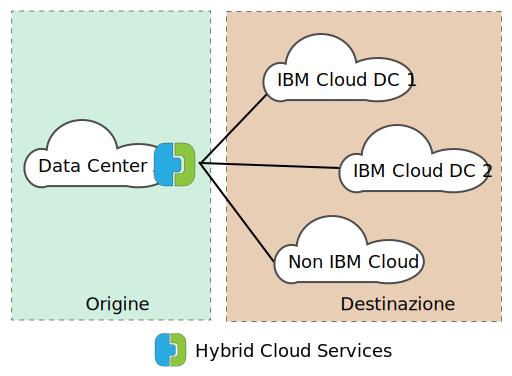
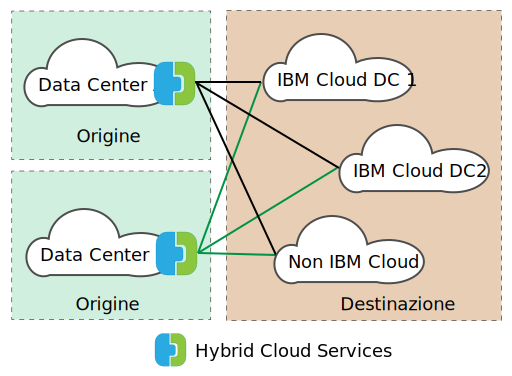

---

copyright:

  years:  2016, 2019

lastupdated: "2019-02-15"

subcollection: vmwaresolutions

---
# Panoramica di VMware HCX on IBM Cloud
{: #hcx-archi-overview}

VMware HCX on IBM Cloud integra senza interruzioni le reti vSphere® vCenter™ in loco nelle distribuzioni IBM Cloud for VMware Solutions. La rete ibrida estende le reti vSphere vCenter in loco in IBM Cloud, supportando la mobilità della VM (Virtual Machine) bidirezionale.

HCX gestisce i processi di codifica e decodifica dell'origine e della destinazione, garantendo una protezione coerente e fornendo l'ammissione per i flussi di lavoro ibridi come la migrazione della VM (Virtual Machine) e l'estensione della rete.

Questa offerta crea una WAN definita dal software e ottimizzata per aumentare le prestazioni della rete estesa, consentendo delle prestazioni che si avvicinano alla velocità della LAN. HCX abilita inoltre il carico di lavoro bidirezionale e la migrazione della politica di sicurezza VMware NSX® a IBM Cloud. HCX si integra con vSphere vCenter ed è gestito dal client web vSphere.

## Estensione della rete di livello 2
{: #hcx-archi-overview-layer-2-net}

HCX consente a una condizione vSphere in loco esistente di estendere in modo sicuro una rete dal suo vCenter in loco a un data center IBM Cloud che esegue VMware Cloud Foundation o vCenter Server. Questa funzione è abilitata dai seguenti elementi:
* HCX fornisce un'applicazione denominata concentratore di livello 2 (L2C).
* Link delle reti estese ai dispositivi edge NSX IBM Cloud distribuiti su VMware Cloud Foundation o vCenter Server.
* Puoi distribuire più concentratori di livello 2 standard per ottenere la scalabilità e aumentare la velocità effettiva dal vCenter in loco.
* Le VM (Virtual Machine) migrate tramite il gateway cloud e attraverso il livello 2 esteso possono conservare i propri indirizzi IP e MAC.

## Migrazione della VM (Virtual Machine)
{: #hcx-archi-overview-vm-mig}

HCX fornisce tre metodi di spostamento delle VM (Virtual Machine): migrazione con basso tempo di inattività, migrazione vSphere vMotion e migrazione di tipo cold (a freddo).

### Migrazione con basso tempo di inattività
{: #hcx-archi-overview-low-downtime-mig}

La migrazione con basso tempo di inattività si basa su vSphere Replication, che è una tecnologia distribuita implementata nell'hypervisor VMware ESX®/ESXi®. La distribuzione HCX in loco crea una replica di una VM (Virtual Machine) live in IBM Cloud ed esegue un cambio per spegnere la VM (Virtual Machine) di origine ed accendere la VM (Virtual Machine) migrata.

Il percorso di migrazione è sempre tramite il gateway cloud. Il trasporto può essere internet, una rete estesa di livello 2 o una riga Direct Connect.

Una VM (Virtual Machine) può essere migrata più volte in entrambe le direzioni.

### Migrazione vMotion
{: #hcx-archi-overview-vmotion-mig}

Le VM (Virtual Machine) possono essere trasferite utilizzando la migrazione vMotion su una rete estesa a IBM Cloud. La migrazione vMotion è anche nota come migrazione senza tempo di inattività o vMotion tra cloud.

### Migrazione di tipo cold (a freddo)
{: #hcx-archi-overview-cold-mig}

Con la migrazione di tipo cold (a freddo), puoi trasferire una VM spenta a IBM Cloud su una rete estesa creata utilizzando il concentratore di livello 2.

### Funzioni di migrazione comuni
{: #hcx-archi-overview-cold-mig-features}

Altre funzioni disponibili con tutti e tre i tipi di migrazione includono l'ottimizzazione WAN definita dal software che aumenta la velocità e la velocità effettiva della migrazione. Inoltre, la migrazione può essere pianificata in modo da verificarsi in un momento specifico e conservare il nome host, il nome della VM (Virtual Machine) o entrambi.

## Funzioni di rete
{: #hcx-archi-overview-net-features}

Le seguenti funzioni di rete sono integrate nel gateway cloud e nei concentratori di livello 2.

### Instradamento del flusso intelligente
{: #hcx-archi-overview-intel-flow-routing}

Questa funzione seleziona automaticamente la connessione migliore in base al percorso internet, caricando in modo efficiente l'intera connessione in modo che i carichi di lavoro vengano spostati il più velocemente possibile. Quando i flussi più grandi, come ad esempio il backup o la replica, causano un conflitto con la CPU, i flussi più piccoli vengono instradati alle CPU meno occupate, migliorando le prestazioni del traffico interattivo.

### Instradamento di prossimità
{: #hcx-archi-overview-prox-routing}

L'instradamento di prossimità garantisce che l'inoltro tra le VM (Virtual Machine) connesse alle reti estese ed instradate, sia in loco che nel cloud, sia simmetrico. Questa funzione richiede che i servizi di rete avanzati con l'instradamento dinamico siano configurati tra il cloud e la locale del cliente.

Quando gli utenti estendono le loro reti al cloud, la connettività di livello 2 viene estesa nelle reti IBM Cloud. Tuttavia, senza l'ottimizzazione dell'instradamento, le richieste di comunicazione di livello 3 devono ritornare all'origine della rete in loco per essere instradate. Questo percorso di ritorno viene denominato _tromboning_ o _hairpinning_.

Il tromboning non è efficiente perché i pacchetti devono andare avanti e indietro tra la rete di origine e il cloud, anche quando sia la VM (Virtual Machine) di origine che di destinazione risiedono nel cloud.

In aggiunta all'inefficienza, se il percorso di inoltro include dei firewall con stato o un'altra apparecchiatura incorporata che deve vedere entrambi i lati della connessione, la comunicazione potrebbe non riuscire. L'errore nella comunicazione della VM (Virtual Machine) (senza l'ottimizzazione dell'instradamento) si verifica quando il percorso in uscita verso il cloud può essere la rete di livello 2 estesa o la rete instradata dell'organizzazione. La rete in loco non conosce la "scelta rapida" della rete estesa. Questo problema viene denominato instradamento asimmetrico. La soluzione è di abilitare l'instradamento di prossimità in modo che la rete in loco possa conoscere le rotte da IBM Cloud.

Il gateway cloud conserva un inventario di VM (Virtual Machine) nel cloud. Conosce inoltre lo stato della VM, che può essere uno dei seguenti:
* Trasferita a IBM Cloud con vMotion (migrazione senza tempo di inattività).
* Migrata al cloud utilizzando la replica basata sull'host (migrazione con basso tempo di inattività).
* Creata nel cloud (su una rete estesa).

### Sicurezza
{: #hcx-archi-overview-sec}

Il gateway cloud offre AES-GCM conforme con Suite B con IKEv2, offload AES-NI e controllo di ammissione basato sul flusso. HCX gestisce inoltre il processo di codifica e decodifica dell'origine e della destinazione, garantendo una protezione coerente e la gestione dei flussi di lavoro ibridi come la migrazione della VM (Virtual Machine) e l'estensione della rete. Le politiche di sicurezza definite e assegnate a una VM (Virtual Machine) in loco, possono essere migrate con la VM (Virtual Machine) in IBM Cloud.

La migrazione della politica è disponibile solo nelle seguenti condizioni:
* Il data center in loco deve eseguire NSX 6.2.2 o superiore.
* In vSphere, la politica di sicurezza è una sezione NSX singola che può contenere molte regole.
* È possibile denominare una serie di indirizzi IP o MAC in modo che partecipino alla politica. Il nome della serie di IP o MAC non può superare i 218 caratteri.
* Le regole supportate specificano le serie di IP o gli indirizzi IP di livello 3 oppure le serie di MAC o di indirizzi MAC di livello 2 come l'origine o la destinazione.

## Componenti di HCX
{: #hcx-archi-overview-comp-hcx}

Il servizio VMware HCX on IBM Cloud distribuisce quattro applicazioni virtuali installate e configurate sul data center in loco e sulla destinazione IBM Cloud. Questa sezione descrive ognuna delle quattro applicazioni virtuali richieste. Facoltativamente, potrebbero essere necessari dei dispositivi edge a seconda della progettazione dell'implementazione.

### HCX Manager
{: #hcx-archi-overview-hcx-man}

L'applicazione virtuale HCX Manager è un'estensione al vCenter in loco. Viene distribuita come una VM (Virtual Machine) e la sua struttura file contiene le altre applicazioni virtuali del servizio ibride. HCX Manager controlla la distribuzione e la configurazione del gateway cloud, i concentratori di livello 2 e l'applicazione virtuale WAN Optimization sia in loco che all'interno di IBM Cloud.

### Hybrid Cloud Gateway
{: #hcx-archi-overview-hcg}

Hybrid Cloud Gateway (CGW) mantiene un canale sicuro tra la condizione vSphere in loco e IBM Cloud. HCX utilizza una potente crittografia per eseguire il bootstrap di una connessione site-to-site a IBM Cloud.

Il canale sicuro tra vSphere e IBM Cloud evita problemi di sicurezza "middle mile" della rete. Il gateway cloud incorpora inoltre la tecnologia di replica vSphere per eseguire la migrazione bidirezionale.

### WAN Optimization
{: #hcx-archi-overview-wan-opt}

L'applicazione WAN Optimization è il componente che esegue il condizionamento WAN per ridurre gli effetti della latenza. Incorpora inoltre Forward Error Correction per negare gli scenari di perdita dei pacchetti e la deduplicazione dei pattern di traffico ridondanti. Complessivamente, viene ridotto l'utilizzo della larghezza di banda e garantito il migliore utilizzo della capacità di rete disponibile per velocizzare il trasferimento dei dati da/a IBM Cloud.

È importante notare che la migrazione della VM (Virtual Machine) si basa sulla combinazione dell'applicazione WAN Optimization e del gateway cloud per ottenere una mobilità ineguagliabile tra vSphere in loco e IBM Cloud. Inoltre, l'estensione di livello 2 trae vantaggio dall'ottimizzazione WAN quando il percorso dei dati viene instradato tramite il gateway cloud.

### Concentratori di livello 2
{: #hcx-archi-overview-layer-2-conc}

Le applicazioni dei concentratori di livello 2 (L2C) permettono l'estensione di una rete di livello 2 dal data center vSphere in loco a IBM Cloud. I concentratori di livello 2 hanno due interfacce:
* Interfaccia trunk interna - Gestisce il traffico della VM (Virtual Machine) in loco per le reti estese utilizzando un'associazione bridge traslazionale a una rete estesa corrispondente in IBM Cloud.
* Interfaccia uplink - HCX utilizza questa interfaccia per inviare il traffico di sovrapposizione incapsulato a/da IBM Cloud. I dati dell'applicazione passano attraverso questa interfaccia.

## Architettura di distribuzione - Esegui la connessione a IBM Cloud utilizzando internet pubblico
{: #hcx-archi-overview-connect-pub-internet}

Questa sezione descrive il layout dei componenti HCX all'interno di IBM Cloud e con il client in loco. In questa progettazione, l'architettura specifica un modello hub e spoke presente tra l'ambiente di origine e IBM Cloud. Quindi, la condizione di origine viene utilizzata come un hub con delle connessioni ad ambienti IBM Cloud diversi come mostrato nella seguente figura.

Figura 1. HCX con una singola origine

L'origine può essere posizionata anche all'interno dell'ambiente IBM Cloud; gli spoke sono sempre le distribuzioni cloud all'interno di questa progettazione come mostrato nella seguente figura.

Figura 2. HCX con più origini

### Panoramica sull'utilizzo
{: #hcx-archi-overview-usage-ovw}

Le seguenti attività vengono completate dal client web vSphere:
* Distribuzione delle applicazioni virtuali HCX e configurazione dei componenti WAN definiti dal software.
* Estensione delle reti VLAN e VXLAN in loco dal vCenter in loco al cloud (IBM Cloud).
* Migrazione dei carichi di lavoro al cloud e viceversa.

### Dipendenze della progettazione di base
{: #hcx-archi-overview-base-design}

Prima che i componenti vengano descritti più dettagliatamente, è imperativo comprendere la distribuzione di base che è richiesta come parte di questa progettazione.
* L'ambiente di origine deve contenere un'implementazione vSphere gestita da un vCenter Server. Sono necessari i vCenter supportati 5.5U3 o 6.0U2 e superiori, con ESXi 5.5 o superiore per Hybrid Cloud Services.
* Se viene utilizzato NSX, la versione 6.2.2 o superiore. NSX è obbligatorio per la migrazione della politica.
* Se è previsto il vMotion tra cloud, si applicano le stesse limitazioni dell'affinità tra i cloud come se fossero in loco.
* L'ambiente di origine deve avere un metodo di connessione agli ambienti cloud. Sono inclusi l'accesso internet pubblico o le connessioni private utilizzando IBM Cloud Direct Link. Le connessioni, diverse da internet pubblico, ad altri fornitori cloud non saranno discusse.
* Le reti e le VM dell'ambiente di origine da migrare o estendere devono essere su gruppi di porte all'interno di uno switch distribuito virtuale o di uno switch distribuito virtuale Cisco Nexus 1000v.
* IBM Cloud deve contenere almeno un'istanza di una distribuzione VMware Cloud Foundation o vCenter Server.
* Risorse sufficienti per le applicazioni virtuali.
* Le reti devono consentire alle applicazioni di comunicare con le applicazioni virtuali remote e locali e con altre VM (Virtual Machine).
* I requisiti di accesso alla porta (appendice A) elencano le porte che devono essere aperte in modo che le applicazioni virtuali Hybrid Cloud Services possano essere installate correttamente.
* Un account del servizio vSphere con il ruolo di sistema di amministratore vCenter Server assegnato.
* Abbastanza spazio disco per l'installazione di Hybrid Cloud Services e delle applicazioni del servizio associate.
* Indirizzi IP sufficienti per le VM in loco di cui è stato eseguito il provisioning durante l'installazione.
* Se il server SSO è remoto, devono essere identificati l'URL del vCenter, il server SSO esterno o il PSC (Platform Services Controller) che esegue il servizio di ricerca esterno. Quando il servizio HCX viene registrato con il vCenter, deve essere fornito questo URL.

## Link correlati
{: #hcx-archi-overview-related}

* [Introduzione di VMware HCX on IBM Cloud](/docs/services/vmwaresolutions/archiref/hcx-archi?topic=vmware-solutions-hcx-archi-intro)
