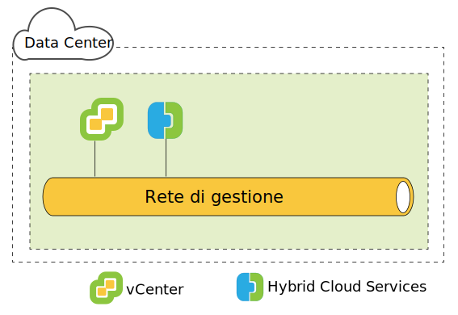
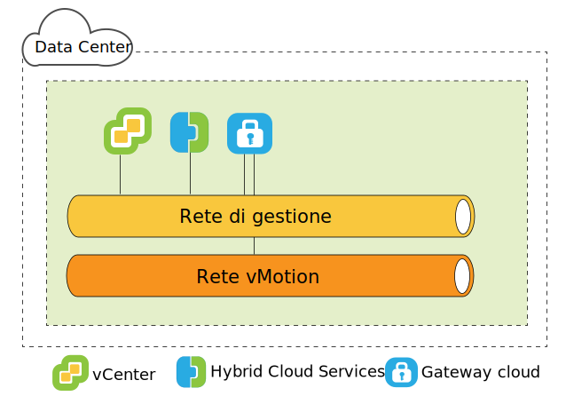
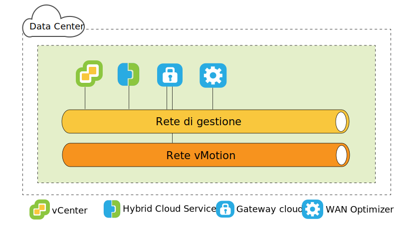
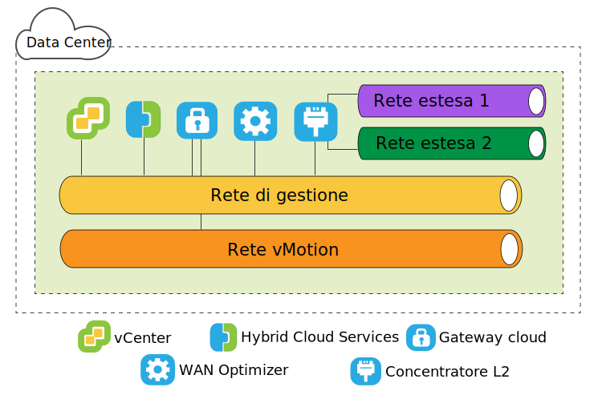

---

copyright:

  years:  2016, 2019

lastupdated: "2019-05-06"

subcollection: vmware-solutions

---

{:tip: .tip}
{:note: .note}
{:important: .important}

# Architettura lato di origine di VMware HCX on IBM Cloud
{: #hcx-archi-source}

Questa sezione descrive l'architettura di ogni componente HCX distribuito nell'ambiente di origine.

## Introduzione a HCX
{: #hcx-archi-source-intro-hcx}

La tecnologia HCX integra rapidamente le reti vSphere vCenter nella piattaforma VCS di IBM Cloud. La rete ibrida estende le reti vSphere vCenter in loco in IBM Cloud, supportando la mobilità della VM (Virtual Machine) bidirezionale.

Questa introduzione riepiloga le attività che possono essere eseguite e le funzioni che supportano la migrazione avanzata e l'estensione di rete.

* HCX gestisce i processi di codifica e decodifica dell'origine e della destinazione, garantendo una protezione coerente e fornendo l'ammissione per i flussi di lavoro ibridi come la migrazione della VM (Virtual Machine) e l'estensione della rete.
* HCX crea una WAN definita dal software e ottimizzata per aumentare le prestazioni della rete estesa, consentendo delle prestazioni che si avvicinano alla velocità della LAN.
* HCX abilita inoltre il carico di lavoro bidirezionale e la migrazione della politica di sicurezza VMware NSX ai servizi di rete IBM Cloud.
* HCX si integra con vSphere vCenter ed è gestito dal client web vSphere.

## Estensione della rete di livello 2
{: #hcx-archi-source-layer-2-ext}

* Estendi in modo sicuro una rete da un vCenter a IBM Cloud.
* HCX fornisce l'High Throughput Layer 2 Concentrator (HT L2C).
* Link delle reti estese ai dispositivi edge NSX IBM Cloud
* Possono essere distribuiti più concentratori di livello 2 standard per ottenere la scalabilità e aumentare la velocità effettiva.
* Le VM (Virtual Machine) migrate tramite il gateway cloud e attraverso il livello 2 esteso possono conservare i propri indirizzi IP e MAC.

## Metodi di migrazione della VM (Virtual Machine)
{: #hcx-archi-source-vm-mig-methods}

### Migrazione con basso tempo di inattività
{: #hcx-archi-source-low-downtime-mig}

La migrazione con basso tempo di inattività si basa su vSphere Replication, che è una tecnologia distribuita implementata nell'hypervisor VMware ESX/ESXi/ESXi. HCX crea una replica di una VM (Virtual Machine) live, la sposta in IBM Cloud ed esegue un cambio per spegnere la VM (Virtual Machine) di origine ed accendere la VM (Virtual Machine) migrata.
* Il percorso di migrazione è sempre tramite il gateway cloud. Il trasporto può essere internet, una rete estesa di livello 2 o una riga Direct Connect.
* Una VM (Virtual Machine) può essere migrata più volte in entrambe le direzioni.

### Migrazione vMotion
{: #hcx-archi-source-vmotion-mig}

La migrazione vMotion utilizza vMotion per trasferire una VM (Virtual Machine) live attraverso una rete estesa a IBM Cloud. La migrazione vMotion è anche nota come migrazione senza tempo di inattività o vMotion tra cloud.

### Migrazione di tipo cold (a freddo)
{: #hcx-archi-source-cold-mig}

Trasferisci una VM (Virtual Machine) spenta a IBM Cloud su una rete estesa.

### Funzioni comuni
{: #hcx-archi-source-common-feat}

* L'ottimizzazione WAN definita dal software facoltativa, se installata, aumenta la migrazione, la velocità effettiva e la velocità.
* La migrazione può essere pianificata in modo da verificarsi in un momento specifico.
* Una VM (Virtual Machine) migrata può conservare i propri nome host, nome della VM (Virtual Machine) o entrambi.

## Funzioni di rete
{: #hcx-archi-source-net-feat}

Le seguenti funzioni di rete sono integrate nel gateway cloud e nei concentratori di livello 2.

* Instradamento del flusso intelligente - Seleziona automaticamente la connessione migliore in base al percorso internet, caricando in modo efficiente l'intera connessione in modo che i carichi di lavoro vengano spostati il più velocemente possibile. Quando i flussi più grandi, come ad esempio il backup o la replica, causano un conflitto con la CPU, i flussi più piccoli vengono instradati alle CPU meno occupate, migliorando le prestazioni del traffico interattivo.
* Instradamento di prossimità - Garantisce che l'inoltro tra le VM (Virtual Machine) connesse alle reti estese ed instradate, sia in loco che nel cloud, sia simmetrico.
* Sicurezza - Il gateway cloud offre AES-GCM conforme con Suite B con IKEv2, offload AES-NI e controllo di ammissione basato sul flusso. HCX gestisce i processi di codifica e decodifica dell'origine e della destinazione, garantendo una protezione coerente e fornendo l'ammissione per i flussi di lavoro ibridi come la migrazione della VM (Virtual Machine) e l'estensione della rete.
  Una politica di sicurezza definita nel vCenter in loco e assegnata a una VM (Virtual Machine), può essere migrata con la VM (Virtual Machine).

## Descrizione dell'HCX
{: #hcx-archi-source-understand-hcx}

HCX supporta una relazione many-to-many tra i vCenter in loco e IBM Cloud. vCenter Server nella modalità di collegamento è supportato. Questo argomento fornisce una panoramica di alto livello su come il programma di installazione interagisce con il data center in loco e IBM Cloud.

Durante l'installazione, il dispositivo virtuale HCX Manager viene importato e configurato come un plugin per il vCenter in loco. Questo plugin viene poi utilizzato per configurare la distribuzione del servizio WAN definito dal software. La configurazione automatizzata esegue il provisioning di ogni dispositivo del servizio ibrido come una VM (Virtual Machine) nel vCenter in loco e distribuisce una VM (Virtual Machine) corrispondente in IBM Cloud.

Una distribuzione corretta richiede:
* Risorse sufficienti per i dispositivi virtuali
* La rete deve consentire ai dispositivi di comunicare con i dispositivi virtuali remoti e locali e con altre VM.

## Panoramica della distribuzione
{: #hcx-archi-source-deployment-ovw}

La VM (Virtual Machine) HCX Manager viene installata per prima e gestisce l'installazione di tutti gli altri dispositivi di VM (Virtual Machine) in loco e nel cloud.

Il seguente è un riepilogo delle attività di installazione di base:
1. Ottieni il file OVA del dispositivo virtuale Hybrid Cloud Enterprise.
2. Dal client web vSphere, installa il dispositivo virtuale del servizio HCX Manager nel vCenter in loco connesso a IBM Cloud.
3. Dal client web vSphere, registra un endpoint IBM Cloud con il plugin HCX. La registrazione stabilisce la relazione one-to-one tra l'HCX in loco e l'istanza HCX su IBM Cloud.
4. Installa e configura i dispositivi virtuali del servizio.
5. Per ogni dispositivo installato in loco, il programma di installazione esegue il provisioning di un dispositivo virtuale del servizio corrispondente nell'IBM Cloud di destinazione.
6. Dopo l'installazione, HCX Manager controlla i dispositivi virtuali del servizio remoto e locale. In IBM Cloud, HCX gestisce i componenti WAN definiti dal software di cui è stato eseguito il provisioning come un servizio.

### Considerazioni sulle prestazioni del componente della distribuzione
{: #hcx-archi-source-perf-consid}

La pianificazione dell'architettura include le VM che devono essere migrate, le reti utilizzate per il traffico della VM (Virtual Machine) e le reti che devono essere estese. Questo argomento riepiloga alcuni valori massimi e minimi per i componenti della distribuzione.
* vSphere vCenter. Il dispositivo HCX Manager deve essere installato sul vCenter che necessita dei servizi ibridi. Può esserci soltanto una distribuzione HCX per vCenter. Questa limitazione si applica alla modalità di collegamento, il dispositivo di gestione HCX è installato solo sul vCenter primario. HCX supporta fino a cinque vCenter registrati nella modalità di collegamento.
* Registrazioni cloud. Il numero massimo di endpoint cloud è dieci. Per trovare il numero di endpoint, Hybrid Cloud Services traccia le connessioni vCenter al cloud.

### Numero massimo di migrazioni ed estensioni di rete
{: #hcx-archi-source-max-mig-net-extension}

* Numero massimo di attività di migrazione con basso tempo di inattività simultanee - 15
* Numero massimo di attività di estensione L2C simultanee - 1
* Numero massimo di attività di migrazione vMotion simultanee - 1

### HCX Management Enterprise
{: #hcx-archi-source-hcxme}

L'HCX Management Enterprise OVA viene distribuito sull'ambiente di origine e registrato come un plugin per il vCenter Server che gestisce l'infrastruttura vSphere di origine. Questo plugin viene poi utilizzato per configurare i servizi di migrazione e di rete necessari per abilitare la migrazione tra cloud e l'estensione di rete L2.

Può esserci soltanto una distribuzione HCX per vCenter. Questa limitazione si applica alla modalità di collegamento: il dispositivo HCX Manager è installato solo sul vCenter primario. HCX Manager supporta fino a cinque
vCenter registrati nella modalità di collegamento.
{:note}

### Dispositivi virtuali HCX
{: #hcx-archi-source-hcxva}

Il pacchetto di installazione è un file OVA che contiene il plugin Hybrid Cloud Services. Questo dispositivo di gestione Hybrid Cloud
Services viene installato e configurato e poi utilizzato per configurare le VM (Virtual Machine) del dispositivo del servizio.
* HCX Manager
* Hybrid Cloud Gateway
* Concentratori di livello 2
* WAN Optimizer

### HCX Manager
{: #hcx-archi-source-hcxm}

Il plugin HCX Manager viene distribuito solo in loco. Gestisce i dispositivi virtuali del servizio per la WAN definita dal software (SD-WAN). Il dispositivo virtuale HCX Manager è un'estensione al vCenter di origine e viene distribuito come una VM (Virtual Machine). Questa struttura file del dispositivo, contiene tutti i dispositivi virtuali del servizio ibrido. HCX Manager controlla la distribuzione e la configurazione del gateway cloud, i concentratori di livello 2 e il dispositivo virtuale WAN Optimization sia in loco che nel cloud.

Il dispositivo virtuale può essere installato con il provisioning di tipo thin o thick per il disco rigido. Per impostazione predefinita, viene eseguito il provisioning di tipo thin dei dischi rigidi per i dispositivi virtuali del servizio.

Dopo aver completato la configurazione e la distribuzione del dispositivo virtuale del servizio, accedi a questa VM (Virtual Machine) per utilizzare il portale di gestione di Hybrid Cloud Services.

### HCX Cloud Gateway
{: #hcx-archi-source-hcg}

L'HCX Cloud Gateway stabilisce e mantiene un canale sicuro tra vSphere e IBM Cloud.

HCX utilizza una potente crittografia per eseguire il bootstrap di una connessione site-to-site a IBM Cloud. Il canale sicuro tra vSphere e IBM Cloud raggiunge la multi tenancy per i protocolli vSphere senza tenant ed evita problemi di sicurezza "middle mile" della rete.

Il gateway cloud incorpora inoltre la tecnologia di replica vSphere per eseguire la migrazione bidirezionale.

### WAN Optimizer
{: #hcx-archi-source-wan-opt}

HCX fornisce inoltre la WAN Optimization definita dal software. Il dispositivo WAN Optimization è un componente fortemente consigliato che esegue il condizionamento WAN per ridurre gli effetti della latenza. Incorpora inoltre Forward Error Correction per negare gli scenari di perdita dei pacchetti e la deduplicazione dei pattern di traffico ridondanti. Complessivamente, viene ridotto l'utilizzo della larghezza di banda e garantito il migliore utilizzo della capacità di rete disponibile per velocizzare il trasferimento dei dati da/a IBM Cloud.

La migrazione della VM (Virtual Machine) si basa sulla combinazione del dispositivo WAN Optimization e del gateway cloud per ottenere una mobilità ineguagliabile tra vSphere in loco e IBM Cloud.

### Concentratore di livello 2
{: #hcx-archi-source-layer-2-conc}

Il Network Extension Service viene fornito dal concentratore di livello 2 (L2C). Estende una rete di livello 2 dal data center vSphere in loco a IBM Cloud e abilita la migrazione rapida tra il data center e il cloud. Il concentratore di livello 2 è obbligatorio per estendere la rete in loco a IBM.

Il dispositivo del concentratore di livello 2 ha due interfacce:
* Interfaccia trunk interna: Gestisce il traffico della VM (Virtual Machine) in loco per le reti estese utilizzando un'associazione bridge traslazionale a una rete estesa corrispondente in IBM Cloud.
* Interfaccia uplink: HCX utilizza questa interfaccia per inviare il traffico di sovrapposizione incapsulato a/da IBM Cloud. I dati dell'applicazione passano attraverso questa interfaccia.

### Solo migrazione
{: #hcx-archi-source-mig-only}

La configurazione minima per eseguire soltanto la migrazione richiede i dispositivi HCX Manager e Gateway cloud. È possibile migrare le VM (Virtual Machine) senza l'estensione di rete. In questo caso, la VM (Virtual Machine) ottiene un nuovo indirizzo IP utilizzando il servizio Guest Customization dopo la migrazione.

Per estendere una rete e conservare l'indirizzo IP originale, deve essere configurato uno switch virtuale distribuito nel vSphere vCenter in loco.

WAN Optimization può migliorare la velocità nelle situazioni descritte; configurando il gateway cloud in modo che utilizzi una linea ad elevata velocità (come ad esempio un Direct Connect) che migliora la velocità fornendo un link di larghezza di banda maggiore per il traffico ottimizzato WAN.

La migrazione delle VM (Virtual Machine) sulle reti estese in IBM Cloud è conveniente perché riduce il tempo di inattività e la configurazione non viene modificata sulla VM (Virtual Machine). La VM (Virtual Machine) può conservare gli indirizzi IP, gli indirizzi MAC, i nomi di computer e di VM (Virtual Machine). Conservando queste proprietà si semplifica enormemente la migrazione a IBM Cloud e si stabiliscono dei facili percorsi di ritorno al data center in loco. La funzione Network Extension richiede un vDS (vSphere Distributed Switch), disponibile con vSphere Enterprise Plus Edition.

### Requisiti dell'indirizzo IP
{: #hcx-archi-source-ip-req}

Per distribuire l'HCX, deve essere disponibile il numero corretto di indirizzi IP in loco
e nell'IBM Cloud di destinazione.

* Indirizzo vMotion
  Il mantenere una rete separata per il vMotion è una pratica comune nel data center in loco. Il gateway cloud deve avere accesso alla rete vMotion. Se non è così, è necessario un ulteriore indirizzo IP per la comunicazione con la rete vMotion.

* In loco
  * Un indirizzo IP per il dispositivo HCX Manager.
  * Uno per ogni gateway cloud, più un altro se è presente una rete vMotion separata.
  * Uno per ogni concentratore di livello 2 standard

* IBM Cloud
  * Due indirizzi IP per il dispositivo HCX Manager connesso a IBM Cloud. Gli indirizzi possono venire utilizzati per il collegamento a internet o a una o più righe Direct Connect.
  * Aggiungine un altro se è presente una rete vMotion separata.

### Funzione Proximity Routing (Instradamento di prossimità)
{: #hcx-archi-source-prox-routing-feat}

L'instradamento di prossimità è una funzione di rete che può essere abilitata quando viene configurato il gateway cloud.

L'instradamento di prossimità garantisce che l'inoltro tra le VM (Virtual Machine) connesse alle reti estese ed instradate, sia in loco che nel cloud, sia simmetrico. Questa funzione richiede che sia configurato l'instradamento dinamico
tra il cloud e la locale del cliente.

Quando gli utenti estendono le loro reti al cloud, la connettività di livello 2 viene estesa in IBM Cloud. Tuttavia, senza l'ottimizzazione dell'instradamento, le richieste di comunicazione di livello 3 devono ritornare all'origine della rete in loco per essere instradate. Questo percorso di ritorno viene denominato "tromboning" o "hairpinning".

Il tromboning non è efficiente perché i pacchetti devono andare avanti e indietro tra la rete di origine e il cloud, anche quando sia la VM (Virtual Machine) di origine che di destinazione risiedono nel cloud. In aggiunta all'inefficienza, se il percorso di inoltro include dei firewall con stato o un'altra apparecchiatura incorporata che deve vedere entrambi i lati della connessione, la comunicazione potrebbe non riuscire. L'errore nella comunicazione della VM (Virtual Machine) (senza l'ottimizzazione dell'instradamento) si verifica quando il percorso in uscita verso il cloud può essere la rete di livello 2 estesa o il gateway edge VCS NSX. La rete in loco non conosce la "scelta rapida" della rete estesa. Questo problema viene denominato instradamento asimmetrico. La soluzione è di abilitare l'instradamento di prossimità in modo che la rete in loco possa conoscere le rotte da IBM Cloud.

Per evitare il tromboning, HCX utilizza la gestione dell'instradamento intelligente per scegliere le rotte appropriate allo stato della VM (Virtual Machine). Il gateway cloud conserva un inventario di VM (Virtual Machine) nel cloud. Conosce inoltre lo stato della VM (Virtual Machine), che può essere:
* Trasferita al cloud con vMotion (migrazione senza tempo di inattività).
* Migrata al cloud utilizzando la replica basata sull'host (migrazione con basso tempo di inattività).
* Creata nel cloud (su una rete estesa).

### Istradamento asimmetrico con la soluzione dell'instradamento di prossimità
{: #hcx-archi-source-asymm-routing}

Nel diagramma, i componenti `N*a` sulla sinistra risiedono nel data center in loco e il componente `N*b`
sulla destra risiede nel cloud.

R1 è il gateway predefinito per N1-b, pertanto, N1-b deve tornare a R1 per instradare il traffico tramite R2. Per evitare l'instradamento asimmetrico, HCX inserisce delle rotte host all'interno della sovrapposizione NSX della distribuzione VCS di IBM Cloud. Se la VM (Virtual Machine) è appena stata creata nel cloud oppure se è stata spostata con la migrazione con basso tempo di inattività, la rotta host viene inserita immediatamente.

Se la VM (Virtual Machine) è stata trasferita utilizzando il vMotion, la rotta non viene inserita finché non viene riavviata la VM (Virtual Machine). Attendere fino a dopo il riavvio garantisce che i dispositivi con stato in loco continuino a utilizzare la sessione esistente finché non viene riavviata la VM (Virtual Machine). Dopo il riavvio, le informazioni di instradamento sono coerenti in loco e nel cloud.

Per tale motivo, R1 può utilizzare l'instradamento per raggiungere una VM (Virtual Machine) specifica tramite R2, invece di utilizzare la rete estesa collegata localmente. R2 gestisce completamente il percorso delle altre reti per raggiungere le VM (Virtual Machine)
con l'instradamento di prossimità abilitato.

### Conservazione dell'indirizzo MAC
{: #hcx-archi-source-mac-addr-ret}

* L'opzione per conservare l'indirizzo MAC è una casella di spunta nella procedura guidata di migrazione. È visibile solo per la migrazione basata sulla replica.
* Per impostazione predefinita, **Retain MAC** è abilitato se la VM (Virtual Machine) di origine è in una rete estesa e disabilitato quando la rete non è estesa. Se l'indirizzo MAC non viene conservato, la VM (Virtual Machine) ottiene un nuovo indirizzo al termine della migrazione. La decisione di conservare un indirizzo MAC o di acquisirne uno nuovo può influenzare il processo di migrazione e il flusso del traffico di rete successivo alla migrazione.
* La conservazione dell'indirizzo MAC è necessaria per i seguenti motivi:
  * Licenze basate sull'indirizzo MAC: alcuni software accoppiano la licenza all'indirizzo MAC della VM. Modificando l'indirizzo MAC di una VM (Virtual Machine) si annulla la validità della licenza.
  * Ordine NIC Linux: in Linux, se viene modificato l'indirizzo MAC su una VM (Virtual Machine), il numero del dispositivo NIC Ethernet potrebbe venire modificato dopo un riavvio. Una modifica al numero del dispositivo può modificare l'ordine di presentazione NIC all'interno del sistema operativo, interrompendo le applicazioni o gli script che dipendono dall'ordine NIC.
  * Tempo di inattività inferiore se la rete è estesa: se la VM (Virtual Machine) viene migrata su una rete estesa, abilitando **Retain MAC** si riduce il tempo di inattività perché la rete non deve cercare le informazioni sul nuovo indirizzo MAC.
  * La casella di spunta si trova nella pagina Select destination network durante l'operazione di migrazione.

### Migrazione della politica di sicurezza
{: #hcx-archi-source-sec-policy-mig}

La funzione di migrazione della politica consente alle regole del firewall distribuite NSX di essere spostate da un vCenter in loco a un cloud abilitato VCS HCX. La migrazione della politica è possibile durante l'utilizzo della migrazione con basso tempo di inattività o vMotion per spostare una VM (Virtual Machine) su una rete estesa con l'High Throughput Layer 2 Concentrator.
* Il data center in loco deve eseguire NSX 6.2.2 o superiore.
* In vSphere, la politica di sicurezza è una sezione NSX singola che può contenere molte regole. Può esserci una sola sezione (politica) per Org vDC.
* Può essere identificata una serie di indirizzi IP o MAC in modo che partecipino alla politica. Il nome della serie di IP o MAC non può superare i 218 caratteri.
* Tutte le regole in una sezione devono avere un nome univoco. Non lasciare il nome della regola vuoto.
Le regole supportate specificano le serie di IP o gli indirizzi IP di livello 3 oppure le serie di MAC o di indirizzi MAC di livello 2 come l'origine o la destinazione.

Le regole che specificano i gruppi di sicurezza o di applicazioni per l'origine o la destinazione non vengono migrate.
{:note}

Tutte le modifiche alla politica migrata vengono propagate a tutte le VM che utilizzano la politica.

## Link correlati
{: #hcx-archi-source-related}

* [Installazione e configurazione sull'origine](/docs/services/vmwaresolutions/archiref/hcx-archi?topic=vmware-solutions-hcx-archi-install-cfg-src)
