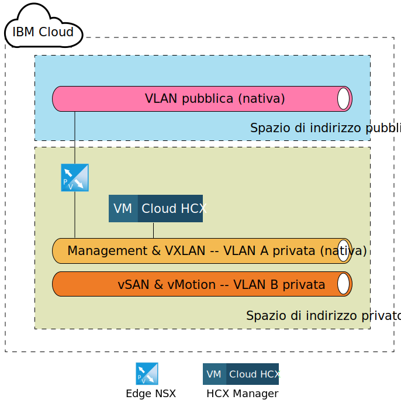
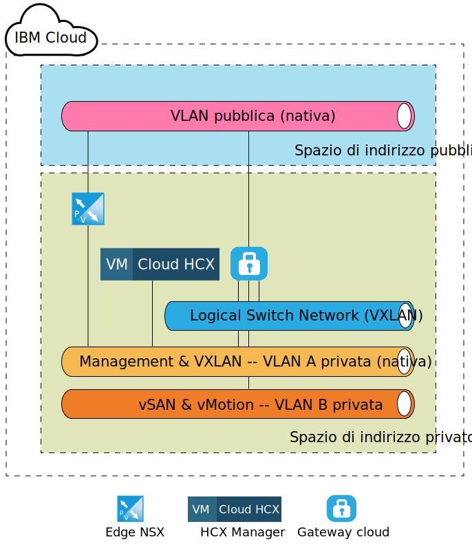
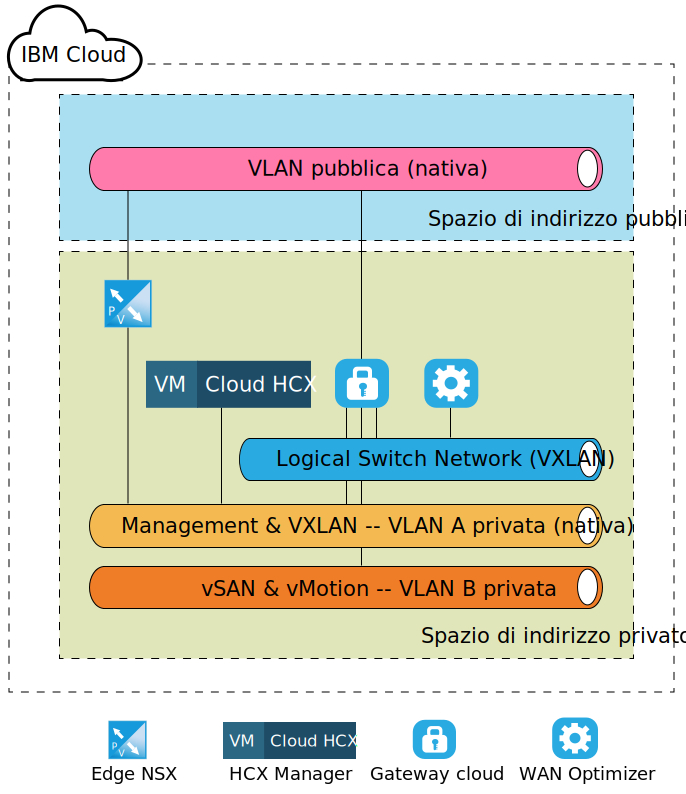
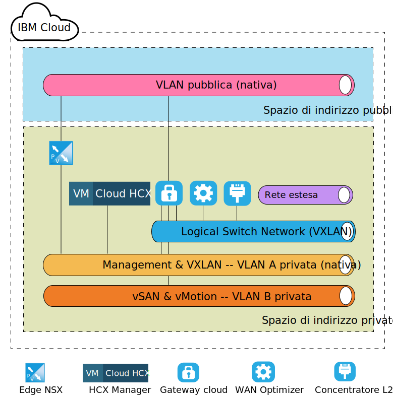

---

copyright:

  years:  2016, 2019

lastupdated: "2019-05-06"

subcollection: vmware-solutions

---
# Architettura di destinazione a livello del componente di VMware HCX on IBM Cloud
{: #hcx-archi-target}

Questa sezione descrive l'architettura di ogni componente HCX distribuito nell'ambiente IBM Cloud. Viene trattato il modello di distribuzione spoke (destinazione) all'interno di IBM Cloud.

## Edge NSX
{: #hcx-archi-target-nsx-edge}

Il primo componente che viene configurato all'interno di IBM Cloud è una coppia di VM (Virtual Machine) Edge NSX. È importante tenere presente che tutte le distribuzioni IBM Cloud for VMware Solutions installano e configurano un dispositivo edge per la comunicazione in uscita di IBM CloudDriver. Tuttavia, mentre questo ESG può essere riutilizzato per le comunicazioni di Hybrid Cloud Services, si consiglia di distribuire una nuova coppia.

Le VM (Virtual Machine) Edge NSX sono configurate come una coppia attiva/passiva di dispositivi Edge NSX X-Large. Questi dispositivi vengono utilizzati per il collegamento nell'ambiente IBM Cloud VMware utilizzando una connessione internet pubblica. L'Edge NSX X-Large è stato scelto per l'ambiente interno poiché è adatto per gli ambienti che hanno un programma di bilanciamento del carico con milioni di sessioni simultanee che non richiedono necessariamente un'elevata velocità effettiva. Come parte del processo di configurazione, l'Edge NSX è connesso alla VLAN pubblica di IBM Cloud e alla VLAN privata di IBM Cloud designata per la gestione dell'infrastruttura.

Tabella 1. Distribuzione Edge NSX

| Componente | Configurazione |
|-----------|---------------|
| CPU       | 6 vCPU        |
| RAM       | 8 GB          |
| Disco      | 4,5 GB VMDK residente sull'archiviazione condivisa con uno swap di 4 GB |

Poiché gli Edge NSX sono configurati come attivi/passivi nella distribuzione interna o dedicata, devono essere create dall'utente delle regole di anti-affinità vSphere Distributed Resource Scheduler (DRS) per garantire che gli Edge NSX non siano eseguiti sullo stesso host del rispettivo dispositivo peer.

Tabella 2. Regole anti-affinità Edge NSX

| Campo     | Valore         |
|-----------|---------------|
| Nome      | Gateway esterno Edge NSX |
| Tipo      | VM (Virtual Machine) separate |
| Membri   | Edge NSX 1 |
|           | Edge NSX 2 |

Oltre ai dispositivi Edge NSX distribuiti all'interno di IBM Cloud, viene distribuito il dispositivo virtuale HCX Manager se viene ordinato il servizio VMware HCX on IBM Cloud. Dopo la distribuzione di questo dispositivo, l'Edge NSX viene abilitato per utilizzare il bilanciamento del carico e viene configurato con i profili dell'applicazione che utilizzano un certificato per la connessione in entrata dall'origine. L'Edge NSX viene inoltre configurato con i pool di bilanciamento del carico per puntare ai dispositivi HCX Manager, vCenter e PSC. Inoltre, viene creato un server virtuale con un indirizzo IP virtuale (VIP) sull'interfaccia pubblica con delle regole che collegano i pool al VIP. Nelle seguenti tabelle viene mostrato un esempio di configurazione del server virtuale e del pool sull'Edge NSX.

Tabella 3. Configurazione VIP per l'Edge NSX - Server virtuali

| Campo     | Valore         |
|-----------|---------------|
| ID server virtuale | virtualServer-1 |
| Nome | HCX-VIP |
| Descrizione | LB-VIP |
| Pool predefinito | pool-1 |
| Indirizzo IP | 254 |
| Protocollo | https |
| Porta | 443 |

Tabella 4. Configurazione VIP per l'Edge NSX - Dettagli server virtuale

| Campo     | Valore         |
|-----------|---------------|
| Descrizione | LB-VIP |
| Limite di connessioni | 0 |
| Stato inserimento dei servizi | Disabled |
| Profilo dell'applicazione | applicationProfile-1 |
| Limite frequenza di connessione | 0 |
| Stato di accelerazione | Disabled |
| Stato profilo servizio |  |

Tabella 5. Configurazione VIP per l'Edge NSX - Regola

| Campo     | Valore         |
|-----------|---------------|
| ID regola | applicationRule-1 |
| Nome | appRule1 |
| Script | acl isHibridity url_beg /hibridity     acl isWebSso url_beg /websso     acl isVCenter url_beg /vsphere-client     use_backend nspPool001 if isHybridity     use_backend vcPool001 if isVCenter     use_backend ssoPool001 if isWebSso |

Tabella 6. Configurazione pool per Edge NSX - Riepilogo pool

| ID pool | Nome       | Algoritmo   | ID monitoraggio |
|---------|------------|-------------|------------|
| pool-1  | nspPool001 | ROUND-ROBIN |            |
| pool-3  | ssoPool001 | ROUND-ROBIN |            |
| pool-2  | vcPool001  | ROUND-ROBIN |            |

Tabella 7. Configurazione pool per Edge NSX - Dettagli pool

| Campo           | Valore     |
|-----------------|-----------|
| Descrizione     |           |
| Trasparente     | Disabled  |
| Nome            | HCX-CLOUD |
| Peso          | 1         |
| Porta monitoraggio    | 8443      |
| Connessioni massime | 0         |
| Connessioni minime | 0         |

## HCX Manager
{: #hcx-archi-target-hcxm}

Il componente HCX Manager è il primo dispositivo che viene distribuito dopo la configurazione dei dispositivi Edge NSX sulla destinazione. Questo dispositivo viene utilizzato come interfaccia principale nell'ambiente cloud per i componenti di origine e fornisce un'interfaccia utente di rete astratta che può essere utilizzata per aggiungere, modificare ed eliminare le reti nonché progettare e configurare l'instradamento senza l'uso diretto di NSX. In seguito all'integrazione del vCenter e di NSX, al dispositivo HCX Manager viene assegnato un indirizzo IP portatile privato sulla VLAN di gestione.

Inoltre, viene configurato per accedere al vCenter e a NSX con un utente specifico. È importante notare che l'indirizzo IP dell'HCX Manager è lo stesso di quello utilizzato nell'Edge NSX per il bilanciamento del carico.

Dopo che il componente cloud HCX Manager è stato distribuito e configurato, i componenti di origine creano una connessione all'HCX Manager tramite gli indirizzi VIP configurati nell'ESG NSX. Una volta effettuata questa connessione, i dispositivi gateway cloud e WAN optimizer vengono distribuiti all'interno dell'IBM Cloud.

## Gateway cloud
{: #hcx-archi-target-cloud-gateway}

Viene distribuito un dispositivo virtuale dopo che viene stabilita una connessione dall'origine al cloud di destinazione. Questo dispositivo è il gateway cloud (CGW) e viene utilizzato per mantenere un canale sicuro tra l'ambiente vSphere designato come l'origine e IBM Cloud. La specifica di ridimensionamento del dispositivo CGW distribuito all'interno dell'IBM Cloud viene elencata nella Tabella 3 Distribuzione gateway cloud.

Tabella 8. Distribuzione gateway cloud

| Componente | Configurazione |
|-----------|---------------|
| CPU       | 8 vCPU        |
| RAM       | 3 GB          |
| Disco      | 2.0 GB VMDK residente sull'archiviazione condivisa |

Questo gateway cloud viene distribuito e configurato per risiedere sulla VLAN di gestione (sottorete portatile privata) nonché sulla VLAN vMotion (sottorete portatile privata) della distribuzione IBM Cloud for VMware Solutions. Inoltre, viene configurata un'altra interfaccia sulla VLAN pubblica (portatile pubblica) per le connessioni effettuate su internet pubblico. L'accesso pubblico non è necessario se è presente una connessione diretta (connessione privata in atto). L'ultima connessione che viene associata al gateway cloud è uno switch logico creato e configurato sull'associazione siti.

Questo switch logico è una rete privata e non instradabile utilizzata come un canale di comunicazione tra il gateway privato e il WAN Optimizer di cui si è trattato in 4.1.4 WAN (TBD).

La seguente figura illustra un diagramma del componente di alto livello del dispositivo gateway cloud e delle connessioni assegnate.

## WAN Optimizer
{: #hcx-archi-target-wan-opt}

Il secondo componente che viene distribuito è il dispositivo WAN Optimization. Anche se il dispositivo WAN Optimization è facoltativo, esegue il condizionamento WAN per ridurre gli effetti della latenza. Incorpora inoltre Forward Error Correction per negare gli scenari di perdita dei pacchetti e la deduplicazione dei pattern di traffico ridondanti.

Complessivamente, viene ridotto l'utilizzo della larghezza di banda e garantito il migliore utilizzo della capacità di rete disponibile per velocizzare il trasferimento dei dati da/a IBM Cloud. WAN Optimizer comporta un uso intensivo del disco e richiede una quantità sufficiente di IOPS per funzionare correttamente. Di conseguenza, WAN optimizer risiede sull'archiviazione vSAN, se presente, oppure sull'archiviazione Endurance con 2.000 IOPS. La specifica di ridimensionamento per il dispositivo WAN Optimization è la seguente tabella.

Tabella 9. Ridimensionamento dispositivo WAN Optimizer

| Componente | Configurazione |
|-----------|---------------|
| CPU       | 8 vCPU        |
| RAM       | 14 GB          |
| Disco      | 30 GB VMDK + 70 GB VMDK residente sull'archiviazione condivisa |

A differenza del gateway cloud, il dispositivo WAN Optimization è collegato solo a uno switch logico per abilitare la comunicazione tra se stessa e il gateway cloud. Questo dispositivo è obbligatorio se WAN optimization viene utilizzato nell'ambiente di origine. Consulta la seguente figura per una vista del layout di rete.

## Concentratore di livello 2
{: #hcx-archi-target-layer-2-conc}

Il terzo componente è noto come concentratore di livello 2 (L2C) e fa parte dei Network Extension Service. L2C è la VM (Virtual Machine) che consente l'estensione delle reti del data center in loco a IBM Cloud. L2C estende le VLAN in loco e/o le VXLAN. Ogni L2C può estendere fino a 4096 VLAN. Ogni L2C, quando accoppiato con il proprio partner in loco, può fornire fino a 1 Gbps per “flusso” e fino a una aggregazione di 4 Gbps per VLAN (o VXLAN). La distribuzione di più dispositivi L2C è supportata se sono necessarie più velocità effettive di rete.

Come parte di questa progettazione, il dispositivo L2C viene distribuito in modo tale che un cliente possa estendere più VLAN e VLXAN in IBM Cloud su internet pubblico o tramite la rete privata utilizzando Direct Link. La specifica di ridimensionamento del dispositivo L2C su IBM Cloud viene elencata nella seguente tabella.

Tabella 10. Ridimensionamento dispositivo HT L2C

| Componente | Configurazione |
|-----------|---------------|
| CPU       | 8 vCPU        |
| RAM       | 38 GB          |
| Disco      | 2 GB VMDK sull'archiviazione condivisa |

Il dispositivo L2C viene distribuito sulla VLAN di gestione e sulla VLAN pubblica. L'interfaccia pubblica viene utilizzata per il traffico dell'applicazione associato all'origine della rete estesa. Vengono create e collegate delle ulteriori connessioni come le reti estese al dispositivo L2C, dopo che l'amministratore dell'origine avvia l'estensione della rete in IBM Cloud. Sono illustrati degli esempi di queste reti e connessioni nella seguente figura.

## Link correlati
{: #hcx-archi-target-related}

* [Installazione e configurazione sull'origine](/docs/services/vmwaresolutions/archiref/hcx-archi?topic=vmware-solutions-hcx-archi-source)
