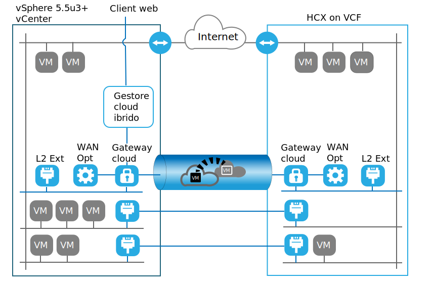

---

copyright:

  years:  2016, 2019

lastupdated: "2019-06-17"

subcollection: vmware-solutions

---

# Introduzione di VMware HCX on IBM Cloud
{: #hcxclient-vcs-intro}

Il servizio VMware HCX on IBM Cloud consente di creare una connessione senza problemi tra IBM Cloud for VMware Solutions e un datacenter virtualizzato VMware in loco.

IBM Cloud for VMware Solutions include distribuzioni rapide e completamente automatizzate di VCS (VMware vCenter Server) in IBM Cloud. Queste offerte integrano l'infrastruttura in loco e consentono ai carichi di lavoro esistenti e futuri di essere eseguiti in IBM Cloud senza dover essere convertiti tramite gli stessi strumenti, competenze e processi che utilizzano in loco. Per ulteriori informazioni, consulta [Virtualization for extending virtualized private cloud](https://www.ibm.com/cloud/garage/architectures/virtualizationArchitecture).

Il servizio VMware HCX on IBM Cloud porta questa ibridità alla fase successiva, combinando le istanze di vCenter Server con i data center virtualizzati in loco esistenti abilitando la creazione di estensioni di rete senza soluzione di continuità e la migrazione bidirezionale dei carichi di lavoro.

I componenti di VMware HCX on IBM Cloud che vengono distribuiti come delle VM (Virtual Machine) nel sito di destinazione IBM Cloud VMware consentono di stabilire una connessione con i componenti VMware HCX on IBM Cloud installati nel sito di origine in loco peer.

Questa connessione crea una interconnettività debolmente accoppiata tra il locale e IBM Cloud e abilita funzionalità come:
* Interconnettività semplice – le connessioni alla rete logica vengono stabilite facilmente tramite una qualsiasi connessione fisica come l'Internet pubblico, la VPN privata o direct link.
* Estensione di livello 2 – le reti in loco sono estese nel cloud. Queste reti includono le sottoreti in loco e l'indirizzamento dell'IP.
* Crittografia – il traffico di rete è crittografato in modo sicuro tra i due
siti.
* Rete ottimizzata – seleziona la connettività migliore e allarga in modo efficace
la connessione in modo che il traffico di rete venga spostato il più velocemente possibile.
* Deduplicazione dei dati - può essere raggiunta la riduzione del 50% del traffico di rete dall'instradamento intelligente - quando un carico di lavoro viene spostato, l'instradamento di prossimità può modificare il percorso di rete (ossia il gateway) in modo che il traffico di rete utilizzi il gateway del sito di destinazione e non “torni” al sito di origine.
* Migrazione senza tempo di inattività – un sistema in esecuzione può essere spostato nel o tolto dal cloud utilizzando vMotion.
* Migrazione pianificata – qualsiasi numero di VM (Virtual Machine) può essere replicato nel sito di destinazione e quindi attivato su quel sito in un momento designato, sostituendo i sistemi in esecuzione sul sito di origine.
* Migrazione delle politiche di sicurezza – se viene utilizzato NSX in loco, tutti i firewall o le politiche di sicurezza
di sicurezza vengono spostati insieme al carico di lavoro.

## Link correlati
{: #hcxclient-vcs-intro-related}

* [Glossario di componenti e termini HCX](/docs/services/vmwaresolutions/services?topic=vmware-solutions-hcxclient-components)
* [Preparazione dell'ambiente di installazione ](/docs/services/vmwaresolutions/services?topic=vmware-solutions-hcxclient-planning-prep-install)
* [Distribuzione client HCX](/docs/services/vmwaresolutions/services?topic=vmware-solutions-hcxclient-vcs-client-deployment)
* [Rete di servizi in loco HCX](/docs/services/vmwaresolutions/services?topic=vmware-solutions-hcxclient-vcs-mesh-deployment)
* [Migrazioni VMware Hybrid Cloud](/docs/services/vmwaresolutions/services?topic=vmware-solutions-hcxclient-migrations)
* [Monitoraggio di parametri e componenti](/docs/services/vmwaresolutions/services?topic=vmware-solutions-hcxclient-monitoring)
* [Risoluzione dei problemi di HCX](/docs/services/vmwaresolutions/services?topic=vmware-solutions-hcxclient-troubleshooting)
