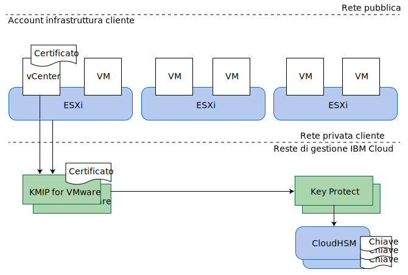

---

copyright:

  years:  2016, 2019

lastupdated: "2019-06-21"

subcollection: vmware-solutions

---

{:tip: .tip}
{:note: .note}
{:important: .important}

# Progettazione KMIP for VMware
{: #kmip-design}

KMIP for VMware on {{site.data.keyword.cloud}} fornisce un servizio di gestione delle chiavi compatibile con le codifiche VMware vSAN e VMware vSphere, utilizzando [IBM Key Protect](/docs/services/key-protect?topic=key-protect-getting-started-tutorial) o [IBM Cloud Hyper Protect Crypto Services](/docs/services/hs-crypto?topic=hs-crypto-get-started#get-started) per fornire l'archiviazione della chiave di dati e della chiave root. Key Protect e Hyper Protect Crypto Services funzionano come il servizio di gestione delle chiavi in questa soluzione.

## Opzioni di codifica dell'archiviazione
{: #kmip-design-storage-options}

KMIP for VMware è compatibile con le codifiche VMware vSAN e vSphere. Entrambe queste soluzioni sono implementate nel livello hypervisor ma forniscono funzioni leggermente diverse. Valuta le loro funzioni in base ai tuoi requisiti.

### Codifica VMware vSAN
{: #kmip-design-vsan-encrypt}

La codifica VMware vSAN è applicabile solo ai datastore vSAN. Con questa soluzione, il VMware vCenter e i tuoi host VMware ESXi si connettono a un server di gestione delle chiavi come ad esempio KMIP for VMware per ottenere delle chiavi di codifica. Queste chiavi vengono utilizzate per proteggere delle unità disco individuali utilizzate per il tuo datastore vSAN, inclusi i dischi di capacità e cache. La codifica vSAN viene implementata in un modo che preserva i vantaggi della deduplicazione e della compressione vSAN.

Poiché la codifica vSAN funziona al livello del datastore, il suo obiettivo principale è di evitare l'esposizione dei dati se si verifica una perdita delle unità disco fisiche. Inoltre, la codifica vSAN è completamente compatibile con tutte le tecnologie di backup e replica della VM (Virtual Machine), come ad esempio la replica vSphere, il vMotion tra vCenter, VMware HCX, Zerto, Veeam e IBM Spectrum Protect Plus.

**Note**:
* La codifica vSAN non codifica le comunicazioni della replica vSAN da host a host all'interno del tuo cluster.
* La codifica vSAN non è applicabile ad altre soluzioni di archiviazione come ad esempio l'archiviazione blocchi e file {{site.data.keyword.cloud_notm}} Endurance.
* La codifica vSAN richiede la licenza vSAN Enterprise.
* Il controllo di integrità vSAN può emettere delle avvertenze periodiche in cui attesta di non potersi connettere al cluster KMS da uno o più dei tuoi host vSphere. Queste avvertenze si verificano perché la connessione del controllo di integrità vSAN va in timeout troppo velocemente. Puoi ignorare queste avvertenze. Per ulteriori informazioni, vedi [vSAN KMS Health Check intermittently fails with SSL Handshake Timeout error](https://kb.vmware.com/s/article/67115){:new_window}.

### Crittografia vSphere
{: #kmip-design-vsphere-encrypt}

La crittografia VMware vSphere si applica a tutti i tipi di archiviazione VMware, incluse l'archiviazione vSAN e l'archiviazione blocchi e file {{site.data.keyword.cloud_notm}} Endurance.

Con questa soluzione, il vCenter Server e i tuoi host ESXi si connettono a un server di gestione delle chiavi come ad esempio KMIP for VMware per ottenere delle chiavi di codifica. Queste chiavi vengono utilizzate per proteggere i dischi della VM (Virtual Machine) individuali, in base alle tue politiche di archiviazione della VM.

La crittografia vSphere funziona al livello del disco della VM (Virtual Machine), per cui può evitare l'esposizione dei dati se si verifica la perdita delle unità disco fisiche o dei dischi della VM. Molte tecnologie di backup e replica non possono eseguire il backup o la replica in modo corretto perché i dati forniti sono crittografati.

Pertanto la crittografia vSphere non è compatibile con la replica vSphere, il vMotion tra vCenter, VMware HCX, Zerto o IBM Spectrum Protect Plus. Tuttavia, quando configurata correttamente, Veeam Backup and Replication è compatibile con la crittografia vSphere.

### Ulteriori considerazioni
{: #kmip-design-considerations}

Quando entrambi i tipi di codifica sono abilitati nel tuo cluster vSphere, VMware crea un'ulteriore chiave per codificare i tuoi core dump ESXi, poiché tali dump potrebbero contenere dati sensibili come ad esempio le credenziali di gestione delle chiavi, le chiavi codificate o i dati decodificati. Dovresti prendere familiarità con [vSphere Virtual Machine Encryption and Core Dumps](https://docs.vmware.com/en/VMware-vSphere/6.5/com.vmware.vsphere.security.doc/GUID-63728E8B-810D-418B-B1AA-6A0A2F92AABE.html).

Quando KMIP for VMware viene utilizzato con la codifica vSAN o vSphere, sono presenti diversi livelli di protezione della chiave.

Se pensi di ruotare le chiavi, rivedi le seguenti informazioni sui livelli a cui possono essere ruotate le chiavi:
* La tua chiave root del cliente (CRK) protegge tutte le chiavi VMware. Le chiavi possono essere ruotate nell'istanza IBM Key Protect o Hyper Protect Crypto Services associata alla tua istanza KMIP for VMware.
* KMIP for VMware utilizza la tua CRK per proteggere le chiavi che genera e distribuisce a VMware. VMware le considera come una _chiave di crittografia delle chiavi (KEK)_.
  * Se stai utilizzando la codifica vSphere, puoi ruotare le chiavi utilizzando il comando **Set-VMEncryptionKey** PowerShell.
  * Se stai utilizzando la codifica vSAN, puoi ruotare le chiavi sull'interfaccia utente vSAN.
* VMware utilizza queste KEK per proteggere le chiavi reali che utilizza per codificare le unità disco e i dischi della VM. Puoi ruotare queste chiavi utilizzando una cosa nota a VMware come una reimpostazione delle chiavi "approfondita". Questa operazione ricodifica tutti tuoi dati codificati per cui può richiedere molto tempo.
  * Se stai utilizzando la codifica vSphere, puoi eseguire una reimpostazione delle chiavi approfondita utilizzando il comando **Set-VMEncryptionKey** PowerShell.
  * Se stai utilizzando la codifica vSAN, puoi eseguire una reimpostazione delle chiavi approfondita utilizzando l'interfaccia utente vSAN.

## KMIP for VMware
{: #kmip-design-kmip-for-vmware}

Le codifiche VMware vSAN e vSphere sono compatibili con molti server di gestione delle chiavi. KMIP for VMware fornisce un servizio di gestione delle chiavi gestito da IBM che utilizza IBM Key Protect o Hyper Protect Crypto Services per darti il controllo completo sulle tue chiavi. Anche altri servizi {{site.data.keyword.cloud_notm}} come Cloud Object Storage sono integrati con Key Protect e Hyper Protect Crypto Services, rendendoli il tuo punto di controllo centrale per la gestione delle chiavi in {{site.data.keyword.cloud_notm}}.

### Chiavi all'interno di chiavi
{: #kmip-design-keys}

I sistemi di gestione delle chiavi normalmente utilizzano una tecnica nota come *crittografia envelope* per impacchettare o proteggere le chiavi con altre chiavi. Queste chiavi sono chiamate _chiavi root_ o _chiave di crittografia delle chiavi (KEK)_. Per accedere a una chiave, devi decodificare o spacchettare la chiave utilizzando la chiave root corrispondente. L'eliminazione permanente della chiave root è un modo efficace per annullare la validità di tutte le chiavi che ha protetto. Queste chiavi non devono essere archiviate accanto alla chiave root. Il controllo dell'accesso alla chiave root è importante.

{{site.data.keyword.cloud_notm}} Key Protect e Hyper Protect Crypto Services forniscono questo servizio utilizzando una *chiave root del cliente* (CRK). Key Protect archivia le CRK esclusivamente nell'hardware {{site.data.keyword.cloud_notm}} CloudHSM da cui non possono essere estratte; Hyper Protect Crypto Services archivia le chiavi in HSM di IBM zSeries. Queste CRK vengono poi utilizzate per impacchettare ulteriori chiavi di codifica come ad esempio quelle generate da KMIP for VMware per la tua istanza VMware.

VMware implementa questo stesso concetto per le proprie chiavi. KMIP for VMware fornisce una chiave a VMware su richiesta e VMware a sua volta utilizza questa chiave come una KEK per impacchettare o codificare le chiavi finali utilizzate per codificare i tuoi dischi della VM (Virtual Machine) o le unità disco vSAN. Queste chiavi finali sono denominate chiavi di codifica dei dati (DEK).

Terminiamo con la seguente catena di codifica:
* Chiave root del cliente (CRK) archiviata permanentemente in IBM Key Protect o Hyper Protect Crypto Services.
* Chiave di codifica della chiave (KEK) generata da KMIP for VMware e fornita a vCenter Server e agli host ESXi nella tua istanza.
* Chiave di codifica dei dati (DEK) generata da VMware e archiviata insieme al disco vSAN o al disco della VM (Virtual Machine).

KMIP for VMware archivia il formato impacchettato delle KEK in IBM Key Protect o Hyper Protect Crypto Services. Sebbene le KEK siano protette in modo crittografico dalla CRK e non è necessario che vengano archiviate all'interno di un HSM, se le archivi nel servizio di gestione delle chiavi, puoi visualizzarle ed eliminarle se devi revocare delle singole chiavi.

### Autenticazione ed autorizzazione
{: #kmip-design-authentication}

La tua soluzione di codifica dell'archiviazione è formata da tre componenti: il tuo cluster VMware, la tua istanza KMIP for VMware e la tua istanza Key Protect o Hyper Protect Crypto Services.

VMware vCenter e ESXi eseguono l'autenticazione con la tua istanza KMIP for VMware utilizzando i certificati che installi o generi in VMware vCenter quando crei una connessione del server di gestione delle chiavi (KMS). Installa il certificato pubblico in KMIP for VMware per identificare il client o i client vCenter che possono connettersi. Ogni client viene autorizzato per tutte le chiavi archiviate in tale istanza KMIP for VMware.

La tua istanza KMIP for VMware viene autorizzata per la tua istanza Key Protect o Hyper Protect Crypto Services utilizzando un ID del servizio {{site.data.keyword.cloud_notm}} Identity and Access Management (IAM) a cui è stato concesso l'accesso all'istanza. L'ID del servizio deve avere almeno l'accesso da visualizzatore per la piattaforma e da gestore per il servizio alla tua istanza del gestore chiavi. KMIP for VMware utilizza la chiave root del cliente (CRK) di tua scelta nell'istanza del gestore chiavi e archivia tutte le KEK generate per conto di VMware, nel formato impacchettato, nell'istanza del gestore chiavi.

### Topologia
{: #kmip-design-topology}

KMIP for VMware è disponibile in diverse MZR (multi-zone region) {{site.data.keyword.cloud_notm}}. Per un elenco completo, consulta [Ordine di KMIP for VMware](/docs/services/vmwaresolutions/services?topic=vmware-solutions-kmip_standalone_ordering).

In ogni MZR, KMIP for VMware fornisce due endpoint di servizio di rete sulla rete privata {{site.data.keyword.cloud_notm}} per l'alta disponibilità. Configura entrambi questi endpoint nella tua configurazione del server di gestione delle chiavi (KMS) vCenter come un cluster KMS. Per un elenco degli endpoint in ogni MZR e delle firme del certificato del server KMIP, consulta la [Documentazione del servizio KMIP for VMware](/docs/services/vmwaresolutions/services?topic=vmware-solutions-kmip_standalone_ordering).

Per accedere a KMIP for VMware sulla rete privata, il tuo account dell'infrastruttura {{site.data.keyword.cloud_notm}} deve essere abilitato per VRF (virtual routing and forwarding) e le rotte dell'endpoint del servizio di rete {{site.data.keyword.cloud_notm}} devono essere aggiunte alle rotte VRF del tuo account. Per ulteriori informazioni, vedi [Abilitazione del tuo account per l'utilizzo degli endpoint del servizio utilizzando la CLI IBM Cloud](/docs/services/service-endpoint?topic=service-endpoint-getting-started#cs_cli_install_steps).

KMIP for VMware si connette anche a {{site.data.keyword.cloud_notm}} Key Protect utilizzando la rete privata {{site.data.keyword.cloud_notm}} invece di internet pubblico.

Quando utilizzi IBM Cloud Hyper Protect Crypto Services, le tue chiavi vengono archiviate in un HSM IBM zSeries invece che in CloudHSM. Inoltre, la connessione tra KMIP for VMware e {{site.data.keyword.cloud_notm}} Hyper Protect Crypto Services transita sulla rete pubblica ma è protetta dalla codifica e dall'autenticazione TLS.

## Link correlati
{: #kmip-design-related}

* [Panoramica della soluzione](/docs/services/vmwaresolutions/archiref/kmip?topic=vmware-solutions-kmip-overview)
* [Implementazione e gestione](/docs/services/vmwaresolutions/archiref/kmip?topic=vmware-solutions-kmip-implementation)
* [IBM Key Protect](/docs/services/key-protect?topic=key-protect-getting-started-tutorial)
