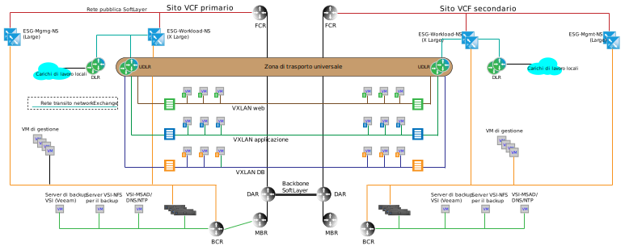

---

copyright:

  years:  2016, 2018

lastupdated: "2018-10-05"

---

# Architettura multisito

Un differenziatore chiave tra {{site.data.keyword.cloud}} e le altre offerte cloud è la capacità di fornire funzionalità di calcolo dedicate in tutto il mondo e di connettere automaticamente l'infrastruttura on-demand con la rete all'interno del tuo account {{site.data.keyword.cloud_notm}} privato. Le funzionalità di rete definita dal software di VMware vCenter Server e VMware Cloud Foundation insieme a {{site.data.keyword.cloud_notm}} forniscono un'infrastruttura globale granulare che può essere costruita in pochi giorni. Le seguenti sezioni descrivono un esempio di architettura multisito di ciò che può essere ottenuto con la funzionalità preconfigurata di vCenter Server o Cloud Foundation.

## Ambiente Cross-vCenter NSX

La funzionalità Cross-vCenter NSX consente il collegamento in una relazione primaria e secondaria di fino a nove gestori NSX: uno primario e otto secondari. Sebbene non sia necessario che i server vCenter siano in una relazione ELM (Enhanced Linked Mode) per il funzionamento di Cross-vCenter NSX, offre comunque i seguenti vantaggi:

* Creazione di relazioni primarie e secondarie semplificate mediante le credenziali SSO (Single sign-on)
* L'automazione di vCenter Server e Cloud Foundation configura la risoluzione dei nomi DNS per tutti i siti collegati tra loro
* Gestione unificata tra tutti i siti sia per le funzioni NSX che per le funzioni vCenter normali

## Esempio di multisito

Il seguente esempio aggiunge una zona di trasporto universale NSX alle topologie di gestione e di carico di lavoro di base illustrate nelle sezioni precedenti, oltre alle seguenti caratteristiche:

* La zona di trasporto universale si estende su due {{site.data.keyword.CloudDataCents_notm}} o POD all'interno di un {{site.data.keyword.CloudDataCent_notm}}.
* Una volta aggiunta la zona di trasporto, vengono aggiunte più VXLAN insieme a un Universal Distributed Router che si estende sulle nuove VXLAN.
* Devi configurare gli uplink agli ESG del carico di lavoro in entrambi i siti. Questa configurazione consente alle macchine virtuali (VM) nel sito locale di passare al proprio ESG locale.
* Per il traffico in entrata, è richiesto un sistema di bilanciamento del carico globale. Vedi le offerte di bilanciamento del carico globale {{site.data.keyword.cloud_notm}} per soddisfare questo requisito.
* Questo esempio richiede VMware NSX Enterprise Edition.

Figura 1. Topologia multisito

### Link correlati

* [Servizi di rete su {{site.data.keyword.cloud_notm}}](networking_services.html)
