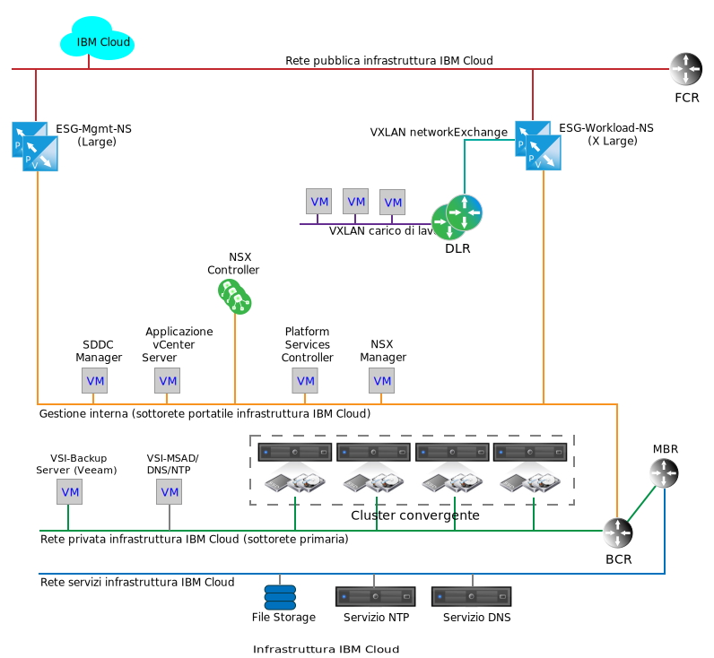
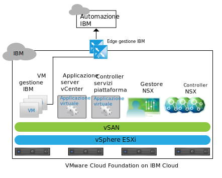
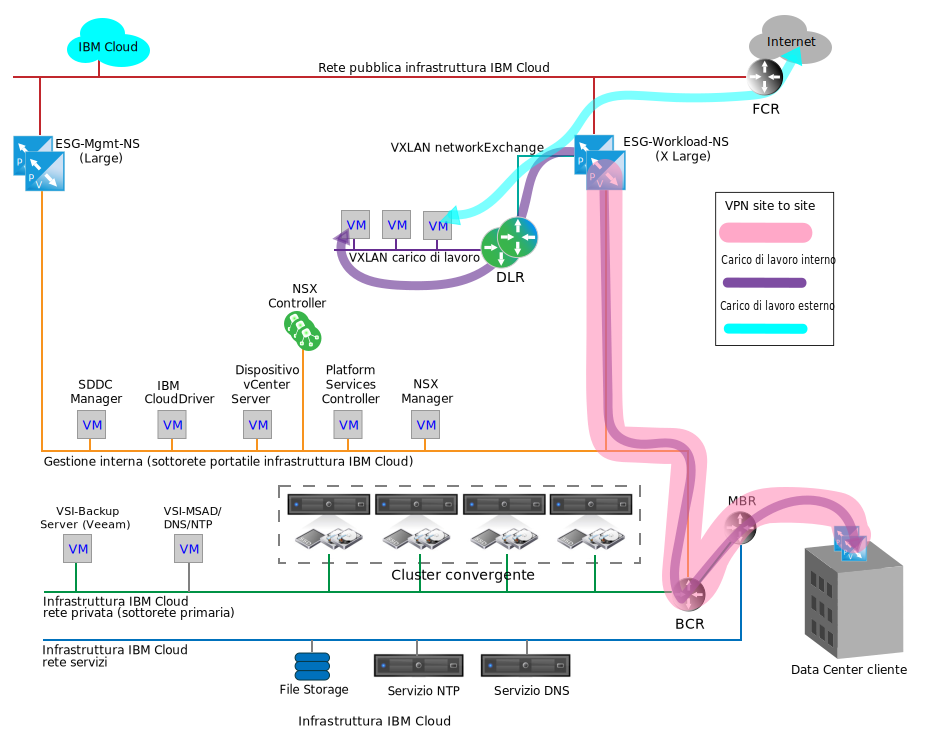

---

copyright:

  years:  2016, 2018

lastupdated: "2018-11-13"

---

{:tip: .tip}
{:note: .note}
{:important: .important}

# Servizi di rete su IBM Cloud

I servizi di rete su {{site.data.keyword.cloud}} sono costituiti da due coppie di gateway dei servizi edge (ESG) VMware NSX per la comunicazione tra {{site.data.keyword.cloud_notm}} e l'Internet pubblico o la rete in loco del cliente tramite una VPN (Virtual Private Network). Questi ESG sono separati per supportare il traffico in uscita della funzione di gestione {{site.data.keyword.cloud_notm}} interna e il traffico in ingresso della rete relativa al cliente.

Il seguente grafico è un diagramma di rete semplificato, che illustra la coppia di ESG di gestione e la coppia di ESG del carico di lavoro. Mostra anche un DLR (Distributed Logical Router) NSX e una VXLAN del carico di lavoro. Questi componenti rappresentano un punto di partenza iniziale per i carichi di lavoro del cliente senza richiedere la conoscenza specifica per configurarli all'interno di NSX. Un DLR viene in genere utilizzato per instradare il traffico tra VMware Cloud Foundation o VMware vCenter Server e il traffico est-ovest, tra reti di livello 2 separate all'interno dell'istanza. Questo comportamento è in contrasto con un ESG, che funziona per facilitare il traffico di rete nord-sud in entrata e in uscita dall'istanza Cloud Foundation o vCenter Server.

Figura 1. Servizi di rete cloud su Cloud Foundation

Mentre un singolo ESG può essere sufficiente per il traffico sia di gestione che del carico di lavoro del cliente, la separazione del traffico di gestione e del cliente è una decisione di progettazione per impedire l'errata configurazione accidentale dell'ESG di gestione.

L'errata configurazione o la disabilitazione dell'ESG di gestione non impedisce il corretto funzionamento dell'istanza Cloud Foundation o vCenter Server, ma disabilita tutte le funzioni di gestione del portale.
{:note}

## Edge NSX dei servizi di gestione IBM

L'ESG di gestione IBM è un cluster edge NSX dedicato solo per il traffico della rete di gestione {{site.data.keyword.cloud_notm}}. Non è inteso per il traffico trasversale di qualsiasi componente che non sia distribuito e gestito dall'automazione di Cloud Foundation o vCenter Server.

L'ESG di gestione fornisce un percorso di comunicazione tra le macchine virtuali (VM) dei servizi aggiuntivi che risiedono all'interno delle istanze Cloud Foundation o vCenter Server e l'infrastruttura di automazione IBM in {{site.data.keyword.cloud_notm}}, come mostrato per Cloud Foundation nel seguente grafico.

Figura 2. Comunicazioni dell'edge di gestione su Cloud Foundation

Come risultato della comunicazione leggera tra alcune VM dei servizi aggiuntivi e i relativi sistemi di licenza e di misurazione, gli ESG NSX sono dimensionati in una configurazione di grandi dimensioni in una coppia HA (high availability) attiva-passiva e distribuiti nel pool di risorse di gestione del cluster convergente di Cloud Foundation o del cluster vCenter Server. La seguente tabella fornisce un riepilogo della distribuzione dell'ESG NSX di gestione IBM.

Tabella 1. Specifiche dell'ESG NSX di gestione IBM

| Edge NSX di gestione IBM | vCPU | Memoria | Dimensione disco | Posizione di archiviazione |
|:----------------------- |:---- |:------ |:--------- |:---------------- |
| ESG NSX di gestione IBM 1 | 2 | 1 GB | 1 GB | Archivio dati vSAN (Cloud Foundation); Archiviazione collegata condivisa per la gestione (vCenter Server) |
| ESG NSX di gestione IBM 2 | 2 | 1 GB | 1 GB | Archivio dati vSAN (Cloud Foundation); Archiviazione collegata condivisa per la gestione (vCenter Server) |

### Servizi di gestione

L'accesso in uscita è richiesto per i seguenti servizi:

* Zerto Virtual Manager. Se installato, Zerto on {{site.data.keyword.cloud_notm}} richiede l'accesso in uscita a Internet per l'attivazione delle licenze e la creazione di report sull'utilizzo.
* Backup e replica Veeam. Se installato, Veeam on {{site.data.keyword.cloud_notm}} richiede l'accesso in uscita a Internet per lo scaricamento del prodotto e gli aggiornamenti della licenza.
* FortiGate Virtual Appliance on {{site.data.keyword.cloud_notm}} richiede l'accesso in uscita a Internet per l'attivazione delle licenze e il monitoraggio delle licenze.
* F5 on {{site.data.keyword.cloud_notm}} richiede l'accesso in uscita a Internet per l'attivazione delle licenze.

### Interfacce Edge

La configurazione delle interfacce ESG definisce le reti L2 a cui ha accesso l'ESG. Per la gestione del ciclo di vita di Cloud Foundation e vCenter Server, è necessario che a specifiche VM posizionate sulla VLAN di gestione sia consentito attraversare alla VLAN pubblica. Sulla distribuzione sono definite le seguenti interfacce:

Tabella 2. Configurazione delle interfacce ESG NSX

| Interfaccia | Tipo di interfaccia | Connessa a | Descrizione |
|:--------- |:-------------- |:------------ |:----------- |
| Uplink pubblico | Uplink | **SDDC-DportGroup-External** | Interfaccia verso internet pubblica |
| Uplink privato | Uplink | **SDDC-DportGroup-Mgmt** | Interfaccia esposta alla rete privata interna |
| Interna | Interna | VXLAN HA carico di lavoro | Interfaccia interna utilizzata per l'heartbeat della coppia HA ESG; gruppo di porte su **SDDC-Dswitch-Private** |

### Sottoreti

Le seguenti sottoreti sono utilizzate ai fini dell'ESG di gestione:

Tabella 3. Configurazione IP ESG NSX

| Interfaccia | Tipo di interfaccia | Tipo di sottorete IP v4 | Intervallo | Descrizione |
|:--------- |:-------------- |:----------------- |:----- |:----------- |
| Uplink pubblico | Uplink | Pubblica portatile {{site.data.keyword.cloud_notm}} | /30 – rende un indirizzo IP assegnabile | Interfaccia esposta all'Internet pubblico |
| Uplink privato | Uplink | Privata portatile {{site.data.keyword.cloud_notm}} (gestione esistente) | /26 – rende 61 indirizzi IP assegnabili | Interfaccia esposta alla rete privata interna |
| Interna | Interna | Link local | 169.254.0.0/16 | Interfaccia interna utilizzata per la comunicazione della coppia HA ESG |

### Definizioni di NAT (Network Address Translation)

NAT (Network Address Translation) viene utilizzato nell'ESG di gestione per consentire al traffico di rete di eseguire l'attraversamento tra uno spazio di indirizzi IP e un altro. In genere ciò viene fatto per conservare gli indirizzi IP instradabili su Internet o per nascondere gli indirizzi IP interni da quelli pubblici per motivi di sicurezza. NAT viene anche utilizzato per consentire il reindirizzamento della porta TCP (Transmission Control Protocol) e UDP (User Datagram Protocol). Il traffico di gestione viene sempre avviato dall'interno dell'istanza Cloud Foundation e vCenter Server, richiedendo che solo un NAT di origine (SNAT) sia definito nell'ESG di gestione. Un singolo SNAT non viene creato per ogni VM interna che ospita un servizio che deve uscire dall'istanza.

Tabella 4. Configurazione NAT ESG NSX

| Applicato sull'interfaccia | Intervallo IP di origine | IP di origine tradotto |
|:-------------------- |:--------------- |:-------------------- |
| Uplink pubblico | Singoli indirizzi IP sulla portatile di gestione /26 | Pubblica portatile {{site.data.keyword.cloud_notm}} |

### Instradamento

Poiché i servizi all'interno delle VM che devono eseguire l'attraversamento per l'ESG di gestione potrebbero anche dover accedere ai servizi {{site.data.keyword.cloud_notm}} all'interno della rete privata {{site.data.keyword.cloud_notm}} del cliente, è necessaria la seguente configurazione per ottenere questa comunicazione.

Sebbene sia difficile prevedere quale sia l'intervallo IP di destinazione necessario come destinazione per le connessioni Internet, qualsiasi servizio distribuito e gestito da {{site.data.keyword.cloud_notm}} punta all'ESG di gestione come proprio gateway predefinito. È richiesta una rotta statica per forzare il traffico sul BCR di {{site.data.keyword.cloud_notm}} per le connessioni di rete esterne richieste dai servizi.

Le seguenti configurazioni sono consigliate per qualsiasi servizio che utilizza l'ESG di gestione per passare al di fuori di un'istanza Cloud Foundation o vCenter Server:
* Il gateway predefinito è un ESG di gestione.
* È necessaria una rotta statica per le destinazioni interne di {{site.data.keyword.cloud_notm}}.

Se è necessario che il servizio o la VM accedano all'ESG del cliente, le rotte statiche devono essere mantenute all'interno del singolo servizio o della singola VM e puntate all'ESG del cliente.

Nessun protocollo di instradamento automatico è attualmente configurato per l'ESG di gestione.

### Definizioni di VXLAN

La coppia HA di gestione richiede una rete per la connessione delle interfacce esterne. Utilizza uno vSwitch, un gruppo di porte o una VXLAN esistente. Per questa progettazione, viene creata una VXLAN dedicata per la comunicazione heartbeat HA della coppia HA dell'ESG di gestione.

Tabella 5. Definizioni di VXLAN ESG NSX

| Definizioni di VXLAN ESG NSX | Zona di trasporto | Tipo |
|:------------------------- |:-------------- |:---- |
| HA di gestione | transport-1 | globale |

### Regole del firewall

Per impostazione predefinita, l'ESG di gestione è configurato per negare tutto il traffico.

**Nega:** per eliminare tutto il traffico senza risposta quando tale traffico non viene autorizzato ad attraversare il firewall da una regola o serie di regole precedente (più alta nell'ordine). La generazione automatica delle regole è selezionata per consentire il traffico di controllo alla coppia ESG.

Sono impostate le seguenti regole del firewall, oltre alle regole generate automaticamente:

Tabella 6. Configurazione del firewall ESG NSX

| Servizio | Origine | Destinazione | Protocollo | Azione |
|:------- |:------ |:----------- |:-------- |:------ |
| Zerto on {{site.data.keyword.cloud_notm}} | VM di gestione Zerto | Qualsiasi | Porta 443 | Consenti |
| Veeam on {{site.data.keyword.cloud_notm}} | Backup Veeam e VM di replica | Qualsiasi | Porta 443 | Consenti |
| FortiGate Virtual Appliance on {{site.data.keyword.cloud_notm}} | VM del servizio | Qualsiasi | Porta 443 | Consenti |
| F5 on {{site.data.keyword.cloud_notm}} | VM del servizio | Qualsiasi | Porta 443 | Consenti |
| Qualsiasi | Qualsiasi | Qualsiasi | Qualsiasi | Nega |

## Edge NSX del carico di lavoro IBM

L'ESG del carico di lavoro IBM fa parte di una semplice topologia destinata alla comunicazione di rete del carico di lavoro. La seguente sezione descrive l'intento di progettazione di dove collegare i carichi di lavoro a una rete all'interno di un'istanza Cloud Foundation o vCenter Server. Questo è un punto di partenza per il collegamento di reti e spazi IP in loco a una specifica istanza CloudCenter o vCenter Center e costituisce la base per una vera e propria architettura Hybrid Cloud.

Una rete del cliente collegata alle reti pubbliche e private di {{site.data.keyword.cloud_notm}} consente al carico di lavoro l'accesso da e verso il traffico Internet, ma consente anche di creare una VPN site-to-site dalle reti {{site.data.keyword.cloud_notm}} pubbliche o private. Ciò consente di ridurre drasticamente il time-to-value riguardo alla connessione alle reti in loco, poiché potrebbero essere necessari mesi per creare una WAN (Wide Area Network) dedicata a causa dei requisiti di sicurezza del cliente. Tuttavia, dopo aver attivato un link dedicato, la VPN può essere girata per attraversare quel link senza influire sulla rete di sovrapposizione all'interno del tunnel VPN o all'interno dell'istanza Cloud Foundation o vCenter Server. Al termine, l'interfaccia pubblica per l'ESG del carico di lavoro può essere rimossa, se necessario dal punto di vista della sicurezza.

La topologia nella seguente figura è costituita dai seguenti componenti NSX:
* Dispositivo Edge NSX (ESG)
* DLR (Distributed Logical Router)
* VXLAN (L2 su L3)

Figura 3. Esempio di diagramma del flusso di rete

### Interfacce Edge per l'edge NSX del carico di lavoro IBM

Come per l'ESG di gestione, la configurazione delle interfacce ESG definisce le reti L2 a cui ha accesso l'ESG. Parte dell'intento di progettazione della topologia del carico di lavoro consiste nel realizzare una sovrapposizione di SDN (Software-Defined Networking) per isolare i carichi di lavoro dallo spazio di indirizzi {{site.data.keyword.cloud_notm}} sottostante. Questa progettazione è la base per il raggiungimento della progettazione BYOIP. Pertanto, sulla distribuzione sono definite le seguenti interfacce:

Tabella 7. Configurazione delle interfacce Edge del carico di lavoro

| Interfaccia | Tipo di interfaccia | Connessa a | Descrizione |
|:--------- |:-------------- |:------------ |:----------- |
| Uplink pubblico | Uplink | SDDC-DportGroup-External | Interfaccia verso internet pubblica |
| Uplink privato | Uplink | SDDC-DportGroup-Mgmt | Interfaccia esposta alla rete privata interna |
| Uplink di transito | Uplink | Workload-Trasit | VXLAN di transito tra l'ESG del carico di lavoro e il DLR del carico di lavoro |
| Interna | Interna | VXLAN HA carico di lavoro | Interfaccia interna utilizzata per l'heartbeat della coppia HA ESG |

In questa progettazione, viene utilizzato un DLR per consentire il potenziale instradamento est-ovest tra le reti L2 connesse al carico di lavoro. Poiché questa topologia deve essere un semplice esempio, viene descritta solo una rete L2 destinata ai carichi di lavoro. L'aggiunta di altre zone di sicurezza può essere realizzata aggiungendo ulteriori VXLAN collegate alle nuove interfacce sul DLR. La seguente tabella illustra le interfacce DLR da configurare:

Tabella 8. Interfacce DLR

| Interfaccia | Tipo di interfaccia | Connessa a | Descrizione |
|:--------- |:-------------- |:------------ |:----------- |
| Uplink di transito | Uplink | Workload-Trasit | VXLAN di transito tra l'ESG del carico di lavoro e il DLR del carico di lavoro |
| Uplink carico di lavoro | Uplink | Carico di lavoro | VXLAN per le connessioni del carico di lavoro |
| Interna | Interna | VXLAN HA carico di lavoro | Interfaccia interna utilizzata per l'heartbeat della coppia HA ESG |

### Sottoreti per l'edge NSX del carico di lavoro IBM

Le seguenti sottoreti sono utilizzate ai fini dell'ESG del carico di lavoro:

Tabella 9. Configurazione IP ESG del carico di lavoro e DLR

| Interfaccia | Tipo di interfaccia | Tipo di sottorete IP v4 | Intervallo | Descrizione |
|:--------- |:-------------- |:----------------- |:----- |:----------- |
| Uplink pubblico (ESG) | Uplink | Pubblica portatile {{site.data.keyword.cloud_notm}} | /30 – rende un indirizzo IP assegnabile | Interfaccia verso internet pubblica (il cliente può ordinare più indirizzi IP separatamente) |
| Uplink privato (ESG) | Uplink | Privata portatile {{site.data.keyword.cloud_notm}} (gestione esistente) | /26 – rende 61 indirizzi IP assegnabili | Interfaccia esposta alla rete privata interna |
| Interna (ESG e DLR) | Interna | Link local | 169.254.0.0/16 | Interfaccia interna utilizzata per la comunicazione della coppia HA ESG |
| Uplink di transito (ESG e DLR) | Uplink | Assegnata dal cliente | TBD | Connessione rete di transito per ESG e DLR |
| Carico di lavoro (DLR) | Uplink | Assegnata dal cliente | TBD | Sottorete carico di lavoro |

### Definizioni di NAT per l'edge NSX del carico di lavoro IBM

NAT è utilizzato nell'ESG del carico di lavoro per consentire al traffico di rete di passare tra uno spazio di indirizzi IP e un altro. Per l'ESG del carico di lavoro, NAT è necessario non solo per consentire la comunicazione verso destinazioni Internet, ma anche per comunicare in qualsiasi intervallo di IP originato da {{site.data.keyword.cloud_notm}}. Per questa progettazione, il traffico del carico di lavoro può uscire su Internet, ma non sulla rete di gestione o su una qualsiasi rete di {{site.data.keyword.cloud_notm}}. Pertanto, è necessario definire solo uno SNAT sull'ESG del carico di lavoro. L'intera sottorete portatile del carico di lavoro è configurata per attraversare SNAT.

Sebbene sia possibile utilizzare NAT per consentire la comunicazione del carico di lavoro tra più istanze di Cloud Foundation o vCenter Server, questo diventa poco pratico quando è necessario collegare molti carichi di lavoro tra le istanze. Per esempi di utilizzo delle funzionalità NSX avanzate per creare una rete L2 eccessivamente transitabile tra le istanze Cloud Foundation o vCenter Server, vedi [Architettura multisito](multi_site.html).

Tabella 10. Regole NAT ESG del carico di lavoro

| Applicato sull'interfaccia | Intervallo IP di origine | IP di origine tradotto | NAT abilitato o disabilitato |
|:-------------------- |:--------------- |:-------------------- |:----------------------- |
| Uplink pubblico (ESG del carico di lavoro) | Definito dal cliente | IP pubblico portatile {{site.data.keyword.cloud_notm}} | definito dal cliente (disabilitato per impostazione predefinita) |

### Instradamento per l'edge NSX del carico di lavoro IBM

All'interno di questa progettazione, l'unico requisito per i carichi di lavoro che attraversano il DLR verso l'ESG del carico di lavoro è quello di accedere a Internet. L'ESG del carico di lavoro deve comprendere il percorso della VXLAN del carico di lavoro e di qualsiasi futura VXLAN/sottorete del carico di lavoro creata dietro il DLR. Sebbene questo può essere realizzato tramite le rotte statiche sull'ESG, l'intento della topologia del carico di lavoro è quello di una progettazione di procedure ottimali dimostrate. Pertanto, OSPT (Open Shortest Path First) viene configurato tra l'ESG del carico di lavoro e il DLR downstream.

Per ulteriori informazioni sulla configurazione, vedi [Configure OSPF Protocol](https://pubs.vmware.com/NSX-6/index.jsp?topic=%2Fcom.vmware.nsx.admin.doc%2FGUID-6E985577-3629-42FE-AC22-C4B56EFA8C9B.html).

Tabella 11. Instradamento dinamico

| Area | Tipo di OSPF | IP interfaccia OSPF | Autenticazione OSPF |
|:---- |:--------- |:----------------- |:------------------- |
| 51 | stub | Assegna un IP per ogni DLR ed ESG sulla rete RFC1918 di transito | Nessuna |

### Regole del firewall per l'edge NSX del carico di lavoro IBM

Per impostazione predefinita, l'ESG del carico di lavoro è configurato per negare tutto il traffico.

**Nega:** per eliminare tutto il traffico senza risposta quando tale traffico non viene autorizzato ad attraversare il firewall da una regola o serie di regole precedente (più alta nell'ordine). La generazione automatica delle regole è selezionata per consentire il traffico di controllo alla coppia ESG.

Sono impostate le seguenti regole del firewall, oltre alle regole generate automaticamente.

Tabella 12. Regole del firewall ESG del carico di lavoro

| Servizio | Origine | Destinazione | Protocollo | Azione |
|:------- |:------ |:----------- |:-------- |:------ |
| Carichi di lavoro | Sottorete carico di lavoro | Qualsiasi | Qualsiasi | Consenti |
| Qualsiasi | Qualsiasi | Qualsiasi | Qualsiasi | Nega |

### Definizioni di VXLAN per l'edge NSX del carico di lavoro IBM

La coppia HA di ESG e DLR della topologia del carico di lavoro richiede segmenti L2 (VXLAN) per la connessione delle interfacce interne, per il transito dei dati tra loro e per i carichi di lavoro.

Tabella 13. Interfacce interne dell'ESG del carico di lavoro

| Nome VXLAN | Zona di trasporto di Cloud Foundation o vCenter Server | Tipo |
|:---------- |:------------------------------------------------- |:---- |
| HA carico di lavoro | transit-1 | Globale |
| Transito carico di lavoro | transit-1 | Globale |
| Carico di lavoro | transit-1 | Globale |

### Impostazioni ESG DLR per l'edge NSX del carico di lavoro IBM

Per impostazione predefinita, la registrazione è abilitata su tutti i nuovi dispositivi edge NSX. Il livello di registrazione predefinito è NOTICE.

### Link correlati

* [Progettazione del gateway dei servizi edge NSX](nsx_design.html)
* [Architettura multisito](multi_site.html)
